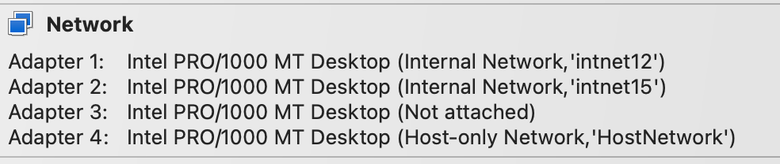
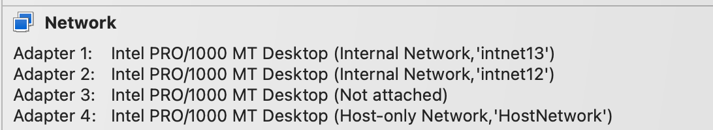

# Notes on How-To BGP-Challenge Lab


### Overview
- Mikrotik routers only need a little memory, but it is recommended that you deploy one router at a time.  Build small, and test often.
- For internal network `intnet` choose names that indicate what are you using them for.  For example, the `intnet` network between T1-T2 I called it `intnet12`, and the one between T1-T5 is called `intnet15`
---
## **Basic T1 Built**

#### **Network Adapters:**



- [ ] **ether1** - Connects to T2 via Internal Network `intnet12`
- [ ] **ether2** - Connects to T5 via Internal Network `intnet15`
- [ ] **ether3** - Is not in use but must be present.
- [ ] **ether4** - Connects to a Host-only Network.  The adapter that is going to be used for the network management.
- [ ] **Lo0** - Loopback - Use exact name.
- [ ] **Lo1** - Loopback used to mimic a network known by T1 - Use exact name.
#### **General Configuration**
- [ ] Set hostname.
- [ ] Enable BGP logging.
#### **IP Setting**

``` c#
[admin@ayalac-T1] > ip add print
Flags: **X** - disabled, **I** - invalid, **D** - dynamic 
 **#   ADDRESS            NETWORK         INTERFACE**                            
 0   192.168.100.1/24   192.168.100.0   ether4                                   
 1   10.200.12.1/24     10.200.12.0     ether1                                   
 2   10.200.15.1/32     10.200.15.1     ether2                                   
 3   10.200.1.1/24      10.200.1.0      Lo0                                      
 4   1.1.1.1/24         1.1.1.0         Lo1
```

- [ ] Ensure you have connectivity to the management network IP address in your host.
- [ ] Use `ssh` for all connections from now on. 

---
## **Basic T2 Built**

#### **Network Adapters:**



- [ ] **ether1** - Connects to T3 via Internal Network `intnet23`
- [ ] **ether2** - Connects to T1 via Internal Network `intnet12`
- [ ] **ether3** - Is not in use but must be present.
- [ ] **ether4** - Connects to a Host-only Network.  The adapter that is going to be used for the network management.
- [ ] **Lo0** - Loopback - For iBGP peering - Use exact name.
#### **General Configuration**
- [ ] Set hostname.
- [ ] Enable OSPF and BGP logging.
#### **IP Setting**

``` c#
[admin@ayalac-T2] > ip add print
Flags: X - disabled, I - invalid, D - dynamic 
 #   ADDRESS            NETWORK         INTERFACE
 0   192.168.100.2/24   192.168.100.0   ether4                                    1   192.168.23.2/24    192.168.23.0    ether1                                    2   10.200.12.2/24     10.200.12.0     ether2                                    3   10.200.2.2/24      10.200.2.0      Lo0
```

- [ ] Ensure you have connectivity to the management network IP address in your host and T1.
- [ ] Use `ssh` for all connections from now on. 

---
### **T1 - T2 eBGP**

### Potential Points:
- **[1 Point]** **T1 & T2** should peer via eBGP using directly connected interfaces.
-  **[0 Point]** Router IDs should follow the format `{U}.0.0.ID`, where `ID` represents the router number. (Evaluated in OSPF)
- **[1 Point]** **T1** should advertise the network prefix represented by `Lo1`.  

#### **Configure eBGP in T1 and T2**
- [ ] Set BGP instance (ASN).
- [ ] Set router-id.
- [ ] Set BGP peer.
- [ ] In T1 advertised the 1.1.1.0 network.

> **Note:**
> - You need to name the bgp instance, I'm choosing `AS100` for T1's instance
> -  You need to name the peer, I'm choosing `eBGP-T2`

```c#
#-- Configure eBGP with T1 -- Do a similar config for T2
#-- Using U=200
routing bgp instance add name=AS100 as=100 router-id=200.0.0.1
routing bgp peer add name=eBGP-T2 remote-as=240 remote-address=10.200.12.2 instance=AS100
routing bgp network add network=1.1.1.0/24
```

#### **Verification From T1:**

``` c#

#-- Similar to the show ip bgp, but it only shows the advertised networks
#-- Notice that the AS-Path is empty, and the pre-appending happens as the
#-- update message leaves the AS

[admin@ayalac-T1] > routing bgp advertisements print                             
PEER     PREFIX         NEXTHOP     AS-PATH          ORIGIN     LOCAL-PREF
eBGP-T2  1.1.1.0/24     10.200.12.1                   igp
```

#### **Verification From T2:**

```C#
#-- A partial view of log pint
#-- Notice the TCP connection established after setting up BGP
#-- and the RemoteAddress as the one configured as neighbour

12:46:50 system,info bgp instance AS240 added by admin 
12:46:50 system,info bgp peer eBGP-T1 added by admin 
12:46:51 route,bgp,info TCP connection established 
12:46:51 route,bgp,info     RemoteAddress=10.200.12.1 

[admin@ayalac-T2] > routing bgp peer print   
Flags: X - disabled, E - established 
 #   INSTANCE                  REMOTE-ADDRESS            REMOTE-AS  
 0 E AS240                      10.200.12.1                100

#-- Notice the "ADb" b for BGP in the routing table, DISTANCE = AD
[admin@ayalac-T2] > ip route print                             
 #      DST-ADDRESS        PREF-SRC        GATEWAY            DISTANCE
 0 ADb  1.1.1.0/24                         10.200.12.1              20
 1 ADC  10.200.2.0/24      10.200.2.2      Lo0                       0
 2 ADC  10.200.12.0/24     10.200.12.2     ether2                    0
 3 ADC  192.168.23.0/24    192.168.23.2    ether1                    0
 4 ADC  192.168.100.0/24   192.168.100.2   ether4                    0

#-- Shows connectivity
[admin@ayalac-T2] > ping count=2 1.1.1.1 
  SEQ HOST                                     SIZE TTL TIME  STATUS              0 1.1.1.1                                    56  64 1ms  
  1 1.1.1.1                                    56  64 1ms  
 sent=2 received=2 packet-loss=0% min-rtt=1ms avg-rtt=1ms max-rtt=1ms
```

---
> **Note:** You could continue with **T3** here and implement the complete AS240.  I'm proposing to build **T5** and **T4** to do most of the basic BGP implementation.  Then implement **T3**, OSPF,  and the iBGP peering.  Last do the challenges.

---
## **Basic T5 Built**

#### **Network Adapters:**
- [ ] **ether1** - Connects to T4 via Internal Network `intnet54`
- [ ] **ether2** - Connects to T1 via Internal Network `intnet15`
- [ ] **ether3** - Is not in use but must be present.
- [ ] **ether4** - Connects to a Host-only Network.  The adapter that is going to be used for the network management.
- [ ] **Lo0** - Loopback - For eBGP peering - Use exact name.
- [ ] **Lo1-Lo5** - T5 networks to be advertised in BGP
#### **General Configuration**
- [ ] Set hostname.
- [ ] Enable BGP logging.
#### **IP Setting**

```c#
[admin@ayalac-T5] > ip add print
#   ADDRESS            NETWORK         INTERFACE                                 
 0   192.168.100.5/24   192.168.100.0   ether4                                    1   10.200.54.5/24     10.200.54.0     ether1                                    2   10.200.15.5/24     10.200.15.0     ether2                                    3   10.200.5.5/24      10.200.5.0      Lo0                                       4   15.5.5.5/24        15.5.5.0        Lo1                                       5   25.5.5.5/24        25.5.5.0        Lo2                                       6   35.5.5.5/24        35.5.5.0        Lo3                                       7   45.5.5.5/24        45.5.5.0        Lo4                                       8   5.5.5.5/24         5.5.5.0         Lo5
```

#### **Configure eBGP in T1 and T5**
- [ ] **T5**:  Set BGP instance (ASN) to 500.
- [ ] **T5**:  Set router-id.
- [ ] **T5**: Set BGP peer using T1-Lo
	- [ ] In MikroTik: `ttl=2 update-source=Lo0 multihop=yes`
- [ ] **T5**: Advertised the Lo1-Lo5.
- [ ] **T1**: Set BGP peer T5-Lo0
	- [ ] In MikroTik: `ttl=2 update-source=Lo0 multihop=yes`

Logs from T5:
```c#
02:37:29 system,info bgp peer eBGP-T1 added by admin 
02:37:30 route,bgp,debug Update source 
02:37:30 route,bgp,debug     Address=10.200.5.5 
02:37:30 route,bgp,debug Connecting 
02:37:30 route,bgp,debug     RemoteAddress=10.200.1.1 
02:37:30 route,bgp,info Failed to open TCP connection: Network is unreachable
```

Ensure connectivity to loopbacks:
- [ ] **T5**: Set static route to T1-Lo0
- [ ] **T1**: Set static route to T5-Lo0

### Verification from T1:

```c#
[admin@ayalac-T1] > routing bgp peer print
#   INSTANCE                  REMOTE-ADDRESS                 REMOTE-AS
0 E AS100                     10.200.12.2                     240
1 E AS100                     10.200.5.5                      500        

[admin@ayalac-T1] > routing bgp advertisements print 
PEER     PREFIX          NEXTHOP          AS-PATH  ORIGIN     LOCAL-PREF
eBGP-T2  15.5.5.0/24     10.200.12.1      500       igp       
eBGP-T2  45.5.5.0/24     10.200.12.1      500       igp       
eBGP-T2  5.5.5.0/24      10.200.12.1      500       igp       
eBGP-T2  35.5.5.0/24     10.200.12.1      500       igp       
eBGP-T2  25.5.5.0/24     10.200.12.1      500       igp       
eBGP-T2  1.1.1.0/24      10.200.12.1                igp       
eBGP-T5  1.1.1.0/24      10.200.1.1                 igp       
```

---
