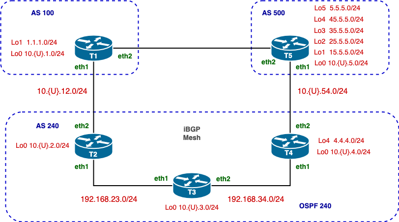

# BGP Challenge Lab

## Topology

---
## Overview

This lab is designed to deepen your understanding of BGP by focusing on configuring and manipulating path attributes to influence route selection and advertisement. You will work with both eBGP and iBGP configurations, exploring the intricacies of neighbour relationships, AS path manipulation, MED configuration, and network advertisement. Additionally, you will integrate OSPF as an IGP within an autonomous system to facilitate iBGP connectivity.

You will learn how to apply BGP attributes to control route preferences and ensure efficient routing policies between and within autonomous systems. This knowledge is critical for managing large-scale, multi-AS environments and optimizing network traffic.

Key focus areas include:
1. Establishing eBGP and iBGP neighbour relationships using directly connected interfaces and loopbacks.
2. Manipulating BGP attributes such as `AS_PATH` and `MED` to influence routing decisions.
3. Advertising and filtering networks using prefix lists, AS-path access lists, and distribute lists.
4. Integrating OSPF with BGP to ensure reachability and seamless routing within an autonomous system.

By the end of this lab, you will have the foundational skills required to configure and troubleshoot BGP in real-world scenarios, as well as an appreciation for how BGP attributes shape the flow of traffic in enterprise and service provider networks.

---
## RouterOS Version Selection

### Recommended Version: RouterOS 6.49

For this lab, it is recommended that students use **MikroTik RouterOS 6.49** instead of the newer **RouterOS 7.x**. The decision to use RouterOS 6.45 is based on the following considerations:

### Why RouterOS 6.49?

1. **Alignment with Cisco's Configuration Style**:
   - RouterOS 6.45 features a BGP configuration process that is more closely aligned with Cisco's approach. This includes a hierarchical structure and similar command-line syntax, making it easier for students transitioning from Cisco devices to MikroTik.

2. **Simpler Learning Curve**:
   - Students who are familiar with Cisco's methods will find the configuration in RouterOS 6.49 more intuitive and easier to follow, minimizing potential confusion during the lab.

3. **Documentation and Examples**:
   - There is an abundance of documentation, examples, and community support for configuring BGP in RouterOS 6.49. In contrast, RouterOS 7.x, while more powerful and feature-rich, has limited command-line examples available.

---
## Initial Configuration

1. Use `eth4` in all devices to connect to a `host-only` management network using the address `192.168.100.0/24`.  Each device should use its ID as its IP address.  For example, `T1-eth4` should be `192.168.100.1/24`
2. Use `internal network` for all other networks.
4. Set the hostnames of each device as shown in the topology and prepend your username.
5. Create all loopback devices using the **exact** names as shown in the topology. For example, the loopback 0 interfaces should be called `Lo0`
6. Configure the initial IP addresses for all routers as shown in the topology diagram.
7. Enable logging for both OSPF and BGP.

---
## Configure OSPF 240 in AS 240

- **[1 Point]** Router IDs should follow the format `{U}.0.0.ID`, where `ID` represents the router number.
- **[1 Point]** Ensure T2-Lo0 of T4-Lo0 participate in OSPF for reachability of iBGP neighbours.

---
## eBGP Peering

- **[1 Point]** **T1 & T2** should peer via eBGP using directly connected interfaces.
- **[1 Point]** **T4 & T5** should peer via eBGP using the Lo0 of each router.
- **[1 Point]** **T1 & T5** should peer via eBGP using the Lo0 of each router.
- **[1 Point]** Only static routes should be used to achieve connectivity to neighbours.
- **[0 Point]** Router IDs should follow the format `{U}.0.0.ID`, where `ID` represents the router number. (Evaluated in OSPF)

---
## iBGP Peering

- **[1 Point]** **Complete iBGP Mesh** in transit area via iBGP using each router.
- **[1 Point]** Ensure `Lo0` of T2 & T4 participate in OSPF for reachability of iBGP neighbors.
- **[1 Point]** Ensure the `nexthop-choice` is correctly set.

---
## BGP Network Advertising

- **[1 Point]** **T1** should advertise the network prefix represented by `Lo1`.  
- **[1 Point]** **T4** should advertise the network prefix represented by `Lo4`.
- **[1 Point]** **T5** should advertise from `Lo1-Lo5`.

---
## Challenge 1:  Influence Inbound Traffic

This challenge focuses on manipulating inbound traffic by making paths advertised by **T1** less preferable to **AS 240**. The technique involves **AS_PATH Prepending**, a method of artificially increasing the length of the AS_PATH attribute for specific prefixes. BGP routers prefer shorter AS_PATHs, so prepending makes a route less desirable without removing it entirely.

- **[1 Point]** Configure **AS_PATH Prepending** on router **T1**.
- **[1 Point]** Ensure that traffic destined for **AS 240** prefers paths through **T5** instead of **T1**.
### Challenge Explained
- **AS 100** advertises prefixes `1.1.1.0` via router **T1**.
- **AS 240** receives advertisements from **T1** (AS 100) and **T5** (AS 500).
- **Goal**: Make paths from **T1** less preferable to **AS 240**.

---
## Challenge 2:  Influence Path Selection for Inbound Traffic to a Specific AS

This challenge focuses on **manipulating how external traffic enters a local AS** (**AS 240**) using the **Multiple Exit Discriminator (MED)** attribute. The **MED** attribute allows you to suggest a preferred entry point into your AS to an external neighbour. Lower MED values indicate a more preferred path, guiding external ASes on route traffic into your network.

**Key Behaviour of MED**:
- `MED` is evaluated **only between multiple paths entering the same AS from the same external AS**.
- `MED` provides fine-grained control over **how inbound traffic enters the local AS**, particularly in multi-exit (multihomed) setups.

You will configure **MED** on **T2** and **T4** to influence traffic destined for the `4.4.4.0` prefix based on the desired entry points into **AS 240**. By adjusting MED values, you will guide traffic from **AS 100** and **AS 500** to enter **AS 240** via specific routers.

-  Configure `MED` on **T2** and **T4** to influence the path selection for inbound traffic to **AS 240**.
- **[1 Point]**  **Path Preference for AS 100**: Ensure that traffic from **T1** in **AS 100** destined for the `4.x` prefix (e.g., `4.4.4.0/24`) prefers the path through **T2** as the entry point into **AS 240**.
- **[1 Point]**  **Path Preference for AS 500**: Ensure that traffic from **T5** in **AS 500** destined for the `4.x` prefix (e.g., `4.4.4.0/24`) prefers the path through **T4** as the entry point into **AS 240**
- **[1 Point]**  **Verify Path Selection**: Confirm the correct path selection by examining routing tables on **AS 100** (T1) and **AS 500** (T5), and by performing traceroute tests.
### Challenge Explained
- **AS 240** advertises prefixes `4.4.4.0/24` via routers **T2** and **T4**.
- **AS 100** receives advertisements of the network from **T2**.
- **AS 500** receives advertisements of the network from **T4**.
- **Goal**: Use `MED` to guide **AS 100** and **AS 500** in selecting their preferred entry point to AS 240 for `4.4.4.0`.  
	- **T1** should prefer 4.4.4.0/24 via **T2**.
	- **T5** should prefer 4.4.40/24 via **T4**.
---
## Challenge 3:  Filtering Routes

This challenge focuses on configuring **route filtering** in BGP to control which prefixes are advertised to specific peers. In this scenario, **T5's routes (AS 500)** should be **filtered out** from being advertised to **T1 (AS 100)** but **allowed** to propagate to **T4 (AS 240)**. This demonstrates the use of filters to selectively manage route advertisement based on specific policies.

- **[1 Point]**  Configure BGP filters on **T2** to block prefixes from **T5** (AS 500) when advertising to **T1** (AS 100).
- **[1 Point]**  Ensure prefixes from **T5** are still advertised to **T4** in **AS 240**.
- **[1 Point]**  Verify the filtering by inspecting routing tables on **T1** and **T4**.
### Challenge Explained
- **AS 100** and **AS 240** are connected via **T2**.
- **AS 240** and **AS 500** are connected via **T4**.
- **AS 500** advertises its prefixes (`5.x` networks) via **T5**.
- **Goal**: Prevent **T1** (AS 100) from learning **T5's prefixes**, while allowing **T4** (AS 240) to receive them.

---
## Collecting Lab Information and Verification

In this section, you will use the **x-remote** script from [https://github.com/ayalac1111/x-remote](https://github.com/ayalac1111/x-remote) to collect configuration and verification outputs from your lab setup. This information will be submitted to Brightspace for evaluation.

The **x-remote** script automates the collection of outputs from your routers, ensuring that all required configurations and verifications are properly captured.

