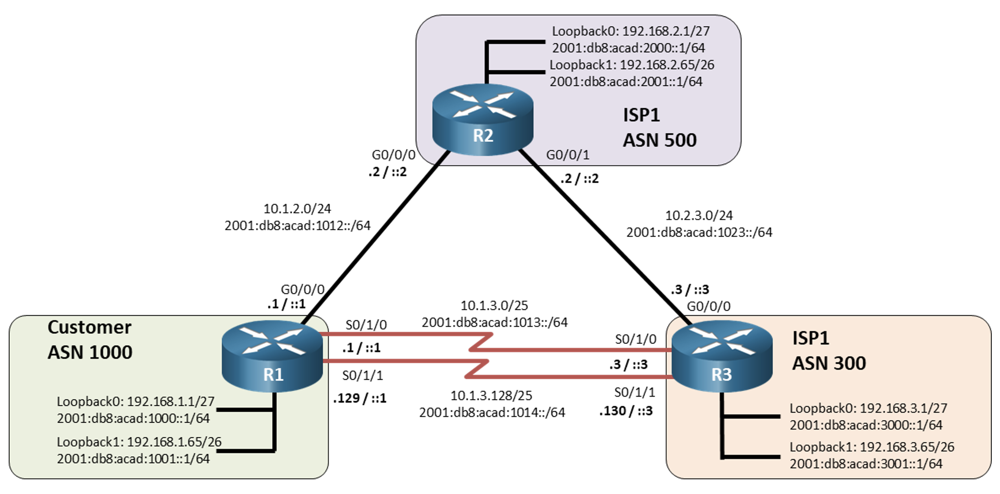

# Multi-Protocol eBGP Lab

### Overview

In this lab, you will explore the fundamentals of Border Gateway Protocol (BGP) path manipulation, an essential skill for managing traffic flows in large, interconnected networks. You will learn to implement and verify various BGP path manipulation techniques to control routing behaviour.

- **Lab 12.1.2: Implementing BGP Path Manipulation**  
   Focuses on configuring and understanding BGP path manipulation tools.  You will: 
   1. **Set up MP-BGP configurations** across routers to establish neighbour relationships and share IPv4/IPv6 routes. 
   2. **Experiment with BGP path attributes** to influence routing decisions, such as selecting preferred paths for traffic flows. 
   3. **Implement route filtering techniques** using prefix lists, distribute lists, and AS-path filters to control route propagation. 
### Why BGP Path Manipulation is Important 
In a multi-AS network, controlling a packet's route is crucial for optimizing performance, enhancing security, and ensuring compliance with network policies. BGP, the backbone routing protocol for the internet, offers mechanisms to: 

- **Direct traffic flows**: By adjusting BGP path attributes, network administrators can prioritize certain paths, reducing latency or balancing load across available routes. 
- **Implement security measures**: Path manipulation allows for the restriction of route advertisements, helping prevent undesirable routes from being advertised to or from other networks. 
- **Optimize inter-domain routing**: Proper path control is vital for maintaining efficient connectivity and managing traffic between multiple ISPs or enterprise networks. 

By mastering these BGP path manipulation techniques, you'll be equipped to handle complex network infrastructures, which is crucial for roles in network engineering, especially within ISPs or large enterprise environments.

---

### Instructions

1. **Cable Setup**  
   Cable both lab and management networks as shown in the topology.

2. **Initial Configuration**  
   Copy the initial configuration files provided to set up each device.

3. **Lab 12.1.2 - Part 2 & Part 3**
   - **Configure MP-BGP**: Establish MP-BGP sessions between routers to share routes across autonomous systems, focusing on IPv4 and IPv6 configurations.
   - **Path Manipulation**: Implement BGP path manipulation by adjusting attributes like Local Preference and Weight to influence route selection. 
   - **Route Filtering**: Apply filters to limit which routes are advertised and accepted by specific routers, using ACLs, prefix lists, and AS-path filters.

4. **Verification Collection**  
   - Use [x_remote.py](https://github.com/ayalac1111/x-remote) with `verify.yaml` to collect the necessary verification commands for the lab.

5. **Submission**  
   - Submit your verification files to Brightspace:
      - `{username}-BGP_Path.txt` 

---

### Management Topology

- Connect all routers and switches to an L2 switch using the **management interface Gi0/0**, located at the back of the devices.
- Connect your PC with the IP address **192.168.100.254/24** to the management switch to access the devices.

### Resources

Download the initial configuration scripts and YAML verification files from this page.

