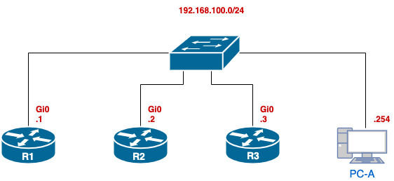

# Multi-Protocol eBGP Lab

### Overview

In these labs, you will configure and verify BGP, one of the most essential protocols for modern network connectivity.

- **Lab 11.1.2: Implement eBGP for IPv4**  
   Focuses on configuring BGP to establish neighbor relationships between different autonomous systems using IPv4. You will also learn how to manage route summarization and advertisements effectively. This lab provides foundational understanding of how external BGP (eBGP) works, a critical skill for network engineers managing traffic between large-scale networks.

- **Lab 11.1.3: Implement MP-BGP (Multi-Protocol BGP)**  
   Builds on your knowledge from Lab 11.1.2 by introducing BGP for both IPv4 and IPv6 using address families. As more networks transition to IPv6, understanding how to configure BGP to handle multiple protocols is key to ensuring seamless, scalable routing across different address families.

### Why are these labs important?

Mastering BGP configuration, both for IPv4 and IPv6, is essential for handling complex network infrastructures, particularly in large enterprise and service provider environments. These labs prepare you to manage and troubleshoot BGP in multi-protocol environments, a key skill for network engineers.

---

### Instructions

1. **Cable Setup**  
   Cable both lab and management networks as shown in the topology.

2. **Initial Configuration**  
   Copy the initial configuration files provided to set up each device.

3. **Lab 11.1.3 - Start with Part 2 and Part 3**
   - Configure Multi-Protocol BGP for both IPv4 and IPv6.
   
4. **Verification Collection** *This Step must be done before continuing*
   - Use [x_remote.py](https://github.com/ayalac1111/x-remote) script and `verify_part3.yaml` to collect verification commands and confirm your configurations.

6. **Continue with Lab 11.1.3 Part 4**  
   - Complete the additional steps as instructed to extend your MP-BGP configuration.

7. **Switch to Lab 11.1.2 - Parts 4 and 5**  
   - Configure eBGP for IPv4, including route summarization and advertisement management.

8. **Verification Collection**  
   - Use [x_remote.py](https://github.com/ayalac1111/x-remote) with `verify_part5.yaml` to collect the necessary verification commands for Parts 4 and 5.

9. **Submission**  
   - Submit your verification files to Brightspace:
      - `{username}-01-MB_BGP.txt` (for Part 2 and 3 verification)
      - `{username}-02-MP_BGP.txt` (for Part 4 and 5 verification)

---

### Management Topology

- Connect all routers and switches to an L2 switch using the **management interface Gi0/0**, located at the back of the devices.
- Connect your PC with the IP address **192.168.100.254/24** to the management switch to access the devices.

### Resources

Download the initial configuration scripts and YAML verification files from this page.

Follow these instructions carefully. Both labs build upon each other to reinforce your understanding of BGP configuration and management in a multi-protocol environment.

Good luck, and verify each configuration thoroughly before moving to the next step!
