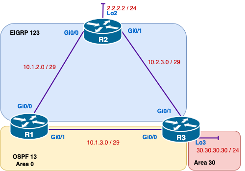
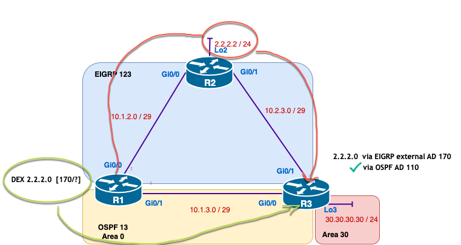
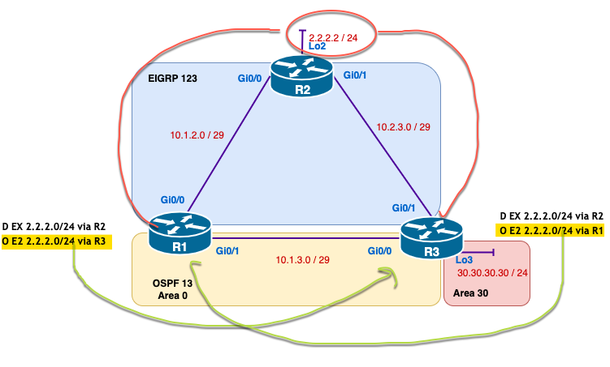

# Redistribution Challenge Lab - Demo

## Overview

This demo provides an in-depth walkthrough of the lab topology, focusing on route redistribution between EIGRP and OSPF, the issues that arise, and solutions using two methods. Following this demo, you’ll apply these concepts in a challenge lab.

---

## Topology Overview

### Network Layout



- **R1, R2, and R3** are connected with both **EIGRP and OSPF** configurations.
- **EIGRP** is configured on specific networks and **OSPF** on others to demonstrate the need for redistribution.
- **Loopback Interfaces**: are used to represent networks needing redistribution to simulate real-world network environments.
- **Lo2**:  Does not participate in **EIGRP** or **OSPF**.
- **R1, R2, and R3** should be connected to a management network via their Gi0 interfaces (no shown in the above topology)

### Objectives

1. Configure routers and switches as per topology.
2. Implement EIGRP and OSPF.
3. Redistribute routes between EIGRP and OSPF.
4. Implement a solution to a suboptimal routing path and routing loops.

---

## Redistribution Process

### Steps in Redistribution

1. **EIGRP Configuration on R2**
	   - Configure **EIGRP Autonomous System 123**.
	   - Advertise **networks 10.1.2.0 and 10.2.3.0** only.
	   - Redistribute the **R2 Loopback** into EIGRP (without the network command).

2. **OSPF Configuration on R1 & R3**
	   - Configure **OSPF Process ID 13** on R1 and R3.
	   - Advertise the **10.1.3.0** network on both routers and **R3 Loopback**.

3. **Redistribute OSPF into EIGRP (on R1)** 
	   - Use the `redistribute` command to bring OSPF routes into EIGRP. 
	   - **Command**: 
		``` bash
		router eigrp 123 
		redistribute ospf 13 metric 10000 100 255 1 1500 
		```
	- **Explanation**: 
		- **ospf 13**: Specifies that OSPF process ID `13` routes are being redistributed into EIGRP. 
		- **metric 10000 100 255 1 1500**: Sets the EIGRP metric for redistributed OSPF routes. 
			- `10000`: Bandwidth in Kbps. 
			- `100`: Delay in tens of microseconds. 
			- `255`: Reliability (value from 0 to 255, where 255 is most reliable). 
			- `1`: Load (value from 0 to 255, where 1 is the lightest load). 				- `1500`: MTU in bytes. 
		- Setting an appropriate metric ensures EIGRP can correctly redistribute these routes.

4. **Redistribute EIGRP into OSPF (on R1)**
	- Redistribute EIGRP routes into OSPF using R1 as the redistribution point. 
		  - **Command**:

		  ```bash 
		  router ospf 13 redistribute eigrp 123 subnets metric 20 
		  ``` 
		  - **Explanation**: 
			  - **eigrp 123**: Specifies that routes from EIGRP AS `123` are being redistributed into OSPF.
			  - **subnets**: Ensures that all subnets, not just classful networks, are redistributed. 
			  - **metric 20**: Sets the OSPF cost for redistributed EIGRP routes. A lower metric value typically makes the route more favourable.

---
## Problem: Suboptimal Routing



- **Symptom**: Some routes prefer paths that are not the optimal path, leading to inefficient routing.
- **Cause**: Due to the default Administrative Distance (AD) values, routes may prefer EIGRP over OSPF, or vice versa, based on configured ADs rather than the best path.

---

## Goal
Prioritize **external EIGRP routes** over OSPF routes on a router like R1 or R3.
## Solution: Adjust Administrative Distance

The **Administrative Distance (AD)** for **external OSPF routes** should be higher than that of external EIGRP. This will ensure that routes learned from EIGRP are preferred over OSPF routes.

**Lower the AD of OSPF on R3:
- Adjust OSPF's AD to prioritize OSPF routes over EIGRP where necessary.
- Commands to modify AD:
     ```bash
     router ospf 13
     distance ospf external 180
     ```

**Explanation**
- `distance ospf external 180`: This command increases the AD for **external OSPF routes** to 180, making them less preferred than EIGRP external routes, which have an AD of 170 by default.

**Effect on Routing**
With this configuration:
- **External EIGRP routes (AD = 170)** will be preferred over **external OSPF routes (AD = 180)**.
- **Internal OSPF routes (AD = 110)** and **internal EIGRP routes (AD = 90)** remain unaffected.
- You may need to flush the routing table: `clear ip route *` to see the changes.

---

## Introducing R3 in Redistribution



## Solution: Using a Route Map with Route Tagging

To effectively prevent routing loops during redistribution in this topology, you would typically need **two separate route maps** configured on both **R1** and **R3**:

1. **Route Map for Tagging EIGRP Routes (TAG_EIGRP_ROUTES)**
	- This route map is applied on **R1 and R3** when redistributing from **EIGRP to OSPF**. It tags specific networks from EIGRP (such as `2.2.2.0/24`, `10.1.2.0/29`, and `10.2.3.0/29`) so that we can later identify them and prevent them from looping back into EIGRP.

	- **Configuration for TAG_EIGRP_ROUTES (on both R1 and R3)**

	``` bash
	access-list 10 permit 2.2.2.0 0.0.0.255 
	access-list 10 permit 10.1.2.0 0.0.0.7 
	access-list 10 permit 10.2.3.0 0.0.0.7  
	
	route-map TAG_EIGRP_ROUTES permit 10  match ip address 10  set tag 100
	```

	- **Explanation**:
	    - The ACL `10` matches the specific networks we want to tag.
	    - The `route-map TAG_EIGRP_ROUTES` uses this ACL to match these networks and applies the **tag `100`** to them when they are redistributed into OSPF.

2. **Applying TAG_EIGRP_ROUTES during Redistribution (on both R1 and R3)**

	``` bash
	router ospf 13  redistribute eigrp 123 subnets route-map TAG_EIGRP_ROUTES
	```

3. **Route Map for Filtering Tagged OSPF Routes (FILTER_OSPF_TO_EIGRP)**
	- This second route map is applied on **R1 and R3** when redistributing from **OSPF back into EIGRP**. 
	- It prevents routes with the tag `100` (indicating they originated in EIGRP) from being redistributed back into EIGRP, thereby stopping potential routing loops.

	- **Configuration for FILTER_OSPF_TO_EIGRP (on both R1 and R3)**
	``` bash
	route-map FILTER_OSPF_TO_EIGRP deny 10  match tag 100
	```
	
	- **Explanation**:
	    - The `route-map FILTER_OSPF_TO_EIGRP` checks for routes tagged with `100`.
	    - By denying routes with tag `100`, we prevent routes originally from EIGRP from being redistributed back into EIGRP, which would create a loop.

4. **Applying FILTER_OSPF_TO_EIGRP during Redistribution (on both R1 and R3)**

``` bash
router eigrp 123  redistribute ospf 13 metric 10000 100 255 1 1500 route-map FILTER_OSPF_TO_EIGRP
```

5. **Summary**
	- **R1 and R3** will both need:
	    - `TAG_EIGRP_ROUTES` route map for tagging specific EIGRP routes when redistributing into OSPF.
	    - `FILTER_OSPF_TO_EIGRP` route map for filtering tagged routes when redistributing from OSPF back into EIGRP.
	- **One route map for tagging routes** when redistributing from **EIGRP to OSPF**.
	- **Another route map for filtering tagged routes** to prevent them from being redistributed back from **OSPF to EIGRP**.
	- **Create a Route Map with Tags on R1 and R3**:
	    - Tag EIGRP routes when redistributing them into OSPF. This tag will allow us to identify and prioritize them within the OSPF routing domain.

---
## Summary

- **Redistribution** allows networks running different routing protocols to communicate but can lead to issues like suboptimal routing and routing loops.
- **Solution 1**: Adjust AD to influence route preference.
- **Solution 2**: Use route maps for more granular control.

