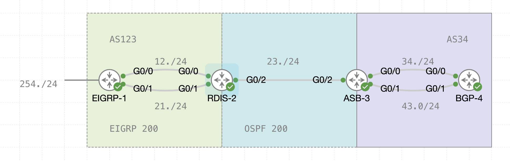

# **SBA Demo for 24F-NET3008**

## **Overview**
During this demo, I will guide you through the **key tasks and configurations** you will encounter in the SBA. The objective is to ensure you are familiar with the topology, the requirements, and the types of configurations expected.

### **Demo Objectives**
1. Understand the **network topology** and its components.
2. Review the initial setup, including **IP addressing** and connectivity verification.
3. Demonstrate basic configurations for:
   - **EIGRP**
   - **OSPF**
   - **BGP**
4. Provide an overview of **redistribution** and **path control** tasks.
5. Answer your questions to clarify SBA expectations.

---

## **1. Topology Overview**


### **Key Points in the Topology**
- **EIGRP (AS123)** is configured between **EIGRP-1** and **RDIS-2**.
- **OSPF (Process ID 200)** is configured between **RDIS-2** and **ASB-3**.
- **BGP (AS34)** is configured between **ASB-3** and **BGP-4**, using both directly connected interfaces and loopbacks.
- Links between routers:
  - **EIGRP-1 ↔ RDIS-2**: `10.200.12.0/24` and `10.200.21.0/24`
  - **RDIS-2 ↔ ASB-3**: `10.200.23.0/24`
  - **ASB-3 ↔ BGP-4**: `10.200.34.0/24` and `10.200.43.0/24`
  - Initial configuration for basic IP addressing will be given.
  - You will have to configure extra loopback devices to emulate routes throughout the SBA.

---
## **2. Initial Setup** (Estimated Time:  20 minutes)
### Tasks:
1. **Verify IP Addressing**:
   - Show the IP addresses for each router using:
    ```bash
     show ip interface brief
     ```
   - Confirm that interfaces are up and correctly assigned.

2. **Verify Basic Connectivity**:
   - Use **ping** to ensure Layer 3 connectivity between directly connected routers.

---

## **3. Routing Protocol Configuration** (Estimated Time: 1 hour)
### **Total Marks: 8 Points**

### [ 2 Points ] **EIGRP Configuration**
1. [ No Points given for basic configuration ] **AS123 Configuration**: 
   - Enable EIGRP on **EIGRP-1** and **RDIS-2**:
     ```bash
     router eigrp 123
      network 10.200.12.1 0.0.0.0
      network 10.200.21.1 0.0.0.0
     ```
   - Verify adjacencies:
     ```bash
     show ip eigrp neighbors
     ```

2. **Possible extras to configure**:
	- Inject an external network.
	- Adjust hello interval and hold timer.
	- Set router as stub routers.
	- Implement EIGRP summarization for the loopback routes.
	- Use all the feasible paths between the routers.

---

### [3 Points]**OSPF Configuration**
1. **Process ID 200**:
   - Enable OSPF on **RDIS-2** and **ASB-3**
   - Verify adjacencies:
     ```bash
     show ip ospf neighbor
     ```

2. **Possible extras to configure**:
	- Configure multi-area OSPF.
	- Adjust hello interval and hold timer.
	- Set an area as stub area or totally stubby area
	- Implement OSPF summarization for the loopback routes.

---

### [ 3 Points] **BGP Configuration**
1. **eBGP Configuration**:
   - Configure **eBGP** on **ASB-3** and **BGP-4**
	   - Using directly connected or loopback devices
1. **Verify BGP Neighbours**:
   ```bash
   show ip bgp summary
```
2. **Route Advertisement**:
    - Advertise network prefixes in BGP.

---

## **4.  Route Filtering, Redistribution, and Path Control** (Estimated Time: 1 hour)
### **Total Marks: 7 Points**

### [ 2 Points] **Route Filtering**
1. Create a set of loopback devices in a router.
2. Advertise the routes via a routing protocol.
3. Use a prefix-list or a distribution list to filter out the routes.
### [ 2 Points] **Redistribution**
1. Perform redistribution from one protocol to another, for example from EIGRP to OSPF.
2. Use a route-map to apply a metric or change a value in the redistribution.
### [ 3 Points] **Path Control**
1. Use a route-map to modify attributes from BGP.
2. Apply PBR to specify the next-hop of a route.
