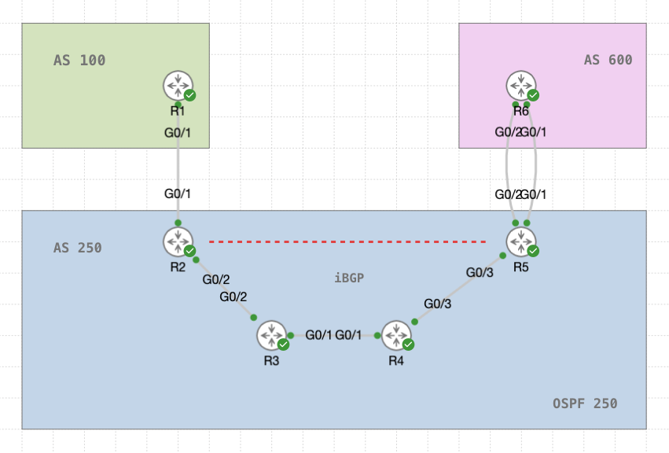

# BGP Quiz Preparation

This document is designed to prepare you for understanding and configuring BGP in both eBGP and iBGP scenarios. The concepts are explained using the topology provided.

---

## 1. eBGP Neighbours Using Directly Connected Interfaces

### Key Concepts:
- eBGP peers communicate over **TCP port 179** to establish neighbour relationships.
- **TTL = 1**: eBGP peers assume direct connectivity, so the default TTL value is set to 1.
  - **Why TTL = 1?** This prevents sessions from being established over unintended or indirect paths, adding a layer of security.

---

## 2. eBGP Neighbours Using Loopback Interfaces

### Why Use Loopbacks?
- Loopback interfaces are stable and remain reachable even if physical interfaces go down, ensuring session reliability.

### Challenges and Solutions:
1. **Neighbour's loopback is not in the routing table.**
   - **Solution**: Configure a static route to the loopback interface of the neighbour.

2. **TTL = 1, so the connection is not established.**
   - **Solution**: Increase the TTL value using the `ebgp-multihop` command:
     ```plaintext
     neighbor <IP> ebgp-multihop 2
     ```
   - **Why?** When the TTL of the packet is decremented to 1 as it enters the neighbour's router, the packet is dropped before reaching its destination.

3. **TCP connection sourced by the closest interface to the neighbour.**
   - **Problem**: The neighbour will reject the connection since only connections from the loopback are allowed.
   - **Solution**: Set the source to the loopback interface:
     ```plaintext
     neighbor <IP> update-source loopback
     ```

---

## 3. Network Advertisement

### Key Concepts:
1. **NLRI (Network Layer Reachability Information):**
   - Contains the prefix (network) and mask (subnet) that BGP advertises.

2. **Next-Hop Attribute:**
   - Specifies the IP address of the next hop to reach the advertised network.

3. **AS_PATH:**
   - Each AS appends its own ASN to the path as it propagates the advertisement.
   - **Loop Prevention**: If a router sees its own ASN in the AS_PATH, it drops the NLRI to avoid routing loops.

4. **Valid NLRI:**
   - For a route to be considered valid:
     - The `next-hop` address must be reachable.
     - The prefix must be properly propagated according to BGP policies.

---

## 4. The Need for iBGP

### Key Concepts:
1. **iBGP Neighbours:**
   - iBGP peers are within the same AS and must form a full-mesh relationship unless route reflectors are used.

2. **Advertising NLRI in iBGP:**
   - iBGP follows the split-horizon rule: a route learned from one iBGP peer is **not advertised** to another iBGP peer.

3. **Next-Hop-Self:**
   - When advertising routes from eBGP peers to iBGP peers, the next-hop attribute remains unchanged.
   - **Solution**: Use the `next-hop-self` command to set the advertising router as the next hop:
     ```plaintext
     neighbor <IP> next-hop-self
     ```

---

### Topology Reference

Refer to the provided topology image for the relationships and connections between the routers:


---