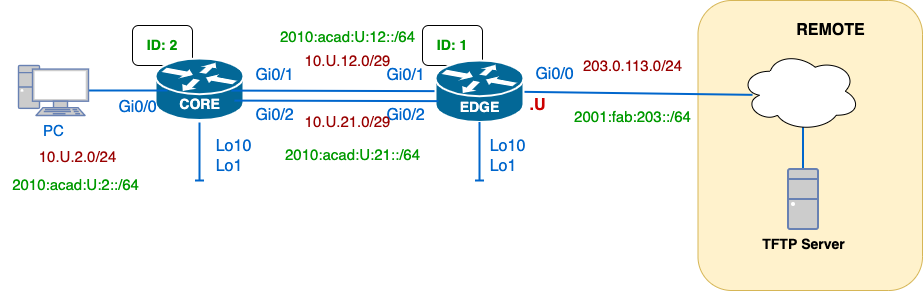

# 25S-CST8371 – SBA Practical Assessment

---
## Required Equipment

- 2 routers, or 1 router and 1 L3 switch
- 1 PC or virtual machine
- Console and network cables (as per topology)

---

## Evidence Collection

You will be able to use the `x-remote` script to collect information; `YAML` will be provided, or if you prefer, you could manually collect the necessary command outputs.

---
## SBA Objectives and Tasks

### Task 0 – Cable and Reload Devices (10 minutes)

> No grades, but requiered

- [ ] Connect the provided topology
- [ ] Ensure all devices are clean before starting:
	- [ ] Erase startup config
	- [ ] Remove VLANs: `delete vlan.dat`

### Task 1 – [ 3 Points] Basic Settings and Direct Connectivity (20 mins )

- [ ] Set IP addresses for IPv4 and IPv6 and interface descriptions
- [ ] Use devices names as `{username}-DEVICE`
- [ ] `no ip domain-lookup`
- [ ] `enable secret`
- [ ] Configure SSH with local user `admin/cisco` 
- [ ] Test configuration and direct connectivity:

---

### Task 2 – [ 5 Points ] Configure OSPFv2 (20 mins )

- [ ] Manually configure the router ID; use same IP as Lo10
- [ ] Enable OSPF on all interfaces but EDGE-Gi0/0/0
- [ ] Configure a default route in EDGE and propagate it into the OSPF domain.
- [ ] Validate neighbour adjacency with:
	  - `show ip ospf neighbor`
	  - `show ip protocols`
	  - `show ip route ospf`

---
### Task 3 – [ 4 Points ] Optimize OSPFv2

Implement **two or more** of the following:
- [ ] Configure `passive-interface`
- [ ] Set reference bandwidth
- [ ] Adjust loopback network type (`point-to-point`)
- [ ] Tune DR/BDR elections (`ip ospf priority`)
- [ ] Tune hello/dead intervals.
- [ ] Change the cost of an interface to favour one link over the other.
- [ ] Validate using:
	  - `show ip ospf`
	  - `show ip route`
	  - `debug ip ospf adj`

---
### Task 4 – [2 Points] IPv4 Path Verification (10 mins)

- [ ] Collect baseline paths with `traceroute`
- [ ] Simulate a link failure
- [ ] Wait for OSPF to reconvergence
- [ ] Capture new failover path

---

### Task 5 – [4 Points] Configure IPv6 Static and Floating Routes (20 mins )

- [ ] Configure static routes using GUA or LLA as next-hop
- [ ] Add floating routes with higher AD (e.g., `ipv6 route ... 130`)
- [ ]  Test with:
	  - `show ipv6 route`
	  - `ping`, `traceroute`

---

### Task 6 – [2 Points] IPv6 Path Verification (10 mins)

- [ ]  Record baseline paths using `traceroute` and `show ipv6 route`
- [ ] Simulate link failure
- [ ] Confirm failover via floating route

---

### Task 7 – Backup Configs and Upload Evidence (10 mins)

- [ ] Copy running-config to TFTP server
- [ ] Upload show commands to the TFTP server

---

### Task 8 – Cleanup Devices and Uncable (10 mins)

> ❗ **Penalty: -5 points if not completed**

- [ ] Erase configs and reload
- [ ] Unplug all cables
- [ ] Leave workstation ready for next group

---

### Task 9 – Return All Papers (5 mins)

> ❗ **Penalty: Grade of 0 if not returned**

- [ ] Submit all notes, printed configs, or scratch work
- [ ] If using loose sheets (not lab book), leave them behind

---

##  Scoring Summary

| Task | Description                      | Points           | Time     |
|------|----------------------------------|------------------|----------|
| 1    | IPv6 Addressing (Basic Setup)    | 2                | 20 min   |
| 2    | OSPF Configuration               | 5                | 20 min   |
| 3    | OSPF Optimization & Tuning      | 4                | 20 min   |
| 4    | IPv4 Path Verification           | 2                | 10 min   |
| 5    | IPv6 Static & Floating Routes    | 4                | 20 min   |
| 6    | IPv6 Path Verification           | 2                | 10 min   |
| 7    | Config Upload to TFTP            | –                | 10 min   |
| 8    | Device Cleanup                   | –5 (if not done) | 10 min   |
| 9    | Paper Return                     | Grade = 0        | 5 min    |
| **Total** |                            | **20 pts + req. tasks** | **115 min** |

---

## Notes

- A default route must exist in the routing table to be advertised (`show ip route`)
- DR/BDR elections require an adjacency reset to take effect
- Use `terminal monitor` when collecting live debug output

---

© 25F-CST8371 – Algonquin College – C. Ayala
