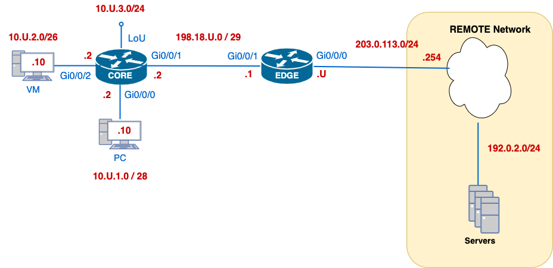

# W01-LAB - Getting to Know Your Lab Environment

---
## Lab Overview
This Packet Tracer lab gets your toolkit working and establishes a **baseline router configuration** you’ll reuse all term. You will bring up the CORE–EDGE topology, apply minimal but essential settings, and verify each step with one clear command.

**You will:**
- Apply a sane base config on **CORE** and **EDGE**.
- Address interfaces from the provided plan (replace `U` with your assigned number).
- Build **reachability with static routes**.
- Secure remote access (**SSHv2** only, local user).
- Configure **NTP** (time), **Syslog** (remote logging), and **CDP** (neighbour discovery).
- Capture concise **evidence** for each checkpoint (C01–C06) in a small text file.

**What you submit:**  
`w01-pt-base-<username>.txt` containing evidence for C01–C06 (tag + one verification per item).  
*Keep it minimal—no full running-configs.*

**Estimated time:** 60–90 minutes (including verification and evidence capture).

---
## Learning Objectives
By the end of this lab, you should be able to:

1. **Interpret a topology & addressing plan** and apply IP settings to the correct interfaces.
2. **Establish basic reachability** using static routes and confirm with `ping`/`traceroute`.
3. **Harden management access** by enabling **SSHv2** only with a local admin account.
4. Configure management-plane services: **NTP**, **Syslog**, and **CDP**, using the appropriate **source interface**.
5. **Verify** each configuration with targeted `show` commands and **record minimal evidence** suitable for grading and troubleshooting.
6. Follow a **find → minimal fix → verify** habit you’ll reuse in audits and challenges.

---
## Why This Lab Is Important
- It creates a **repeatable baseline** so future labs (routing, ACLs, NAT, IPv6) don’t start from scratch.
- Time and logs (**NTP/Syslog**) make your troubleshooting **trustworthy and traceable**.
- Secure VTY access (**SSH-only**) is the foundation for safe remote management.
- Practicing **minimal configuration + one-line verification** builds the evidence discipline you’ll need for **audits** and **challenges**.
- Static routing here removes protocol complexity so you can **focus on essentials** first; dynamic routing arrives later.

### Topology
  

*Addresses in red show network blocks; use your `U` value wherever shown.*

### Addressing Plan

| Device      | Interface  | Network        | IP/Mask              | Notes                        |
| ----------- | ---------- | -------------- | -------------------- | ---------------------------- |
| **CORE**    | G0/0/0     | 10.U.1.0/28    | **10.U.1.2/28**      | PC LAN — default gateway     |
| **CORE**    | G0/0/2     | 10.U.2.0/26    | **10.U.2.2/26**      | VM LAN — default gateway     |
| **CORE**    | G0/0/1     | 198.18.U.0/29  | **198.18.U.2/29**    | To EDGE (internal link)      |
| **CORE**    | LoopbackU  | 10.U.3.0/24    | **10.U.3.2/24**      | Loopback for tests/router-ID |
| **EDGE**    | G0/0/1     | 198.18.U.0/29  | **198.18.U.1/29**    | To CORE (internal link)      |
| **EDGE**    | G0/0/0     | 203.0.113.0/24 | **203.0.113.U/24**   | To REMOTE network            |
| **REMOTE**  | —          | 203.0.113.0/24 | **203.0.113.254/24** | Remote gateway (given)       |
| **Servers** | —          | 192.0.2.0/24   | —                    | Reachable via REMOTE         |
| **PC**      | NIC        | 10.U.1.0/28    | **10.U.1.10/28**     | DG = 10.U.1.2                |
| **VM**      | NIC        | 10.U.2.0/26    | **10.U.2.10/26**     | DG = 10.U.2.2                |
> Replace `U` with your assigned number.

---
## The Network Explained

**Roles**
- **CORE** — internal router: PC/VM LANs and the internal link to EDGE.
- **EDGE** — border router: connects the lab to the **REMOTE** network.

**Addressing pattern**
- Replace `U` with your assigned number. Examples: `10.U.1.0/28`, `198.18.U.0/29`, `203.0.113.U/24`.
- A small /29 between CORE↔EDGE keeps the internal link simple and point-to-point.

**Routing for Week 1 (static only)**
- **EDGE**: default route to the REMOTE gateway `203.0.113.254`.
- **CORE**: default route to **EDGE** (`198.18.U.1`).
- That’s enough to reach course services (TFTP/HTTPs) behind REMOTE without introducing OSPF yet.

**Management plane**
- **SSH only** on VTY (no Telnet).
- **NTP** to `192.0.2.123`; **Syslog** to `192.0.2.250`.  
  On EDGE, source management traffic from `G0/0/0` (the 203.0.113.0/24 side) for consistent reachability.
- **CDP** stays on for the CORE↔EDGE and EDGE↔REMOTE links so you can verify neighbours.

---

## Building the Network

> Replace every `U` with your assigned number. Keep configurations **minimal**.  
> After each Task, complete the matching **🔍 C0x — Verification & Collection of Information**.

### Create Submission File
- [ ] On your desktop, create **`w01-pt-base-<username>.txt`**. You will submit this file to Brightspace.
- [ ] **Avoid double extensions:** Many editors (Notepad, TextEdit) add `.txt` automatically.
	  - In **Notepad (Windows)**: either type the name **without** `.txt` (Notepad adds it), **or** choose **Save as type: All Files (*.*)** if you include `.txt` yourself.
	  - In **TextEdit (macOS)**: use **Format → Make Plain Text**, then save as `w01-pt-base-<username>.txt`.
	  - **Check the final name** is exactly: `w01-pt-base-<username>.txt`
	    - ✅ `w01-pt-base-ayalac.txt`
	    - ❌ `w01-pt-base-ayalac.txt.txt`

### Task  0 — Basic Configuration (CORE & EDGE)
- [ ] Set **hostname** (CORE / EDGE) as `username-<devicename>` (eg: *ayal0014-EDGE*)
- [ ] Disable **DNS lookup**.
- [ ] Protect privileged exec with password `class` stored with strong encryption.
- [ ] Configure the console line to minimize disruptions caused by log messages.
### Task 1 — IP Addressing & Interface State
- [ ] Find your `U` number in Brightspace; you will be using it as part of your network addresses during the semester.
- [ ] Assign IPs per the **Addressing Plan/Topology** (replace `U` with your number).
- [ ] Add clear **descriptions** to each interface you configure.
- [ ] Ensure required interfaces are **up/up** (CORE↔EDGE link and EDGE↔REMOTE).

#### 🔍 C01 — Verification & Collection of Information
📝 In your `w01-pt-base-<username>.txt` file, create a section labelled:

```diff
=== CO1 – IP Addressing & Interface State ===
```

##### **Part A — Verify (run on EDGE and CORE)**

1. **Interface state (fast scan):**
    
	```plaintext
	show ip interface brief | ex una
	```

> This hides lines with `unassigned`, so you focus on configured interfaces and **up/down** status. 
> ⚠️ Note: this command **does not show subnet masks**.

2. **Address + mask (authoritative):**
    

```plaintext
show ip route | inc C|L
````

> The routing table shows **C (connected)** and **L (local)** routes with **prefix length** (mask) and the bound interface.  
> Use this to confirm your configured IP **and** mask are correct.


📘 **Sample Verification Output Block** _(example uses `U=250`; your values will differ)_
```plaintext
ayalac-CORE#show ip interface brief | ex una
Interface              IP-Address      OK? Method Status                Protocol
GigabitEthernet0/0/0     10.250.1.2      YES manual up                    up
GigabitEthernet0/0/2     10.250.2.2      YES manual up                    up
Loopback250            10.250.3.2      YES manual up                    up
GigabitEthernet0/0/1     198.18.250.2    YES manual up                    up

ayalac-CORE#show ip route | inc C|L
Codes: L - local, C - connected, S - static, R - RIP, M - mobile, B - BGP
       i - IS-IS, L1 - IS-IS level-1, L2 - IS-IS level-2, ia - IS-IS inter area
C       10.250.1.0/28 is directly connected, GigabitEthernet0/0/0
L       10.250.1.2/32 is directly connected, GigabitEthernet0/0/0
C       10.250.2.0/26 is directly connected, GigabitEthernet0/0/2
L       10.250.2.2/32 is directly connected, GigabitEthernet0/0/2
C       10.250.3.0/24 is directly connected, Loopback250
L       10.250.3.2/32 is directly connected, Loopback250
C       198.18.250.0/24 is directly connected, GigabitEthernet0/0/1
L       198.18.250.2/32 is directly connected, GigabitEthernet0/0/1
```


##### **Part B — What to submit (both devices)**

```plaintext
show ip route | inc C|L
```

✅ **What to Include (CO1 — submission)**

| Requirement                              | Details                                                                                                                                                     |
| ---------------------------------------- | ----------------------------------------------------------------------------------------------------------------------------------------------------------- |
| 🖥️ Device prompt + command              | Include device name and command, e.g., `ayalac-EDGE# show ip route \| inc C\|L` and `ayalac-CORE# show ip route \| inc C\|L`.                               |
| 📜 Output to paste                       | **Only** the filtered routing table lines (`C` + `L`) from **both** routers. No `show run`, no screenshots.                                                 |
| 🧭 Addressing check                      | `C` (connected) prefixes show **network + mask** and interface; `L` (local) shows the **host /32**. Confirm they match the addressing plan with your `U`.   |
| 🔌 Interface state (verify, don’t paste) | Use `show ip interface brief \| ex una` on each router to ensure required links are **up/up**. **Do not** include this output in CO1—just use it to verify. |
| 🗒️ Comment line                         | Add one line after the outputs, e.g.: `!-- Interfaces up/up confirmed via brief; IP + mask verified via C/L routes.`                                        |
| 🔁 Both devices                          | Provide the `show ip route \| inc C\|L` block **for EDGE and CORE**.                                                                                        |

---

### Task 2 — Static Routing (baseline reachability)

- [ ] On **EDGE**: install a **default route** **to REMOTE** (via `203.0.113.254`).
- [ ] On **CORE**: install a **default route** **to EDGE** (via `198.18.U.1`).
- [ ] On **EDGE**: install a **summary route** for **all internal networks** behind CORE.
- [ ] On **REMOTE**: install **return routes** **back via EDGE** so REMOTE can reach internal subnets:
  - `198.18.U.0/24` (internal link space)
  - `10.U.0.0/16`  (PC/VM/Loopback summary)

**Why the summary on EDGE?**  
EDGE must reach three internal networks that sit behind CORE:
- PC LAN `10.U.1.0/28`, VM LAN `10.U.2.0/26`, and LoopbackU `10.U.3.0/24`.  
A single summary **`10.U.0.0/16`** covers all of them → fewer routes, same reachability.

**Commands (replace `U` and interfaces to match your diagram):**
```plaintext
! ----- EDGE -----
ip route 0.0.0.0 0.0.0.0 203.0.113.254
ip route 10.U.0.0 255.255.0.0 198.18.U.2


! ----- CORE -----
ip route 0.0.0.0 0.0.0.0 198.18.U.1

! ----- REMOTE -----
! Return paths back via EDGE (EDGE’s WAN IP is 203.0.113.U)
ip route 198.18.U.0 255.255.255.0 203.0.113.U
ip route 10.U.0.0    255.255.0.0   203.0.113.U
!               ^ summaries back toward EDGE’s WAN
```

> **Note (PT vs real gear):** PT can be inconsistent with “fully specified” routes (next-hop **+** exit interface).  
> In PT we use **next-hop only**. In the physical lab, you’ll be expected to use **fully specified** statics.

#### 🔍 C02 — Verification & Collection of Information
📝 In your `w01-pt-base-<username>.txt` file, create a section labelled:

```diff
=== CO2 – Static Routing & REMOTE Reachability ===
```

##### **Part A — Verify (run these first)**

> We already confirmed directly connected links in **CO1**.  
 
1. **EDGE & CORE** — show only your static routes
```plaintext
!-- EDGE & CORE
show ip route static
```
- Look for `S* 0.0.0.0/0` (default) on both.
- On EDGE, also see `S 10.U.0.0/16` (summary).

2. **REMOTE** — prove the return routes exist
```plaintext
!-- REMOTE
show ip route 198.18.U.0
show ip route 10.U.0.0
```
- You should see **Known via "static", distance 1**, and next-hop `203.0.113.U`.

3. **PC** — end-to-end path test (better than a single ping)
```bash
C:\> tracert 192.0.2.69
```
- Confirms the path: **PC → CORE → EDGE → REMOTE → TFTP**.

**How `tracert` works (quick)**  
Windows `tracert` sends **ICMP Echo** packets with **increasing TTL (1, 2, 3, …)**.  
Each router decrements TTL; when TTL hits 0, that router returns **ICMP Time Exceeded**, revealing itself as a hop.  
At the final hop, the destination replies with **ICMP Echo Reply**.  
Compared to a single `ping`, `tracert` is better for **path diagnostics**: you see where traffic goes and **where it breaks** (e.g., a missing static route or blocked hop).  
_Tip: Asterisks `*` can appear if a hop doesn’t respond to TTL-expired probes—path can still work end-to-end._

4. **EDGE** — internal reachability to the VM
```bash
ping 10.U.2.10
```


📘 **Sample Verification Output Block** _(example uses `U=250`; your values will differ)_

```plaintext
ayalac-EDGE#show ip route static
     10.0.0.0/16 is subnetted, 1 subnets
S       10.250.0.0 [1/0] via 198.18.250.2
S*   0.0.0.0/0 [1/0] via 203.0.113.254

RemoteS#show ip route 198.18.250.0
Routing entry for 198.18.250.0/24
  Known via "static", distance 1, metric 0
  Routing Descriptor Blocks:
  * 203.0.113.250
      Route metric is 0, traffic share count is 1
      
C:\>tracert 192.0.2.69
Tracing route to 192.0.2.69 over a maximum of 30 hops:

  1    0 ms    0 ms    0 ms  10.250.1.2
  2    0 ms    0 ms    0 ms  198.18.250.1
  3    0 ms    0 ms    0 ms  203.0.113.254
  4    0 ms    0 ms    0 ms  192.0.2.69

Trace complete.
```


##### **Part B — What to submit (paste these blocks)**

Run these commands on **EDGE** and **CORE**, then from the **PC**:

```bash
# -- EDGE - CORE
show ip route static

# -- REMOTE
# Prove return routes on REMOTE
show ip route 198.18.U.0
show ip route 10.U.0.0

# Connectivity tests
# -- EDGE
ping 10.U.2.10       
# -- PC
PC> tracert 192.0.2.69                   # TFTP server behind REMOTE (end-to-end)
```

✅ **What to Include:**

| Requirement               | Details                                                                                   |
| ------------------------- | ----------------------------------------------------------------------------------------- |
| 🖥️ Device prompts        | Include device + command (e.g., `ayalac-EDGE# show ip route \| begin Gateway`)            |
| 🌐 Defaults (EDGE & CORE) | Snippet showing **S*** `0.0.0.0/0` on **both** routers                                    |
| 🧭 EDGE internal summary  | `show ip route 10.U.0.0` showing **S 10.U.0.0/16 via 198.18.U.2, <internal-if>**          |
| 🔁 REMOTE return routes   | `show ip route 198.18.U.0` and `show ip route 10.U.0.0` showing **next-hop 203.0.113.U**  |
| 💻 PC → REMOTE test       | PC traceroute to **192.0.2.69** (paste result)                                            |
| 🔧 EDGE → VM test         | EDGE ping to **10.U.2.10**                                                                |
| 🗒️ Comment               | Add: `!-- defaults routes + EDGE /16 summary + REMOTE return routes verified; tests run.` |

---
### Task 3 — Secure Remote Access (SSHv2)

- [ ] Create a local **admin** user with **privilege level 15** and **secret password `cisco`** (hashed).
- [ ] Set the device **domain name** to **`cnap.cst`** (needed for key generation).
- [ ] Generate an **RSA host key** with **modulus 1024 bits**.
- [ ] Enforce **SSH version 2 only**.
- [ ] SSH hardening: **authentication retries = 3** and **authentication timeout = 60 seconds**.
- [ ] VTY lines **0–4**: **login local**, **SSH-only** (no Telnet), and **exec-timeout = 10 minutes**.
- [ ] Set an **enable secret** for privileged mode if you haven't done it yet.

> Note: Ensure the **hostname** was set in Task 1 **before** generating RSA keys.


#### 🔍 C03 — Verification & Collection of Information
📝 In your `w01-pt-base-<username>.txt` file, create a section labelled:

```diff
=== CO3 – Secure Remote Access (SSHv2) ===
```

##### **Part A — Verify (run these first)**

1. **From the SSH target (example: CORE)**
```bash
# From the Packet Tracer PC to CORE (replace U):
ssh -l admin 198.18.U.2
# Once in CORE:
ayalac-CORE# show tcp brief
TCB            Local Address         Foreign Address        (state)
7F9862587110   198.18.250.2.22       10.250.1.10.1027       ESTABLISHED
```
- 198.18.250.2.22 = SSH server on port 22 (device you connected to).
- 10.250.1.10.1027 = PC source IP with an ephemeral port (1027).
- ESTABLISHED = SSH handshake completed; session is live.

2.  **From EDGE, prove the settings:**

```bash
ayalac-EDGE# show ip ssh
SSH Enabled - version 2.0
Authentication timeout: 60 secs; Authentication retries: 3
```
- Confirms SSHv2 only, plus your hardening values (timeout 60s, retries 3).

> Packet Tracer vs. real gear: PT’s show ip ssh output is minimal.
>On real IOS, you’ll typically also use show ssh (session table) and can verify RSA key details with show crypto key mypubkey rsa.

##### **Part B — What to submit (paste these blocks)**

```bash
# On CORE (verify the session landed)
show tcp brief

# On EDGE (prove SSH server settings)
show ip ssh
```

✅ **What to Include:**

| Requirement             | Details                                                                                          |
| ----------------------- | ------------------------------------------------------------------------------------------------ |
| 🖥️ Device prompt       | Include device name + command (e.g., `ayalac-CORE# show ssh`)                                    |
| 🔐 Version proof        | From **EDGE**: `show ip ssh` showing **SSH Enabled – version 2.0**                               |
| 📡 Live session on CORE | From **CORE**: `show ssh` and `show tcp brief` showing the **active SSH connection**             |
| 🗒️ Comment             | Add: `!-- SSHv2 enforced, domain & RSA key present, live session verified.`                      |

---

### Task 4 — NTP (time synchronization)
- [ ] On **EDGE**: act as an **NTP server of stratum 4**.
- [ ] On **CORE**: **sync time from EDGE**.
- [ ] First, **set the clock** on EDGE so clients have a sane initial time.

**Suggested commands (copy/paste with your U value):**

```plaintext
! ----- EDGE -----
# On privileged EXEC
clock set 14:00:00 28 Aug 2025         ! set the current time
# On global configuration
ntp master 4                           ! serve as stratum-4 master

! ----- CORE -----
# On global configuration
ntp server 198.18.U.1                  ! EDGE's CORE-facing IP
```

> ⏱️ **Tip:** NTP may take ~10–60s to show as reachable/selected. 
> In Packet Tracer you can forward the time.

#### 🔍 CO4 — Verification & Collection of Information

📝 In your `w01-pt-base-<username>.txt` file, create a section labelled:

`=== CO4 – NTP (time synchronization) ===`

##### **Part A — Verify (run these first)**

1. **From EDGE, verify settings**:
```bash
ayalac-EDGE#show ntp status
# Clock is synchronized with stratum 4 as configured
Clock is synchronized, stratum 4, reference is 127.127.1.1
nominal freq is 250.0000 Hz, actual freq is 249.9990 Hz, precision is 2**24
# Note the time in ( )
reference time is FFFFFFFFEC3093DD.00000164 (12:2:37.356 UTC Fri Aug 29 2025)
clock offset is 0.00 msec, root delay is 0.00  msec
root dispersion is 0.00 msec, peer dispersion is 0.12 msec.
loopfilter state is 'CTRL' (Normal Controlled Loop), drift is - 0.000001193 s/s system poll interval is 5, last update was 4 sec ago.
```

2. **From CORE**:
```bash
ayalac-CORE#show ntp status
# Clock is sync, stratum 5 ( EDGE is 4 + 1 ); reference is EDGE
Clock is synchronized, stratum 5, reference is 198.18.250.1
nominal freq is 250.0000 Hz, actual freq is 249.9990 Hz, precision is 2**24
# Time is correct
reference time is FFFFFFFFEC30A21C.000002FF (13:3:24.767 UTC Fri Aug 29 2025)
```

##### **Part B — What to submit (paste these blocks)**

```bash
# On EDGE and CORE
show ntp status
```

✅ **What to Include:**

| Requirement           | Details                                                                          |
| --------------------- | -------------------------------------------------------------------------------- |
| 🖥️ Device prompt     | Include device name + command (e.g., `ayalac-EDGE# show ntp status`)             |
| 🕰️ EDGE master proof | From **EDGE**: `show ntp status` indicating stratum **4**                        |
| 📡 CORE peer to EDGE  | From **CORE**: `show ntp status` indicating stratum **5** y reference clock EDGE |
| 🗒️ Comment           | Add: `!-- EDGE serving stratum-4; CORE synced to EDGE.`                          |

---

### Task 5 — Syslog (remote logging)
- [ ] Use the **VM (Packet Tracer Server)** as the Syslog server.
- [ ] Send Syslog from **CORE** and **EDGE** to the **VM**.

**A) Prepare the VM (Packet Tracer Server)**
- Services → **Syslog** → **On** (no filters needed)

**B) Configure Syslog on routers**

```plaintext
! ----- CORE -----
logging host 10.U.2.10                       ! VM IP
!

! ----- EDGE -----
logging host 10.U.2.10                       ! VM IP (reachable via static route above)
!
```

>💡 **Tip:** To generate test events, `shutdown /no shutdown` an interface or do a single `login on-success` via console/VTY.  
> In PT, open the VM’s **Syslog** service to watch messages arrive.

#### 🔍 CO5 — Syslog (Verification & Collection of Information)

📝 In your `w01-pt-base-<username>.txt` file, create a section labelled:

```plaintext
=== CO5 – Syslog (remote logging) ===
```

Run these checks:

```plaintext
# On CORE - EDGE
show running-config | include logging

# On VM's Syslog pane
# confirm you see entries from CORE and EDGE
```

✅ **What to Include:**

| Requirement                | Details                                                                                 |
| -------------------------- | --------------------------------------------------------------------------------------- |
| 🖥️ Device prompt          | Include device + command (e.g., `ayalac-CORE# show run \| include ...`)                 |
| 🎯 Remote host line        | Show the **logging host** = `10.U.2.10` on **both** routers                             |
| 🗒️ Comment                | Add: `!-- Syslog to VM configured; source-if per spec; EDGE route to VM LAN confirmed.` |

---

### Task 6 — CDP Neighbour Discovery (internal link)
- [ ] Ensure **CDP** is running globally.
- [ ] Confirm CDP on the **CORE ↔ EDGE** interfaces.

> ℹ️ **Nothing to configure:** CDP is **enabled by default**. If someone disabled it, re-enable globally with `cdp run` (no need to include that in evidence).

#### 🔍 CO6 — Verification & Collection of Information

📝 In your `w01-pt-base-<username>.txt` file, create a section labelled:

```diff
=== CO6 – CDP Neighbour Discovery ===
```

Run this command **on EDGE only**:

```plaintext
show cdp neighbors
```


✅ **What to Include:**

|Requirement|Details|
|---|---|
|🖥️ Device prompt|Include device + command, e.g., `ayalac-EDGE# show cdp neighbors`|
|👥 Neighbour present|Table shows **CORE** as a neighbour|
|🔌 Ports match|**Local** = EDGE’s internal link (e.g., **Gi0/0/1**), **Port ID** = CORE’s matching port|
|⏳ Timing note|CDP entries can take up to ~60s to appear in PT—wait briefly if the table is empty|
|🗒️ Comment|Add: `!-- CDP up on internal link; CORE visible from EDGE as expected.`|

---

## 🗒️ Documentation (for your Lab Book)

Keep a concise record of what you built in W01—this becomes your quick-reference for later labs and the physical gear.

**Do these two things:**
1) **Update your lab book** with:
   - **Topology** sketch (label device names and key interfaces)
   - **Addressing** plan used (replace `U` everywhere)
   - **Accounts & security**: admin user, SSH settings (v2, retries=3, timeout=60), VTY policy
   - **Services**: NTP (who’s master/peer), Syslog (server IP + source-if), CDP notes
   - **Routing choices**: default routes, the `10.U.0.0/16` summary, REMOTE return routes

2) **Create a personal reference file** (plain text):
   - File name suggestion: `w01-baseline-notes-<username>.txt`
   - For each area below, list **the minimal config you used**, **the verification command**, and the **expected evidence line(s)**:
     - **Basic config:** hostname, user/secret, domain name  
       _Verify:_ `show running-config | include ^hostname|^username|^ip domain-name`
     - **IP addressing:** key interfaces/loopback  
       _Verify:_ `show ip route | inc C|L`
     - **Static routes:** defaults, summary, return routes  
       _Verify:_ `show ip route static`
     - **SSH/VTY:** v2 only, retries=3, timeout=60, SSH-only on VTY  
       _Verify:_ `show ip ssh`, `show tcp brief` (ESTABLISHED on :22)
     - **NTP:** EDGE master (stratum 4), CORE peered  
       _Verify:_ `show ntp status` (EDGE), `show ntp associations` (CORE)
     - **Syslog:** server IP + source interface  
       _Verify:_ `show running-config | include ^logging`
     - **CDP:** neighbour on internal link  
       _Verify:_ `show cdp neighbors`
     - **Connectivity tests:** `tracert 192.0.2.69` (PC), `ping 10.U.2.10 source g0/0/1` (EDGE)

> **Heads-up for Week 2 (physical lab):** Some details will change on real equipment because Packet Tracer has limitations. Expect to use **fully specified static routes** (next-hop **and** exit interface), optionally set **`ntp source …`**, and adjust interface names. Your W01 notes should make those swaps easy.

---

## 📤 Submission Checklist (Brightspace)

- [ ] **File name:** `w01-pt-base-<username>.txt` (plain text, UTF-8)
- [ ] **Include all CO sections (in order)**
- [ ] **Submit** to Brightspace.

