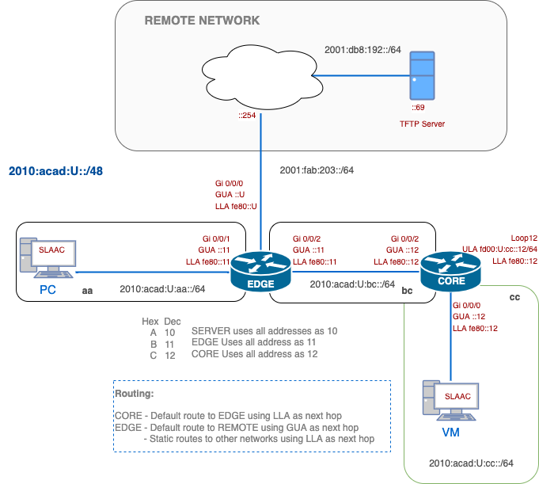

# Lab 02 – IPv6 Addressing and Static Routing

> Based on Linda MacEwan's IPv6 Lab

## Overview
You’ll configure **LLA, GUA, and ULA** addresses on Cisco routers, build reachability with static routes using both GUA and LLA next hops, and practice IPv6 verification on Alpine Linux.  
You will bring up the **EDGE–CORE topology**, confirm basic end-to-end reachability, and collect minimal evidence.

**You will:**
- Configure IPv6 addresses on all devices (LLA, GUA, ULA).
- Install static routes:
    - CORE → default via EDGE (LLA).
    - EDGE → default to REMOTE (GUA).
    - EDGE → static to internal networks (LLA).
- Verify host behaviour: SLAAC on VM (Alpine), static vs SLAAC comparison.
- Capture concise **evidence lines** for grading.

**Estimated time:** 2h 45m (including verification + evidence capture).

---
### Learning Objectives

By the end of this lab, you should be able to:
1. Configure **manual LLA + GUA** on routers, and verify with `show ipv6 int brief`.
2. Use **ULA loopbacks** for internal testing.
3. Install and test **static routes** with both GUA and LLA next hops.
4. Verify host IPv6 addressing, routes, and neighbour discovery on **Alpine Linux**.
5. Capture **minimal evidence** for IPv6 connectivity and routing table correctness.

---

## 💡 Why This Lab is Important

IPv6 is the **future of network addressing**, and the future is already here. The explosion of connected devices, cloud computing, and Internet of Things (IoT) has exhausted the IPv4 address space. IPv6 solves this with an address space so vast that it could assign an IP to every grain of sand on Earth. 

In this lab, you will be:
- Practice configuring LLA, GUA, and ULA on Cisco routers and Linux VMs.
- Implement default and static IPv6 routes using both GUA and LLA next hops.
- Use Linux commands to validate neighbour discovery, SLAAC, and route behaviour.
- Test full IPv6 connectivity between network segments.

Most importantly, this lab gives you hands-on experience with IPv6 **as it’s deployed in production environments today**, statically at the edge, dynamically inside, and incrementally rolled out alongside IPv4 in dual-stack topologies.

---

## 🗺️ Network Topology



### 📘 IPv6 Addressing Format

#### General IPv6 formatting:

| Block               | Role                  | Use                                        |
| ------------------- | --------------------- | ------------------------------------------ |
| `2010:acad::/48`    | Student Internal      | All router, VLAN, and lab configs          |
| `fd00:U::/8`        | Loopbacks             | Non-routable internal only                 |
| `2001:fab:203::/64` | Transit to Server LAN | Transit network towards the Server network |
| `2001:db8:192::/64` | Server LAN            | Public servers, including the TFTP server  |
#### Student Addressing:
All students use the format `2010:acad:U:<segment>::/64`, where:
-  `U` is your assigned unique student number (e.g., `1`, `2`, ..., `30`)
- `<segment>` is a 2-letter hex code for the link:

| Student Segment       | Link Segment | Interface or Purpose |
| --------------------- | ------------ | -------------------- |
| `2010:acad:U:aa::/64` | **`aa`**     | PC LAN               |
| `2010:acad:U:bc::/64` | **`bc`**     | EDGE ↔ CORE link     |
| `2010:acad:U:cc::/64` | **`cc`**     | VM LAN               |

---
## 🧾 Configuration and Verification Commands for Cisco IPv6

| Task                                | Command Example                                  | Notes                                            |
| ----------------------------------- | ------------------------------------------------ | ------------------------------------------------ |
| Enable IPv6 routing                 | `ipv6 unicast-routing`                           | Required on all routers                          |
| Assign Link-Local Address (LLA)     | `ipv6 address fe80::1 link-local`                | Manually configured, locally scoped              |
| Assign Global Unicast Address (GUA) | `ipv6 address 2001:db8:acad::1/64`               | Used for routing across the network              |
| Default Route (GUA next-hop)        | `ipv6 route ::/0 2001:db8:acad::2`               | Common for stub routers like SA                  |
| Static Route (GUA next-hop)         | `ipv6 route 2001:db5:b055::/64 2001:db8:acad::2` | All-zeroes in host portion of destination prefix |
| Static Route (LLA next-hop)         | `ipv6 route 2001:db5:b055::/64 g0/1 fe80::2`     | Must specify both exit interface and LLA         |
| Interface Summary                   | `show ipv6 interface brief`                      | Displays interface status and IPv6 addresses     |
| Detailed Interface Info             | `show ipv6 interface g0/0/0`                     | Useful for checking LLAs and multicast addresses |
| Routing Table                       | `show ipv6 route`                                | Confirms learned/static/default routes           |

---
## Building the Network

> Replace every `U` with your assigned number. Keep configurations **minimal**.  
> After each Task, complete the matching **🔍 C0x — Verification & Collection of Information**.

### Create Submission File
- [ ] On your desktop, create **`w02-ipv6-<username>.txt`**. You will submit this file to the TFTP server in the lab.
- [ ] **Avoid double extensions:** Many editors (such as Notepad and TextEdit) automatically add .txt.
- **Check the final name** is exactly: `w02-ipv6-<username>.txt`
	- ✅ `w02-ipv6-ayalac.txt`
	- ❌ `w02-ipv6-ayalac.txt.tx`
---
### Task  0 — Basic Configuration (CORE & EDGE)
- [ ] Set **hostname** (CORE / EDGE) as `username-<devicename>` (eg: *ayal0014-EDGE*)
- [ ] Disable **DNS lookup**.
- [ ] Protect privileged exec with password `class` stored with strong encryption.
- [ ] Configure the console line to minimize disruptions caused by log messages.
- [ ] <span style="color:#c00">[NEW]</span> no ip tftp source-interface

---
### Task 1 - Setting Up the Routers' IPv6 Addresses 

#### IPv6 Address Types Summary

In IPv6, a single interface can have **multiple IP addresses**, and this is **by design**. Unlike IPv4, where typically one IP is assigned per interface, IPv6 interfaces often have a **Link-Local Address (LLA)** and **one or more Global Unicast Addresses (GUAs)** at the same time. The **LLA** (starting with `fe80::/10`) is automatically generated and used for communication within the local link, such as neighbour discovery or routing protocol exchanges. Meanwhile, the **GUA** (starting with `2000::/3`) is routable across networks and used for regular data traffic. This **multi-address model** enhances flexibility, allowing interfaces to participate in local control-plane functions while also handling end-to-end global traffic.

| Address Type | Prefix / Format | Purpose                        | Where Used in Lab    | Notes                                                                  |
| ------------ | --------------- | ------------------------------ | -------------------- | ---------------------------------------------------------------------- |
| **LLA**      | `fe80::/10`     | Local link-only communication  | All interfaces.      | Required for neighbour discovery and used as next-hop in static routes |
| **GUA**      | `2000::/3`      | Global communication routing   | Physical interfaces. | Used for default/static routes, ping tests, and Internet access        |
| **ULA**      | `fd00::/8`      | Private internal communication | Loopback interfaces. | Similar to private IPv4 (RFC1918); not routable on global Internet     |
#### 1. Routers Addressing
- [ ] Enable IPv6 routing using `ipv6 unicast-routing`
- [ ] Assign LLA and GUA on all interfaces according to the topology.
- [ ] Loopback interfaces use ULA addresses (`fdxx::/8`).
- [ ] Create a description for each interface.
- [ ] Verify interfaces are **`up/up`**, and there are no address typos.
#### ⚙️ Example Cisco IOS Configuration - `EDGE-Gi0/0/0`

> Assuming `U=250` 

```bash
interface GigabitEthernet0/0/0
 description Link to REMOTE
 ipv6 address fe80::250 link-local           ! Manually set LLA
 ipv6 address 2001:fab:203::250/64           ! GUA (student-specific, with U=250)
 no shutdown
```

#### ⚙️ Example Cisco IOS ULA Configuration - `CORE-Lo12` 

```bash
interface loopback12
 description ULA loopback
 ipv6 address fe80::12 link-local            ! Manually set LLA
 ipv6 address fd00:250:cc::12/64             ! LUA Address for Loopback
```

#### 2. Verify your results

Unlike the IPv4 version of this command, the IPv6 output is **not formatted as a table**. Instead, each interface name appears on its own line, and its IPv6 addresses (both **Link-Local** and **Global/ULA**) are listed **below** it.

```bash
ayalac-CORE#show ipv6 int brief | exclude unassigned|down
GigabitEthernet0/0/2     [up/up]
    FE80::12
    2010:ACAD:250:BC::12
GigabitEthernet0/0/0     [up/up]
    FE80::12
    2010:ACAD:250:CC::12
Loopback12               [up/up]
    FE80::12
    FD00:250:CC::12


ayalac-EDGE#show cdp neighbors detail
-------------------------
Device ID: RemoteSW
Entry address(es):
  IP address: 203.0.113.254
  IPv6 address: 2001:FAB:203::254  (global unicast)
  IPv6 address: FE80::254  (link-local)
Platform: cisco WS-C3560V2-48PS,  Capabilities: Router Switch IGMP
Interface: GigabitEthernet0/0/0,  Port ID (outgoing port): FastEthernet0/8
Holdtime : 135 sec

Version :
Cisco IOS Software, C3560 Software (C3560-IPBASEK9-M), Version 12.2(55)SE9, RELEASE SOFTWARE (fc1)
Technical Support: http://www.cisco.com/techsupport
Copyright (c) 1986-2014 by Cisco Systems, Inc.
Compiled Mon 03-Mar-14 22:36 by prod_rel_team

advertisement version: 2
Protocol Hello:  OUI=0x00000C, Protocol ID=0x0112; payload len=27, value=00000000FFFFFFFF010221FF00000000000064168DEA4280FF0000
VTP Management Domain: ''
Native VLAN: 1
Duplex: full
Management address(es):
  IP address: 203.0.113.254

-------------------------
Device ID: ayalac-CORE.cnap.cst
Entry address(es):
  IPv6 address: 2010:ACAD:250:BC::12  (global unicast)
  IPv6 address: FE80::12  (link-local)
Platform: cisco ISR4331/K9,  Capabilities: Router Switch IGMP
Interface: GigabitEthernet0/0/2,  Port ID (outgoing port): GigabitEthernet0/0/2
Holdtime : 144 sec

Version :
Cisco IOS Software [Everest], ISR Software (X86_64_LINUX_IOSD-UNIVERSALK9-M), Version 16.6.5, RELEASE SOFTWARE (fc3)
Technical Support: http://www.cisco.com/techsupport
Copyright (c) 1986-2018 by Cisco Systems, Inc.
Compiled Mon 10-Dec-18 13:10 by mcpre

advertisement version: 2
VTP Management Domain: ''
Duplex: full


Total cdp entries displayed : 2    

```

✔️ **What to look for:**
- The interface status (`[up/up]`) is on the **same line** as the interface name.
- The **Link-Local Address** (`FE80::...`) is usually listed **first**.
- The **GUA or ULA** appears on the **next line**.
- Connection to RemoteSW with IPv6 address 2001:FAB:203::254

#### 🔍 C01 — Verification & Collection of Information
📝 In your `w02-ipv6-<username>.txt` file, create a section labelled:

```diff
=== CO1 – IPv6 Addressing & Interface State ===
```

Copy the following commands:
```bash
#--- From EDGE and CORE
show ipv6 int brief | exclude unassigned|down

#--- EDGE
show cdp neighbor detail
```


✅ **What to Include (CO1 — submission)**

| Requirement                 | Details                                                                                                                                                  |
| --------------------------- | -------------------------------------------------------------------------------------------------------------------------------------------------------- |
| 🖥️ Device prompt + command | Include device name and command, e.g., `ayalac-EDGE# show ipv6 interface brief`                                                                          |
| 📜 Output to paste          | Copy the complete output of the command. No `show run`, no screenshots.                                                                                  |
| 🧭 Addressing check         | Confirm addresses match the addressing plan with your `U`.                                                                                               |
| 🔌 Interface state          | Ensure required links are **up/up**.                                                                                                                     |
| 🧑‍🤝‍🧑 Neighbour          | Ensure EDGE is connected to RemoteSW and with IPv6 address `2001:FAB:203::254`                                                                           |
| 🗒️ Comment line            | Add one line after the outputs, e.g.:`!-- LLA + GUA on all links; CORE ULA on Loopback12; all required interfaces up/up; EDGE is connected to RemoteSW.` |
| 🔁 Both devices             | Provide information for both routers **EDGE and CORE**.                                                                                                  |

---
### Task 2 - Routing Configuration

#### CORE:
- [ ] Configure a **default route using an LLA next hop**.
- [ ] A **ping** from CORE to EDGE's GUA should be successful.

LLAs are **guaranteed to be present** and don’t change, even if GUAs are renumbered. That makes them ideal for **stable local links**, especially for static routing on simple point-to-point connections. 

When configuring routes using LLAs, the exit interface *must* be configured, since LLAs are **only unique on each link**; IOS needs to know **which interface** to send the packet out. Without it, the router wouldn't know which neighbour the LLA refers to.

#### ⚙️ Cisco default route using LLA as the next hop
``` bash
ipv6 route ::/0 gigabitethernet0/0/2 fe80::11
```

This command means:

> *Send all unknown traffic to the next-hop at `fe80::11`, but only reachable via interface `G0/0/2`.*

#### EDGE:
- [ ] Configure **internal static routes** using the LLAs as next hops.  *Reflect: How many routes do you need?*
- [ ] Configure a **default route** to Remote networks using the GUA next hop.
- [ ] Pings to the TFTP/SCP servers should be successful.

Configure **specific static routes** for known internal networks, CORE’s LAN and loopback interfaces, and then use a **single default route** to handle all traffic destined for the external or teacher network. This approach keeps the routing table clean and easy to troubleshoot. Instead of overloading EDGE with unnecessary routes, you define only what’s needed for internal reachability, and let the default route handle everything else.

> *Don’t over-configure. Use specific routes for known subnets and a default for ‘everything else.’ Less clutter = cleaner troubleshooting.*

#### 🔍 C02 — Verification & Collection of Information
📝 In your `w02-ipv6-<username>.txt` file, create a section labelled:

```diff
=== CO2 – IPv6 Routing ===
```

Copy the following commands:
```bash
#--- From EDGE and CORE
show ipv6 route static | begin Application
#--- CORE
ping 2001:db8:192::69                 ! TFTP Server
#--- EDGE
ping fd00:U:cc::12                    ! CORE - Lo12
```

✅ **What to Include:**

| Requirement               | Details                                                                |
| ------------------------- | ---------------------------------------------------------------------- |
| 🖥️ Device prompts        | Include device + command (e.g., `ayalac-EDGE# show ipv6 route`)        |
| 🌐 Defaults (EDGE & CORE) | Snippet showing default routes in **both** routers                     |
| 🧭 EDGE internal summary  | Show of both routes towards CORE                                       |
| 💻 CORE → REMOTE test     | Successful ping to the TFTP server using its IPv6 address              |
| 🔧 Internal Connectivity  | Pings to internal networks successful                                  |
| 🗒️ Comment               | Add: `!-- defaults routes + EDGE internal routes verified; tests run.` |


---

### Task 3 -  🖥️ Host & VM Configuration

### 1. Windows PC:
- [ ] Use SLAAC to obtain an IPv6 address.
- [ ] Verify at least 1 GUA and 1 LLA in the `2010:acad:U:aa::/64` network
- [ ] A ping to the TFTP server IPv6 address should be successful
- [ ] Test web browser access: `http://[2001:db8:192::69]`

> In IPv6, you must **enclose the IP address in square brackets** when using it in a URL, which tells protocols like HTTP that it's an address, not part of the port or path.
### 2. Alpine VM:

#### 🖥️ Why You’re Using Alpine Linux in This Lab

In this lab, you'll work with a lightweight Linux VM called **[Alpine](https://www.alpinelinux.org/downloads/)** instead of another Windows system. In the real world, most network devices, servers, and cloud systems run on Linux, and often without a graphical interface. By using Alpine, you’ll gain experience with essential **command-line tools** like `ip`, `ip -6 route`, and `ip neighbor`, which help you understand and verify IPv6 behaviour such as **SLAAC**, **EUI-64**, and routing. 

This is a valuable chance to build comfort with cross-platform networking, preparing you for careers in **DevOps, network engineering, and systems administration**, where Linux is everywhere.

Use `root/cisco` to log in to Alpine.

- [ ] Use `ip link set up dev eth0`
- [ ] Verify SLAAC-derived IPv6 address matches EUI-64 from MAC
- [ ] Use `ip address show`, `ip -6 route show`, and `ip neighbor`

#### ⚙️ Alpine Linux - Dynamic IP address

``` bash
ip link set up dev eth0
```

#### 🔍 Verify your results

```bash
VM-Alpine:~$ ip address show eth0
2: eth0: <BROADCAST,MULTICAST,UP,LOWER_UP> mtu 1500 qdisc pfifo_fast state UP qlen 1000
    link/ether 52:54:00:13:12:93 brd ff:ff:ff:ff:ff:ff
    inet6 2010:acad:250:cc:5054:ff:fe13:1293/64 scope global dynamic flags 100 
       valid_lft 2591921sec preferred_lft 604721sec
    inet6 fe80::5054:ff:fe13:1293/64 scope link 
       valid_lft forever preferred_lft forever
       
VM-Alpine:~$ ip -6 route show
2010:acad:250:cc::/64 dev eth0  metric 256  expires 0sec
fe80::/64 dev eth0  metric 256 
default via fe80::12 dev eth0  metric 1024  expires 0sec
multicast ff00::/8 dev eth0  metric 256 

VM-Alpine:~$ ip neighbor
fe80::12 dev eth0 lladdr 52:54:00:19:89:e5 router ref 1 used 0/0/0 probes 1 REACHABLE
```

Where:
- `link/ether` shows your MAC address.
-  `inet6`shows your IPv6 address.
	- First, your GUA, then your LLA
> **Note:** The interface ID is derived from the 48-bit MAC by inserting `ff:fe` in the middle and flipping the 7th bit (EUI-64).

#### 🔍 C03 — Verification & Collection of Information
📝 In your `w02-ipv6-<username>.txt` file, create a section labelled:

```diff
=== CO3 – PC/VM IPv6 Verification ===
```


```bash
# From the PC, copy the output of the command:
ipconfig
curl "http://[2001:db8:192::69]"
```

##### **Verify (run these first) in Alpine Linux**

```bash
# MV - ALPINE:
#-- Review the following commands - We will be using them from now on.

ip address show dev eth0
ip -6 route show
ip neighbor
ping -c 4 PC-Address                ! You will need to find this Address on PC 
ping -c 4 fd00:U:cc::12             ! CORE-Lo12
ping -c 4 2001:db8:192::69
```

##### **How to capture your output in Alpine**


```bash
# ===== Fill these with your U value and your username =====
USER="<username>"
PC="2010:acad:U:aa:"        # PC GUA (replace U) -- find this address
CORE_LO="FD00:U:CC::12"     # CORE loopback LLA (replace U)
TFTP="2001:DB8:192::69"     # TFTP address
FILE="w02-alpine-${USER}.txt"

#-- For this lab we'll run one command at a time 
#-- and save the outputs in the file $FILE;
#-- Later on, we'll move to scripting

echo "#=== CO3 – VM IPv6 Verification ===" >> $FILE
echo "IPv6 address">> $FILE
ip -6 addr show dev eth0 >> $FILE
ip -6 route show >> $FILE
ip -6 neigh >> $FILE
echo "#-- Pings" >> $FILE
echo "## to PC ($PC)"
ping -c 4 "$PC" >> $FILE
echo "## to CORE loopback ($CORE_LO)" >> $FILE
ping -c 4 "$CORE_LO" >> $FILE
echo "## to TFTP (2001:DB8:192::69)" >> $FILE
ping -c 4 2001:DB8:192::69 >> $FILE
echo "!-- Alpine: SLAAC present, default via LLA, pings to CORE loopback and TFTP succeed." >> $FILE
```

##### **How to upload (SCP over IPv6)**

```bash
# IPv6 addresses in scp must be in [brackets] 
# change 'username'

# Verify you created your file with the required information.
ls -l w02-alpline-<username>.txt
more w02-alpline-<username>.txt

# Copy the file to the TFTP server
scp w02-alpine-<username>.txt cisco@[2001:DB8:192::69]:~/submissions/
```

Use credentials `cisco/cisco`
If you see a host-key prompt the first time, answer **yes**.

> **Common pitfalls**
> ❌ Forgot the brackets around the IPv6 address → `scp: ambiguous target`
> ❌ No route/LL next-hop on Alpine → check `ip -6 route show` and confirm default via `fe80::12 dev eth0`

##### **Optional: quick self-check**
- `ip -6 addr show dev eth0` shows **one fe80::** and **one GUA**.
- `ip -6 route show` has a **default** via **fe80::12 dev eth0**
- `ip -6 neigh` lists the CORE link-local.
- All 3 pings return `0% packet loss`.

✅ **What to Include:**

| Requirement           | Details                                                                                                            |
| --------------------- | ------------------------------------------------------------------------------------------------------------------ |
| 🧾 Filename           | Create **`w02-alpine-<username>.txt`** on the Alpine VM.                                                           |
| 🖥️ Commands captured | In this order: `ip -6 addr show dev eth0` → `ip -6 route show` → `ip -6 neigh` → 3 pings.                          |
| 📍 Ping targets (3)   | 1) **PC GUA** `2010:ACAD:U:AB::10` 2) **CORE ULA loopback** `FD00:U:CC::12` 3) **TFTP** `2001:DB8:192::69`         |
| 🔢 Replace `U`        | Replace **`U`** with your assigned **hex** digit.                                                                  |
| 📤 Upload via SCP     | Copy the file to the server at **`2001:DB8:192::69`** using **scp** (IPv6 host must be in brackets).               |
| 🗒️ Comment           | Add at the end of the file: `!-- Alpine: SLAAC present, default via LLA, pings to CORE loopback and TFTP succeed.` |

---
### Task 4 -  SSH Configuration in Both Routers

- [ ] Create a local **admin** user with **privilege level 15** and **secret password `cisco`** (hashed).
- [ ] Set the device **domain name** to **`cnap.cst`** (needed for key generation).
- [ ] Generate an **RSA host key** with **modulus 1024 bits**.
- [ ] Enforce **SSH version 2 only**.
- [ ] SSH hardening: **authentication retries = 3** and **authentication timeout = 60 seconds**.
- [ ] VTY lines **0–4**: **login local**, **SSH-only** (no Telnet), and **exec-timeout = 10 minutes**.
- [ ] Set an **enable secret** for privileged mode if you haven't done it yet.

#### 🔍 C04 — Verification & Collection of Information
📝 In your `w02-ipv6-<username>.txt` file, create a section labelled:

```diff
=== CO4 – Secure Remote Access (SSHv2) ===
```

1. From the VM, ssh into CORE
```bash
# 
ssh admin@2010:acad:250:cc::2
# Once in CORE:
# -- CHECK IPv6 addresses
ayalac-CORE# show tcp brief
TCB            Local Address         Foreign Address        (state)
7F9862587110   2010:acad:250:cc::2.22  2010:acad:250:cc:5054:ff:fe13:1293.1027       ESTAB
```

2.  **From EDGE, prove the settings:**

```bash
ayalac-EDGE#show ip ssh
SSH Enabled - version 2.0
Authentication methods:publickey,keyboard-interactive,password
Authentication Publickey Algorithms:x509v3-ssh-rsa,ssh-rsa,ecdsa-sha2-nistp256,ecdsa-sha2-nistp384,x509v3-ecdsa-sha2-nistp256,x509v3-ecdsa-sha2-nistp384,rsa-sha2-256,rsa-sha2-512
Hostkey Algorithms:x509v3-ssh-rsa,rsa-sha2-512,rsa-sha2-256,ssh-rsa
Encryption Algorithms:aes128-gcm,aes256-gcm,aes128-ctr,aes192-ctr,aes256-ctr
MAC Algorithms:hmac-sha2-256,hmac-sha2-512,hmac-sha1,hmac-sha1-96
KEX Algorithms:ecdh-sha2-nistp256,ecdh-sha2-nistp384,ecdh-sha2-nistp521,diffie-hellman-group-exchange-sha1,diffie-hellman-group14-sha1
Authentication timeout: 60 secs; Authentication retries: 3
Minimum expected Diffie Hellman key size : 2048 bits
IOS Keys in SECSH format(ssh-rsa, base64 encoded): ayalac-EDGE.cnap.cst
ssh-rsa AAAAB3NzaC1yc2EAAAADAQABAAABAQC3fMC0CbetMYvH6biaUlsDtqXAgzyThjTvobwokQ8J
Gav61wXMsE5T2vhZFwkUtDjDDbTX07xjCvNH/4m8OFQDndeX5mjDTD5xSXn15M4ueACMVTZ3sM0ORL6c
n1pdWNuO+ePtqRa/HKxoUWwqB0/EnDQn/t0wFj/pt0NcRX7++PX5JM906JL6FmKFe9UXqb97Mj5aLAWP
w+SbYQqJ0TTGO1afjAE9t/1JRyJ7JbKkyB0FNQW/jhdeTPHdQK6BPoMRqA7REqq2YctUYHkTVZplK/3q
wnIW9CKU7mRVYnVEia1sx83NKNN+cCOYvu/YxuYnbS/IVZ/OuXhLDDfomC1d
```

>**Note**:  You can find more information in Cisco devices that in Packet Tracer

##### **Part B — What to submit (paste these blocks)**

```bash
# On CORE (verify the session landed)
# You need to keep the VM connected to CORE via ssh!
show tcp brief

# On EDGE (prove SSH server settings)
show ip ssh
```

✅ **What to Include:**

| Requirement             | Details                                                                     |
| ----------------------- | --------------------------------------------------------------------------- |
| 🖥️ Device prompt       | Include device name + command (e.g., `ayalac-CORE# show ssh`)               |
| 🔐 Version proof        | From **EDGE**: `show ip ssh` showing **SSH Enabled – version 2.0**          |
| 📡 Live session on CORE | From **CORE**: `show tcp brief` showing the **active SSH connection**       |
| 🗒️ Comment             | Add: `!-- SSHv2 enforced, domain & RSA key present, live session verified.` |

---
## 🗒️ Documentation (for your Lab Book) — W02 IPv6

Keep a concise record of what you built in W02; this becomes your quick reference for later labs and for the physical gear.
### Addressing & Roles (put this in your lab book)

| Segment / Link               | Prefix / Address      | Example Hosts (convention)         | Notes                   |
| ---------------------------- | --------------------- | ---------------------------------- | ----------------------- |
| **PC LAN (aa)**              | `2010:acad:U:aa::/64` | EDGE=`…::11`, PC (SLAAC)=`…::xxxx` | Student LAN             |
| **EDGE–CORE (bc)**           | `2010:acad:U:bc::/64` | EDGE=`…::11`, CORE=`…::12`         | Internal link           |
| **VM LAN (cc)**              | `2010:acad:U:cc::/64` | CORE=`…::12`, VM (SLAAC)=`…::xxxx` | RA/SLAAC enabled        |
| **Transit to REMOTE**        | `2001:fab:203::/64`   | EDGE=`…::11`, REMOTE=`…::254`      | External GUA            |
| **Server network (TFTP)**    | `2001:db8:192::/64`   | Server=`…::69`                     | Docs range              |
| **ULA (Loopback for tests)** | `fd00:U:cc::12/128`   | CORE loopback=`fd00:U:cc::12`      | For reachability checks |
| **LLA convention**           | `fe80::10/11/12`      | per interface                      | One per link, not on Lo |

**Routing choices:** 
- [ ] CORE default → **EDGE via LLA on G0/0/2**; 
- [ ] EDGE default → **REMOTE via GUA** (`2001:fab:203::254`).  

### Personal Reference File (`w02-ipv6-notes-<username>.txt`)

Record the **minimal config**, the **verify command**, and the **evidence line(s)** for each area:

| Area                        | Minimal config (gist)                                            | Verify                                         | Evidence to capture                                       |
| --------------------------- | ---------------------------------------------------------------- | ---------------------------------------------- | --------------------------------------------------------- |
| **Interfaces (IPv6)**       | `ipv6 address …/64` on aa/bc/cc, LLAs present                    | `show ipv6 interface brief`                    | aa/bc/cc show **up/up** with GUAs; `fe80::11/12` on links |
| **CORE default via LLA**    | `ipv6 route ::/0 g0/0/2 fe80::11`                                | `show ipv6 route static`                       | `S* ::/0 … via fe80::11, GigabitEthernet0/0/2`            |
| **EDGE default via GUA**    | `ipv6 route ::/0 2001:fab:203::254`                              | `show ipv6 route static`                       | `S* ::/0 … via 2001:fab:203::254`                         |
| **Internal statics (opt.)** | e.g., `ipv6 route 2010:acad:U:cc::/64 g0/0/2 fe80::12` (on EDGE) | `show run                                      | s ^ipv6 route`                                            |
| **ND tie (LLA on link)**    | —                                                                | `show ipv6 neighbors g0/0/2`                   | Entry for **fe80::11** on **G0/0/2** (REACH/STALE/DELAY)  |
| **SLAAC (VM LAN)**          | RA enabled on CORE `g0/0/0`                                      | `show ipv6 interface g0/0/0` & VM `ip -6 addr` | RA flags on CORE; VM has `2010:acad:U:cc::/64` address    |
| **TFTP client source**      | `no ip tftp source`                                              | `show run`                                     | inc `no ip tftp source`                                   |
| **Connectivity – Server**   | —                                                                | `ping 2001:db8:192::69`                        | Replies (~<10 ms)                                         |
| **Connectivity – CORE Lo**  | —                                                                | `ping fd00:U:cc::12`                           | 5/5 success                                               |

> 🟨 **Write this in your lab book (must-remember):**  
> _When the next-hop is a **link-local** IPv6 address, always configure the static route with **exit interface + LLA**
> . LLA alone is ambiguous; IOS won’t install/forward correctly without the interface._

**Heads-up for the physical lab:** 
On real gear, **interface-only** static routes (`ipv6 route ::/0 g0/0/2`) are unreliable on Ethernet; always use **`<interface> <fe80::…>`** for LLA next-hops.


---
##  📤 Submission and Cleanup

### Submit:
- [ ] **`w02-ipv6-<username>.txt`** to the TFTP server.
- [ ] **`w02-alpine-<username>.txt`** to the TFTP server via `scp`.
- [ ] Router configs to TFTP server.
- [ ] Verify your submission to the TFTP server using the following command:

```shell
ssh cisco@192.0.2.69
ls -l /var/tftp/*username*
```

- [ ] [NEW] Submit a file on Brightspace to receive feedback information.

### Cleanup:
```bash
erase startup-config
delete vlan.dat
reload
```

---

**📅 Due:** End of scheduled lab session.
