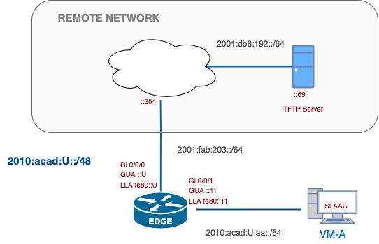

# W03 — IPv6 Neighbour Discovery (NDP): RA/RS & NS/NA in Action

---
## Start Here — Week 03
**Window:** Thu 3:00 PM → **Fri 3:30 PM** — **no late submissions**

- **What to submit (Lab, 10 pts):** `w03-ndp-{username}.txt`
- **Where:** *TFTP* (ops-only proof lines)
- **Rules:** exact filename; **no** `show run`; include device **prompt + command**; ops-only lines.
- **Estimated time to complete:**  **2 hours**
- **Output tested:** All sample outputs were verified on **CML**. In CML, interface names appear as `Gi0/1` (short form). If your hardware/IOS uses `GigabitEthernet0/0/1`, substitute accordingly—it's just an **extra 0** in the path.

### Mini Quick-Ref (NDP)
- **Router RA/RS**: `show ipv6 interface <if>` • `debug ipv6 nd` • `show ipv6 routers`
- **Neighbours & states**: `show ipv6 neighbors` • `clear ipv6 neighbors *`
- **Host (Linux)**: `ip -6 addr` • `ip -6 route` • `ip -6 neigh` • `ping -6 <addr>`
- **Multicast groups**: `show ipv6 interface <if>` (joined groups incl. **ff02::1:ffxx:xxxx**)

---
## Overview
You’ll observe how hosts learn prefixes and default gateways from **Router Advertisements (RAs)**, how **Router Solicitations (RS)** trigger those RAs, and how **Neighbour Unreachability Detection (NUD)**—via **NS/NA**—populates and refreshes the neighbour cache. You’ll capture **ops-only** evidence at checkpoints, then re-run final proofs at submission.

>**Ops-only (operations-only) evidence:**  
  Text-only command lines and outputs that _prove_ the required result.
  _Why we do it:_ ops-only keeps evidence objective, portable, and easy to compare across labs, focusing on observable **behaviour** rather than configs.
  
## Why this lab matters
- NDP replaces ARP + ICMP router discovery in IPv6. Reading **RS/RA** fields (prefixes, lifetimes, flags, router preference) explains why hosts form GUAs and pick a default via the router’s **LLA**.
- **NS/NA** provide address resolution and maintains the **neighbour cache**. You’ll read **NUD** states (INCOMPLETE → REACHABLE → STALE/PROBE) to diagnose first‑ping failures and link reachability.
- **DAD (Duplicate Address Detection)** prevents two nodes on the same segment from using the same IPv6 address. You’ll provoke a duplicate and prove how the tentative address is rejected.

## Objectives (CO map)
- **CO1** — Verify **RA/RS behaviour, EUI-64 interface-ID formation**, and default route formation on hosts.
- **CO2** — Demonstrate neighbour cache operation (NS/NA, solicited-node multicast, NUD states).
- **CO3** — Duplicate Address Detection (**DAD**): Demonstrate that when two nodes configure the **same IPv6 address on the same link**, DAD prevents the duplicate from becoming usable; capture **router debug** and **host** evidence.


---
## 🗺️ Network Topology




---

## Tasks

### Task 0 - Build the Network

- [ ] On your desktop, create **`w03-ndp-{username}.txt`**. You will submit this file to the TFTP server in the lab.
- [ ] Set up basic configuration, including hostnames, IP addresses, and the correct clock.
- [ ] Keep `EGDE-GigabitEthernet0/0/0` in a shutdown state until you are ready to submit.

---
### Task 1 — See Router Advertisements (RAs) arrive (CO1)

#### Background
**Stateless Address Autoconfiguration (SLAAC) and IPv6 Address**
- SLAAC = **RA prefix** + **interface ID** (often **EUI-64** on hosts/routers).
- **EUI-64**: take the MAC, insert **ff:fe** in the middle, and **flip the U/L bit** (XOR first byte with `0x02`).
- LLAs commonly use EUI-64; GUAs may be **stable/temporary**, so check the LLA first.
**RA and default routes**
- Hosts learn prefixes and default gateways from **RAs**; an initial **RS** from the host can prompt an immediate RA.
- Hosts install the default route via the router’s **link-local address (LLA)**.
- Reading the router’s **RA debug** confirms the **RS→RA** exchange on the LAN.

<details>
<summary><strong>Why this works</strong></summary>

- **From MAC→IID:** `aa:bb:cc:dd:ee:ff` → `a8:bb:cc:ff:fe:dd:ee:ff` (U/L bit flipped). 
- **IPv6 form:** group into hextets (e.g., `a8bb:ccff:fedd:eeff`) and attach to the prefix.
- **LLA vs GUA:** LLA almost always EUI-64; GUA may be RFC7217/4941 (not EUI-64).
- **RS→RA handshake:** a host’s Router Solicitation triggers a Router Advertisement on-link.  
- **Default via LLA:** IPv6 next-hop is the router’s LLA; it’s always valid on that link.  
- **PIO & timers:** RA carries Prefix Information (valid/preferred lifetimes) that enables SLAAC.

</details>

#### Goal
Prove that an RA was received and a **default route via the router’s LLA** was installed, and show that **VM-A’s LLA tail matches its EUI-64** derived from the NIC’s MAC.

#### Steps
- [ ] **EDGE**: Ensure interfaces are up and enable NDP debugging.
- [ ] **VM-A**: Nudge an RS/RA cycle
- [ ] Wait ~5–15 s for the RA to arrive.
- [ ] **EDGE**: Stop debugging after you see events: `undebug all`

<details>
  <summary><strong>How To (Exec) — EDGE & VM</strong></summary>

```bash
# -- EDGE
undebug all
clear logging
terminal monitor
debug ipv6 nd

# -- VM-A
sudo ip -6 addr flush dev eth0                                                  # forces fresh SLAAC/DAD + RS
sudo ip link set eth0 down; sleep 1; sudo ip link set eth0 up  # Bounce the link to trigger RS → RA

#-- EDGE (Wait to see all the RS/RA)
undebug all
 ```
 
</details>

<details> <summary><strong>Expected output — EDGE & VM</strong></summary>

```bash
# From VM
VM-A:~$ ip -6 route | grep default
default via fe80::11 dev eth0  metric 1024  expires 0sec

VM-A:~$ ip link show eth0 | grep link/ether
    link/ether 52:54:00:0e:7a:a7 brd ff:ff:ff:ff:ff:ff

VM-A:~$ ip -6 addr show dev eth0
2: eth0: BROADCAST,MULTICAST,UP,LOWER_UP mtu 1500 state UP qlen 1000
    inet6 2010:acad:100:aa:5054:ff:fe0e:7aa7/64 scope global dynamic flags 100 
       valid_lft 2591994sec preferred_lft 604794sec
    inet6 fe80::5054:ff:fe0e:7aa7/64 scope link 
       valid_lft forever preferred_lft forever
       
# From EDGE
ayalac-EDGE#show logging | include ND
*Sep 10 20:40:31.955: ICMPv6-ND: (GigabitEthernet0/1,FE80::5054:FF:FE0E:7AA7) Received RS
*Sep 10 20:40:31.955: ICMPv6-ND: Validating ND packet options: valid
*Sep 10 20:40:31.955: ICMPv6-ND: (GigabitEthernet0/1) Sending solicited RA
*Sep 10 20:40:31.956: ICMPv6-ND: (GigabitEthernet0/1) The interface media type supports ND resolution.
*Sep 10 20:40:31.956: ICMPv6-ND: (GigabitEthernet0/1,FE80::11) send RA to FF02::1
*Sep 10 20:40:31.956: ICMPv6-ND: (GigabitEthernet0/1,FE80::11) Sending RA (1800) to FF02::1
*Sep 10 20:40:31.956: ICMPv6-ND:   MTU = 1500
*Sep 10 20:40:31.956: ICMPv6-ND:   prefix 2010:ACAD:100:AA::/64 [LA] 2592000/604800
*Sep 10 20:40:31.957: ICMPv6-ND: ND output feature SEND executed on 3 - rc=0
```

> On the equipment, EDGE uses **GigabitEthernet0/0/1** *(CML logs show **GigabitEthernet0/1**)*

</details>

#### Verify
- `VM-A$ ip -6 route | grep default` ← default via **fe80::11**
- `EDGE# show logging | include 'ND'` ← RS in / RA out
- `VM-A$ ip link show eth0 | grep link/ether` ← MAC
- `VM-A$ ip -6 addr show dev eth0 scope link | grep fe80::` ← LLA tail (EUI-64 pattern)

#### Checkpoint
- **Do:** Trigger RS→RA, confirm default via LLA, then confirm EUI-64 in the LLA.
- **Verify:** `VM-A$ ip -6 route | grep default`
- **Expect:** `default via fe80::11 dev eth0` on VM; debug shows **RS received** and **RA sent** with the advertised prefix; VM-A’s **LLA tail matches EUI-64**.

#### CER seed (copy to Reflect later)
- **Claim:** If a host receives an RA on-link, it installs a default via the router’s LLA, and if the IID is EUI-64, the LLA ends with that pattern.
- **Evidence:** `VM-A$ ip -6 route | grep default`; `VM-A$ ip -6 addr show dev eth0 scope link | grep fe80::`
- **Reasoning hint:** RA signals router role + prefix; SLAAC/LLA uses EUI-64 (MAC → flip U/L bit + ff:fe).

#### CO1 — Verification & Collection of Information

In your `w03-ndp-{username}.txt` file, create a section labelled:

```diff
=== CO1 – RAs & host default via LLA (incl. EUI-64) ===
```

Copy and paste the following commands:

```bash
EDGE# show ipv6 interface g0/0/1
EDGE# show logging | include ND

VM-A:~$ ip -6 route | grep default
VM-A:~$ ip link show eth0 | grep link/ether
VM-A:~$ ip -6 addr show dev eth0 scope link | grep fe80::
VM-A:~$ ip -6 addr show dev eth0 scope global | grep inet6
```

```bash
!-- Default via fe80::… present; RA seen on g0/0/1; LLA tail matches EUI-64 from MAC.
```

---

### Task 2 — Watch Neighbour Solicitation (NS) and Neighbour Advertisement (NA) build the neighbour cache (CO2)

#### Background
- **NS → NA** performs address resolution and refreshes the **neighbour cache**.
- Entries move through **NUD** states: INCOMPLETE → REACHABLE → STALE → (DELAY/PROBE).
- **Solicited-node multicast** (`ff02::1:ffXX:XXXX`) is the NS target group derived from the IID.
- **LLA vs GUA:** LLAs are link-scope; pings must include an interface context (zone).

<details>
<summary><strong>Why this works </strong></summary>

- **Address resolution:** Host sends NS to the target’s *solicited-node multicast*; the owner replies NA (unicast).
- **NUD timers:** ReachableTime expiry moves entries to **STALE**; reuse triggers **DELAY/PROBE**.
- **Scope:** GUA pings don’t need a zone; LLA pings must specify **which interface/link**.

**NUD = Neighbour Unreachability Detection.**  
It’s the IPv6 mechanism (part of NDP) that keeps the **neighbour cache** accurate—verifying whether a neighbour is still reachable and refreshing the L3→L2 mapping using real traffic and, when needed, active probes (**NS/NA**).

**States (at a glance):**
- **INCOMPLETE** – don’t know L2 yet; sent NS.
- **REACHABLE** – recently confirmed good.
- **STALE** – mapping is old; first reuse will test it.
- **DELAY → PROBE** – grace period, then unicast NS probes.
- _(Linux may also show **FAILED**.)_

**Why you care:** explains “first ping fails, second works,” flaky links, and odd reachability.

</details>

#### Goal
Show NS/NA on the router while building entries to **REACHABLE**, prove **solicited-node multicast** membership, and demonstrate **LLA** reachability using the correct scope.

#### Steps
- [ ] **EDGE** — enable ND debug capture
- [ ] **VM-A** — clear local cache (optional) and trigger traffic to the router **GUA**.
- [ ] **Prove solicited-node multicast** (both sides).
- [ ] **Demonstrate LLA scope** (either direction).
- [ ] **Stop debug** after you see events.

<details> <summary><strong>How-to (Exec) — EDGE & VM</strong></summary>

```bash
# EDGE (exec)
# 1. Enable debug
undebug all
clear logging
terminal monitor
debug ipv6 nd

# VM-A (exec)
# 2. Clear cache and trigger traffic
sudo ip -6 neigh flush dev eth0
ping -6 -c 2 2010:acad:U:aa::11

# VM-A
# 3. Prove solicited-node multicast
# NOTE:  the maddr may not work on some alpine versions.  If that is the case, 
# only check the router multicast address
ip -6 maddr show dev eth0 | grep ff02::1:ff
# Edge
show ipv6 interface g0/0/1 | include ff02::1:ff

# VM-A
# 4. Demonstrate LLA scope
ping -6 -c 2 fe80::11%eth0   # LLA requires zone

# EDGE
# 5 - Stop debug
undebug all
```

</details>

<details> <summary><strong>Expected output — logs & tables</strong></summary>

```bash
ayalac-EDGE#show logg | in ND ( partial show)
*Sep 11 12:20:14.509: ICMPv6-ND: (GigabitEthernet0/1,2010:ACAD:100:AA::11) Received NS from 2010:ACAD:100:AA:5054:FF:FE0E:7AA7
*Sep 11 12:20:14.509: ICMPv6-ND: Validating ND packet options: valid
*Sep 11 12:20:14.509: ICMPv6-ND: (GigabitEthernet0/1,2010:ACAD:100:AA::11) Sending NA to 2010:ACAD:100:AA:5054:FF:FE0E:7AA7
*Sep 11 12:20:14.510: ICMPv6-ND: ND output feature SEND executed on 3 - rc=0
*Sep 11 12:20:14.510: ICMPv6-ND: (GigabitEthernet0/1,2010:ACAD:100:AA:5054:FF:FE0E:7AA7) STALE -> DELAY
*Sep 11 12:20:19.567: ICMPv6-ND: (GigabitEthernet0/1,2010:ACAD:100:AA:5054:FF:FE0E:7AA7) DELAY -> PROBE
*Sep 11 12:20:19.567: ICMPv6-ND: (GigabitEthernet0/1,2010:ACAD:100:AA:5054:FF:FE0E:7AA7) Sending NS
*Sep 11 12:20:24.605: ICMPv6-ND: (GigabitEthernet0/1,FE80::11) Received NS from FE80::5054:FF:FE0E:7AA7
*Sep 11 12:20:24.605: ICMPv6-ND: Validating ND packet options: valid
*Sep 11 12:20:24.605: ICMPv6-ND: (GigabitEthernet0/1,FE80::11) Sending NA to FE80::5054:FF:FE0E:7AA7
*Sep 11 12:20:24.606: ICMPv6-ND: ND output feature SEND executed on 3 - rc=0
*Sep 11 12:20:24.606: ICMPv6-ND: (GigabitEthernet0/1,FE80::5054:FF:FE0E:7AA7) STALE -> DELAY
*Sep 11 12:20:29.662: ICMPv6-ND: (GigabitEthernet0/1,FE80::5054:FF:FE0E:7AA7) DELAY -> PROBE
*Sep 11 12:20:29.662: ICMPv6-ND: (GigabitEthernet0/1,FE80::5054:FF:FE0E:7AA7) Sending NS

EDGE# show ipv6 neighbors | include Gi0/0/1
FE80::5054:FF:FE0E:7AA7   5254.00e0.7aa7  REACH  Gi0/0/1
2010:acad:100:aa::a3f2    5254.00e0.7aa7  REACH  Gi0/0/1

ayalac-EDGE#show ipv6 inte g0/1 | inc FF02::1:FF
    FF02::1:FF00:11

VM-A:~$ ip -6 nei
fe80::11 dev eth0 lladdr 52:54:00:08:71:90 router ref 1 used 0/0/0 probes 1 REACHABLE
2010:acad:100:aa::11 dev eth0 lladdr 52:54:00:08:71:90 router ref 1 used 0/0/0 probes 1 REACHABLE
```

</details>

#### Verify
- `EDGE# show logging | include 'ND'` ← NS seen / NA sent, one from the GUA and one from the LLA; from the received NS to the Sending NS
- `EDGE# show ipv6 neighbors | include Gi0/0/1|REACH|STALE|PROBE` ← state progression
- `VM-A$ ip -6 maddr show dev eth0 | grep ff02::1:ff` and  
    `EDGE# show ipv6 interface g0/0/1 | include ff02::1:ff` ← solicited-node group present
- `VM-A$ ping -6 -c 1 fe80::11%eth0` **or** `EDGE# ping ipv6 fe80::<vm-lla> source g0/0/1` ← LLA with scope works

#### Checkpoint
- **Do:** Build entries with a GUA ping, prove **NS/NA** in logs, and show the **ff02::1:ff…** group on both sides; then prove an **LLA** ping works when scoped.
- **Verify:** `EDGE# show logging | include 'ND'`
- **Expect:** Neighbour table entries **REACHABLE** (then **STALE** after idle); solicited-node group present; LLA ping succeeds only when scoped.

#### CER seeds (copy to Reflect later)
- **CER #1 — NS/NA & states**  
    **Claim:** If I send traffic to a new IPv6 target, NS/NA resolves the L2 mapping and the entry becomes **REACHABLE**, later ageing to **STALE**.  
    **Evidence:** `EDGE# show logging | include 'ND'`; `EDGE# show ipv6 neighbors | include REACH|STALE`  
    **Reasoning:** Logs prove the exchange; the table shows the resulting state.
    
- **CER #2 — LLA scope & solicited-node**  
    **Claim:** If the target is a **link-local** address, reachability works only when I specify the **interface/zone**, and the target’s solicited-node group appears on both nodes.  
    **Evidence:** `VM-A$ ping -6 fe80::11%eth0` (or `EDGE# ping ipv6 fe80::<vm-lla> source g0/0/1`); `ip -6 maddr …` and `show ipv6 interface … | include ff02::1:ff`  
    **Reasoning:** LLAs are link-scope; zone selection disambiguates the link; solicited-node membership confirms the multicast target for NS.

#### CO2 — Verification & Collection of Information

In your `w03-ndp-{username}.txt` file, create a section labelled:

```diff
=== CO2 – NS/NA & NUD states ===
```

Copy/paste the following commands:

```bash
# EDGE:
show logging | include ND
show ipv6 neighbors
show ipv6 interface g0/0/1 | include FF02::1:FF

# VM-A
ip -6 neigh
```


```
!-- NS/NA observed in router logs; neighbour entry REACHABLE→STALE; solicited-node group present on both; LLA works when scoped.
```

---

### Task 3 — Duplicate Address Detection (DAD) (CO3)

#### Background
- **DAD** runs whenever a node configures a **new IPv6 address**: it sends a Neighbour Solicitation (NS) from `::` to the address’s **solicited-node multicast**.  
- If any node replies / claims that address, the tentative address is **rejected** (not usable).  
- Router debug lets you see the **NS used for DAD** on the link.

<details>
<summary><strong>Why this works (mini theory)</strong></summary>

- **DAD probe:** source `::` → destination `ff02::1:ffXX:XXXX` (based on the IID).  
- **Rejection path:** a response indicates a duplicate → stack marks **tentative/duplicate** (Linux: `dadfailed`).  
- **Scope:** DAD is **on-link** only; both nodes must share the same /64 and L2 segment.
</details>

#### Goal
Show that when **EDGE** configures the **same IPv6 address** already present on **VM-A** (same /64), **DAD rejects** it on the router; capture router **interface duplicate** evidence.

#### Steps
- [ ] **EDGE** — start a short ND debug:
- [ ] **VM-A** — add a **test GUA**, use address **::10**
- [ ] **EDGE** — deliberately add the **same** address of the VM-A test address (this should fail DAD).
- [ ] **EDGE** — stop debug after DAD events.

<details> <summary><strong>How-to (Exec) — EDGE & VMs</strong></summary>

```bash
# VM-A (exec)
sudo ip -6 addr add 2010:acad:{U}:aa::10/64 dev eth0
ip -6 addr show dev eth0 | grep 2010:acad

# EDGE) — duplicate on-link
interface gi0/0/1
ipv6 address 2010:acad:{U}:aa::10/64
```

</details>

<details> <summary><strong>Expected output — logs & Addresses</strong></summary>

```bash
ayalac-EDGE#show logg | inc DUP|DUPLICATE
*Sep 11 13:22:04.171: %IPV6_ND-4-DUPLICATE: Duplicate address 2010:ACAD:100:AA::10 on GigabitEthernet0/1
ayalac-EDGE#show logg | inc DAD|Duplicate
*Sep 11 13:22:04.169: IPv6-Addrmgr-ND: DAD request for 2010:ACAD:100:AA::10 on GigabitEthernet0/1
*Sep 11 13:22:04.169: ICMPv6-ND: (GigabitEthernet0/1,2010:ACAD:100:AA::10) Sending DAD NS [Nonce: b9eb.9b6b.a268]
*Sep 11 13:22:04.171: %IPV6_ND-4-DUPLICATE: Duplicate address 2010:ACAD:100:AA::10 on GigabitEthernet0/1

ayalac-EDGE#show ipv6 interface gi0/1 | in DUP 
    2010:ACAD:100:AA::10, subnet is 2010:ACAD:100:AA::/64 [DUP]

VM-A:~$ ip -6 addr show dev eth0 scope global
2: eth0: BROADCAST,MULTICAST,UP,LOWER_UP mtu 1500 state UP qlen 1000
    inet6 2010:acad:100:aa::10/64 scope global 
       valid_lft forever preferred_lft forever
    inet6 2010:acad:100:aa:5054:ff:fe0e:7aa7/64 scope global dynamic flags 100 
       valid_lft 2591976sec preferred_lft 604776sec
```

</details>

#### Verify
- `EDGE# show ipv6 interface g0/0/1 | include DUP` ← router flags the address as **duplicate/tentative** (not usable)
- `VM-A$ ip -6 addr show dev eth0 | grep 2010:acad` ← VM-A still owns the address

#### Checkpoint
- **Do:** Add the same GUA to both VM-A and EDGE.
- **Verify:** `show ipv6 int gi0/1 | in DUP; `show logg | include DAD`
- **Expect:** EDGE new IPv6 address is **rejected**; router logs show the **ND** probe used for DAD.

#### CER seed
- **Claim:** If two nodes configure the same IPv6 address on one link, **DAD** prevents the duplicate from becoming usable.
- **Evidence:** `VM $ ip -6 addr … tentative/dadfailed`; `show ipv6 int gi0/1 | in DUP; `show logg | include DAD` Note, if EDGE has the IP first, you verify on VM
- **Reasoning hint:** DAD NS probes the address’s solicited-node group; a conflicting presence causes the stack to reject the tentative address.


#### CO3 — Verification & Collection of Information

In your `w03-ndp-{username}.txt` file, create a section labelled:

```diff
=== CO3 – Duplicate Address Detection (DAD) ===
```

Copy/paste the following commands:
```bash
# EDGE
show logging | include DAD|DUPLICATE
show ipv6 interface gi0/0/1 | in DUP

#VM-A
ip -6 addr show dev eth0 scope global' 
```

```bash
!-- DAD blocked the duplicate: host shows tentative/dadfailed; router saw the DAD NS on the LAN.
```


---

## Submission

- [ ] Enable `EDGE-GigabitEthernet0/0/0` and verify connectivity to RemoteSW and TFTP server.
- [ ] Submit **`w03-ndp-{username}.txt`** to the TFTP server.
- [ ] Verify your submission to the TFTP server using the following command:

```shell
ssh cisco@192.0.2.69
ls -l /var/tftp/*username*
```

### Submission checklist
- [ ] Filename exact; TFTP upload OK
- [ ] Ops-only; prompt + command shown
- [ ] One section per **assessed CO**; one-line comment under each
- [ ] Commands trimmed to the minimal proof lines

**📅 Due:** End of scheduled lab session.
## Grading rubric (10 pts)
| Criteria (CO)                |                                        Description |    Pts |
| ---------------------------- | -------------------------------------------------: | -----: |
| **CO1 — RAs & host default** | Host default via router LLA proven with RA context |      4 |
| **CO2 — NS/NA & NUD**        |                Cache states observed and explained |      3 |
| **CO3 — DAD**                |            Duplicate on-link is **blocked by DAD** |      3 |
| **Total**                    |                                                    | **10** |

## Version history
- 2025-09-06 — v1.0 Initial release
