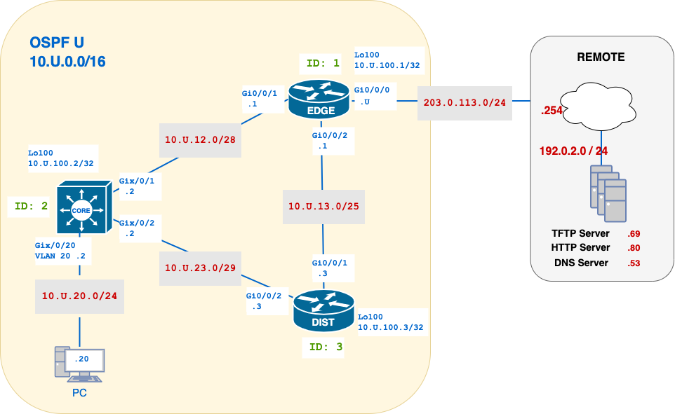

# W04 – OSPF Foundations


---
## Start Here — Week 04
**Window:** Fri Sept 19 4:00 PM → **Fri 26 1:30 PM** — **no late submissions**

- **What to submit (Lab, 10 pts):** `w04-ospf-{username}.txt`
- **Where:** *TFTP* (ops-only proof lines)
- **Rules:** exact filename; **no** `show run`; include device **prompt + command**; ops-only lines.
- **Estimated time to complete:**  **2 hours and 30 minutes**

### Mini Quick-Ref (OSPF)
- **Bring-up:** `ip ospf U area 0` • `router ospf U; router-id 10.U.100.x` • `int g0/x; ip ospf U area 0` _(opt: `ip ospf network point-to-point`)_
- **Hygiene:** `router ospf U → `no passive-interface g0/x` _(transit only)_
- **Verify:** `show ip ospf neighbor` • `show ip ospf interface brief` • `show ip route ospf` • `show ip protocols | i Router ID|Reference`
- **Default @ EDGE:** `ip route 0.0.0.0 0.0.0.0 gi0/0/0 203.0.113.254` • `router ospf U` → `default-information originate` • Check CORE/DIST for `O*E2 0.0.0.0/0`
- **If neighbour won’t form:** check IP/subnet; match **area/timers/type/auth/MTU**; ensure link not **passive**.
---
## Overview

This lab introduces **single-area OSPFv2** on a three-router Ethernet topology. You’ll bring up adjacencies using the **interface-based** method (no `network` wildcard), set stable **Router-IDs** via **/32 loopbacks**, apply a **passive-interface** pattern on non-transit links, and verify learned routes plus **default route** propagation from **EDGE**. Keep your configs for the next lab (tuning DR/BDR, reference bandwidth, and network types).

> This lab builds on foundational IPv4 configuration and prepares you for more advanced routing design in future labs.

## Why This Lab is Important

Dynamic routing protocols like OSPF allow networks to **adapt automatically** to changes. OSPF is widely used in enterprise networks for its fast convergence and link-state model. This lab gives you experience configuring OSPF on real equipment, understanding neighbour formation, and verifying routing behaviour across a small but realistic topology.

## Objectives (CO map)
- **CO1 — Configure with explicit RID = Lo100**
- **CO2 — Verify adjacencies** using interface‑based activation on transit links (Area 0).
- **CO3 — Propagate a default** from **EDGE**; verify it on **CORE** and **DIST**.
- **CO4 — Produce ops‑only evidence** that proves neighbour state and learned routes.


---

## Network Topology



## Addressing Table (IPv4)

| Device | Interface         | Address/Mask               | Notes                       |
| -----: | :---------------- | :------------------------- | :-------------------------- |
|   EDGE | Lo100             | 10.U.100.1/32              | RID & mgmt                  |
|   CORE | Lo100             | 10.U.100.2/32              | RID & mgmt                  |
|   DIST | Lo100             | 10.U.100.3/32              | RID & mgmt                  |
|   EDGE | G0/0/0((→ REMOTE) | 203.0.113.U/24             | Upstream/exit (for default) |
|   EDGE | G0/0/1 (→ CORE)   | 10.U.12.1/29               | Transit, Area 0             |
|   EDGE | G0/0/2 (→ DIST)   | 10.U.13.1/29               | Transit, Area 0             |
|   CORE | G0/0/1 (→ EDGE)   | 10.U.12.2/29               | Transit, Area 0             |
|   CORE | G0/0/2 (→ DIST)   | 10.U.23.2/29               | Transit, Area 0             |
|   CORE | VLAN20            | 10.U.20.2/24               | Gateway for PC              |
|   DIST | G0/0/1 (→ EDGE)   | 10.U.13.3/29               | Transit, Area 0             |
|   DIST | G0/0/2 (→ CORE)   | 10.U.23.3/29               | Transit, Area 0             |
|     PC | NIC               | 10.U.20.20/24 GW 10.U.20.2 | User host                   |
>**Notes:** 
>- **Addressing plan** (IPv4; replace `U` with your pod number)
>- Keep the **.1/.2/.3** convention (EDGE/CORE/DIST) on every inter‑router /29. 

---

## Tasks
### Task 0 - Build the Network

- [ ] On your desktop, create **`w04-ospf-{username}.txt`**. You will submit this file to the TFTP server in the lab.
- [ ] Assign IPs per the **Addressing Plan/Topology** (replace `U` with your number).  Ensure all interfaces are UP and UP.
- [ ] Configure `Lo100` on EDGE/CORE/DIST with `10.U.100.1/32`, `.2/32`, `.3/32` respectively.
- [ ] Set up basic configuration as in Lab 01:
	- [ ] `ssh` with user admin/cisco in all devices
	- [ ] `NTP` synchronization to EDGE, with stratum 4
	- [ ] `Syslog` to PC - In PC use `tftpd64` as the syslog server

### CORE Port Configuration
- [ ] Create VLAN 666 and VLAN 20, use VLAN names as `username-<VLANID>`(eg, `ayal0014-VLAN666`).  All VLANs should have your `username` pre-appended to the device name!
- [ ] Shutdown all interfaces that are not in use and move them to VLAN 666.  
- [ ] No port should be in VLAN 1
- [ ] `Gix0/0/20` should be configured as an access port in `VLAN20`

## Connections
- [ ] Keep a console connection to **EDGE**
- [ ] From the PC  ssh into **CORE**
- [ ] For now, you will move your console connection between **EDGE** and **DIST**

---

### Task 1 — Configure OSPF identity and advertise loopbacks

#### Goal
Each router has Lo100 and uses **RID = Lo100**; loopbacks are advertised in Area 0.
#### Steps
- [ ] Enable OSPF using process id `U`
- [ ] Under `router ospf U`, set `router-id` to that same address.
- [ ] Add `ip ospf U area 0` under the loopback to advertise it.

<details>
<summary><strong>Example — EDGE</strong></summary>

```bash
# Fom IP configuration
interface loopback100
 ip address 10.U.100.1 255.255.255.255

# Enable OSPF using ID U
# Manually set the router-id to match loopback100
router ospf U
 router-id 10.U.100.1

# Enable OSPF under the loopback interface
interface loopback100
 ip ospf U area 0
```

**Verify**
- `show ip ospf | include Router ID`
- `show ip route | include 10.U.100.1|10.U.100.2|10.U.100.3`

</details>

#### Checkpoint
- **Do:** OSPF enabled with **process U**; RID equals **10.U.100.1/.2/.3**; loopback100 added to Area 0 on all routers.
- **Verify:** `show ip ospf | i Router ID` shows the correct RID on each device; `show ip ospf interface loopback100` shows **Process ID U, Area 0**.
- **Expect:** No neighbours yet (that comes in Task 2).

#### CO1 — Verification & Collection of Information

In your **`w04-ospf-{username}.txt`** file, create a section labelled:

```diff
=== CO1 – Router IDs ===
```

```bash
# From all Routers ( including CORE)
show ip ospf | include Routing Process|Router ID
show ip ospf interface loopback100 | include Process ID|Area
```

`!-- Proves each router is running OSPF process U, has the intended Router-ID, and loopback100 is OSPF-enabled in Area 0.`

---

### Task 2 — Enable OSPF on transit links + passive edges (CO1)

> - **EDGE `Gi0/0/0` (to REMOTE)**: **do not** enable OSPF on this interface — it does **not** participate in OSPF.  
> - **CORE `SVI20` (VLAN 20)**: **must** be added to OSPF **Area 0** so the **10.U.20.0/24** LAN is advertised, **but it must be passive** (no neighbours).  
> - In general, **end-network/edge interfaces are passive**; **transit links only** form neighbours.
#### Goal
Form adjacencies on all **inter-router** links; advertise loopbacks and CORE’s user LAN; keep end-facing interfaces **passive**.

### Steps
- [ ] On every **transit** link between routers, enable OSPF **process `U`** in **Area 0**  
  `interface g0/0/<to-peer>` → `ip ospf U area 0`  *(option: `ip ospf network point-to-point` on both ends)*  
- [ ] On **CORE `SVI20`**, add it to OSPF so the LAN is advertised:  
  `interface vlan 20` → `ip ospf U area 0`  
- [ ] Set end interfaces as passive.

<details>
<summary><strong>Example — CORE</strong></summary>

```bash
interface gx/0/1          ! to EDGE
 ip ospf U area 0
 ip ospf network point-to-point
!
interface gx/0/2          ! to DIST
 ip ospf U area 0
 ip ospf network point-to-point
!
interface vlan 20       ! user LAN 10.U.20.0/24
 ip ospf U area 0       ! advertise LAN
!
router ospf U
 passive-interface vlan20
```
</details>

<details>
<summary><strong>Example — EDGE</strong></summary>

```bash
interface g0/0/1          ! to CORE
 ip ospf U area 0
 ip ospf network point-to-point
!
interface g0/0/2          ! to DIST
 ip ospf U area 0
 ip ospf network point-to-point
!
! DO NOT add OSPF on g0/0/0 (to REMOTE 203.0.113.U/24)
!
```
</details>

#### Verify
```bash
show ip ospf neighbor
show ip ospf interface brief
show ip ospf interface vlan 20 | include Passive|Process ID|Area
```
- Expect **2 neighbours** per router on the transit links.  
- `Vlan20` on CORE shows **Passive** and **Process ID U, Area 0**.  
- EDGE `Gi0/0/0` is **absent** from the OSPF interface list.

### Checkpoint
- **Do:** OSPF enabled on all **transit** links; **CORE SVI20** added to OSPF (passive); **EDGE Gi0/0/0** excluded from OSPF.  
- **Verify:** Neighbour state **Full** on transits only; `show ip ospf interface brief` shows `Vlan20` as **Passive** and no OSPF on EDGE `Gi0/0/0`.  
- **Expect**:  Neighbour should be in **FULL** state.

#### CO2 — Verification & Collection of Information

In your **`w04-ospf-{username}.txt`** file, create a section labelled:

```diff
=== CO2 – Transit adjacencies & passive edges ===
```

```bash
# From EDGE / CORE / DIST
show ip ospf neighbor 
show ip ospf interface brief 

# FROM CORE
show ip ospf interface vlan 20 | include Passive|Process ID|Area
```

`!-- Prove adjacencies on transit links, CORE’s SVI20 is in OSPF (Passive, Area 0), and the EDGE uplink to REMOTE does not participate in OSPF.`

---

### Task 3 — Default route at EDGE (CO3)

**Goal:** Inject a default at **EDGE** and verify it appears on **CORE** and **DIST**.

**Steps**
-  On **EDGE**, create a **fully specified** static default (interface **and** next-hop)
-  Propagate the default route to the OSPF domain.

<details>
<summary><strong>Example — EDGE (config summary)</strong></summary>

```bash
ip route 0.0.0.0 0.0.0.0 g0/0/0 203.0.113.254
!
router ospf U
 default-information originate
```
</details>

#### Verify
```bash
# On EDGE (prove fully specified static exists)
show ip route 0.0.0.0

# On CORE and DIST (prove OSPF default learned)
show ip route | include E2

# Optional end-to-end (from PC on CORE LAN)
ping 192.0.2.69
```

#### Checkpoint
- **Do:** Fully specified static default configured on **EDGE**; `default-information originate` enabled in **OSPF U**.
- **Verify:**
    - **EDGE:** `show ip route 0.0.0.0` shows `via 203.0.113.254, GigabitEthernet0/0/0`.
    - **CORE/DIST:** route table contains `O*E2 0.0.0.0/0`.
- **Expect:** PC traffic to remote addresses exits via **EDGE** (path visible in `traceroute`).

#### CO3 — Verification & Collection of Information

In your **`w04-ospf-{username}.txt`** file, create a section labelled:

```
=== CO3 – Default route propagation ===
```

```bash
# On EDGE
show ip route 0.0.0.0 

# On CORE/DIST
show ip route | include E2
```

`!-- Default route has been propagated from EDGE to CORE/DIST via OSPF.`

---

### Task 4 — Convergence & Path Verification (CO4)

#### Goal
Demonstrate OSPF **reconvergence** when a transit link fails: traffic from the **PC (CORE LAN)** to **REMOTE (203.0.113.U)** should reroute automatically.

#### Steps
1. **Baseline path (from the PC on CORE LAN)**
    - From PC:
        `tracert -d 203.0.113.U        # Windows`
    - **Expected:** `PC → CORE → EDGE → REMOTE`
2. **Simulate a failure on the CORE↔EDGE link**
    - On **EDGE**, shut the **interface to CORE** (per your addressing table, this is `G0/0/1`)
    - **Wait** ~60 seconds (default OSPF hello/dead on Ethernet is 10/40s).
3. **Re-test path (from the PC)**    
    `tracert -d 203.0.113.U        # Windows`
    - **Expected after failure:** `PC → CORE → DIST → EDGE → REMOTE`
4. **Restore the link**
#### Verify

```bash
# On CORE — next-hop for default before/after 
show ip route 0.0.0.0  

# On CORE — neighbour table reflects the downed link and surviving adjacencies
show ip ospf neighbor  

# From PC — traceroute/tracert output shows path change 
traceroute -n 203.0.113.U      # or: 
tracert -d 203.0.113.U
```
- Before failure, default next-hop should be **EDGE** via the **CORE↔EDGE** link.
- After failure, default next-hop remains **EDGE**, but via **CORE→DIST→EDGE** (visible in traceroute).

#### Checkpoint
- **Do:** Shut **EDGE G0/0/1** (to CORE), observe reroute, then **no shut** to restore.
- **Verify:**
    - **PC traceroute** shows baseline path `PC→CORE→EDGE`, then post-failure path `PC→CORE→DIST→EDGE`.
    - **CORE `show ip route 0.0.0.0`** remains present (default learned via OSPF) while next-hop/interface usage changes.
    - **CORE `show ip ospf neighbor`** reflects adjacency loss on the failed link during the test, with remaining adjacencies intact.
- **Expect**: Continue to have connectivity, but via another path.

#### CO4 — Verification & Collection of Information

In your **`w04-ospf-{username}.txt`**  file, create a section labelled:

```diff
=== CO4 – Convergence & path change ===
```

```bash
# BEFORE (PC) 
traceroute -n 203.0.113.U      # or: tracert -d 203.0.113.U  

# AFTER link down (PC) 
traceroute -n 203.0.113.U      # or: tracert -d 203.0.113.U  

# CORE evidence (any time during/after test) when gi0/0/1 is down
show ip route 0.0.0.0
show tcp brief                 # Must be sshed into CORE
```

`!-- Proves baseline path via CORE→EDGE, post-failure path via CORE→DIST→EDGE, and that the default route persists during reconvergence (OSPF reroutes without manual changes).`

---
## Submission checklist
- [ ] **Filename:** `w04-ospf-{username}.txt` (UTF‑8, plain text)
- [ ] CO sections present and in order
- [ ] Evidence shows neighbour **Full** and default learned
- [ ] Submitted to *TFTP* within the window

## Grading rubric (10 pts)

| Criteria (CO)                     | Description                                               | Pts    |
| --------------------------------- | --------------------------------------------------------- | ------ |
| **CO1 — Identity & loopbacks**    | OSPF process `U` running; RID = Lo100; Lo100 in Area 0    | 2      |
| **CO2 — Transit adjacencies**     | Neighbours Full on transits; CORE `Vlan20` passive/Area 0 | 3      |
| **CO3 — Default propagation**     | `O*E2 0.0.0.0/0` visible on CORE & DIST                   | 3      |
| **CO4 — Convergence & TCB proof** | Path change shown; `show tcp brief` included from CORE    | 2      |
| **Total**                         |                                                           | **10** |


---
## Cleanup

```bash
# On CORE
delete vlan.dat
```

---

**📅 Due:** End of this week’s lab session.
