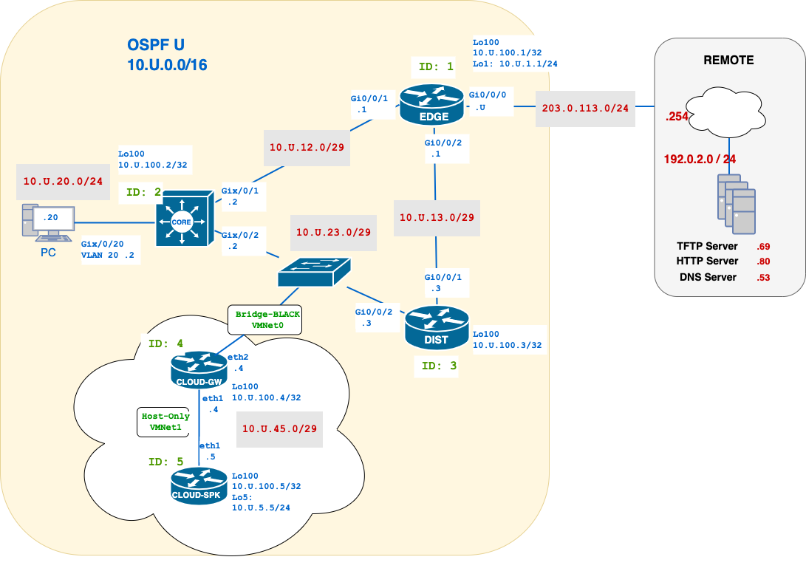

# W06 — OSPF Hybrid (Cisco + MikroTik Cloud)

**Course:** CST8371  
**Week:** W06  
**Activity:** Lab (10 pts)  

**Submission:** `{username}-w06-tsk#.txt` → TFTP (ops-only lines)  all automatic collections.
**Difficulty**:  4.5/5
**Window:** {Opens Friday, October 3rd, 4:00 PM} → **{Closes Friday, October 10th, 4:00 PM}** (no late submissions)  
**Scope:** **Single-area OSPF (Area 0)**, interface-mode only (no `network`).  
**Ops-only policy:** Show **device prompt + command + output**. **No** `show running-config`.

> **What’s new this week:** Mixed **Cisco + MikroTik** OSPF, campus DR/BDR tuning, timer tweaks, default propagation to cloud, plus **automation** with `x_remote.py`.

---

## Mini Quick-Ref

**Cisco (IOS):**  
- Enable per interface: `int g0/x` → `ip ospf U area 0`  
- Network types: `ip ospf network point-to-point` (p2p) or leave default (broadcast)  
- Timers (match on both ends): `ip ospf hello-interval 3` • `ip ospf dead-interval 10`  
- DR/BDR priority: `ip ospf priority <0|U|255>`  
- Verify: `show ip ospf neighbor` • `show ip ospf interface brief` • `show ip route | i ^O|^O*E2`  
- Default @ EDGE: static + `default-information originate`

**MikroTik (RouterOS/CHR):**  
- Set RID: `/routing ospf instance set [find] router-id=10.U.100.4` (GW) / `.5` (SPK)  
- Add area 0: `/routing ospf area add name=backbone area-id=0.0.0.0`  
- Enable interface: `/routing ospf interface-template add interfaces=etherX area=backbone`  
- Priority (DR): `/routing ospf interface-template set [find interfaces=etherX] priority=255`  
- Verify: `/routing ospf neighbor print` • `/ip route print where dst-address=0.0.0.0/0`

---

## Overview

This week you’ll practise OSPF as an **open, vendor-neutral routing protocol** by stitching together a small campus (Cisco IOS) with a lightweight **cloud segment (MikroTik/RouterOS)**—all in **Area 0**. You’ll tune neighbour behaviour (network type, timers, priorities), verify **DR/BDR** outcomes, and **originate a default** from the campus edge into the cloud. Because OSPF is an **IETF standard**, the same control-plane concepts apply across vendors: you’ll see how identical ideas (interface cost, Router ID, passive edges) are expressed a bit differently on Cisco vs MikroTik. To cap it off, you’ll take a **first step toward automation**, using a simple script to pull proof lines so your evidence is fast, consistent, and ops-only.

## Why this Lab is Important
- **Open standards, real interoperability:** OSPF is an **IETF standard**—this lab shows how identical control-plane ideas (Router ID, cost, DR/BDR, passive) work **across vendors** (Cisco IOS + MikroTik/RouterOS), not just in one CLI.
- **Design, not just defaults:** You’ll **shape neighbour behaviour** (network type, hello/dead, priority) to get predictable DR/BDR roles and faster convergence—instead of hoping the defaults line up.
- **Cloud integration, campus discipline:** Extending OSPF to a small **cloud segment** forces clean boundaries: what participates, what stays passive, and how **default routes** are originated and validated downstream.
- **Cost math you can prove:** By tuning **interface cost** (Cisco ref-bandwidth vs MikroTik ether cost), you’ll **explain and verify** why a path wins—or how to create ECMP—using **short, ops-only lines**.
- **First steps toward automation:** Simple scripted collection makes your evidence **repeatable and auditable**—a practical bridge to configuration management and CI for networks.
- **Midterm readiness:** The exact proof lines you capture here (neighbour states, interface brief, routes) are the same ones you’ll lean on for the **midterm** and future troubleshooting.

### Lab Objectives
- **Configure OSPF across Cisco devices using interface-mode**, including RID, network-type, hello/dead timers, and priority settings.  (CO1)
- **Originate and propagate a default route from EDGE** to all downstream devices (Cisco and MikroTik).  (CO2-CO3)
- **Configure a standalone cloud network using MikroTik CHRs and OSPF**, then integrate it into the Cisco campus using bridged networking.  (CO2-CO3)
- **Demonstrate proper DR/BDR election behaviour** based on priority settings and interface types.  (C03)
- **Use automation scripts to collect structured evidence** of OSPF state, reachability, and routing behaviour.  (C01-C04)
- **Perform a temporary peer-to-peer OSPF session between pods** to verify inter-domain visibility.  (C04)

---

## Network Topology




---
## PreRequisite

1. Understand VMWare Network Configuration — from past courses.  
    If unsure, review:
    - https://geek-university.com/networking-configurations/
    - https://geek-university.com/configure-bridged-networking/
    - https://geek-university.com/configure-host-only-networking/
2. Know how to run a Python script — from the current course **DAT0129**.
3. Understand YAML files — see https://www.redhat.com/en/topics/automation/what-is-yaml
4. MikroTik and OSPF basics — see https://help.mikrotik.com/docs/spaces/ROS/pages/9863229/OSPF

---

## Tasks

### Task 0 — Prep: download automation tools (CO0)

**Goal:** Get the evidence-collection tools onto your Desktop before starting. You’ll use them in later tasks.

**Steps**
- [ ] Download **x-remote** from GitHub and place the script on your **Desktop** — https://github.com/ayalac1111/x-remote
  *(Open the repo → `src/x_remote.py` → download the raw file to your Desktop.)*
  *(Open the repo → `requirements.txt` → download the raw file to your Desktop.)*
- [ ] Install the requirements
```python
pip install -r requirements.txt
```
- [ ] Download `w06-tsk*.yaml` [here](https://github.com/ayalac1111/Networking-Courses/blob/main/25F-CST8371/labs/w06-yamls.zip)  
- [ ] Extract files to your Desktop folder.  
- [ ] Open each YAML file and replace `{username}`and `{U}`variables with your information.
- [ ] Running `x_remote`:
	
```bash
# In Windows
x_remote.py w06-tsk01.yaml

# In Linux
chmod +x x_remote.py
./x_remote.py w06-tsk01.yaml

# Otherwise, use explicit Python
python x_remote.py w06-tsk01.yaml
```
	

---

### Task 1 — Campus OSPF Fundations (CO1)

**Goal:** Build a robust, single-area OSPF deployment using **interface-mode** across Cisco devices, with correct **network types**, **timers**, **router IDs**, **priorities**, and **default route origination** from EDGE.

**Start**
- [ ] Cable network topology; note that `CORE-Gix/0/2` and `DIST-Gi0/0/2`now connect via a switch.
- [ ] Use your Lab4/5 to upload all the interface configurations.

**Start**
- [ ] Cable the network topology; note that `CORE-Gi0/0/2` and `DIST-Gi0/0/2` now connect via a switch (broadcast segment).  
- [ ] Load your **Lab 4/5 baseline configuration** (including interface IPs, usernames, SSH, etc.) onto all devices.  
- [ ] Do **not** include any OSPF configuration from earlier labs — you will build OSPF from scratch in this task.  
- [ ] **Verify** the interfaces are `up/up` and all addressing matches the topology diagram.  

**Services Configuration**
- [ ] Configure all routers/L3 switches with **SSH version 2** using username `admin` and password `cisco`.  
- [ ] **Verify** SSH access to each device via its **Loopback100 IP** using `admin/cisco` from your PC.  
- [ ] On all devices, disable TFTP source binding using: `no ip tftp source-interface`. This ensures compatibility when uploading configs to the TFTP server.  
- [ ] Set **EDGE** to the correct time (your current time) and configure it as an **NTP server** with **stratum 3**.  
- [ ] Configure **CORE** and **DIST** to sync time from **EDGE** using NTP.  
- [ ] Run **TFTP64** on your PC; verify that the **syslog capture file** is saving to your **Desktop**.  
	1. Launch **TFTP64** and open the **Settings** menu.
	2. Enable the **TFTP** service and the **Syslog** service.
	3. Set the **Base Directory** (or “Home Directory”) to your **Desktop** so that any transferred files and log files are easy to locate.
- [ ] Configure all routers/L3 switches to send **syslog messages** to the IP address of your PC.  

**EDGE Configuration**
- [ ] Configure OSPF using process ID `{U}`; manually set the **Router ID** to the IP of **Loopback100**.
- [ ] Set the **reference bandwidth** to 10000 Mbps in the OSPF process.
- [ ] Enable **all internal interfaces** (including loopbacks) in **OSPF Area 0**.
- [ ] Ensure **Gi0/0/0** is **not** included in OSPF — _you will lose marks if it is_.
- [ ] Configure a **fully specified static default route** on EDGE and advertise it into OSPF.
- [ ] **Verify** **EDGE can reach the TFTP server** via its IP address.
- [ ] At this stage, **no OSPF neighbours** should form (since other devices aren’t yet configured).

**CORE Configuration**
- [ ] Configure OSPF using process-id `{U}`; manually set the **router-id** to the address of **Loopback100**.
- [ ] Set the OSPF **reference bandwidth** to `10000` bps.
- [ ] Enable all internal interfaces (including **loopbacks**) in **area 0**.
- [ ] Configure **VLAN20** to participate in OSPF, but set it as a **passive interface**.
- [ ] Confirm all OSPF interfaces use the **broadcast** network type (default).
- [ ] **Verify**: OSPF **neighborship with EDGE** should reach the **FULL** state on the EDGE–CORE transit.

**DIST Configuration**
- [ ] Configure OSPF using process-id `{U}`; manually set the **router-id** to the address of **Loopback100**.
- [ ] Set the OSPF **reference bandwidth** to `10000` bps.
- [ ] Enable all internal interfaces (including **loopbacks**) in **area 0**.
- [ ] Confirm all OSPF interfaces use the **broadcast** network type (default).
- [ ] **Verify** that DIST has formed **FULL** OSPF neighbour relationships with both EDGE and CORE.

**Transit Optimization**
_Improve convergence and control DR/BDR elections across transit networks._
On **EDGE–CORE**:
- [ ] Change the OSPF **network type** to `point-to-point` for faster convergence.
On **EDGE–DIST**:
- [ ] Set `DIST-Gi0/0/1` **priority to {U}** to win the DR election.
- [ ] Reduce OSPF timers: set **Hello = 3** and **Dead = 10** (confirm these are compatible with the neighbour).
On **CORE–DIST**:
- [ ] CORE `Gi0/0/2` priority to **0** (to opt out of DR/BDR election),
- [ ] DIST `Gi0/0/2` priority to **{U}** (to win the election).

> **Note:** After changing priority or network type, you must **clear the OSPF process** (`clear ip ospf process`) to force reelection or renegotiation.

**Router ID Update**
_Ensure the updated OSPF router ID propagates properly._
- [ ] On **EDGE**, update the OSPF router-id to `0.0.0.{U}`.
- [ ] **Clear the OSPF process** after setting the new router-id.
- [ ] **Verify** from CORE and DIST that they now see the updated router-id for EDGE.

**Checkpoint (CO1)**  
- [ ] All OSPF adjacencies on transit links are in **FULL** state.
- [ ] **DIST** is the **DR** on EDGE–DIST and CORE–DIST segments, as configured.
- [ ] **Hello/Dead timers** are correctly applied on the EDGE–DIST link.
- [ ] **CORE VLAN20** is part of OSPF and correctly marked as **Passive** in Area 0.
- [ ] All routers use the correct **OSPF reference bandwidth** value.
- [ ] All loopbacks are **advertised and reachable** across the domain.
- [ ] **EDGE router ID** is updated to `0.0.0.U` and recognized by all neighbours.
- [ ] All routers have the **default route via EDGE**.
- [ ] **Traceroute from PC** to the TFTP server follows the expected path through EDGE.
- [ ] All routers have the same number of **OSPF LSAs** in their databases.
- [ ] **CORE and DIST** show correct **NTP sync status** with EDGE.
- [ ] **Syslog messages** from all devices are received and logged on the PC.

### CO1 — Verification & Collection

Execute the script to collect proof of your configuration:

```bash
x_remote.py w06-tsk1.yaml
```

This will generate a file name `{username}-w06-tsk1.txt` containing command outputs.
- [ ]  Confirm all commands ran as expected
- [ ]  Review the file to verify timers, DR/BDR roles, default route, router IDs, and loopback reachability.
- [ ] Ensure logs show successful syslog activity from all devices to `10.{U}.20.20`.

_Tip:_ Check your `w06-tsk1.yaml` file to see exactly which commands are being run during verification.

**Upload immediately**
- [ ] Use **TFTP64** to upload the file to the TFTP server; or
- [ ] `tftp -i 192.0.2.69 put <path-to-file>`

---

### Task 2 — Cloud OSPF Buildout (MikroTik) (CO2)

**Goal:** Create an **isolated OSPF segment** between two MikroTik routers using VMWare. Establish internal peering and prepare the cloud for integration into the Cisco network.

**VMWare Network Configuration**
Use **VMware Virtual Network Editor** to simulate separate environments.
- [ ]  Set **VMNet0** as a **Bridged adapter** to your Realtek NIC (`BLACK`) — reserved for later Cisco integration.
- [ ]  Set **VMNet1** as **Host-Only** and **disable DHCP** — this will connect `CLOUD-GW` and `CLOUD-SPK` internally.
- [ ] Configure your host's **VMNet1** with the ip `10.{U}.45.6/29`, no gateway is needed.

**MikroTik VMs**
- [ ]  **Clone** your MikroTik VM twice:
    - Name one `CLOUD-GW`
    - Name the other `CLOUD-SPK`
- [ ] Network Adapter settings:
    - `CLOUD-GW`:
        - Adapter 1 → `VMNet1` (internal cloud)
        - Adapter 2 → `VMNet0` (used **later** in Task 3)
    - `CLOUD-SPK`
        - Adapter 1 → `VMNet1` only
- [ ] Login credentials: `admin/admin`

**MikroTik Configuration**
- [ ] When moving/cloning VMs, the interface names change; to ensure consistency, rename the interfaces as in the network diagram.  The first NIC shown in the VM settings should be labelled `ether1`.  If unsure, go to [Advanced] and check the MAC address of the interface.
- [ ] Set names as `{username}-CLOUD-GW` and `{username}-CLOUD-SPK` (for Gateway and Spoke)
- [ ] Create Lo100 in both routers, and a Lo5 in CLOUD-SPK with address `10.{U}.5.5/24`
- [ ] Assign IP addresses to all interfaces
- [ ] SSH into both cloud routers for simplicity of use.  SSH is enabled by default in MikroTik.
- [ ] Enable `OSPF-{U}` in both routers using the router ID of the Lo100
- [ ] Add `AREA-0` with id `0.0.0.0` to ospf `OSPF-{U}`
- [ ] Enable the interfaces in AREA-0
- [ ] **Verify** connectivity using `ping` from `CLOUD-GW`to `CLOUD-SPK-Lo5`
- [ ] Save configuration after all changes:
  - `/system backup save name={yourname}-cloud.backup`
  - The file will be saved on the CLOUD router, you can scp it to your host.

<details>
<summary><strong>MikroTik Configuration Example</strong></summary>

Using `U=250`

```python
# CLOUD routers: Rename Interfaces
/interface print
Flags: R - RUNNING
Columns: NAME, TYPE, ACTUAL-MTU, L2MTU, MAC-ADDRESS
#   NAME    TYPE      ACTUAL-MTU  L2MTU  MAC-ADDRESS      
0 R ether5  ether           1500         00:0C:29:41:EB:ED
1 R ether6  ether           1500         00:0C:29:41:EB:F7

# ID 0 is the first interface, lower name, in this case, with MAC ending in ED;
/interface set 0 name=ether1
/interface set 1 name=ether2

# CLOUD-GW:
# Set name
/system identity set name=CLOUD-GW

# Create Lo100
/interface bridge add name=Lo100

# Assign IP address to all interfaces - Using U=250
/ip address add address=10.250.23.6/29 interface=ether2 network=10.250.23.0
/ip address add address=10.250.45.4/29 interface=ether1 network=10.250.45.0
/ip address add address=10.250.100.4 interface=Lo100 network=10.250.100.4

# Enable OSPF-250
/routing ospf instance add name=OSPF-250 router-id=10.250.100.4
/routing ospf area add instance=OSPF-250 name=AREA-0

# Enable all the interfaces in OSPF 
/routing ospf interface-template add area=AREA-0  interfaces=Lo100
/routing ospf interface-template add area=AREA-0 interfaces=ether1
/routing ospf interface-template add area=AREA-0 interfaces=ether2
```

**Verify**
Mikrotik uses the `print` at the end of line

```bash
/ip add print
Columns: ADDRESS, NETWORK, INTERFACE
# ADDRESS          NETWORK       INTERFACE
0 10.250.23.6/29   10.250.23.0   ether2   
1 10.250.45.4/29   10.250.45.0   ether1   
2 10.250.100.4/32  10.250.100.4  Lo100

# OSPF Neighbours
/routing ospf neighbor print
Flags: V - virtual; D - dynamic 
 0  D instance=OSPF-250 area=AREA-0 address=10.250.45.5 priority=128 router-id=10.250.100.5 dr=10.250.45.4 bdr=10.250.45.5 state="Full" state-changes=7 adjacency=1m6s timeout=34s

# OSPF interfaces
/routing ospf interface-template print
Flags: X - disabled, I - inactive 
 0   area=AREA-0 interfaces=Lo100 instance-id=0 type=broadcast retransmit-interval=5s transmit-delay=1s hello-interval=10s dead-interval=40s priority=128 cost=1 

 1   area=AREA-0 interfaces=ether1 instance-id=0 type=broadcast retransmit-interval=5s transmit-delay=1s hello-interval=10s dead-interval=40s priority=128 cost=1 

 2   area=AREA-0 interfaces=ether2 instance-id=0 type=broadcast retransmit-interval=5s transmit-delay=1s hello-interval=10s dead-interval=40s priority=128 cost=1

# OSPF Routes
/routing route print where ospf
Flags: A - ACTIVE; o - OSPF
   DST-ADDRESS      GATEWAY             AFI  ROUTING-TABLE  DISTANCE  SCOPE  TARGET-SCOPE  IMMEDIATE-GW      
Ao 10.250.5.0/24    10.250.45.5%ether1  ip   main                110     20            10  10.250.45.5%ether1
Ao 10.250.100.5/32  10.250.45.5%ether1  ip   main                110     20            10  10.250.45.5%ether1
```
_Note the simplicity of the CLI and its programmability_


</details>


**Checkpoint (CO2)**  
- [ ] CLOUD-GW and CLOUD-SPK form a full **OSPF adjacency** on their shared internal segment.
- [ ] Each cloud router learns:
  - The other’s **Lo100** address.
  - CLOUD-SPK’s Lo5 (`10.{U}.5.5/24`) via OSPF.
- [ ] Routes appear with `distance=110` and `routing-table=main`.
- [ ] Each interface shows correct participation in **AREA-0**.

### CO2 — Verification & Collection

Execute the script to collect proof of your configuration:

```bash
x_remote.py w06-tsk2.yaml
```

This will generate a file name `{username}-w06-tsk2.txt` containing command outputs.
- [ ]  Confirm all commands ran as expected

_Tip:_ Check your `w06-tsk2.yaml` file to see exactly which commands are being run during verification.

**Upload immediately**
- [ ] Use **TFTP64** to upload the file to the TFTP server; or
- [ ] `tftp -i 192.0.2.69 put <path-to-file>`


---

## Task 3 — Campus–Cloud Integration (CO3)

**Goal:** Connect the MikroTik cloud into the Cisco campus. **Inject the cloud into Area 0**, ensure **OSPF roles (DR/BDR)** are respected, and verify **end-to-end default propagation** to the cloud edge.

**Network Integration**
- [ ] **CLOUD-GW**; modify ether2 priority to 255
- [ ] Cable your CLOUD routes into the physical network; cable `BLACK` to the L2-Switch
- [ ] From **DIST**, observe OSPF neighbour adjacency formation. **DIST** should keep the **DR** role.
- [ ] Force a new **DR/BDR** election:
  - Use `debug ip ospf adj` to monitor
  - Either `clear ip ospf process` or shut/no shut `DIST-Gi0/0/2`
  - Run `undebug all` when complete
- [ ] **CLOUD-SPK**; Verify OSPF network; you should receive the 0.0.0.0 and the other OSPF routes; you should be able to traceroute to the TFTP server

<details>
<summary><strong>MikroTik Configuration Example</strong></summary>

Using `U=250`

```python
# Find the ID for CLOUD-GW ether2; Mikrotik uses a default priority of 128
/routing ospf interface-template print detail
Flags: X - disabled, I - inactive
 0   area=AREA-0 interfaces=Lo100 instance-id=0 type=broadcast retransmit-interval=5s transmit-delay=1s hello-interval=10s dead-interval=40s priority=128 cost=1

 1   area=AREA-0 interfaces=ether1 instance-id=0 type=broadcast retransmit-interval=5s transmit-delay=1s hello-interval=10s dead-interval=40s priority=128 cost=1

 2   area=AREA-0 interfaces=ether2 instance-id=0 type=broadcast retransmit-interval=5s transmit-delay=1s hello-interval=10s dead-interval=40s priority=128 cost=1

# Set ether2 (ID 2 - first number) priority to 255
/routing ospf interface-template set 2 priority=255
```


**Verify**
From DIST:

```bash
# CLOUD-GW (10.250.100.4) becomes the DR with priority 255
# show ip ospf neigh
Neighbor ID     Pri   State           Dead Time   Address         Interface
10.250.100.2 0      FULL/DROTHER    00:00:34    10.250.23.2     GigabitEthernet0/0/2
10.250.100.4  255  FULL/DR         00:00:34    10.250.23.6     GigabitEthernet0/0/2
0.0.0.250  1       FULL/BDR        00:00:07    10.250.13.1     GigabitEthernet0/0/1

# learned CLOUD networks 10.250.5.0/24 and 10.250.45.0/29
#show ip route ospf | begin Gateway
Gateway of last resort is 10.250.13.1 to network 0.0.0.0
O*E2  0.0.0.0/0 [110/1] via 10.250.13.1, 04:22:28, GigabitEthernet0/0/1
      10.0.0.0/8 is variably subnetted, 14 subnets, 3 masks
O        10.250.1.1/32 
           [110/11] via 10.250.13.1, 04:22:28, GigabitEthernet0/0/1
O        10.250.5.0/24 
           [110/12] via 10.250.23.6, 00:13:24, GigabitEthernet0/0/2
O        10.250.12.0/29 
           [110/20] via 10.250.23.2, 00:13:24, GigabitEthernet0/0/2
           [110/20] via 10.250.13.1, 04:22:28, GigabitEthernet0/0/1
O        10.250.20.0/24 
           [110/20] via 10.250.23.2, 00:13:24, GigabitEthernet0/0/2
O        10.250.45.0/29 
           [110/11] via 10.250.23.6, 00:13:24, GigabitEthernet0/0/2
O        10.250.100.1/32 
           [110/11] via 10.250.13.1, 04:22:28, GigabitEthernet0/0/1
O        10.250.100.2/32 
           [110/11] via 10.250.23.2, 00:13:24, GigabitEthernet0/0/2
O        10.250.100.4/32 
           [110/11] via 10.250.23.6, 00:13:24, GigabitEthernet0/0/2
O        10.250.100.5/32 
           [110/12] via 10.250.23.6, 00:13:24, GigabitEthernet0/0/2
```

From CLOUD-GW

```bash
/routing route print where ospf

Flags: A - ACTIVE; o - OSPF
Columns: DST-ADDRESS, GATEWAY, AFI, ROUTING-TABLE, DISTANCE, SCOPE, TARGET-SCOPE, IMMEDIATE-GW
   DST-ADDRESS      GATEWAY             AFI  ROUTING-TABLE  DISTANCE  SCOPE  TARGET-SCOPE  IMMEDIATE-GW      
Ao 0.0.0.0/0        10.250.45.4%ether1  ip   main            110     20            10  10.250.45.4%ether1
Ao 10.250.20.0/24   10.250.45.4%ether1  ip   main       110     20            10  10.250.45.4%ether1
Ao 10.250.12.0/29   10.250.45.4%ether1  ip   main         110     20            10  10.250.45.4%ether1
Ao 10.250.13.0/29   10.250.45.4%ether1  ip   main          110     20            10  10.250.45.4%ether1
Ao 10.250.23.0/29   10.250.45.4%ether1  ip   main         110     20            10  10.250.45.4%ether1
Ao 10.250.1.1/32    10.250.45.4%ether1  ip   main          110     20            10  10.250.45.4%ether1
Ao 10.250.100.1/32  10.250.45.4%ether1  ip   main          110     20            10  10.250.45.4%ether1
Ao 10.250.100.2/32  10.250.45.4%ether1  ip   main         110     20            10  10.250.45.4%ether1
Ao 10.250.100.3/32  10.250.45.4%ether1  ip   main          110     20            10  10.250.45.4%ether1
Ao 10.250.100.4/32  10.250.45.4%ether1  ip   main          110     20            10  10.250.45.4%ether1
```
</details>

**Checkpoint (CO3)**  
- On **10.{U}.23.0/29**, **CLOUD-GW = DR**; DIST and CORE show correct roles per priority.  
- **CLOUD-SPK** has a **default route (0.0.0.0/0)** via OSPF.  
- Full adjacency formed between cloud and campus devices (MikroTik and Cisco)
- `Traceroute` from **CLOUD-SPK** to TFTP succeeds (via campus).

### CO3 — Verification & Collection

Execute the script to collect proof of your configuration:

```bash
x_remote.py w06-tsk3.yaml
```

This will generate a file name `{username}-w06-tsk3.txt` containing command outputs.
- [ ]  Confirm all commands ran as expected

_Tip:_ Check your `w06-tsk3.yaml` file to see exactly which commands are being run during verification.

**Upload immediately**
- [ ] Use **TFTP64** to upload the file to the TFTP server; or
- [ ] `tftp -i 192.0.2.69 put <path-to-file>`


---

## Task 4 — Cross-Pod Peering & Automation (CO4)

**Goal:** Temporarily enable peering with a partner pod for route discovery and visibility. Use automation to collect all routing and adjacency proofs and **validate OSPF reachability** across teams.

**Partner step (brief)**
- [ ] **Enable OSPF on EDGE Gi0/0/0** (temporarily) to see partner routes.  
- [ ] On DIST, check **OSPF routes**; note any **10.{partner}.x.x** you learn.  
- [ ] From **CLOUD-SPK**, `traceroute` your partner’s **CLOUD-SPK Lo100**.  What path would the packets take?
	- `/tool traceroute count=1 10.{partner}.100.5`
- [ ] **Disable OSPF on EDGE Gi0/0/0** after collecting outputs.

**Checkpoint (CO4)**
- `DIST` learns partner loopbacks via OSPF.
- `CLOUD-SPK` reaches partner Lo100 via OSPF.
- Gi0/0/0 on EDGE is **removed** from OSPF afterward.
- Default route via EDGE is still preferred.

### CO4 — Verification & Collection

Execute the script to collect proof of your configuration:

```bash
x_remote.py w06-tsk4.yaml
```

This will generate a file name `{username}-w06-tsk4.txt` containing command outputs.
- [ ]  Confirm all commands ran as expected

_Tip:_ Check your `w06-tsk4.yaml` file to see exactly which commands are being run during verification.

**Upload immediately**
- [ ] Use **TFTP64** to upload the file to the TFTP server; or
- [ ] `tftp -i 192.0.2.69 put <path-to-file>`

---

## Rubric (10 pts)

| CO  | Criteria                                                                 | Pts    |
| --- | ------------------------------------------------------------------------ | ------ |
| CO1 | Cisco OSPF is fully operational; correct RIDs, types, timers, priorities | 5      |
| CO1 | Cisco services ssh, ntp and syslog are correctly configured              | 1      |
| CO2 | Cloud (MikroTik) segment forms correct OSPF adjacencies and routes       | 4      |
| CO2 | Default route from EDGE is correctly originated and seen campus-wide     | 1      |
| CO3 | Campus–Cloud integration is complete; DR/BDR roles correct               | 4      |
| CO3 | Cloud-SPK sees default and Cisco networks; traceroute to TFTP works      | 2      |
| CO4 | Automation outputs collected from all devices (campus + cloud)           | 2      |
| CO4 | Cross-pod peering verified; partner Lo100 reachable from CLOUD-SPK       | 2      |
|     | **Total**                                                                | **20** |

