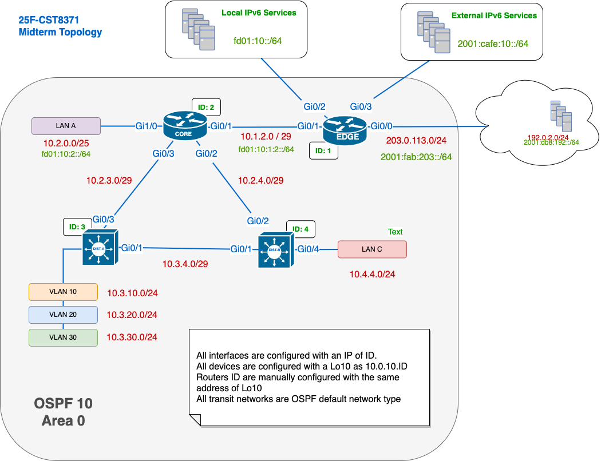

# 25F-CST8371 Midterm Topology Explanation

This document provides an overview and explanation of the midterm exam topology for CST8371. Students should study the structure and address scheme to prepare for the exam.

### Topology
  

---

## Topology Overview

The topology represents a simplified enterprise network using a **three-tier architecture**:

- **Core Layer**: CORE (ID: 2)
- **Distribution Layer**: R1 (ID: 3) and R2 (ID: 4)
- **Edge Layer**: EDGE (ID: 1)

The network operates entirely within **OSPF Area 0** and includes IPv4 and limited IPv6 routing.

---

## Device Roles and IDs

| Device | Role             | ID  | Loopback (Lo10) | OSPF Router-ID |
| ------ | ---------------- | --- | --------------- | -------------- |
| EDGE   | External Gateway | 1   | 10.0.10.1/32    | 10.0.10.1      |
| CORE   | Core Router      | 2   | 10.0.10.2/32    | 10.0.10.2      |
| DIST-A | Distribution     | 3   | 10.0.10.3/32    | 10.0.10.3      |
| DIST-B | Distribution     | 4   | 10.0.10.4/32    | 10.0.10.4      |

Each device uses its `Lo10` address for the OSPF Router-ID.

---

## IPv4 Addressing Scheme

- All transit networks use `/29` prefixes.
- Address format for transit links: `10.ID1.ID2.0/<mask>`
- Loopbacks: `10.0.10.ID/32`
- Examples:
  - CORE–EDGE: 10.1.2.0/29
  - CORE–DIST-A: 10.2.3.0/29
  - CORE–DIST-B: 10.2.4.0/24

**Internal Networks**:

- LAN A (behind CORE): 10.2.0.0/25
- LAN C (behind DIST-B): 10.4.4.0/24
- VLANs on DIST-A:
  - VLAN 10: 10.3.10.0/24
  - VLAN 20: 10.3.20.0/24
  - VLAN 30: 10.3.30.0/24

---

## IPv6 Addressing Scheme

IPv6 is used **only in selected segments**:

- LAN A: `fd01:10:2::/64`
- CORE–EDGE link: `fd01:10:1:2::/64`
- Local IPv6 Services: `fd01:10::/64`
- External IPv6 Services: `2001:cafe:10::/64`
- ISP/Remote:
  - IPv4: `203.0.113.0/24`
  - IPv6: `2001:fab:203::/64`

---

## OSPF Configuration Notes

- All devices are part of **OSPF process 10, Area 0**.
- All transit networks are configured with the **default OSPF network type** (broadcast).
- Passive interfaces may be used to suppress OSPF adjacencies on end-user subnets.
- OSPF propagates both loopbacks and transit networks.

---

## Routing Behaviour Summary

- **IPv4**: Full routing across all internal segments and to the EDGE.
- **IPv6**:
  - LAN A can reach **Local IPv6 Services**.
  - LAN A **cannot reach** External IPv6 Services or Remote (GUA only).
  - EDGE has connectivity to external IPv6 destinations.

---

## Study Tips

- Trace IPv4 routes using OSPF Router-IDs and cost.
- Understand why IPv6 connectivity is limited to local services.
- Know the OSPF path selection process and how costs affect it.
- Be able to interpret route tables and deduce how a router reaches other segments.

---

Use this reference to understand the midterm scenario and structure your preparation. Visualize routing behaviour and practice reading topologies!

