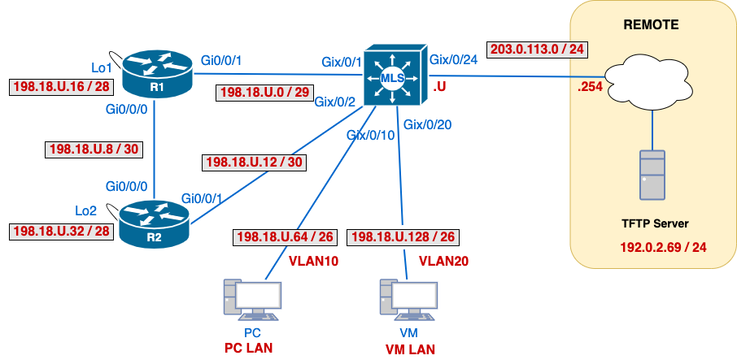

#  Lab 01 – Static Routing, SVIs, and Management Setup

## Overview
In this lab, you'll configure static routes, SVIs, and management interfaces using a structured topology. You'll review IP addressing with VLSM and submit working configurations to a TFTP server.

---
## 💡 Why This Lab is Important
This lab prepares you to:
- Apply IP subnetting (VLSM) in realistic scenarios
- Configure router links and VLAN SVIs
- Enable inter-VLAN routing and management access
- Practice end-to-end verification and remote config submission

**Static routing** remains widely used because it provides simplicity, predictability, and control, especially in small networks, point-to-point links, or backup paths. It requires no overhead from routing protocols and is easy to troubleshoot. 
**Default routes** are equally essential, acting as a *gateway of last resort* to send packets when no specific route exists, simplifying configurations in hub-and-spoke networks or for internet-bound traffic. 
Together, static and default routes form the foundation for scalable, secure, and manageable network design.

---

## 🌐 Network Topology and IP Addresses



### VLANs and Networks

| Device  | Interface       | Address           | Notes                  |
| ------- | --------------- | ----------------- | ---------------------- |
| **MLS** | Gix/0/24        | `203.0.113.U/24`  | Connection to REMOTE   |
|         | Gix/0/1         | `198.18.U.1/29`   | To R1                  |
|         | Gix/0/2         | `198.18.U.13/30`  | To R2                  |
|         | VLAN10          | `198.18.U.65/26`  | Default Gateway for PC |
|         | VLAN20          | `198.18.U.129/26` | Default Gateway for VM |
|         | Gix/0/10        | -                 | Access port VLAN 10    |
|         | Gix/0/20        | -                 | Access port VLAN 20    |
| **R1**  | Gi0/0/1         | `198.18.U.2/29`   | To MLS                 |
|         | Gi0/0/0         | `198.18.U.9/30`   | To R2                  |
|         | Lo1             | `198.18.U.17/28`  | Simulated LAN          |
| **R2**  | Gi0/0/0         | `198.18.U.10/30`  | To R1                  |
|         | Gi0/0/1         | `198.18.U.14/30`  | To MLS                 |
|         | Lo2             | `198.18.U.33/28`  | Simulated LAN          |
| **PC**  | VLAN10 (PC LAN) | `198.18.U.66/26`  | VLAN 10                |
| **VM**  | VLAN20 (VM LAN) | `198.18.U.130/26` | VLAN 20                |
> 💬 **Note:** 
> **U** is your assigned "magic" number for CST8371. You can find your **U** number in the Brightspace gradebook.

---

## 🛠️ Initial Configuration

### 0. Create submission file
- [ ] On your desktop, create a file `01-username.txt`.  This is the file you will be submitting at the end of the lab to the tftp server.
- [ ] Only the `01-username.txt`will be graded even if the running configs are submitted.
### 1. Initial Setup for all Devices
- [ ] Hostnames: `username-<devicename>R` (eg: *ayal0014-R1*)
- [ ] Protect privileged exec with password `class` stored with strong encryption
- [ ] Disable dns lookups
- [ ] Configure the console line to minimize disruptions caused by log messages.
- [ ] On the vty lines: enable SSHv2 access using the domain `cnap.cst` authenticating with `admin / cisco`.
- [ ] Switches must be configured with `vtp mode transparent`
- [ ] Routers must be configured with `(config)# no ip tftp source-interface`
### 2. MLS: VLAN, SVIs and Port Configuration
- [ ] Create VLAN 10, 20, and 666, use VLAN names as `username-<VLANID>`(eg: `ayal0014-VLAN10`).  All VLANs should have your `username` pre-appended to the device name!
- [ ] Assign SVIs IP addresses  to VLAN 10 and VLAN 20.
- [ ] Place PC on VLAN 10 and VM on VLAN 20.
- [ ] Shutdown all interfaces that are not in use and move them to VLAN 666.  
- [ ] No port should be in VLAN 1
### 3. Addressing Configuration
- [ ] Configure addresses according to the topology diagram, paying attention to the network masks.
- [ ] Add a description to all Cisco interfaces, using `notes` from the network addresses table.
- [ ] Ensure all interfaces are UP/UP before continuing.

---
## 🛠️ Routing Setup, Testing and Troubleshooting

You will take a **systematic approach** to configure routing in the network: set up and verify one device at a time before moving to the next. This will reduce errors and help isolate configuration issues.

### 1. MLS (Multilayer Switch)

**MLS** acts as the **edge router** in your student topology. In real-world deployments, this is the device that typically connects your internal network to an upstream provider, such as an ISP or core router. Since **MLS doesn't have detailed knowledge of all external destinations**, it uses a **default route** to send unknown traffic toward the **REMOTE** network, which handles Internet-bound or external routing.

Additionally, MLS is responsible for **inter-VLAN routing via Switch Virtual Interfaces (SVIs)**. VLAN 10 and VLAN 20 are configured locally, so any traffic between them is routed internally through the MLS — no additional static routes are required for those segments.
##### 📌 Why Use Fully Specified Routes?

When dealing with **multi-access networks**, such as the link between **MLS** and **REMOTE**, using a **fully specified static route** (with both next-hop IP *and* exit interface) is considered best practice. This prevents potential ambiguity in route resolution and ensures the router knows exactly how to forward traffic. This is especially important when multiple hosts share the same link and **ARP resolution** might introduce unnecessary delays or misdirection.

#### ✅ Configuration Tasks for MLS

- [ ] Configure a **fully specified default route** towards the REMOTE network.
- [ ] Configure a **fully specified route** towards **R1-Lo1**.  This route will be tested later when all **R1** routes are configured.
- [ ] Configure a **fully specified route** towards **R2-Lo2**.  This route will be tested later when all **R2** routes are configured.
- [ ] Confirm that the **PC in VLAN 10 can ping the VM in VLAN 20**.
- [ ] Confirm that the **PC in VLAN 10 can ping the TFTP server**.

> 💬 **Note on Return Traffic:**
>
> For replies to reach VLAN 10 or VLAN 20 from the TFTP server (or any other external network), **REMOTE must have a route back** to the `198.18.U.64/26` and `198.18.U.128/26` networks. These are globally routable test addresses and can be forwarded like real Internet traffic.
>
> In production, this is often handled with a **static route** or a summarized **default route** pointing back toward the student lab edge.

#### 📋 CO1 - Verification and Collection of Information

Copy the following commands in your `01-username.txt`file, under the label **CO1**:

```bash
  - MLS:  show vlan brief
  - MLS:  show ip interface brief | exclude unassigned
  - PC:   ping 198.18.U.130                                !-- VM
  - PC:   ping 192.0.2.69                                  !-- TFTP
```

> 💬 **Note:**
> - [ ] Verify MLS' routing table.  Do not copy the routing table yet into your submission file
> - [ ] When copying the pings, ensure you copy the last line showing `0% packet loss`.
> - [ ] Don't forget to save the file.

---
### 2. R1

Now that the **MLS** has routing configured and is verified, it’s time to bring **R1** into the routing path. This step ensures traffic from internal networks can flow **outward toward REMOTE**, and prepares **R1** for future inter-router communication.

#### ✅ Configuration Tasks for R1

- [ ] Add a **fully specified default route pointing to MLS** — this will send all unknown traffic (e.g., TFTP, REMOTE, Internet) toward the edge of the student network.
- [ ] Ensure **R1 can communicate with VLAN 10 and VLAN 20**.  
	- [ ] You do not have to set up routes for the VLANs, the default route encompasses them.

#### 📋 CO2 - Verification and Collection of Information

Copy the following commands in your `01-username.txt`file, under the label **CO2**:

```bash
  - R1:   ping 198.18.U.66                !-- PC
  - R1:   ping 198.18.U.130 source Lo1    !-- VM
  - R1:   ping 192.0.2.69                 !-- TFTP server
```

> 💬 **Note:**
> - [ ] Pinging the **VM **sourcing from the **Lo1**, tests that **MLS** has a route towards **R1-Lo1**.
> - [ ] When copying the pings, ensure you copy the last line showing `0% packet loss`.
> - [ ] Don't forget to save the file.

---

### 3. R2

In this step, you’ll bring **R2** online as the final internal router. **R2** acts as a transit router in your student network, connecting **R1** to **MLS** and enabling access to its own loopback network.

#### ✅ Configuration Tasks for R2

- [ ] Add a **fully specified default route pointing to MLS** towards REMOTE.
- [ ] Ensure **R2** can communicate with **R1-Lo1** via **MLS**.
- [ ] Ensure **MLS** can communicate with **R2-Lo2** via **R2**.

#### 📋 CO3 - Verification and Collection of Information

Copy the following commands in your `01-username.txt`file, under the label **CO3:

```bash
  - R2:   ping 198.18.U.130 source Lo2              !-- VM
  - R2:   traceroute 198.18.U.66                    !-- PC
  - R2:   traceroute 198.18.U.17                    !-- R1-Lo1
  - R2:   traceroute 192.0.2.69                     !-- TFTP server
```

Don't forget to save the file.

> 💬 **Note:** 
> -[ ] With only a default route, **R1** and **R2** do not need specific entries for VLANs, **MLS handles inter-VLAN routing** and forwards as long as it knows how to return traffic to R1 and R2’s interfaces.
> - [ ] When copying the pings, ensure you copy the last line showing `0% packet loss`.
> - [ ] Don't forget to save the file.

---
### 4. Collect Routing Information

#### 📋 CO4 - Verification and Collection of Information

Copy the following commands in your `01-username.txt`file, under the label **CO4:

```bash
  - MLS:  show ip route | begin Gateway
  - R1:   show ip route | begin Gateway
  - R2:   show ip route | begin Gateway
```

> 💬 **Note:** 
> - [ ] Don't forget to save the file.

---

## 📤 Submission and Clean up

Submit:
- [ ] `01-username.txt` file via TFTP upload from your PC.
- [ ] Submit an empty file in BrightSpace, this file is necessary to provide feedback.
- [ ] From each device, upload `running-config` to the TFTP:
```bash
copy run tftp
Address or name of remote host []? 192.0.2.69
Destination filename []? (ENTER)
```

- [ ] Check uploads with:
```bash
ssh cisco@192.0.2.69
ls -l /var/tftp/yourname*
```
- [ ] 📝 Cleanup: Be sure to `erase startup-config`, and `delete vlan.dat` before disassembly.

---

**📅 Due:** By the end of your scheduled lab session.
