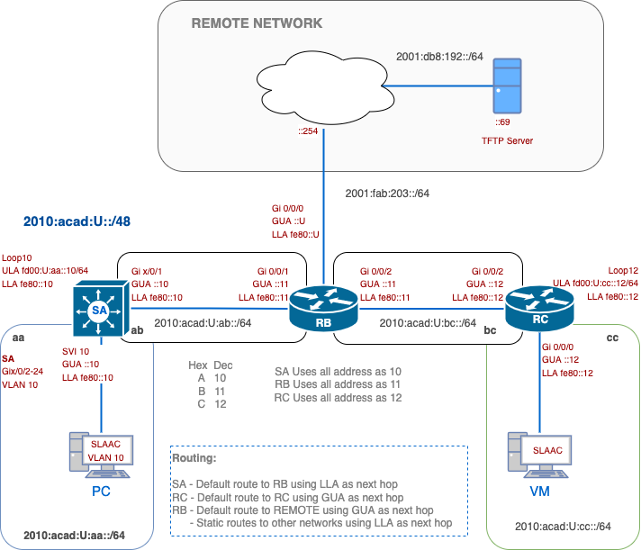

# Lab 02 – IPv6 Addressing and Static Routing

> Based on Linda MacEwan's IPv6 Lab
> 
> 🚧 *This lab is currently under development and will be released soon.*
> 
## 🧭 Overview
This lab introduces you to IPv6 routing concepts, including Global Unicast Addresses (GUA), Link-Local Addresses (LLA), Unique Local Addresses (ULA), and static route configuration using both GUA and LLA as next hops. You'll work through a multi-router topology, configure hosts, and verify IPv6 connectivity from end to end.

###  🎯 Learning Objectives
By the end of this lab, you will be able to:
- Identify and configure LLA, GUA, and ULA IPv6 address types.
- Apply default and static routes using GUA and LLA next hops.
- Use Linux and Cisco tools to validate IPv6 configuration and reachability.

---

## 💡 Why This Lab is Important

IPv6 is the **future of network addressing**, and the future is already here. The explosion of connected devices, cloud computing, and Internet of Things (IoT) has exhausted the IPv4 address space. IPv6 solves this with an address space so vast that it could assign an IP to every grain of sand on Earth. 

In this lab, you will be:
- Practice configuring LLA, GUA, and ULA on Cisco routers and Linux VMs.
- Implement default and static IPv6 routes using both GUA and LLA next hops.
- Use Linux commands to validate neighbour discovery, SLAAC, and route behaviour.
- Test full IPv6 connectivity between network segments.

Most importantly, this lab gives you hands-on experience with IPv6 **as it’s deployed in production environments today**, statically at the edge, dynamically inside, and incrementally rolled out alongside IPv4 in dual-stack topologies.

---

## 🗺️ Network Topology



### 📘 IPv6 Addressing Format

#### General IPv6 formatting:

| Block            | Role             | Use                                |
| ---------------- | ---------------- | ---------------------------------- |
| `2010:acad::/48` | Student Internal | All router, VLAN, and lab configs  |
| `fd00::/8`       | ULA Loopbacks    | Non-routable internal only         |
| `2001:db8::/32`  | Remote / Teacher | Simulated external/public services |
#### Student Addressing:
All students use the format `2010:acad:U:<segment>::/64`, where:
-  `U` is your assigned unique student number (e.g., `1`, `2`, ..., `30`)
- `<segment>` is a 2-letter hex code for the link:

| Student Segment       | Link Segment | Interface or Purpose |
| --------------------- | ------------ | -------------------- |
| `2010:acad:U:aa::/64` | **`aa`**     | SA VLAN 10 (PC LAN)  |
| `2010:acad:U:ab::/64` | **`ab`**     | SA ↔ RB link         |
| `2010:acad:U:bc::/64` | **`bc`**     | RB ↔ RC link         |
| `2010:acad:U:cc::/64` | **`cc`**     | RC VLAN 20 (VM LAN)  |

---
## 🧾 Configuration and Verification Commands for Cisco IPv6

| Task                                | Command Example                                  | Notes                                            |
| ----------------------------------- | ------------------------------------------------ | ------------------------------------------------ |
| Enable IPv6 routing                 | `ipv6 unicast-routing`                           | Required on all routers                          |
| Assign Link-Local Address (LLA)     | `ipv6 address fe80::1 link-local`                | Manually configured, locally scoped              |
| Assign Global Unicast Address (GUA) | `ipv6 address 2001:db8:acad::1/64`               | Used for routing across the network              |
| Default Route (GUA next-hop)        | `ipv6 route ::/0 2001:db8:acad::2`               | Common for stub routers like SA                  |
| Static Route (GUA next-hop)         | `ipv6 route 2001:db5:b055::/64 2001:db8:acad::2` | All-zeroes in host portion of destination prefix |
| Static Route (LLA next-hop)         | `ipv6 route 2001:db5:b055::/64 g0/1 fe80::2`     | Must specify both exit interface and LLA         |
| Interface Summary                   | `show ipv6 interface brief`                      | Displays interface status and IPv6 addresses     |
| Detailed Interface Info             | `show ipv6 interface g0/0/0`                     | Useful for checking LLAs and multicast addresses |
| Routing Table                       | `show ipv6 route`                                | Confirms learned/static/default routes           |

---
## 🛠️  Initial Setup

### 0. Create submission file
- [ ] On your desktop, create a file `02-username.txt`.  You will submit this file at the end of the lab to the TFTP server.
- [ ] Only the `02-username.txt`will be graded even if the running configs are submitted.

### 1. Basic Configuration
- [ ] Copy or download the basic device configuration.  You will use this configuration in most labs.
#### ⚙️ Cisco Basic Configuration

```bash
!
! Replace 'abcd1234' with your own college username
hostname abcd1234-device

!-- Enable secret password to class
enable secret class

!-- Disable dns lookups
no ip domain-lookup

!
!-- Console logging suppression
line con 0
logging synchronous
exec-timeout 0 0

! VTY access with SSH and Telnet
ip domain-name cnap.cst
username cisco privilege 15 secret cisco
crypto key generate rsa modulus 1024
ip ssh version 2
!
line vty 0 4
transport input telnet ssh
login local

!-- Enable IPv6 if needed
ipv6 unicast-routing

!-- Allow the router to pick the source IP of the 
!-- outgoing interface to the destination.
no ip tftp source-interface

!-- If the device is a switch
vtp mode transparent

```
---

## Part A - Setting Up IPv6 Addresses

#### IPv6 Address Types Summary

In IPv6, a single interface can have **multiple IP addresses**, and this is **by design**. Unlike IPv4, where typically one IP is assigned per interface, IPv6 interfaces often have a **Link-Local Address (LLA)** and **one or more Global Unicast Addresses (GUAs)** at the same time. The **LLA** (starting with `fe80::/10`) is automatically generated and used for communication within the local link, such as neighbour discovery or routing protocol exchanges. Meanwhile, the **GUA** (starting with `2000::/3`) is routable across networks and used for regular data traffic. This **multi-address model** enhances flexibility, allowing interfaces to participate in local control-plane functions while also handling end-to-end global traffic.

| Address Type | Prefix / Format | Purpose                        | Where Used in Lab    | Notes                                                                  |
| ------------ | --------------- | ------------------------------ | -------------------- | ---------------------------------------------------------------------- |
| **LLA**      | `fe80::/10`     | Local link-only communication  | All interfaces.      | Required for neighbour discovery and used as next-hop in static routes |
| **GUA**      | `2000::/3`      | Global communication routing   | Physical interfaces. | Used for default/static routes, ping tests, and Internet access        |
| **ULA**      | `fd00::/8`      | Private internal communication | Loopback interfaces. | Similar to private IPv4 (RFC1918); not routable on global Internet     |
### 1. Addressing
- [ ] For **SA**:  
	- [ ] Create `VLAN 10` and `VLAN 666`, 
	- [ ] Use VLAN names as `username-VLAN10` and `username-VLAN666`.
	- [ ] Set Switchport `Gix0/0/2-10` in `VLAN 10`
	- [ ] All other switchports should be moved to `VLAN 666` and `shutdown`.
	- [ ] Assign an IPv6 address to SVI `VLAN 10` as in the network diagram.
	- [ ] Ensure the SVI is `UP/UP`.
- [ ] For all devices:
	- [ ] Assign LLA and GUA on all interfaces according to the topology.
	- [ ] Loopback interfaces use ULA addresses (`fdxx::/8`).
	- [ ] Create a description for each interface.
- [ ] Verify interfaces are **`up/up`**, and there are no address typos.
#### ⚙️ Example Cisco IOS Configuration for `Gi1/0/1` on SA

> Assuming `U=100` and interface `Gi1/0/1`

```bash
interface GigabitEthernet1/0/1
 description Link to RB
 ipv6 address fe80::10 link-local           ! Manually set LLA
 ipv6 address 2010:acad:100:ab::10/64       ! GUA (student-specific, with U=100)
 no shutdown
```

#### ⚙️ Example Cisco IOS ULA Configuration for `Lo10` on SA

```bash
interface loopback10
 description ULA loopback
 ipv6 address fe80::10 link-local            ! Manually set LLA
 ipv6 address fd00:100:aa::10/64             ! LUA Address for Loopback
```

#### 🔍 Verify your results (SA Sample)

Unlike the IPv4 version of this command, the IPv6 output is **not formatted as a table**. Instead, each interface name appears on its own line, and its IPv6 addresses (both **Link-Local** and **Global/ULA**) are listed **below** it.

```bash
ayalac-SA#show ipv6 int brief
GigabitEthernet1/0/1     [up/up]
    FE80::10
    2010:ACAD:100:AB::10
Loopback10             [up/up]
    FE80::10
    FD00:100:AA::10
Vlan10                 [up/up]
    FE80::10
    2010:ACAD:100:AA::10
```

✔️ **What to look for:**
- The interface status (`[up/up]`) is on the **same line** as the interface name.
- The **Link-Local Address** (`FE80::...`) is usually listed **first**.
- The **GUA or ULA** appears on the **next line**.

 ⚠️ **Common Mistakes to Watch For**:
- **Missing address**: Likely due to forgetting `no shutdown` or a misconfigured prefix.
- **Wrong `U` value**: Double-check that it matches your number assigned.
- **LLA mismatch**: If it shows something like `FE80::1AB:23FF:FECD:4567`, that means it’s still **auto-generated**, not manually assigned.
- **SVI down**:  Check that your VLAN is created and has switchports associated with it.
### 🔍 CO1 - Verification and Collection of Information

Copy the following commands in your `02-username.txt`file, under the label **CO1**:

From SA, RB and RC:

```
show ipv6 int brief
```

---
## Part B - Routing Configuration

### 1. SA:

- [ ] Configure a **fully specified default route using RB's GUA next hop**.
- [ ] A ping from SA to RB's GUA should be successful

Configure a **default route on SA** using the **Global Unicast Address (GUA)** of its next-hop neighbour (RB). 

**SA** is at the edge of the network, and it needs to send traffic to other routers or devices beyond its own link. Using the **GUA of RB** makes it clear and easy to route traffic across multiple segments. It’s also **more intuitive for beginners**, as the GUA is human-readable and globally scoped.
#### ⚙️ Cisco default route using LLA as the next hop
``` bash
ipv6 route ::/0 gigabitethernet1/0/1  2010:acad:100:ab::11
```
> *Send all unknown traffic to the next-hop at `2010:acad:100:ab::11`, reachable via interface `G1/0/1`.*

### 2. RC:

- [ ] Configure a **default route using an LLA next hop**.
- [ ] A ping from RC to RB's GUA should be successful.

Configure a **default IPv6 route on RC**, but instead of using a GUA, you’ll use the **Link-Local Address (LLA)** of the next-hop router (RB).

LLAs are **guaranteed to be present** and don’t change, even if GUAs are renumbered. That makes them ideal for **stable local links**, especially for static routing on simple point-to-point connections. When configuring routes using LLAs, the exit interface *must* be configured, since LLAs are **only unique on each link**, IOS needs to know **which interface** to send the packet out. Without it, the router wouldn't know which neighbour the LLA refers to.
#### ⚙️ Cisco default route using LLA as the next hop
``` bash
ipv6 route ::/0 gigabitethernet0/0/2 fe80::2
```

This command means:

> *Send all unknown traffic to the next-hop at `fe80::2`, but only reachable via interface `G0/0/2`.*

### 3. RB:

- [ ] Configure **4 static routes** to SA and RC networks using the LLAs as next hops.
- [ ] Configure a **default route** to Remote networks using the GUA next hop.
- [ ] Pings to the TFTP/SCP servers should be successful.

On RB, you'll configure **specific static routes** for known internal networks, like SA and RC’s LAN and loopback interfaces, and then use a **single default route** to handle all traffic destined for the external or teacher network. This approach keeps the routing table clean and easy to troubleshoot. Instead of overloading RB with unnecessary routes, you define only what’s needed for internal reachability, and let the default route handle everything else.

> *Don’t over-configure. Use specific routes for known subnets and a default for ‘everything else.’ Less clutter = cleaner troubleshooting.*

### 🔍 CO2 - Verification and Collection of Information

Copy the following commands in your `02-username.txt`file, under the label **CO2**:

```
- SA, RB, RC: show ipv6 route
- SA:  ping 2001:db8:192::62                 ! TFTP Server
- RC:  ping fd00:U:aa::10                    ! SA - Lo10
- RC:  ping fd00:U:aa::10 source Lo12        ! SA - Lo10 sourcing from Lo12
```


---

## Part D -  🖥️ Host & VM Configuration

### 1. Windows PC:
- [ ] Use SLAAC to obtain an IPv6 address
- [ ] Verify at least 1 GUA and 1 LLA in the `2010:acad:U:aa::/64` network
- [ ] A ping to the TFTP server IPv6 address should be successful
- [ ] Test web browser access: `http://[2001:db8:192::69]`

### 2. Alpine VM:

#### 🖥️ Why You’re Using Alpine Linux in This Lab

In this lab, you work with a lightweight Linux VM called **Alpine** instead of another Windows system. In the real world, most network devices, servers, and cloud systems run on Linux, and often without a graphical interface. By using Alpine, you’ll gain experience with essential **command-line tools** like `ip`, `ip -6 route`, and `ip neighbor`, which help you understand and verify IPv6 behaviour such as **SLAAC**, **EUI-64**, and routing. 

This is a valuable chance to build comfort with cross-platform networking, preparing you for careers in **DevOps, network engineering, and systems administration**, where Linux is everywhere.

- [ ] Use `ip link set up dev eth0`
- [ ] Verify SLAAC-derived IPv6 address matches EUI-64 from MAC
- [ ] Use `ip address show`, `ip -6 route show`, and `ip neighbor`

#### ⚙️ Alpine Linux - Dynamic IP address

``` bash
ip link set up dev eth0
```

#### 🔍 Verify your results

```bash
VM-Alpine:~$ ip add show eth0
2: eth0: <BROADCAST,MULTICAST,UP,LOWER_UP> mtu 1500 qdisc pfifo_fast state UP qlen 1000
    link/ether 52:54:00:13:12:93 brd ff:ff:ff:ff:ff:ff
    inet6 2010:acad:100:cc:5054:ff:fe13:1293/64 scope global dynamic flags 100 
       valid_lft 2591921sec preferred_lft 604721sec
    inet6 fe80::5054:ff:fe13:1293/64 scope link 
       valid_lft forever preferred_lft forever
       
VM-Alpine:~$ ip -6 route show
2010:acad:100:cc::/64 dev eth0  metric 256  expires 0sec
fe80::/64 dev eth0  metric 256 
default via fe80::12 dev eth0  metric 1024  expires 0sec
multicast ff00::/8 dev eth0  metric 256 

VM-Alpine:~$ ip nei
fe80::12 dev eth0 lladdr 52:54:00:19:89:e5 router ref 1 used 0/0/0 probes 1 REACHABLE
```

Where:
- `link/ether` shows your MAC address.
-  `inet6`shows your IPv6 address.
	- First, your GUA, then your LLA
- Note that the last 6 hex numbers of your MAC address are used to form your IPv6 addresses
### 🔍 CO3 - Verification and Collection of Information

Copy the following commands in your `02-username.txt`file, under the label **CO3**:

```bash
ALPINE:
ip address show dev eth0
ip -6 route show
ip neighbor
ping -c 4 PC-Address                ! You will need to find this Address on PC 
ping -c 4 fd00:100:aa::10           ! SA-Lo10
ping -c 4 2001:db8:192::69
```


---
## Part E - 📤 Submission and Cleanup

### Submit:
- [ ] `02-username.txt`to TFTP server.
- [ ] Router configs to TFTP server (SA, RB, RC).
- [ ] Submit a file on Brightspace to receive feedback information.

### Cleanup:
```bash
erase startup-config
delete vlan.dat
reload
```

---

**📅 Due:** End of scheduled lab session.
