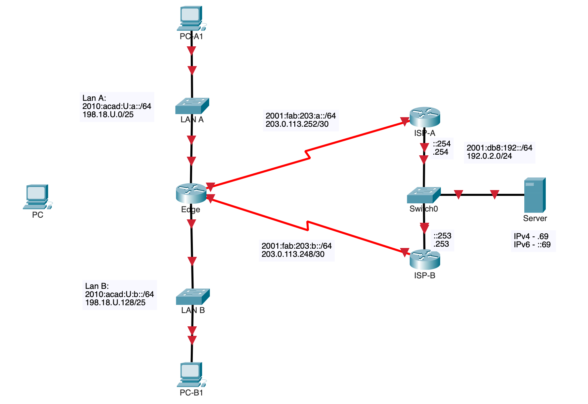

# Lab 03 – Dual Stack IPv4 and IPv6 Network Configuration

## 🧭 Overview
This lab explores the configuration of a dual-stack environment, where IPv4 and IPv6 operate simultaneously. Maintaining both protocols ensures backward compatibility with legacy systems while preparing for future IPv6-only environments. In a realistic network topology, you'll configure addressing, routing, and host behaviour across both IP versions.

> 🧾 This lab uses **Packet Tracer 8.2.2** to implement the network topology

## 🎯 Learning Objectives
By the end of this lab, you will be able to:
- Configure IPv4 and IPv6 on network interfaces
- Understand IPv6 address structure and assign static routes
- Develop a consistent IPv4/IPv6 addressing scheme
- Validate dual-stack connectivity across a network

---

## 💡 Why This Lab is Important

Modern networks are transitioning to IPv6 due to IPv4 exhaustion, but IPv4 remains widely used. A dual-stack environment allows organizations to support both protocols during this transition. By understanding and configuring both, you’ll gain critical skills for supporting today's complex networks.

---

## 🗺️ Network Topology



---

## 🛠️ Initial Setup

### 0. Create submission file
- [ ]  On your desktop, create a file `03-username.txt`.  You will submit this file to BrightSpace.
### 1. Basic Configuration
- [ ] [Download 03-PT-dual-stack.pkt](https://github.com/ayalac1111/Networking-Courses/raw/main/25S-CST8371/Resources/03-PT-dual-stack.pkt).  This is not a packet tracer activity, it is not auto-graded.  Rename the file to `03-username.pkt`
- [ ] Use the provided base configuration file: [basic.cfg](../Resources/basic.cfg)
### 2. Power On Devices
- [ ] All devices are powered off by default. Ensure each is turned on before starting the configuration.

---
## Part A – Setting Up IP Addresses

### 📘 IPv4 and IPv6 Addressing Table

| Device | Interface | IPv4 Address       | GUA IPv6 Address         | **LLA **   | Description       |
| ------ | --------- | ------------------ | ------------------------ | ---------- | ----------------- |
| Edge   | G0/0      | `198.18.U.1/25`    | `2010:acad:U:a::1/64`    | `fe80::1`  | To LAN A          |
| Edge   | G0/1      | `198.18.U.129/25`  | `2010:acad:U:b::129/64`  | `fe80::1`  | To LAN B          |
| Edge   | S0/0/0    | `203.0.113.253/30` | `2001:fab:203:a::253/64` | `fe80::1`  | To ISP-A          |
| Edge   | S0/0/1    | `203.0.113.249/30` | `2001:fab:203:b::249/64` | `fe80::1`  | To ISP-B          |
| ISP-A  | S0/0/0    | `203.0.113.254/30` | `2001:fab:203:a::254/64` | `fe80::a`  | To Edge           |
| ISP-A  | G0/0      | `192.0.2.254/24`   | `2001:db8:192::254/64`   | `fe80::a`  | To Server Network |
| ISP-B  | S0/0/1    | `203.0.113.250/30` | `2001:fab:203:b::250/64` | `fe80::b`  | To Edge           |
| ISP-B  | G0/0      | `192.0.2.253/24`   | `2001:db8:192::253/64`   | `fe80::b`  | To Server Network |
| Server | NIC       | `192.0.2.69/24`    | `2001:db8:192::69/64`    | `fe80::69` | Dual-stack server |
| PC-A   | NIC       | `198.18.U.10/25`   | `2010:acad:U:a::10/64`   | `fe80::10` | LAN A Host        |
| PC-B   | NIC       | `198.18.U.130/25`  | `SLAAC`                  | `SLAAC`    | LAN B Host        |

> 🔍 **Note**: Link-Local Addresses (LLAs) must be unique per interface on a link.


- [ ] Enable `ipv6 unicast routing` in all routers.
- [ ] Set all addresses as shown in the table above.
### 🔍 CO1 - IPv4/IPv6 Interface Configuration

> ⚠️ Open your console so the command output is correctly displayed, showing each line completely.

**Correct** display of commands:

``` bash
show ip int brief | ex una
Interface IP-Address OK? Method Status Protocol
GigabitEthernet0/0 192.0.2.1 YES manual up up
Serial0/0/0 203.0.113.154 YES manual up up
```

Copy the following command and command outputs in your `03-username.txt`file, under the label **CO1**:

- [ ] Ensure all your interfaces are `UP/UP` and have the correct IP addresses.

From all routers:
``` bash
show ip int brief | ex una
show ipv6 int brief
```

> ⚠️ **Packet Tracer Limitation**:  The `show ipv6 int brief` command does not allow filtering with `| ex una`.


From Edge:
``` bash
show ipv6 interface gi0/0
```

> ⚠️ **IPv6 Multicast Reminder**  
> As you check your `Link-Local Address (LLA)` and `Global Unicast Address (GUA)`, you'll also notice **Joined Group Addresses** like:
>
> ```bash
> Joined group address(es):
> FF02::1
> FF02::2
> FF02::1:FF00:1
> ```
>
> These are **IPv6 multicast addresses**:
> - `FF02::1` → All nodes on the local link.
> - `FF02::2` → All routers on the local link.
> - `FF02::1:FF00:1` → A solicited-node multicast address used by **Neighbor Discovery Protocol (NDP)** to find other IPv6 devices.
>
> IPv6 uses multicast (instead of broadcast) to communicate with multiple hosts efficiently. You'll explore more of this in future labs!


From PC-A and PC-B:
```bash
ipconfig/all
```

> ⚠️ **IPv6 Address and MAC – EUI-64 Format**  
> When a device uses **SLAAC** (Stateless Address Autoconfiguration), it can form its IPv6 address using its **MAC address** and the **EUI-64** method.
>
> Example from PC-B (`U=100`):
>
> ```bash
> Physical Address................: 0060.5C90.3CBD
> Link-local IPv6 Address.........: FE80::260:5CFF:FE90:3CBD
> IPv6 Address....................: 2010:ACAD:100:B:260:5CFF:FE90:3CBD
> ```
>
> 🔍 **How it works:**
> - The MAC address is split in half and `FFFE` is inserted in the middle.
> - The **7th bit** (Universal/Local bit) is flipped to indicate it's globally unique.
> - This modified value is appended to the IPv6 prefix (like `2010:ACAD:100:B::/64`) to form the full address.
>
> This method helps automatically generate unique interface IDs without needing DHCPv6.

**Recap** of commands to submit in this step:

- [ ] All routers:  `show ip int brief | ex una`
- [ ] All routers:  `show ipv6 int brief`
- [ ] All PCs: `ipconfig /all`

---

## Part B – Routing Configuration

The LAN networks require static routes to enable Internet access for internal users via the ISPs. **ISP-A** serves as the primary path to the Internet, while **ISP-B** acts as a backup, using floating static routes for redundancy.

Both ISP routers need static routes to reach the internal LANs behind the Edge router.

>⚠️ **Note on Static Routing in Packet Tracer**  
>Cisco Packet Tracer does not support **fully specified** static routes. As a result, this lab uses either:
> - **Directly connected** static routes where the exit interface is specified, or
> - **Next-hop** routes where the next hop is specified, 
> 
> For IPv6, **link-local addresses (LLAs)** typically require a fully specified route (i.e., next-hop LLA plus exit interface), which is not supported. Therefore, all IPv6 routes in this lab use **GUA next-hops** to maintain compatibility and ensure the configuration works in the Packet Tracer environment.

### 1. Edge - Configure IPv4/IPv6 Default Routes
- [ ] Configure a **directly connected** default route. This primary default route should be through router **ISP1-A**
- [ ] Configure a **directly connected** floating default route through **ISP-B** with an administrative distance of **`U`**.
### 2. ISP A - Configure IPv4/IPv6 Static Routes to LAN networks
- [ ] Configure a **next-hop** or **recursive** static route to **LAN A** via **Edge**.
- [ ] Configure a **next-hop** or **recursive** static route to **LAN B** via **Edge**.
- [ ] Configure a **next-hop** or **recursive** floating routes to **LAN A** and **LAN B** via **ISP-B** with an administrative distance of **`U`**.
### 3. ISP B - Configure IPv4/IPv6 Static Routes to LAN networks
- [ ] Configure a **next-hop** or **recursive** static route to **LAN A** via **Edge**
- [ ] Configure a **next-hop** or **recursive** static route to **LAN B** via **Edge**
- [ ] Configure floating routes to **LAN A** and **LAN B** via **ISP-A** with an administrative distance of **`U`** 
### 🔍 CO2 - IPv4/IPv6 Routing Tables

From all routers:

```bash
show ip route static                        !-- Show only static routes
show ipv6 route                             !-- static keyword is not implemented
```


---
## Part C - Path Verification 

If your configuration has been completed correctly, you can ping the Server from the hosts on LAN A and LAN B. In addition, if the primary route link is down, connectivity between the LAN hosts and the Server should still exist.
### 🔍 CO3 - Connectivity

``` bash
PC-B1: tracert 192.0.2.69
PC-A1: tracert 2001:db8:192::69

!-- Check redundant paths
!-- ISP-A: shutdown S0/0/0  

ISP-A: show ip route static                   !-- Should show your float route
ISP-A: show ipv6 route                        !-- Should show your float route
Edge:  show ip route static
Edge:  show ipv6 route static
PC-B: tracert 192.0.2.69
PC-A: tracert 2001:db8:192::69

!-- ISP-A:  Bring S0/0/0 up
!-- ISP-B:  Shutdown S0/0/1

ISP-B:  show ip route static
ISP-B:  show ipv6 route
ISP-B:  tracert 198.18.U.10                   !-- PC-A
ISP-B:  tracert `2010:acad:U:a::10

!-- ISP-B:  Bring S0/0/1 up
```

---

## Part D – NDP / RA Exploration

In this section, you'll observe how an IPv6 host automatically forms its address using **Router Advertisements (RAs)**.

When a new PC is connected to **LAN B**, it listens for `RAs` from the **Edge** router. These advertisements provide the **IPv6 network prefix** and configuration flags that allow the PC to generate its **Global Unicast Address (GUA)** using **SLAAC (Stateless Address Autoconfiguration)**.

- [ ] **Edge**:   Shutdown S0/0/0, S0/0/1, Gi0/0.  This will allow us to see the RAs more easily.
- [ ] **Edge**:   `debug ipv6 nd`
- [ ] Connect **PC-NEW** to **LAN B**, and ensure the IPv6 address is set to **automatic**
- [ ] **Edge**:   `no debug all`
- [ ] Copy/paste to your `03-username.txt` **4** lines of the debug information showing **`ICMPv6-ND`** process.

> ✅ Sample `debug ipv6 nd` output:
> ```bash
> ICMPv6-ND: (GigabitEthernet0/0, FE80::1) send RA to FF02::1
> ICMPv6-ND: (GigabitEthernet0/0, FE80::1) Sending RA(1800) to FF02::1
> ICMPv6-ND: MTU = 1500
> ICMPv6-ND: prefix = 2010:acad:U:b::/64
> ```

- [ ] Copy/paste to your `03-username.txt` from PC-NEW:  `ipconfig /all`
- [ ] **Edge**:  Enable all interfaces again.

These messages allow the PC to configure its **Link-Local Address (LLA)** and, if enabled, a **Global Unicast Address (GUA)** via SLAAC. This step demonstrates how hosts learn about routers and network prefixes **without needing DHCPv6**.

---
## Part E – Submission

Submit the following:
- [ ] `03-username.txt` - show commands
- [ ] `03-username.pkt` - packet tracer

