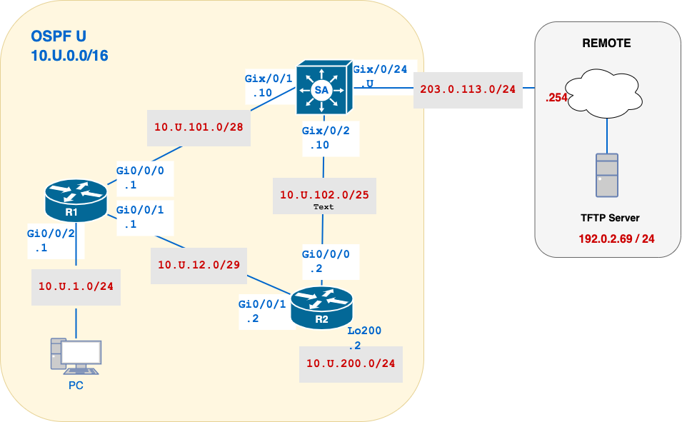

a# Lab 04 – OSPF Basics and Convergence Testing

## 🧭 Overview

This lab introduces **Open Shortest Path First (OSPF)** configuration on a multi-router topology using Cisco IOS. You’ll configure OSPF on three routers (SA, RA, RB), verify adjacency, examine the link-state database, and test dynamic convergence. You will also practice using wildcard masks and observe default route propagation.

> This lab builds on foundational IPv4 configuration and prepares you for more advanced routing design in future labs.

---

## 🎯 Learning Objectives

By the end of this lab, you will be able to:
- Configure OSPF using router ID and wildcard masks
- Enable OSPF using interface-level commands
- Propagate a default route via OSPF
- Verify OSPF neighbours and route entries
- Observe OSPF reconvergence after a topology change

---

## 💡 Why This Lab is Important

Dynamic routing protocols like OSPF allow networks to **adapt automatically** to changes. OSPF is widely used in enterprise networks for its fast convergence and link-state model. This lab gives you experience configuring OSPF on real equipment, understanding neighbour formation, and verifying routing behaviour across a small but realistic topology.

---

## 🗺️ Network Topology



## 📘  Addressing Table (IPv4)

| Device | Interface | IP Address       | Description |
| ------ | --------- | ---------------- | ----------- |
| SA     | Gix0/0/24 | `203.0.113.U/24` | To Remote   |
| SA     | Gix0/0/1  | `10.U.101.10/28` | To R1       |
| SA     | Gix0/0/2  | `10.U.102.10/25` | To R2       |
| R1     | Gi0/0/0   | `10.U.101.1/28`  | To SA       |
| R1     | Gi0/0/1   | `10.U.12.1/29`   | To R2       |
| R1     | Gi0/0/2   | `10.U.1.1/24`    | Lan Network |
| R2     | Gi0/0/0   | `10.U.102.2/25`  | To SA       |
| R2     | Gi0/0/1   | `10.U.12.2/29`   | To R1       |
| R2     | Lo200     | `10.U.200.2/24`  | Mock Lan    |
| PC     |           | `DHCP`           |             |

---
## 🧾 Configuration and Verification Commands for Cisco OSPFv2

| Task                            | Command Example                      | Notes                                                                 |
|---------------------------------|--------------------------------------|-----------------------------------------------------------------------|
| Enable OSPF Process             | `router ospf U`                      | **Configuration**: Starts the OSPF process with locally significant ID `U`  <br> Applied under global config mode. |
| Set Router ID                   | `router-id U.0.0.10`                 | **Configuration**: Manually sets the router ID for OSPF process. <br> Applied under `router ospf` mode. |
| Enable OSPF on Interface        | `ip ospf U area 0`                   | **Configuration**: Enables the interface in OSPF Area 0 with process ID `U`. <br> Applied under interface config mode. |
| Redistribute Default into OSPF | `default-information originate`     | **Configuration**: Advertises a default static route into OSPF. <br> Applied under `router ospf` mode. |
| Interface Summary               | `show ip ospf interface brief`       | **Verification**: Displays OSPF-enabled interfaces, their state, and neighbour counts. <br> EXEC mode command. |
| Neighbour Status                | `show ip ospf neighbor`              | **Verification**: Lists all OSPF adjacencies and their current states. <br> EXEC mode command. |
| Protocol Summary                | `show ip protocols`                  | **Verification**: Shows OSPF process ID, router ID, and redistribution status. <br> EXEC mode command. |
| Routing Table                   | `show ip route`                      | **Verification**: Confirms OSPF-learned routes including external (`O E2`) routes. <br> EXEC mode command. |
| OSPF Process Details            | `show ip ospf`                       | **Verification**: Displays router role (e.g., ASBR), areas, and SPF execution stats. <br> EXEC mode command. |


---

## 🛠️ Initial Setup

### 0. Create submission file
- [ ]  On your desktop, create a file `04-username.txt`.  You will submit this file to BrightSpace.
### 1. Basic Configuration
- [ ] Use the provided base configuration file: [basic.cfg](../Resources/basic.cfg)
### 2. SA: Port Configuration
- [ ] Create VLAN 666, use VLAN names as `username-<VLANID>`(eg, `ayal0014-VLAN666`).  All VLANs should have your `username` pre-appended to the device name!
- [ ] Shutdown all interfaces that are not in use and move them to VLAN 666.  
- [ ] No port should be in VLAN 1
### 3. Addressing Configuration
- [ ] Configure addresses according to the topology diagram, paying attention to the network masks.
- [ ] Add a description to all Cisco interfaces, using `Description` from the network addresses table.
- [ ] Ensure all interfaces are UP/UP before continuing.

---

## 🔧 Part A – SA OSPF Configuration

**SA** is the central router that links the internal OSPF domain to an external segment. It will define a **default static route** to the remote network and be configured to **redistribute** that route to other *OSPF-enabled* routers. Because of this role, **SA** becomes what OSPF classifies as an **Autonomous System Boundary Router (ASBR)**, a router that introduces external routes into the OSPF **autonomous system**.  This is a common function in enterprise networks where edge routers manage connectivity to outside services and advertise a default route so that internal routers like R1 and R2 can forward unknown traffic upstream without maintaining full route information.
#### 1. Configure a Default Route to the Remote network
- [ ] Use a **fully specified** default route via Remote.
- [ ] Verify that SA can successfully ping the TFPT server.
#### 2. Enable OSPF in SA
Before a router can participate in dynamic routing, it must be explicitly configured to run a routing protocol. When a router is **OSPF-enabled**, it begins exchanging routing information with neighbours and building a complete view of the network using link-state advertisements (LSAs). In this section, you'll enable OSPF on SA and configure it to advertise its internal routes while excluding the external link.
##### (A) Enable OSPF Process-ID `U`
The `process-id` is a locally significant number used to identify the OSPF routing process on a specific router. This means it only matters to the router it's configured on; it does **not** need to match the process IDs on neighbouring routers.  You can think of it like a **process ID (PID) in Linux**: it's used to manage internal processes, but it has no meaning outside the local system.

``` bash
config t
router ospf U
```

##### B) Manually set the Router ID
The `router-id` is a unique 32-bit number (usually formatted like an IP address) that identifies the router within the OSPF network. It is used in LSA generation and for establishing neighbour adjacencies. This value is important for stable OSPF behaviour, particularly in adjacency formation and LSA identification. If not set manually, the router will automatically select the highest IP address from any active loopback interface, or, if no loopbacks exist, the highest IP on an active physical interface. Manually configuring the router ID avoids relying on this automatic selection, which can lead to unpredictable or inconsistent behaviour.

```bash
router-id U.0.0.10
```

##### (C) Enable OSPF on Interfaces Gix/0/1 and Gix/0/2
Enable OSPF on the internal interfaces facing R1 and R2. These interfaces will participate in OSPF **area 0** and exchange routing information.

>💡 Think of enabling OSPF on an interface like **“flipping it into OSPF mode.”**  
Just like you might use `no shutdown` to bring a link physically **up**, applying the `ip ospf` command **activates OSPF** on that interface, telling the router:  **“This link should now speak OSPF.”**

This approach is easier and less error-prone than the legacy method of enabling OSPF using wildcard masks in global configuration mode. It's also more intuitive and aligns with how most modern platforms, including non-Cisco vendors, implement dynamic routing today.

⚠️ Do **not** enable OSPF on the external-facing interface (Gix/0/24) connected to the REMOTE network. We exclude this interface to prevent OSPF from sending Hello packets toward external networks where no OSPF neighbours exist.

```bash
 interface range gx/0/1-2
 ip ospf U area 0
```

##### (D) Configure OSPF to Propagate the Default Route
Because **SA** is connected to an external network, it is configured with a **static default route** pointing to that network. However, by default, OSPF does **not automatically advertise** this route to other routers. We must explicitly instruct OSPF to **redistribute the default route** into the OSPF routing process.

This allows routers like **RA** and **RB** to learn that SA is the exit point for all unknown destinations, a common design pattern in enterprise networks where edge routers provide a **single** outbound path.

> 💡 Think of this step as saying:  
> **“Tell the rest of the network: if you don’t know where to send a packet, forward it to me.”**

```
router ospf U
default-information originate
```

> ⚠️ This command assumes that a default route (`0.0.0.0/0`) is already configured in the router’s routing table. If it's missing, OSPF won't advertise it unless you add the `always` keyword (`default-information originate always`).

#### 3. Verify OSPF in SA
After configuring OSPF on SA, use the following commands to verify that the router is operating correctly and participating in the OSPF routing process.
##### (A) Check the OSPF Process and Router ID

```
show ip protocols | begin ospf
```
✅ What to check:
- [ ] **Process ID**: `"ospf U"` confirms you're running OSPF process U.
- [ ] **Router ID**: `U.0.0.10` — matches the manually set ID.
- [ ] **Interfaces**: `Gi0/0/1` and `Gi0/0/2` are actively participating in Area 0.
- [ ] **Redistribution**: The line `Redistributing External Routes` confirms this router is acting as an **ASBR** and propagating the default route.

##### (B) Verify OSPF-Enabled Interfaces

```bash
show ip ospf interface brief
````
✅ What to check:
- [ ] **PID**: The OSPF Process ID is `U`, as configured.
- [ ] **Area**: Both interfaces are in **Area 0**.
- [ ] **IP Address**: Matches your configured IPs
- [ ] **State**: Should be `DR` initially when no neighbour is present
- [ ] **Nbrs**: **0** — this is expected for now. Neighbours will appear once R1 and R2 are configured in the next steps.

---
## 🔧 Part B – R1 OSPF Configuration

Now that SA is configured, you will enable OSPF on **R1**. This router will participate in OSPF Area 0 and establish adjacencies with both SA and RB. Unlike SA, R1 will **not have a manually configured router ID**. Instead, the router will automatically select the highest active IP address, typically from a loopback interface or physical interface.

#### 1. Enable OSPF in R1
##### (A) Enable OSPF Process-ID `U`
Enable the OSPF routing process on RA using the same **Process-ID `U`** as SA. While the process ID is **locally significant** (it doesn’t need to match across routers), using the same number on all devices helps **reflect consistency** and makes configuration **easier to troubleshoot**.
##### B) Do Not Manually Set the Router ID
Unlike SA, RA will not have a manually configured `router-id`. OSPF will automatically select one when the process starts.

> 🔁 **Reminder:** OSPF chooses the router ID in this order:
> 1. Highest IP address on a loopback interface
> 2. If no loopback exists, the highest IP address on any active physical interface

Since **RA does not have a loopback interface**, the router ID will be selected from one of the active GigabitEthernet interfaces.

> 💬 **Reflection:** Based on the IP addresses configured on RA, 
> Which interface do you think will be used for the router ID? 
> What does this tell us about how OSPF reflects interface roles in router identity?
##### (C) Enable OSPF on Interfaces `Gi0/0/0`, `Gi0/0/1` and `Gi0/0/2`
All three interfaces on RA are internal and should participate in OSPF Area 0. These links connect to SA, the LAN, and eventually to RB. Enabling OSPF directly under the interfaces makes it clear which links are part of the routing process and avoids reliance on wildcard masks.

#### 2. Verify OSPF in R1
##### (A) Check the OSPF Process and Router ID
✅ What to check:
- [ ] **Process ID**: `"ospf U"` confirms you're running OSPF process U.
- [ ] **Router ID**: automatically selected based on the highest active IP address in R1.
- [ ] **Interfaces**: Three interfaces are actively participating in Area 0.
##### (B) Verify OSPF-Enabled Interfaces
 ✅ What to check:
- [ ] **PID**: The OSPF Process ID is `U`, as configured.
- [ ] **Area**: All interfaces are in **Area 0**.
- [ ] **IP Address**: Matches your configured IPs.
- [ ] **State**: Interface states may show as `DR`, `BDR`, or `DROther` — you do not need to interpret these yet. This will be discussed in detail next week.
- [ ] **Nbrs**: `Gi0/0/0`, which connects to SA, should show **1 neighbour**. `Gi0/0/1` may show **0 neighbours** if RB has not been configured yet.
##### (C) Verify OSPF Neighbours
Use the following command to view current OSPF neighbours:

```bash
show ip ospf neighbor
```
✅ **What to check:**
- [ ] R1 should show **1 OSPF neighbour** — this should be **SA**
- [ ] The neighbour is in **Area 0** and on a **directly connected subnet**
- [ ] The neighbour state should be **Full** once the adjacency is complete

⚠️ **Reminder**  
Routers must meet the following conditions to become OSPF neighbours:  
- [ ] Be in the **same OSPF area**  
- [ ] Share a **common subnet** (same network and mask)  
- [ ] Have matching **Hello and Dead intervals**

##### (D) Verify R1 OSPF Learned Routes
Display the routing table on R1:

```bash
show ip route ospf
```
✅ **What to check:**
- [ ] R1 should have **learned a default route** (`0.0.0.0/0`) via OSPF.
- [ ] The default route will appear as an **OE2 route**.  This means the route was **manually configured on SA** and redistributed into OSPF, making it **external to the OSPF process**.
##### (E) Verify SA OSPF Learned Routes
Open a **second PuTTY window** and SSH into SA, verify SA's routing table.
✅ **What to check:**
- [ ]  SA should have learned a route to the **PC network** via OSPF (from RA).
- [ ]  If no route to the PC network appears, troubleshoot the device **connected directly to the PC**.
##### (F) End-to-End Connectivity Test
Verify that the **PC can ping 192.0.2.69**

---
## 🔧 Part C – R2 OSPF Configuration

Now that **SA** and **R1** are configured and forming OSPF adjacencies, you'll complete the setup by enabling OSPF on **R2**. This router connects to SA and R1 and will participate in **Area 0**, allowing dynamic routing across all internal links.
#### 1. Enable OSPF in R2
##### (A) Enable OSPF Process-ID `U`
##### (B) Do Not Manually Set the Router ID

> 💬 **Reflection:** Based on the IP addresses assigned to R2,  
> Which interface do you expect OSPF to use for the router ID?  
##### (C) Enable OSPF on Interfaces `Gi0/0/0` and `Gi0/0/1`

#### 2. Verify OSPF in R2

##### (A) Check the OSPF Process and Router ID
**✅ What to check:**
- [ ] R2 is running OSPF Process ID `U`.
- [ ] The router ID was automatically selected (highest active IP address).
- [ ] R2 is routing for two networks (Gi0/0/0 and Gi0/0/1).
##### (B) Verify OSPF-Enabled Interfaces
**✅ What to check:**
- [ ] OSPF is enabled on `Gi0/0/0` and `Gi0/0/1`.
- [ ] Interface states may show `DR`, `BDR`, or `DROther` — no need to interpret yet.
- [ ] `Gi0/0/0` (connected to SA) and `Gi0/0/1` (connected to R1) should each show **1 neighbour** once adjacencies are established.
##### (C) Verify OSPF Neighbours
**✅ What to check:**
- [ ] R2 has **2 OSPF neighbours** — one with **SA**, one with **R1**.
- [ ] Neighbours are in **Area 0** on directly connected subnet.
- [ ] Hello/Dead timers match defaults (10s / 40s)
- [ ] Neighbour states should be **Full** once adjacencies are complete.
##### (D) Verify OSPF Learned Routes
**✅ What to check:**
- [ ] R2 has learned a **default route** via OSPF (marked as `O E2`).
- [ ] R2 has an OSPF route to the **PC network**

---
## 🔍 CO1 - Verification and Collection of Information
Copy the following command outputs in your `04-username.txt`file, under the label **CO1**:

From all devices:
```
show ip protocols
show ip ospf interface brief
show ip ospf neighbor
show ip ospf
show ip route ospf | begin Gateway
```

---
## 🧪 Part D – Convergence and Path Verification
You will test how OSPF dynamically reconverges when a link fails. Use the `tracert` command from the PC before and after simulating a failure on SA.

**Step 1 – Baseline Path Test**

Run the following from the PC and save the output in your `04-username.txt` file under the label **CO2**:

``` ruby
PC:  tracert -d 203.0.113.U
```
**✅ What to check:**
- [ ] Path should be PC -> R1 -> SA

**Step 2 – Simulate Failure and Re-test**
- [ ] On SA, shutdown Gi0/1, the interface towards R1.
- [ ] ⏱️ Wait 60 seconds for the network to **reconverge**.
- [ ] Rerun the `tracert`again from the PC.

``` ruby
PC:  tracert -d 203.0.113.U
```
**✅ What to check:**
- [ ] Path should be PC -> R1 -> R2 -> SA

---
## 📤 Submission Checklist

- [ ] Submit `04-username.txt` to the TFTP server.
- [ ] Upload running-configs of SA, R1, and R2 to TFTP server
- [ ] Verify files with:
```bash
ssh cisco@192.0.2.69
ls -l /var/tftp/username*
```

>💾 **Note:** Be sure to **save a local copy** of your configurations.  
**Lab 05** will use the **same topology**, and having your configs available will save you time during setup.

---
## 🧼 Cleanup

```bash
erase startup-config
delete vlan.dat
reload
```

---

**📅 Due:** End of this week’s lab session.
