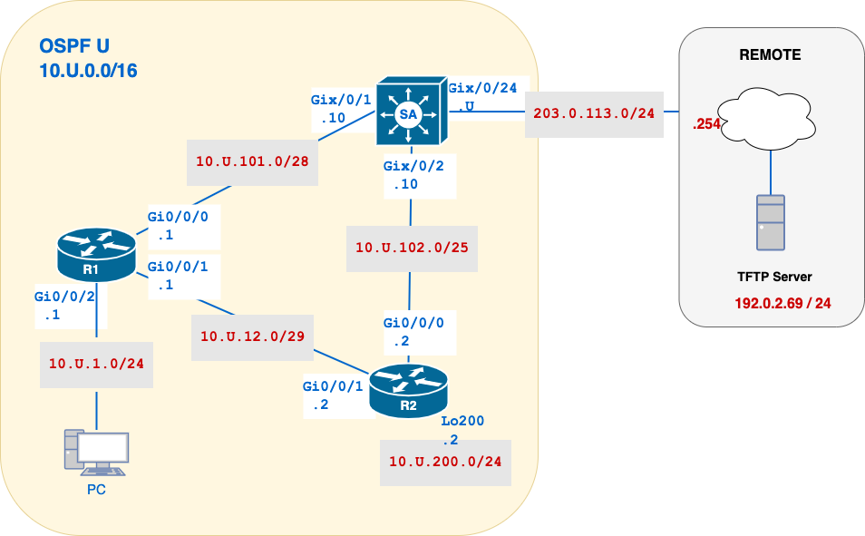

# Lab 05 – Tuning OSPF and Advanced Configuration

## 🧭 Overview

In this lab, you'll **tune and refine OSPF behaviour** beyond basic adjacency and route sharing. You’ll work with **router IDs**, **OSPF interface types**, **Designated Router elections**, **timer tuning**, and **passive interfaces**. 

This lab **builds directly on your configuration from Lab 04**, using the same topology and IP addresses, and focuses on making OSPF more predictable and scalable.

---
## 🎯 Learning Objectives

By the end of this lab, you will be able to:

- Configure and verify manual **router IDs**
- Adjust **OSPF network types** for loopbacks
- Influence **DR/BDR elections** using priority and router ID
- Tune **Hello and Dead** intervals and adjacency changes
- Use **passive interfaces** to reduce OSPF overhead on end-user networks

---
## 💡 Why This Lab is Important

Basic OSPF configuration is enough to get routes flowing, but **network engineers must fine-tune OSPF** to meet the performance, stability, and security needs of real-world environments.

This lab helps you build those skills, by adjusting how OSPF selects router IDs, advertises loopbacks, forms adjacencies, and reacts to interface behaviour. Mastering these features will make your OSPF deployments more **predictable**, **scalable**, and **secure**.

---

## 🗺️ Network Topology



## 📘  Addressing Table (IPv4)

| Device | Interface | IP Address       | Description |
| ------ | --------- | ---------------- | ----------- |
| SA     | Gix0/0/24 | `203.0.113.U/24` | To Remote   |
| SA     | Gix0/0/1  | `10.U.101.10/28` | To R1       |
| SA     | Gix0/0/2  | `10.U.102.10/25` | To R2       |
| R1     | Gi0/0/0   | `10.U.101.1/28`  | To SA       |
| R1     | Gi0/0/1   | `10.U.12.1/29`   | To R2       |
| R1     | Gi0/0/2   | `10.U.1.1/24`    | Lan Network |
| R2     | Gi0/0/0   | `10.U.102.2/25`  | To SA       |
| R2     | Gi0/0/1   | `10.U.12.2/29`   | To R1       |
| R2     | Lo200     | `10.U.200.2/24`  | Mock Lan    |
| PC     |           | `DHCP`           |             |

---

## 🧾 Configuration and Verification Commands

| Task                    | Command Example                           | Notes                                                                                  |
| ----------------------- | ----------------------------------------- | -------------------------------------------------------------------------------------- |
| Set Router ID           | `router-id U.0.0.1`                       | **Configuration**: Manually sets the OSPF router ID. <br> Applied under `router ospf`. |
| Clear OSPF Process      | `clear ip ospf process`                   | **Configuration**: Required to apply new router ID. <br> EXEC mode.                    |
| Show Protocol Info      | `show ip protocols`                       | **Verification**: Displays router ID and networks. <br> EXEC mode.                     |
| Modify Network Type     | `ip ospf network point-to-point`          | **Configuration**: Changes interface behavior. <br> Interface config.                  |
| DR Election Debug       | `debug ip ospf adj`                       | **Verification**: See DR/BDR election process. <br> Use with caution.                  |
| Set Hello/Dead Interval | `ip ospf hello-interval 5` / `...dead 20` | **Configuration**: Must match on both sides. <br> Interface config.                    |
| Passive Interface       | `passive-interface g0/0/2`                | **Configuration**: Disables OSPF Hello messages. <br> Under `router ospf`.             |

---
## 🛠️ Initial Setup

Before starting, complete the following steps to ensure your lab environment is ready:

- [ ] Create a submission file named: `05-username.txt`  
  → This is where you will paste all required command outputs (CO1–CO5) for grading. Replace `username` with your Algonquin login.
  
- [ ] Load your saved **running-configs from Lab 04**
  → If you didn’t save your configs, you may need to reconfigure routers manually based on Lab 04 instructions.

- [ ] <span style="color: red; font-weight: bold;">NEW</span> Set the **clock on each router** to ensure consistent times tamping in logs and debug messages.

	```bash
	clock set HH:MM:SS DAY MONTH YEAR
	!--- Example:
	clock set 15:00:00 26 May 2025
	```

- [ ] Verify that all interfaces are **up/up** and OSPF adjacencies are fully formed.
  → Use `show ip ospf neighbor` on each router to confirm.

- [ ] Confirm **full IP reachability** across the topology
  → You should be able to ping from each router to any other device in the network.

- [ ] If using SSH or Telnet, enable real-time debug output display:
	```bash
  terminal monitor
	```

📌 **IMPORTANT:** Do not continue until you’ve confirmed the network is stable and all routers are forming adjacencies as expected.

---
## 🔧 Part A – Configure OSPF Router ID

Each OSPF router must have a unique **Router ID** (RID), which is used in:
- Link State Advertisements (LSAs)
- Neighbour relationships
- SPF path calculations

If left to auto-select, the router may pick an unexpected interface IP, which could lead to unstable or inconsistent behaviour. Setting the RID manually is **best practice** in production networks.

> 🔁 **Router ID Selection Order in OSPF:**
> 1. Manually configured using `router-id`
> 2. Highest IP address on any loopback interface
> 3. Highest IP address on any active physical interface

### 1. Set the Static Router ID
Configure the following Router IDs under the OSPF process:

```bash
SA: router-id U.0.0.10
R1: router-id U.0.0.1
R2: router-id U.0.0.2
```

Use global configuration mode, e.g.:

```bash
router ospf U
 router-id U.0.0.10
```

### 2. Clear the OSPF Process (Mandatory)
In order for the new Router ID to take effect, you **must reset the OSPF process**:

```bash
clear ip ospf process
```

This will:

- Force re-evaluation of the Router ID
- Tear down and re-establish neighbour adjacencies
- Trigger SPF recalculations and LSA resync

This step is **necessary when changes** are made to parameters like the router ID or Hello/Dead intervals, which are only evaluated when the OSPF process starts.

> ⚠️ **Warning**: This causes a temporary disruption in routing while adjacencies reform. Always plan carefully when doing this on live networks.

### 3. Confirm Router IDs
After clearing the OSPF process, check the Router ID on each device:

```bash
show ip ospf
```
**✅ What to check:**
- [ ] All routers display the manually configured Router ID
- [ ] Router IDs match those listed above

### 🔍  CO1 – Verification and Collection of Information

📝 In your `05-username.txt` file, create a section labelled:

```diff
=== CO1 – Router ID Verification ===
```

Copy the output of this command from **SA, R1, and R2**:

```bash
show ip ospf
```

✅ **What to Include:**

| Requirement            | Details                                                          |
| ---------------------- | ---------------------------------------------------------------- |
| 🖥️ Device prompt      | Include device name and command, e.g., `ayalac-R1# show ip ospf` |
| 📜 Full command output | Not just the router ID line                                      |
| 🔍 Router ID check     | Ensure it shows the **configured Router ID**                     |
| 🗒️ Comment            | Add a confirmation line, e.g.:                                   |
|                        | `!-- Verified all routers use router-id as expected.`            |

📘 **Sample Output Block**: ( partial show command)
```bash
=== CO1 – Router ID Verification ===
!-- Verified all routers use router id as expected

ayalac-R1#show ip ospf
 Routing Process "ospf 100" with ID 100.0.0.1
ayalac-R2#show ip ospf
 Routing Process "ospf 100" with ID 100.0.0.2
ayalac-SA#show ip ospf
 Routing Process "ospf 100" with ID 100.0.0.10
```

---
## 🔧 Part B – OSPF Network Types (Loopbacks)

By default, OSPF advertises **loopback interfaces** as `/32` host routes, even when they’re configured with a larger subnet (like `/24`). This is intentional: loopbacks are logical interfaces, always “up,” and are usually treated as **identifiers**, not full subnets.

However, if a loopback is meant to represent a **reachable network**, and you want routers to learn the **entire subnet** (e.g., `10.U.200.0/24`), you must change the OSPF **network type** for that interface.

### 🔁 Why This Matters

This is a common design decision in real networks:
- `/32` is great for router ID or loopback reachability
- `/24` is essential when simulating real LANs or requiring full subnet advertisement

### 1️. Check How R2’s Loopback Is Advertised

1. Enable OSPF on `R2-Lo200` in area `0`.

2. From **R1**, check what R2 is currently advertising:

```bash
show ip route ospf
```

>❓ **Think About It**
Look for the route to: `10.U.200.2`.  Based on the current configuration, what prefix length do you expect to see for the `R2-Loopback200` on R1?
>
 📝 Write down your prediction in your notes before running the command.

### 2. Change the Network Type on R2
Modify the loopback configuration on **R2**:

```bash
interface loopback200
ip ospf network point-to-point
```
This tells OSPF to treat the loopback like a point-to-point interface, causing it to advertise the **real subnet mask** (e.g., `/24`).

> ⚠️ This only affects OSPF’s advertisement of the loopback — it does not change the actual interface mask.

### 3. Re-verify from R1
Check R1’s routing table again.  Confirm that the full `/24` subnet is now being advertised and received.

### 🔍  CO2 - Verification and Collection of Information

📝 In your `05-username.txt` file, create a section labelled:

```plaintext
=== CO2 – Loopback Network Type Verification ===
```

Copy the output of this command from **R1**, **after the change**:

```bash
show ip route ospf
```

✅ **What to Include:**

| Requirement                 | Detail                                                                 |
| --------------------------- | ---------------------------------------------------------------------- |
| 🖥️ Device Prompt & Command | Include the device name and command                                    |
| 📜 Full Output              | Paste the **full command output**, not just the matching route         |
| 📌 Route Check              | Confirm that the route **`10.U.200.0/24`** appears in the OSPF section |
| 🗒️ Comment                 | Add a short verification comment, e.g.:                                |
|                             | `!-- Loopback200 now shows as 10.U.200.0/24 in R1’s routing table.`    |
📘 **Sample Output Block**:

```bash
=== CO2 – Loopback Network Type Verification === 
!-- Loopback200 now shows as 10.U.200.0/24 in R1’s routing table.  

ayalac-R1#show ip route ospf      
O    10.U.200.0/24 [110/2] via 10.100.12.2, 00:00:02, GigabitEthernet0/0/1      ...
```

---
## 🔧 Part C – Designated Router (DR) Control

### Designated Router (DR) Elections in OSPF

In multi-access networks (like Ethernet), OSPF reduces LSA traffic by electing a **Designated Router (DR)**. Rather than each router exchanging LSAs with every other router, they send updates to the DR and Backup DR (BDR), simplifying communication.

### 🤖 How DR is Elected

DR election depends on:

1. **OSPF Priority** (default: 1; priority 0 = ineligible)
2. **Router ID (RID)** – used as a tiebreaker

Once elected, the DR remains in place until the adjacency resets — **OSPF does not preempt**.

### 1. Predict the DR on Network 10.U.101.0/28

> ❓ **Think About It**  
> Based on the OSPF priorities and Router IDs from Part A, which router do you expect to be the **DR** on the `10.U.101.0/28` network?

→ Make a prediction before running the command below.

Then, verify using:

```bash
show ip ospf neighbor
```

✅ Check for the neighbour marked as **DR** on the interface connected to SA.

> 💬 **Why might your prediction be wrong?**  
> DR elections are **non-preemptive** — even if SA has a higher priority now, the current DR won’t change until the adjacency resets.

### 2. Raise R1’s Priority to Force DR Role
To influence the next DR election, increase R1’s OSPF priority on the interface facing SA:

```bash
interface gi0/0/0
ip ospf priority U
```

Verify if the DR election changed.

>⚠️ This change won't take effect unless the adjacency resets. DR elections are **non-preemptive** — a new election only occurs when the OSPF neighbour state resets.

### 3. Trigger a New DR Election

1. On **R1**, enable OSPF debug:
```bash
debug ip ospf adj
```

2. On **SA**, shut and re-enable interface `Gi0/0/1` (the link to R1) to force a new election.  Shutdown the interface, wait for 10 seconds and then bring the interface up again.

3. Back on **R1**, stop debugging:
```bash
no debug all
!-- or
u all
```

🖥️ **Sample output**, `U=100`.   
Your output should show the timestamp.  Note that this router's output may look a bit different than yours.
```bash
!-- Debug captures showing the election of the DR.
ayalac-R1# show logging | include OSPF
[1]  OSPF: Neighbor 10.U.0.10 (GigabitEthernet0/0/0) state changed from FULL to DOWN
[2]  OSPF: Neighbor 10.U.0.10 (GigabitEthernet0/0/0) attempt to reestablish adjacency
[3]  OSPF: Build adjacency to 10.U.0.10 on GigabitEthernet0/0/0, interface priority 100
[4]  OSPF: DR/BDR election on interface GigabitEthernet0/0/0
[5]          DR: 10.U.0.1  BDR: 10.U.0.10  RTR: 10.U.0.1
[6]  OSPF: Neighbor 10.U.0.10 (GigabitEthernet0/0/0) state changed from INIT to 2WAY
[7]  OSPF: Neighbor 10.U.0.10 (GigabitEthernet0/0/0) state changed from 2WAY to EXSTART
[8]  OSPF: Neighbor 10.U.0.10 (GigabitEthernet0/0/0) state changed from EXSTART to EXCHANGE
[9]  OSPF: Neighbor 10.U.0.10 (GigabitEthernet0/0/0) state changed from EXCHANGE to FULL
```

### 🧾 Explanation of Output Lines

| Line #  | Explanation                                                                                                                                |
| ------- | ------------------------------------------------------------------------------------------------------------------------------------------ |
| **[1]** | The existing OSPF neighbor (SA) transitioned from `FULL` to `DOWN` because the interface went down or was reset (triggered DR reelection). |
| **[2]** | The router detects the neighbor is coming back and begins the process to rebuild the adjacency.                                            |
| **[3]** | R1 begins forming the adjacency with SA. Note: `priority 100` indicates that R1 is now eligible to win the DR election.                    |
| **[4]** | The DR/BDR election process is triggered on the multi-access segment.                                                                      |
| **[5]** | This is the key line confirming the results of the election:                                                                               |
|         | → `DR: 10.U.0.1` (R1)                                                                                                                      |
|         | → `BDR: 10.U.0.10` (SA)                                                                                                                    |
|         | → `RTR: 10.U.0.1` means this router (R1) was actively involved in the election.                                                            |
| **[6]** | Neighbor transitions from `INIT` to `2WAY` — bidirectional communication has been confirmed.                                               |
| **[7]** | Progresses to `EXSTART`, where the routers negotiate who will send the database first.                                                     |
| **[8]** | State advances to `EXCHANGE`, meaning LSAs are being exchanged.                                                                            |
| **[9]** | Final state `FULL` — routers are now fully adjacent and synchronized.                                                                      |

### 🔍  CO3 – Verification and Collection of Information

📝 In your `05-username.txt` file, create a section labelled:

```plaintext
=== CO3 – DR Election Verification ===
```

From **SA**, copy the following:
```
show ip ospf neighbor
```

✅ **What to Include:**

| Requirement                 | Detail                                                                                   |
| --------------------------- | ---------------------------------------------------------------------------------------- |
| 🖥️ Device Prompt & Command | Include the device name and command                                                      |
| 📜 Full Output              | Paste the **entire command output**, showing OSPF neighbors and their roles              |
| 🧾 DR Role Verification     | Confirm that **R1 is the DR** for interface **Gi0/0/0** with priority `U`                |
| 🗒️ Comment                 | Add a short explanation, e.g.:                                                           |
|                             | `!-- After raising R1's priority and resetting the adjacency, R1 was elected as the DR.` |

From **R1**, copy the following:
```bash
show logging | include OSPF
```

✅ **What to Include:**

| Requirement                 | Detail                                                                                      |
| --------------------------- | ------------------------------------------------------------------------------------------- |
| 🖥️ Device Prompt & Command | Include the device name and command                                                         |
| 📜 Full Command Output      | Submit the complete output for both commands                                                |
| 🧾 Neighbour Table Check    | Confirm that **R1 is the DR** on `Gi0/0/0`                                                  |
| 🧪 Debug Line Check         | Include at least lines labeled `[3]`, `[4]`, `[5]`, and `[9]` from the OSPF debug log       |
| 🗒️ Comment                 | Add a verification note, e.g.:                                                              |
|                             | `!-- Debug captures showing the election of the DR and confirmation that R1 is now the DR.` |


---
## 🔧 Part D – OSPF Hello and Dead Interval Mismatch

Neighbour relationships in OSPF are established and maintained through **Hello packets**, which are exchanged regularly on each interface. These packets are essential for detecting neighbours and maintaining adjacency.

Each `Hello` packet includes key information that must match between routers for a neighbour relationship to form, including:

- **Hello Interval** – How often Hello packets are sent (default: 10 seconds on broadcast networks)
- **Dead Interval** – How long to wait without hearing a Hello before declaring the neighbour down (default: 40 seconds)

> ⏱️ These timers must match **exactly** on both ends of a link.  
> If there is a mismatch, the routers will see each other’s Hello packets but will **not form an adjacency**.

### 🔁 Why This Matters

Mismatched timers are a **top cause of adjacency failure** in real networks. This section helps you recognize the symptoms, diagnose them via debugging, and correct the mismatch.

### 1️. Observe Current OSPF Timers

Start by checking the current Hello and Dead timers on R1 and R2:

```bash
show ip ospf interface gi0/0/1
```

### 2️. Break the Adjacency Using a Timer Mismatch

On **R2**, change the Hello/Dead timers:

```bash
interface gi0/0/1
ip ospf hello-interval 5  
ip ospf dead-interval 20
```

Then, enable debug to capture messages:

```bash
debug ip ospf hello
```

If the adjacency doesn't reset, you may need to:

```bash
clear ip ospf process
```

🔍 You should see messages like:

```bash
[1] OSPF HELLO Gi0/0/1: Rcv hello from 100.0.0.1 area 0 10.100.12.1
[2] OSPF HELLO Gi0/0/1: Mismatched hello parameters from 10.100.12.1
[3] OSPF HELLO Gi0/0/1: Dead R 20 C 20, Hello R 5 C 10 Mask R 255
[4] OSPF HELLO Gi0/0/0: Send hello to 224.0.0.5 area 0 from 10.100.12.1
```

>🔍 **Debug Line Guide**
>- **[2]** shows the mismatch detection
>- **[3]** confirms which timer values were expected (R) vs current (C)

### 3. Restore Adjacency by Matching Timers

1. Set the same timer values in R1's interface facing R2.
2. Observe the adjacency reforming and confirm via:
	```bash
	show ip ospf neighbor
	```

3. Stop debugging in **R2**.

	```bash
	no debug all
	```

> ⚠️ **Reminder**: Always stop debugging after capturing output — it consumes CPU and clutters logs.

4. Verify the timer settings from R1:

	```bash
	show ip ospf interface gi0/0/1
	```

### 🔍  CO4 – Verification and Collection of Information

📝 In your `05-username.txt` file, create a section labelled:

```
=== CO4 – Hello/Dead Timer Mismatch Verification ===
```

From **R2**, copy the following:

```bash
show logging | include OSPF
```

✅ **What to Include:**

| Requirement                 | Detail                                                                                 |
| --------------------------- | -------------------------------------------------------------------------------------- |
| 🖥️ Device Prompt & Command | Include the device name and command                                                    |
| 📜 Debug Output             | Submit at least **4 lines** of debug messages, including the **mismatch notification** |
| 🔍 Key Message              | Make sure one line includes: `Mismatched hello parameters`                             |
| 🗒️ Comment                 | Add a brief explanation, e.g.:                                                         |
|                             | `!-- Initially, R2's timers caused a mismatch.`                                        |

From **R1**, copy the following:
```bash
show ip ospf neighbor
show ip ospf interface gi0/0/1
```

✅ **What to Include:**

| ✅ Requirement                | Description                                                                             |
| ---------------------------- | --------------------------------------------------------------------------------------- |
| 🖥️ Device Prompt & Commands | Include the device name and command for both commands                                   |
| 📜 Full Output               | Copy **complete output** from both commands                                             |
| 👥 Neighbor Check            | Confirm R1 has formed adjacencies with **R2 and SA**                                    |
| ⏱️ Timer Validation          | Confirm that **Hello = 5**, **Dead = 20** on `Gi0/0/1`                                  |
| 🗒️ Comment                  | Add a verification note, e.g.:                                                          |
|                              | `!-- After configuring R1 timers to match (5/20), the adjacency reformed successfully.` |

---
## 🔧 Part E – Passive Interface

By default, OSPF sends **Hello packets** on every OSPF-enabled interface to discover and maintain neighbour relationships. However, not all interfaces need to form adjacencies.

For example, if an interface connects to a **user-facing network** (like a LAN with only PCs), there's no reason for OSPF to send Hellos — the router just needs to **advertise the connected network**.

This is where **passive interfaces** come in.

When an interface is marked as **passive**, OSPF will:
- ✅ Advertise the connected network into OSPF
- ❌ Suppress Hello packets, so **no neighbour relationship is attempted**

### 🔁 Why This Matters

Passive interfaces are used to:
- 🔒 **Improve security** — prevent rogue neighbours from forming on access ports
- 📉 **Reduce unnecessary traffic** — avoid sending Hello packets where they aren’t needed
- 🧹 **Keep neighbour tables clean** — particularly in large networks

This is a best practice in OSPF design for **edge interfaces or terminal networks**.

### 1. Identify the Interface to Make Passive

In this topology, the following interfaces should be made passive:

| Router | Interface   | Reason                          |
| ------ | ----------- | ------------------------------- |
| R1     | Gi0/0/2     | Connected to end-user LAN       |
| R2     | Loopback200 | Logical interface, no neighbors |

> ❓ **Think About It**  
> What would happen if you accidentally made **Gi0/0/0** passive on R1?

→ Write your prediction before continuing.

### 2. Configure Passive Interfaces

On each router, enter OSPF configuration mode and apply the `passive-interface` command:
#### On R1:
```bash
router ospf U
 passive-interface gi0/0/2
```

#### On R2
Configure Loopback200 as a passive interface.

>⚠️ **Never mark router-to-router links as passive.** 
>Doing so disables neighbour formation and breaks routing.

### 3. Verify Passive Interface Behaviour

Use the following command to verify that each interface is now passive and that **Hello packets are no longer sent**:

```
show ip ospf interface [interface-name]
```

✅ Look for:
- [ ] "The interface is passive"
- [ ] "Hello timer 0"
- [ ] No mention of DR/BDR state

### 4. Confirm the Route is Still Advertised

To prove that the passive interfaces still **advertise their networks**, run the following **cross-verification commands**:

1.  From **R1**, check for R2's loopback route:

	```bash
	show ip route 10.U.200.0 255.255.255.0
	```

2. From **R2**, check for R1's LAN route:

	```bash
	show ip route 10.U.1.0 255.255.255.0
	```

✅ Output should show an `O` (OSPF) route, even though those interfaces are passive.

### 🔍  CO5 – Verification and Collection of Information

📝 In your `05-username.txt` file, create a section labelled:

```
=== CO5 – Passive Interface Verification ===
```

From the routers, copy the following:
```bash
R1: show ip ospf interface gi0/0/2
R1: show ip route 10.U.200.0 255.255.255.0
R2: show ip ospf interface loopback200
R2: show ip route 10.U.1.0 255.255.255.0
```

✅ **What to Include:**

| Requirement                   | Detail                                                                                                         |
| ----------------------------- | -------------------------------------------------------------------------------------------------------------- |
| 🖥️ Device Prompts & Commands | Include the device name and command for all commands                                                           |
| 📜 Full Output                | Copy **complete output** from all four commands                                                                |
| 🔇 Passive Behaviour          | Confirm that passive interfaces **do not send Hellos** (check “Hello” status on OSPF interface)                |
| 📡 Route Check                | Ensure the associated networks are **still advertised via OSPF**                                               |
| 🗒️ Comments                  | Add a brief explanation per device, e.g.:                                                                      |
|                               | `!-- Passive interfaces are not sending Hellos, but the networks are still advertised and reachable via OSPF.` |

---
## 🔧 Part F – Reference Bandwidth Tuning (Best Practice)

OSPF calculates interface cost using the formula:

```c++
Cost = Reference Bandwidth / Interface Bandwidth
```

>🧮 OSPF uses **integer division**, not floating-point math.  
That means any **fractional results are rounded down**.

By default, the reference bandwidth is **100 Mbps**. This means:
- 100 Mbps = 100 Mbps / 1000 Mbps → cost = 1
- 1 Gbps = 1000 Mbps / 1000 Mbps → cost = 1
- 10 Gbps = 1000 Mbps / 1000 Mbps → cost = 1

> 🧠 **Problem:** Modern networks have speeds of 1G, 10G, or even 100G — but OSPF treats them all the same under the default reference, because they’re all **faster than 100 Mbps**, resulting in identical costs.

To solve this, we **raise the reference bandwidth**, typically to **10,000 Mbps (10 Gbps)** or higher, so that OSPF can distinguish between different high-speed links.
### 🔁 Why This Matters

Even though all interfaces in this lab are **1 Gbps**, in real enterprise environments with mixed-speed links (1G, 10G, 40G), setting the correct reference bandwidth ensures:

- 🔄 **Accurate cost calculation**
- 📶 **Better path selection**
- 🧰 **More control** when tuning or optimizing OSPF behaviour

> 🛠️ This step is a best practice. It has **no visible impact in this lab**, but it prepares you for real-world OSPF scaling.

### 1️. Apply Reference Bandwidth Change

Update the reference bandwidth to **10 Gbps** (10,000 Mbps) on **each router**.

```bash
router ospf U
 auto-cost reference-bandwidth 10000
```

>💡 You must apply this command to all OSPF routers in the network.
If not, they may calculate different costs and introduce routing inconsistencies.

### 2. Verify New Costs
After the change, verify the reference bandwidth in all routers:
```
show ip ospf | include Reference
```
✅ Verify
- [ ] `Reference bandwidth unit is 10000 mbps`

### 🔍 CO6 – Reference Bandwidth Verification
📝 In your 05-username.txt file, create a section labelled:

```
=== CO6 – Reference Bandwidth Verification ===
```

From all routers, copy the following:
```
show ip ospf | include Reference
```

✅ **What to Include:**

| Requirement                 | Detail                                                                                                  |
| --------------------------- | ------------------------------------------------------------------------------------------------------- |
| 🖥️ Device Prompt & Command | Include the device name and command                                                                     |
| 📜 Full Output              | Submit the line that includes the reference bandwidth (e.g., `Reference bandwidth unit is 10000 mbps.`) |
| ⚙️ Consistency Check        | Confirm that the **reference bandwidth is updated** across all routers                                  |
| 🗒️ Comment                 | Add a short explanation per device, e.g.:                                                               |
|                             | `!-- Reference bandwidth updated to 10000 Mbps in all routers.`                                         |

>💡 **Wrap-up Thought:**
Setting the reference bandwidth is about future-proofing your OSPF design. Even though it has no visible effect now, it's a habit used in nearly every enterprise deployment.

---
## 📤 Submission Checklist

- [ ] Submit `05-username.txt` to the TFTP server.
- [ ] Include all `CO` sections:  CO1-CO6
- [ ] Upload updated configs to the TFTP server.
- [ ] Verify with:
```bash
ssh cisco@192.0.2.69
ls -l /var/tftp/*username*
```

> 💾 **Reminder**: Save your configs — the next lab continues with this setup.