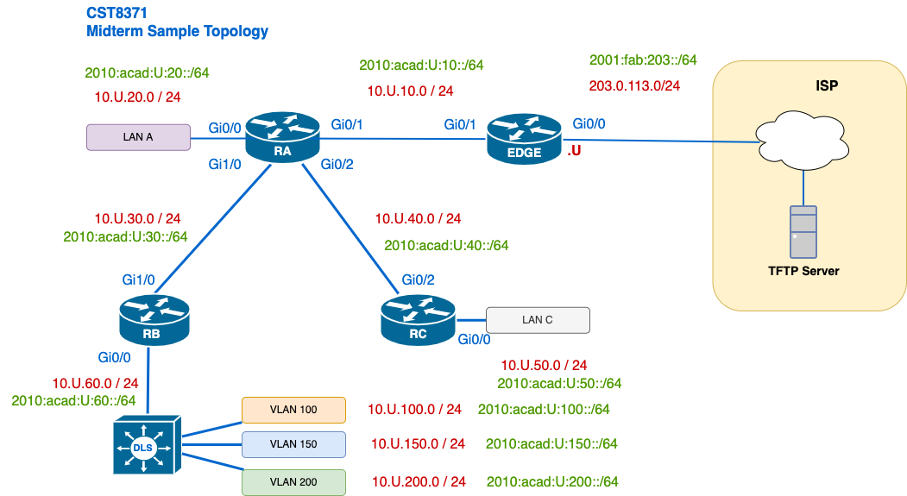

# Lab 07 – Applied Learning Lab

 _This is a collaborative, ungraded lab intended to help you practice the core skills tested on the midterm._
## 🧭 Overview
This lab is designed to reinforce the key concepts from the midterm exam using hands-on configuration and analysis of a realistic network. You’ll work with **IPv6**, **static and dynamic routing**, **OSPF troubleshooting**, and **routing table interpretation**. The topology is based on the midterm sample, so all tasks and challenges are directly related to what you’ll face during the exam.

---
## 🗺️ Network Topology



### Device ID Mapping (per your convention)
Use the following IDs for IP addressing, for example, EDGE-Gi0/1 will be 10.U.10.U 

| Device | ID  |
| ------ | --- |
| EDGE   | U   |
| RA     | 1   |
| RB     | 2   |
| RC     | 3   |
| DLS    | 10  |

> **Tips:**  
> 1. Replace any VLAN-configured end-user networks with `Loopback` interfaces on DLS.
> 2. Connect LAN-A and LAN-C interfaces to a L2 Switch for the interfaces to go UP/UP 
> 3. Your routers/switches will have an extra digit in the interface name, for example, gi0/0 will be gi0/0/0
> 4. You could use the topology of Lab 4 and apply the same type of scenarios presented in this lab.

---
## 🛠️ Initial Setup

### 1. Basic Configuration
- [ ] [OPTIONAL] Setup basic configuration. At least set SSH for easy access to all devices.
### 2. Addressing Configuration
- [ ] Configure addresses according to the topology diagram, paying attention to the network masks.
- [ ] Ensure all interfaces are UP/UP before continuing.
- [ ] Set the **clock on each router** to ensure consistent times tamping in logs and debug messages.
---

## 🔧 Part A – IPv6 Addressing and Static Routes

This section helps you observe how IPv6 autoconfiguration works using the **Neighbour Discovery Protocol (NDP)**. You’ll verify how link-local and global unicast addresses are formed and how the Alpine VM receives its addressing information.
### 1. Identify IPv6 Addresses
- [ ] RA:  `show ipv6 interface brief`
	✅ Confirm link-local addresses (LLAs) are **manually set** or **auto-generated**
	💡 If auto-generated: Can you explain how the LLA was formed?
- [ ]  On **RA**, inspect Gi0/0:
	```bash
	show ipv6 int gi0/0
	```
	✅ List all **multicast groups** the interface has joined

### 2. Add an Alpine VM to LAN-A
- [ ]  Connect an Alpine Linux VM to the **LAN-A** segment
- [ ]  Review Lab 02 notes if you need help with Alpine interface management
- [ ]  On **RA**, enable debugging for NDP before Alpine activates the interface:
	```bash
	debug ipv6 nd 
	```
- [ ] On **Alpine**, bring up the interface and allow SLAAC to assign the IPv6 address:
- [ ]  On **RA**, observe RS and RA messages in the debug output:
	✅ Identify the **Router Solicitation (RS)** from Alpine
	✅ Identify the **Router Advertisement (RA)** from RA
- [ ] Stop debugging on RA:
#### Reflection Questions
1.  What is Alpine’s **MAC address**?
2.  How was the **LLA** generated from the MAC?  
3.  What **prefix** was advertised in the RA message?
4.  What is the **GUA** address assigned to Alpine?
5.  Did you observe **Neighbour Solicitation/Advertisement** activity?

### 3. IPv6 Static Route Configuration
- [ ]  On **RC**, configure a **static route** to reach **LAN-A** using **RA’s link-local address** on the shared segment.
- [ ] From RC: try to ping the Alpine Linux host on LAN-A.
	✅ Is the ping **successful**?
- [ ] From RC: ping the Alpine Linux sourcing from Gi0/0.
	✅ Is the ping **still successful**?
#### Reflection Questions:
1.  What happens if the exit interface is omitted from the static route when using an LLA?
2.  Why must we use **LLA + interface** instead of a global unicast address here?
3.  When sourcing from Gi0/0, does the return path work properly? Why?
	💡 **Hint:** If return traffic fails, check RA’s route back to RC.

---
## 🔧 Part B – OSPF
### 1. Configure OSPF on all routers
- [ ] Do not configure the router ID manually
- [ ] Enable OSPF on all internal interfaces.
- [ ] Verify connectivity across the network
### 2. Router ID Selection
- [ ] Predict the router ID on DLS.
- [ ] Verify if your prediction is correct.
- [ ] Manually set the router ID to 15.0.0.15
- [ ] Review if the router ID is set, and review if the neighbours see the new router ID.
### 3. DR Election
- [ ] How many DR elections happen in the network? Count network segments (_broadcast_ domains)
- [ ] Using the commands `show ip ospf neigh` and `show ip ospf int` review the number of DR in the network.
	✅ Identify which routers were elected **DR/BDR** on each shared segment.
- [ ] Influence RA-Gi0/1 to become the DR on its network segment, how would you accomplish this?
#### Reflection Questions:
1.  Why didn’t the new Router ID or DR priority take effect immediately?
2.  What conditions cause a DR/BDR re-election?
3.  Why is it best practice to **manually set router IDs** in production?

---

## 🔧 Part C – OSPF Cost

This section helps students understand how OSPF chooses the best path based on interface cost and how `traceroute` reflects the actual forwarding decision. It also demonstrates the impact of changing the **OSPF reference bandwidth**.

### 1. Observe the Current Path from DLS
- [ ] From **DLS**, use `traceroute` to reach **Alpine Linux** in LAN-A.
	✅ Record the path: Which routers/interfaces are involved?
- [ ] On each router along the path, run:
```
show ip ospf interface [int]
```
	✅ Note the **cost** of each link (based on default bandwidth) 

### 2. Analyze OSPF Cost Values
- [ ]  Based on the `show ip ospf interface` outputs, calculate the **total cost** from **DLS to LAN-A**
- [ ] Predict:  If OSPF were to use a **different path**, would the cost be higher, lower, or equal?

### 3. Modify the Reference Bandwidth
 - [ ] On **all routers** (RA, RB, RC, DLS), set the OSPF reference bandwidth to reflect **modern link speeds** to 100000 Mbps
 - [ ] Recalculate the **total cost** from DLS to Alpine.
 - [ ] Review your routing table to see if the cost of the route has changed as well.
	  ✅ Did the metric (cost) of the route change?

### Reflection Questions
1. How does OSPF calculate cost from bandwidth?
2. What’s the default reference bandwidth in Cisco IOS?
3. Why is it important to update the reference bandwidth on all routers?
4. Did changing the bandwidth **actually change the forwarding path**? Why or why not?
5. What could you do to intentionally change the OSPF path?

