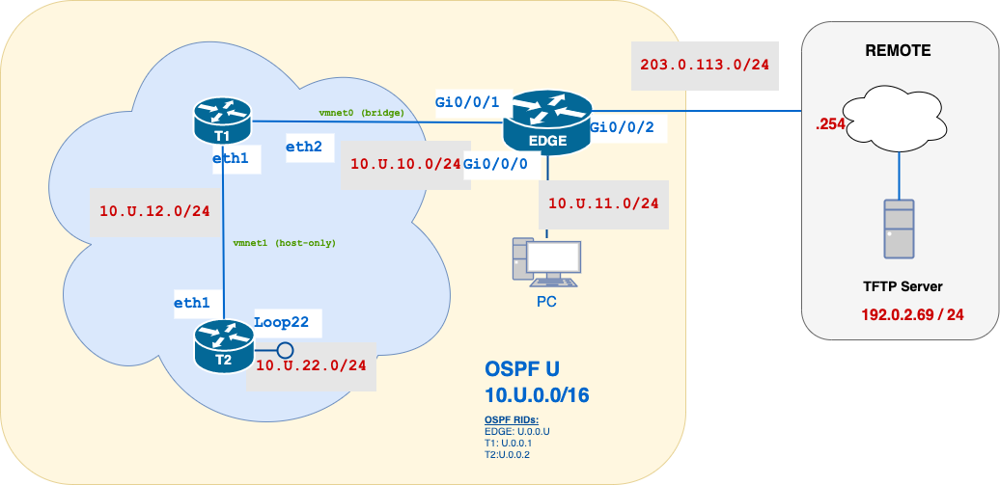

# Lab 08 – Hybrid OSPF Lab: Cisco and Cloud-Routers

---
## 🧭 Overview

In this lab, you will integrate a **physical Cisco router** (EDGE) with **MikroTik cloud routers** (T1 & T2) running in VMware. You’ll configure OSPF across hardware and virtual platforms, establish default-route advertisement to an external TFTP network, and verify end-to-end connectivity.

---
## 💡 Why This Lab Is Important

- **Hybrid Connectivity**: Modern networks often span on-premises hardware and cloud-hosted instances.
- **Multi-Vendor OSPF**: OSPF’s open standard allows seamless routing between Cisco IOS and RouterOS.
---
## 🗺️ Network Topology



---
## 📘 Addressing Table

| Device   | Interface | IP Address       | Notes                         |
| -------- | --------- | ---------------- | ----------------------------- |
| **EDGE** | Gi0/0/0   | `10.U.10.U/24`   | To T1 (MikroTik Cloud)        |
|          | Gi0/0/1   | `10.U.11.U/24`   | To PC                         |
|          | Gi0/0/2   | `203.0.113.U/24` | To Remote / TFTP network      |
| **T1**   | eth2      | `10.U.10.1/24`   | To EDGE                       |
|          | eth1      | `10.U.12.1/24`   | Host-only link to T2          |
| **T2**   | eth1      | `10.U.12.2/24`   | Host-only link to T1          |
|          | Loop22    | `10.U.22.2/24`   | Simulated LAN on T2           |
| **PC**   | (vNIC)    | `10.U.11.10/24`  | Default gateway = `10.U.11.U` |

---
## Part A – Configure EDGE (Cisco IOS)

1. **Basic Setup & Addressing**
    - [ ] Configure basic commands.
    - [ ] Assign IPs as per the addressing table.
2. **OSPF Configuration**
    - [ ] Enable OSPF using process-id  `U`
    - [ ] Configure a router-ID of `U.0.0.10`.
    - [ ] Enable OSPF on internal links.
3. **Provide Internet/TFTP Reachability**  
4. **Originate that external reachability so all OSPF neighbours learn the path to the external network**
### ✅ Reflection Questions
1. Why is a **default route** advertised from EDGE rather than a static host route?
2. What happens in the OSPF LSDB when you issue `default-information originate`?
3. If you omitted `default-information originate`, what would PC-to-TFTP pings show?

---
## Part B – Configure T1 & T2 (MikroTik RouterOS)

#### **MikroTik Basics**

**RouterOS** is the operating system running on MikroTik routers. It can also be installed as a VM image.  
- **Why MikroTik?**  
  - **Cost-Effective**: High feature set (OSPF, MPLS, BGP, VPN, hotspot) at a lower price point than many enterprise vendors.  
  - **Active Community & Documentation**: Extensive user forums, tutorials, and example scripts.  
  - **Flexible Licensing**: Scales from small labs to production networks with straightforward license levels.  
- **Management Interfaces**  
  - **WebFig**: A web-based GUI accessible via HTTP(S).  
  - **CLI**: Accessible via console, SSH, or Telnet. Commands follow a clear, hierarchical structure (e.g., `/ip address add …`).  
- **Ease of the CLI**  
  - **Intuitive Hierarchy**: Commands are grouped by function (e.g., `/routing ospf …`), making it simple to find and modify settings.  
  - **Tab-Completion & Inline Help**: Quickly discover available commands and options with `Tab` and `?`.  
- **Programmability & Automation**  
  - **Built-In Scripting**: RouterOS includes a full-featured scripting language for automating tasks (backups, dynamic adjustments, alerting).  
  - **API Access**: External tools can interact programmatically via the RouterOS API (e.g., Python, Ansible modules).  
  - **Exportable Config**: Easily export your configuration to a human-readable file for version control or templating.  
#### **Preparation**:
1. Download the MikroTik OSPF lab VM from [https://github.com/DesertBlume/MikroTik-Lab/.../MikroTik%20OSPF%20Lab%20Setup%20Guide.md](https://github.com/DesertBlume/MikroTik-Lab/.../MikroTik%20OSPF%20Lab%20Setup%20Guide.md)
2. Clone twice the VM and name the VMs **T1** and **T2**.
3. Each VM should have **eth1** & **eth2**.

#### **Initial Verification & “Show” Commands**
Before making any changes, it’s useful to get a baseline of your MikroTik VM’s state. Below are some `/print` commands in RouterOS alongside their Cisco IOS “show” equivalents.

| Purpose               | MikroTik RouterOS              | Cisco IOS                                       |
| --------------------- | ------------------------------ | ----------------------------------------------- |
| List all interfaces   | `/interface print`             | `show ip interface brief`                       |
| List IP addresses     | `/ip address print`            | `show ip interface brief`                       |
| View routing table    | `/ip route print`              | `show ip route`                                 |
| Show OSPF neighbors   | `/routing ospf neighbor print` | `show ip ospf neighbor`                         |
| Show OSPF routes/LSPs | `/routing ospf route print`    | `show ip ospf database`<br>`show ip route ospf` |

> **Tip:** You can append `detail` to any `/print` to see more fields, e.g.:  

#### **T1 Configuration Example**
!-- change username with your username
!-- U with your U number

1. Ensure your interfaces are labelled `eth1`and `eth2`, if not, rename the interfaces to ensure the name convention of the lab.
```shell
[admin@MikroTik] > interface print
Flags: R - RUNNING

#   NAME    TYPE       ACTUAL-MTU MAC-ADDRESS     
0 R ether3  ether           1500  08:00:27:2E:F6:5C
1 R ether4  ether           1500  08:00:27:BC:DC:9B
2 R lo      loopback       65536  00:00:00:00:00:00
```

```bash
#-- number refers to the id (#) in the above list
interface set number=0 name=ether1 
interface set number=1 name=ether2

[admin@MikroTik] > interface print                   

0 R ether1  ether           1500  08:00:27:BC:DC:9B
1 R ether2  ether           1500  08:00:27:2E:F6:5C
2 R lo      loopback       65536  00:00:00:00:00:00
```

2. Configure T1:
```bash
# Set name
/system identity set name=username-T1

# Assign IPs
/ip address add address=10.U.10.1/24 interface=eth2 comment="To EDGE"
/ip address add address=10.U.12.1/24 interface=eth1 comment="To T2"

# Configure OSPF
/routing ospf instance add name=ospfU router-id=U.0.0.1
/routing ospf area add name=backbone area-id=0.0.0.0 instance=ospfU

# Advertise networks
routing ospf interface-template add interfaces=ether2 networks=10.U.12.0/24 area=backbone
```
#### **T2 Configuration**
 Mirror the above on T2, using `.2` addresses and router-ID `2.0.0.2`.
Advertise `10.U.12.0/24` and `10.U.22.0/24` into OSPF.     
### ✅ Reflection Questions
1. How can you verify on T1/T2 that you have full adjacency with EDGE?
2. If the host-only link between T1 & T2 goes down, what happens to OSPF peering?

---
## Part C – Hybrid Connectivity & Verification

1. **Bridge Adapter on VMware**
    - Ensure T1 ether2 uses a **bridge** adapter so it is on the same segment as EDGE Gi0/0/0.
2. **Verify OSPF Neighbours**
    - On EDGE, confirm neighbours: T1 (`.1`) and T2 (`.2`) appear in area 0.
3. **End-to-End Tests**
    - **PC → T2 Loop22**
    - **T2 → TFTP**:
### ✅ Reflection Questions
1. Trace the **OSPF path** taken by PC→Loop22. Which routers and interfaces are used?
2. Why does T2 learn about the TFTP network?
3. What would happen if EDGE did **not** originate the default into OSPF?