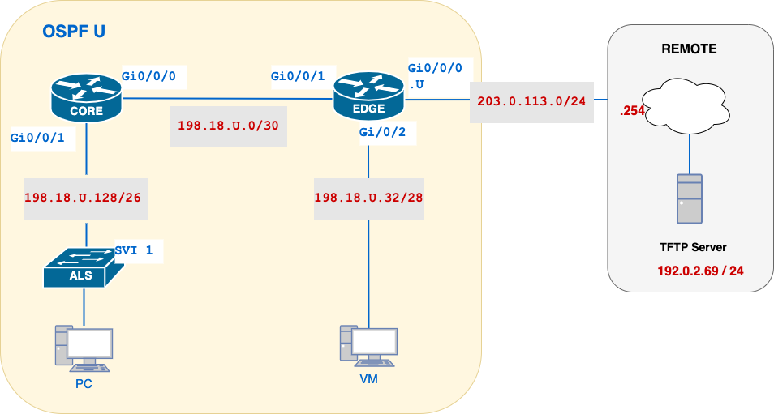

# Lab 10 – Controlling Services with Extended ACLs

## 🧭 Overview

In this lab, you will enforce service-level access controls by creating and applying an **extended named ACL** (`EXT-SERVICES`) on the EDGE router’s WAN interface. You will:

1. **POLICY-TFTP**  
   - **Deny** any TFTP (UDP 69) from the **VM subnet** (`198.18.U.32/28`) to the remote TFTP server (`203.0.113.69`)  
   - **Permit** TFTP from the **PC subnet** (`198.18.U.128/26`), **CORE** and **EDGE** to that server  
   - **Implicitly deny** everyone else  

2. **POLICY-DNS**  
   - **Deny** DNS (UDP 53) from the **PC** (`198.18.U.129`) to the DNS server (`203.0.113.53`)  
   - **Permit** DNS from all other devices in the **PC subnet** (`198.18.U.128/26`), the **VM subnet** (`198.18.U.32/28`), **CORE** and **EDGE** to that server  
   - **Implicitly deny** everyone else  

3. **POLICY-WEB**  
   - **Permit** HTTP/HTTPS (TCP 80/443) from the **PC subnet** (`198.18.U.128/26`) to the web server (`203.0.113.80`)  
   - **Implicitly deny** everyone else (including VM, CORE, EDGE)

All ACEs will be grouped into one **named extended** ACL (`EXT-SERVICES`) and applied **outbound** on the EDGE router’s `GigabitEthernet0/0/0` interface toward the remote cloud.

### ✅ Protocol Access Matrix

|    **Node**     | **TFTP (UDP 69)** |   **DNS (UDP 53)**   | **HTTP/HTTPS (TCP 80/443)** |
| :-------------: | :---------------: | :------------------: | :-------------------------: |
|  **PC subnet**  |     ✅ Allowed     | ❌ Denied (host only) |          ✅ Allowed          |
|  **VM subnet**  |     ❌ Denied      |      ✅ Allowed       |          ❌ Denied           |
| **CORE router** |     ✅ Allowed     |      ✅ Allowed       |          ❌ Denied           |
| **EDGE router** |     ✅ Allowed     |      ✅ Allowed       |          ❌ Denied           |

---
## 🎯 Learning Objectives

By completing this lab, you will learn how to:

- Define and apply **named extended ACLs** to enforce service- and protocol-specific policies.  
- Choose the correct **interface** and **direction** for placement of extended ACLs (near the source).  
- Use **port numbers** and **protocols** in ACEs to permit or deny traffic precisely.  
- Enable and interpret **ACL hit-counters** and **logging** for troubleshooting and auditing.  
- Verify service access and confirm that unwanted traffic is blocked.

---
## 💡 Why This Lab Is Important

- **Granular Control:** Extended ACLs filter on source IP, destination IP, protocol, and port—essential for enforcing least-privilege access.  
- **Network Efficiency:** By dropping disallowed traffic close to the source, you reduce unnecessary load on upstream links and remote hosts.  
- **Auditability:** Logging denied ACEs provides visibility into unauthorized service attempts, aiding security monitoring.  
- **Real-World Relevance:** Extended ACLs are widely used on Internet edge routers and firewall devices to control which services internal users can access.

---
## 🗺️ Network Topology



| **Network**           | **Subnet**      | **Notes**                                            |
| --------------------- | --------------- | ---------------------------------------------------- |
| CORE–EDGE transit     | 198.18.U.0/30   | EDGE = 198.18.U.1 ; CORE = 198.18.U.2                |
| VM subnet             | 198.18.U.32/28  | VM hosts on last usable address                      |
| PC subnet & Mgmt VLAN | 198.18.U.128/26 | PC hosts on first usable; ALS SVI on 2nd-last usable |
| Remote cloud          | 203.0.113.0/24  | GW = .254 ; TFTP = .69 ; DNS = .53 ; WEB = .80       |

---
## 📋 Addressing Table

| Device       | Interface                     | IP Address           |
| ------------ | ----------------------------- | -------------------- |
| **EDGE**     | GigabitEthernet0/0/0 (REMOTE) | 203.0.113.1/24       |
|              | GigabitEthernet0/0/1 (CORE)   | 198.18.U.1/30        |
|              | GigabitEthernet0/0/2 (VM)     | 198.18.U.33/28       |
| **CORE**     | GigabitEthernet0/0/0 (EDGE)   | 198.18.U.2/30        |
|              | GigabitEthernet0/0/1 (ALS)    | 198.18.U.129/26      |
| **ALS (SW)** | Vlan1 (Mgmt)                  | 198.18.U.190/26      |
| **PC Host**  | —                             | 198.18.U.129 (first) |
| **VM Host**  | —                             | 198.18.U.46 (last)   |
| **Remote**   | — (Gateway)                   | 203.0.113.254        |
| **TFTP SVR** | —                             | 203.0.113.69         |
| **DNS SVR**  | —                             | 203.0.113.53         |
| **WEB SVR**  | —                             | 203.0.113.80         |

---

## 🛠️ Initial Setup (Management Network & 09-Lab Config Import)

Before you import your Lab 9 configurations, you’ll set up a dedicated management network on each device and on your PC so you can TFTP your running-configs into the routers/switches. Use the network `192.168.U.0/24` (replace **U** with your lab section number).

#### 0. Prepare Your Submission File
- [ ] On your desktop, create an empty file `10-username.txt`.  
- [ ] You will populate this with your verification outputs and then TFTP it to the remote server.

#### 1. Management Network Addressing

| Node         | Interface                                 | IP Address       |
| ------------ | ----------------------------------------- | ---------------- |
| **EDGE**     | **GigabitEthernet0/0**<br/>_(rear panel)_ | 192.168.U.1 /24  |
| **CORE**     | **GigabitEthernet0/0**<br/>_(rear panel)_ | 192.168.U.2 /24  |
| **ALS (SW)** | **GigabitEthernet0/0**<br/>_(rear panel)_ | 192.168.U.3 /24  |
| **PC**       | Management NIC                            | 192.168.U.10 /24 |

> **Note:** The Gi0/0 management ports are physically located on the back of each router or switch. They are dedicated to out-of-band access and should **not** carry regular data-plane traffic.

All management interfaces and your PC connect to the same dedicated management switch (separate from your data-plane network).

On **EDGE**:
```bash
configure terminal
 interface GigabitEthernet0/0
  description MANAGEMENT NETWORK
  ip address 192.168.U.1 255.255.255.0
  no shutdown
exit
```

Configure **CORE** and **ALS** with the given IP address.

#### 2. Configure Your PC’s Management NIC
- [ ] Assign a static IP to your PC’s management interface:
    - **IP:** `192.168.U.10`
    - **Mask:** `255.255.255.0`
- [ ] Connect the PC to the management switch—no gateway is required since you’re on the same subnet.
#### 3. Verify Management Connectivity

From your PC’s terminal:

```bash
ping 192.168.U.1   # EDGE 
ping 192.168.U.2   # CORE 
ping 192.168.U.3   # ALS
```

All pings must succeed before proceeding.

### 4. Edit your saved Lab-9 configs

On your PC, open each file (`EDGE_lab9.cfg`, `CORE_lab9.cfg`, `ALS_lab9.cfg`) in a text editor and make these changes **before** uploading:


```bash
! — at the top of the file, under the hostname line —  
hostname EDGE 
+! 
+! --- Management Interface (rear panel) --- 
+interface GigabitEthernet0/0 
+ description MANAGEMENT NETWORK (rear panel) 
+ ip address 192.168.U.<1|2|3> 255.255.255.0 
+ no shutdown 
+ 
+! 
! — later in the file, where you defined ACLs — 
! for EACH standard ACL you created in Lab 9: 
-interface <INTF>        
! e.g. interface Gi0/1 
- ip access-group 10 in 
+! (remove any ip access-group lines) 
-no ip access-list standard ACL-NAME
```

- [ ] Replace `1|2|3` with `1` on EDGE, `2` on CORE, `3` on ALS.
- [ ] Remove **all** `ip access-group …` statements and the corresponding `access-list` definitions from Lab 9.
- [ ] Save your changes.

#### 5. Configure the TFTP Server

Copy your 09-Lab configs into the TFTP's root directory. `Desktop` is a good directory to use.

```bash
C:\Users\Student\Desktop\EDGE_lab9.cfg  
C:\Users\Student\Desktop\CORE_lab9.cfg
C:\Users\Student\Desktop\ALS_lab9.cfg
```
  
  Disable or create an exception in your Windows firewall for tftp64 so remote devices can connect.

#### 6. Import Lab 9 Configurations via TFTP

On each device, pull the saved running-config from your PC’s TFTP server over the management network:

**EDGE:**
```bash
copy tftp://192.168.U.10/EDGE_lab9.cfg running-config
reload
```

Use similar commands for `CORE`and `ALS`.

#### 7. Verification of Uploaded Configurations

After importing your modified Lab 9 running-configs, verify that the network baseline is correct before proceeding with Lab 10.

| **Verification Item**     | **Device**      | **Command**                                   | **Expected Result**                                                                   |
| ------------------------- | --------------- | --------------------------------------------- | ------------------------------------------------------------------------------------- |
| **1. Interfaces UP/UP**   | EDGE, CORE, ALS | `show ip interface brief`                     | All interfaces—including Gi0/0 (Mgmt), Gi0/0/1, Gi0/0/2, VLAN 1 (ALS)—show **up/up**. |
| **2. OSPF Neighbours**    | EDGE            | `show ip ospf neighbor`                       | Lists CORE neighbor in **FULL** state on the CORE–EDGE link.                          |
| **3. DR Election**        | CORE            | `show ip ospf interface GigabitEthernet0/0/0` | On the /30 transit link, **Role** = **DR**, **Neighbor Count** = 1 (EDGE).            |
| **4. Passive Interfaces** | CORE, EDGE      | `show ip protocols`                           | See _4. NOTE_                                                                         |
| **5. Router IDs**         | CORE, EDGE      | `show ip protocols`                           | See _5. NOTE_                                                                         |
| **6. OSPF Routes**        | CORE, EDGE      | `show ip routes`                              | See _6. NOTE_                                                                         |

>_**4 NOTE: Passive Interfaces_**
>Review output of `show ip protocols`
>- **CORE**: Gi0/0/1 marked **passive**
>- **EDGE**: Gi0/0/2 marked **passive**  

>**_5 NOTE: Router ID & Process ID_**
>  CORE, EDGE: **Process ID** = `U`
>- **EDGE** Router ID = `U.0.0.0`
>- **CORE** Router ID = `0.0.0.U` 

>**_6. OSPF Routes Propagated**_:
>- **CORE** learns default route `0.0.0.0/0` via OSPF from EDGE.
>- All OSPF-learned networks (PC, VM, CORE–EDGE) appear in the routing table.

**_7. End-to-End Reachability_** 
EDGE, CORE, ALS:
`ping 198.18.U.129`
`ping 198.18.U.46`
`ping 203.0.113.254`
All pings succeed, confirming PC host, VM host, and remote gateway are reachable from each device.

**8. Accessing the Devices After PC Readdressing**

Once you’ve completed **Step 7. Verification of Uploaded Configuration**, your PC will be moved into the PC subnet (`198.18.U.128/26`), so the out-of-band management network (`192.168.U.0/24`) is no longer reachable.  Use the following connections for Lab 10:

- **EDGE router:**  Connect via **console** cable from PC.  
- **CORE router:**  SSH from your PC.
- **PC host:**  Sits in the PC subnet and can reach CORE directly over the data network for TFTP or testing (no management network).

---

## 🔒 Policy #1 – Secure TFTP

### 1. Security Policy Statement

**Policy #1 – Secure TFTP Access**  
To ensure that our TFTP‐based file transfers are strictly controlled and to prevent unauthorized uploads or downloads, only hosts in the PC subnet (`198.18.U.128/26`), the CORE router (`198.18.U.2`), and the EDGE router (`203.0.113.1`) may initiate TFTP sessions (UDP port 69) to the remote TFTP server (`203.0.113.69`). All other sources—including the VM subnet (`198.18.U.32/28`)—shall be denied.

>**Note:** We’ll remove any `ip tftp source-interface` override so that routers source TFTP from their data-plane IP, matching our ACL permits.

### 2. Policy Decomposition

**Policy #1 – Secure TFTP**  
- **Deny** any TFTP (UDP 69) from the **VM subnet** (`198.18.U.32/28`) to the remote TFTP server (`203.0.113.69`).  
- **Permit** TFTP from the **PC subnet** (`198.18.U.128/26`), the **CORE router** (`198.18.U.2`), and the **EDGE router** (`203.0.113.1`).  
- **Implicitly deny** all other traffic.  

This granular approach permits _explicit_ control over each host, but you could equally accomplish “block VM, allow all others” with a simpler two-line ACL (`deny udp VM …; permit ip any any`).

| Component            | Details                                                            |
| -------------------- | ------------------------------------------------------------------ |
| **ACL Name**         | `EXT-SERVICES`                                                     |
| **ACL Type**         | Extended                                                           |
| **Match #1 (deny)**  | Source = `198.18.U.32/28`, Dest = `203.0.113.69`, UDP dst-port 69  |
| **Match #2 (permit)**| Source = `198.18.U.128/26`, Dest = `203.0.113.69`, UDP dst-port 69 |
| **Match #3 (permit)**| Source = `host 198.18.U.2` (CORE), Dest = `203.0.113.69`, UDP 69    |
| **Match #4 (permit)**| Source = `host 203.0.113.1` (EDGE), Dest = `203.0.113.69`, UDP 69   |
| **Match #5 (deny)**  | `ip any any`                                                       |
| **Logging**          | `log` on every ACE                                                 |

### 3. ACL Placement & TFTP Source Note

| Device | Interface              | Direction | Remarks                                                               |
| ------ | ---------------------- | --------- | --------------------------------------------------------------------- |
| EDGE   | `GigabitEthernet0/0/0` | `out`     | All TFTP egress to the remote server leaves via GigabitEthernet0/0/0. |

> **TFTP Source-IP:**  
> Before uploading via TFTP, ensure routers use their WAN IP as source (so ACL permits match). On both CORE and EDGE:
> ```bash
> configure terminal
>  no ip tftp source-interface
> exit
> ```
> This causes IOS to pick the egress interface IP (`203.0.113.1` on EDGE, `198.18.U.2` on CORE) as the TFTP source.

---

### 4. Configuration

```bash
EDGE# configure terminal
  ip access-list extended EXT-SERVICES
    remark 10 Deny TFTP from VM subnet
    deny   udp 198.18.U.32 0.0.0.15 host 203.0.113.69 eq 69 log

    remark 20 Permit TFTP from PC subnet
    permit udp 198.18.U.128 0.0.0.63 host 203.0.113.69 eq 69 log

    remark 30 Permit TFTP from CORE router
    permit udp host 198.18.U.2 host 203.0.113.69 eq 69 log

    remark 40 Permit TFTP from EDGE router
    permit udp host 203.0.113.1 host 203.0.113.69 eq 69 log

    remark 50 Deny all other IP traffic
    deny   ip any any log
  exit

EDGE# interface GigabitEthernet0/0/0
  ip access-group EXT-SERVICES out
  logging access-list
  exit
EDGE# end
```

### 5. Verification and Testing

1. **Clear counters**
	```bash
	EDGE# clear access-list counters EXT-SERVICES
    ```
    
2. **Test TFTP from each node**

| **Source**  | **Command**                  | **Expected Result** |
| ----------- | ---------------------------- | ------------------- |
| PC host     | Upload `10-username.txt`     | ✅ Succeeds          |
| VM host     | Upload `username.txt`        | ❌ Fails             |
| CORE router | `copy run tftp://192.0.2.69` | ✅ Succeeds          |
| EDGE router | `copy run tftp://192.0.2.69` | ✅ Succeeds          |
Ensure that both 10-username.txt and username.txt contain data.

3. **Validate ACL hit-counters**

    ```bash
    EDGE# show access-lists EXT-SERVICES
    ```
    
    - Line 10 (deny VM) should have ≥1 match.        
    - Lines 20/30/40 (permits) should each have 1 match.
    - Line 50 (deny any) should have 0 or minimal hits.
        
4. **Check syslog entries**
    
    ```bash
    EDGE# show logging | include EXT-SERVICES
    ```
    
    - [ ] Look for `%IPACCESSLOGD` for the VM deny and `%IPACCESSLOGP` for each permit.

Once you’ve confirmed Policy #1 works, proceed to define and test Policy #2 (DNS) and Policy #3 (Web) using the same structure.

---
## 🔒 Policy #2 – Secure DNS

### 1. Security Policy Statement

**Policy #2 – Secure DNS Access**  
To maintain strict control over name resolution traffic and prevent unauthorized lookups, only hosts in the VM subnet (`198.18.U.32/28`), the CORE router (`198.18.U.2`), and the EDGE router (`203.0.113.1`) may initiate DNS queries (UDP port 53) to the remote DNS server (`203.0.113.53`). All other sources—including the single PC host (`198.18.U.129`) and any remaining networks—shall be denied.

### 2. Policy Decomposition (fill in the details)

**Policy #2 – Secure DNS**  
- **Deny** DNS queries (UDP 53) from the **PC host** (`198.18.U.129`) to the remote DNS server (`203.0.113.53`).  
- **Permit** DNS queries from the **VM subnet** (`198.18.U.32/28`), the **CORE router** (`198.18.U.2`) and the **EDGE router** (`203.0.113.1`).  
- **Implicitly deny** all other DNS or non-DNS traffic.

| Component             | Details                                          |
| --------------------- | ------------------------------------------------ |
| **ACL Name**          |                                                  |
| **ACL Type**          |                                                  |
| **Match #1 (deny)**   | Source = … , Dest = 192.0.2.53 , UDP dst-port 53 |
| **Match #2 (permit)** | Source = … , Dest = 192.0.2.53 , UDP dst-port 53 |
| **Match #3 (permit)** | Source = … , Dest = 192.0.2.53 , UDP dst-port 53 |
| **Match #4 (permit)** | Source = … , Dest = 192.0.2.53 , UDP dst-port 53 |
| **Match #5 (deny)**   | ip any any                                       |
| **Logging**           | log on every ACE                                 |

*(Hints: #1 = PC host; #2 = VM subnet; #3 = CORE router; #4 = EDGE router)*

### 3. ACL Placement

| Device | Interface            | Direction | Reason                                                             |
| ------ | -------------------- | --------- | ------------------------------------------------------------------ |
| EDGE   | GigabitEthernet0/0/0 | out       | All DNS egress to the remote cloud leaves via GigabitEthernet0/0/0 |

### 4. Configuration

> _[Translate your decomposition and placement into IOS commands to create `EXT-SERVICES`, apply it to the switch’s SVI and VTY lines, and enable logging as required.]_

### 5. Verification and Testing

#### 🛠️ DNS Server Details

The remote DNS server (`192.0.2.53`) is authoritative for the `cnap.cst` zone and hosts the following records:

| **Hostname**    | **IPv4 Address** | **Description**                    |
| --------------- | ---------------- | ---------------------------------- |
| `www.cnap.cst`  | `192.0.2.80`     | Web server for the cnap.cst domain |
| `ns.cnap.cst`   | `192.0.2.53`     | DNS master server                  |
| `tftp.cnap.cst` | `192.0.2.69`     | TFTP server                        |

> **Note:**  
> - You’ll use these names when testing DNS resolution (e.g. `ping www.cnap.cst`).  
> - The DNS server itself is at `192.0.2.53`, but all zone records reside on `ns.cnap.cst`.

### 🛠️ Preparation for DNS Resolution Tests on CORE & EDGE

Before you test Policy #2, you need to enable IOS DNS lookups so that you can `ping` a hostname (e.g. `www.example.com`). This involves two pieces:

1. **Enabling `ip domain-lookup`**  
2. **Pointing your router at the DNS server** (`192.0.2.53`)

#### How `ip domain-lookup` Works

- **When enabled** (the IOS default), any word you type that isn’t recognized as a command is treated as a hostname.  
  ```bash
  EDGE# inetrface GigabitEthernet0/0
  Transalating "inetrface"... domain server (192.0.2.53)
  % Unknown host
```

- You’ll see a “Translating…” delay while IOS sends DNS queries.
- After timing out (or receiving NXDOMAIN), IOS returns `% Unknown host` or `% Unrecognized command or computer name...`.
- **When disabled** with `no ip domain-lookup`, mistyped commands are rejected **immediately**:
    
    ```bash
    EDGE(config)# no ip domain-lookup 
    EDGE(config)# inetrface GigabitEthernet0/0 % 
    Unknown command 
    ```
    
    - **No** “Translating…” pause—instant feedback on typos.

> **Lab Note:** We want DNS lookups **enabled** for Policy #2 testing, but in general labs, you might disable lookups to speed up command‐typing feedback.

#### Configuration on CORE & EDGE

```bash
CORE/EDGE# configure terminal   
ip domain-lookup   
ip name-server 192.0.2.53 
exit
```

- **`ip domain-lookup`** turns on DNS resolution of “unknown” words.    
- **`ip name-server 192.0.2.53`** tells the router which DNS server to query.

#### Verifying DNS Resolution

Once configured, test by pinging a well-known hostname:

```bash
# ping www.cnap.cst 
```

- **Expected:** Replies from the resolved IP address (e.g. `93.184.216.34`)    
- If you see `% Unknown host` immediately, check that you **did not** disable `ip domain-lookup`.
- If you see “Translating…” then `% Unknown host` after a delay, verify your `ip name-server` is reachable and correct.

With DNS resolution active on CORE & EDGE, you’re ready to verify Policy #2 (Secure DNS Access).

| **Source**  | **Test Command**           | **Expected Result** |
| ----------- | -------------------------- | ------------------- |
| PC host     | `PC# nslookup ns.cnap.cst` | ❌ Denied            |
| VM host     | `VM# nslookup ns.cnap.cst` | ✅ Allowed           |
| CORE router | `CORE# ping ns.cnap.cst`   | ✅ Allowed           |
| EDGE router | `EDGE# ping ns.cnap.cst`   | ✅ Allowed           |
   
1. **Run the four tests above.**
    
2. **Show hit-counters**

    ```bash
    EDGE# show access-lists EXT-SERVICES
    ```
    
    - Line 10 (deny PC) should have at least 1 match.
    - Lines 20/30/40 (permits) should each have at least 1 match.
        
3. **Check syslog**
    
    ```bash
    EDGE# show logging | include EXT-SERVICES
    ```
    
    - [ ] Look for `%IPACCESSLOGD` on the PC deny and `%IPACCESSLOGP` on each permit

---

## 🔒 Policy #3 – Secure Web Access

### 1. Security Policy Statement

**Policy #3 – Secure Web Access**  
To enforce least-privilege access to our web services, only hosts in the PC subnet (`198.18.U.128/26`) may initiate HTTP (TCP port 80) or HTTPS (TCP port 443) sessions to the remote web server (`203.0.113.80`). All other sources—including the VM subnet (`198.18.U.32/28`), CORE router (`198.18.U.2`) and EDGE router (`203.0.113.1`)—shall be denied.  

### 2. Policy Decomposition

| Component    | Details                                                         |
| ------------ | --------------------------------------------------------------- |
| **ACL Name** | `EXT-SERVICES`                                                  |
| **ACL Type** | Extended                                                        |
| **Match #1** | Permit TCP from `198.18.U.128/26` to host `203.0.113.80` eq 80  |
| **Match #2** | Permit TCP from `198.18.U.128/26` to host `203.0.113.80` eq 443 |
| **Match #3** | Deny IP any any (implicit deny would apply, but we’ll log it)   |
| **Logging**  | `log` on every ACE                                              |

### 3. ACL Placement

| Device | Interface              | Direction | Reason                                                                       |
| ------ | ---------------------- | --------- | ---------------------------------------------------------------------------- |
| EDGE   | `GigabitEthernet0/0/0` | `out`     | All web-service traffic to the remote server leaves via GigabitEthernet0/0/0 |

### 4. Configuration

> _[Translate your decomposition and placement into IOS commands to create `EXT-SERVICES`, apply it to the switch’s SVI and VTY lines, and enable logging as required.]_


### 5. Verification and Testing

| **Source**      | **Test Command**             | **Expected Result**            |
| --------------- | ---------------------------- | ------------------------------ |
| **PC host**     | `curl http://192.0.2.80`     | ✅ HTTP page content            |
| **PC host**     | `curl -k https://192.0.2.80` | ✅ HTTPS page content           |
| **VM host**     | `curl http://192.0.2.80`     | ❌ Connection refused           |
| **CORE router** | `telnet 192.0.2.80 80`       | ❌ Connection timed out/refused |
| **EDGE router** | `telnet 192.0.2.80 80`       | ❌ Connection timed out/refused |
    
1. **Run each test** from PC, VM, CORE and EDGE.
    
2. **Show hit-counters**
    
	```bash
	EDGE# show access-lists EXT-SERVICES
	```
    
    - Lines 10/20 (permits) should each have 1 match.    
    - Line 30 (deny any) should have 2 matches from CORE and EDGE tests (and VM, if HTTP fails).
        
3. **Check syslog**
    
    ```bash
    EDGE# show logging | include EXT-SERVICES
    ```

    - [ ] Confirm `%IPACCESSLOGP` for PC permits and `%IPACCESSLOGD` for other denies.    


---
## 🔍  CO1 – Verification and Collection of Information


In your `10-<username>.txt`, include **all** of the following:

1. **Clear counters**
```bash
	EDGE# clear access-list counters EXT-SERVICES
```

>**NOTE:**
>If you are not going to re-run the testing commands, do not clear the counters to ensure there are _hits_ in each ACE

2. Policy-Specific Test Outputs

**Policy #1 (TFTP)**

| **Source**  | **Command**                  | **Expected Result** |
| ----------- | ---------------------------- | ------------------- |
| PC host     | Upload `10-username.txt`     | ✅ Succeeds          |
| VM host     | Upload `username.txt`        | ❌ Fails             |
| CORE router | `copy run tftp://192.0.2.69` | ✅ Succeeds          |
| EDGE router | `copy run tftp://192.0.2.69` | ✅ Succeeds          |
> You won't be able to copy anything for the uploads from PC and VM, but ensure there are _hits_ on those ACEs

**Policy #2 (DNS)**

| **Source**  | **Test Command**           | **Expected Result** |
| ----------- | -------------------------- | ------------------- |
| PC host     | `PC# nslookup ns.cnap.cst` | ❌ Denied            |
| VM host     | `VM# nslookup ns.cnap.cst` | ✅ Allowed           |
| CORE router | `CORE# ping ns.cnap.cst`   | ✅ Allowed           |
| EDGE router | `EDGE# ping ns.cnap.cst`   | ✅ Allowed           |

**Policy #3 (Web)**

| **Source**      | **Test Command**             | **Expected Result**            |
| --------------- | ---------------------------- | ------------------------------ |
| **PC host**     | `curl http://192.0.2.80`     | ✅ HTTP page content            |
| **PC host**     | `curl -k https://192.0.2.80` | ✅ HTTPS page content           |
| **VM host**     | `curl http://192.0.2.80`     | ❌ Connection refused           |
| **CORE router** | `telnet 192.0.2.80 80`       | ❌ Connection timed out/refused |
| **EDGE router** | `telnet 192.0.2.80 80`       | ❌ Connection timed out/refused |

3. **ACL Hit-Counters**  
```bash
   show ip access-lists EXT-SERVICES
```
(This lists each ACE and its match count for all three policies.)

4. **ACL Binding**

```bash
show ip interface GigabitEthernet0/0/0 | include EXT-SERVICES
```
(Confirms EXT-SERVICES is applied outbound on GigabitEthernet0/0/0 toward 192.0.2.0/24.)

5. **Syslog Entries**

```bash
show logging | include EXT-SERVICES
```
(Sample %IPACCESSLOGP and %IPACCESSLOGD lines for each policy.)


>**Note:** Replace username with your actual username. Be sure to capture the full command output (device prompt, command, and all resulting lines) so we can see both the success/failure of the test and the ACL counters incrementing appropriately.


✅ **What to Include:**

| Requirement            | Details                                                                                                                             |
| ---------------------- | ----------------------------------------------------------------------------------------------------------------------------------- |
| 🖥️ Device prompt      | Include device name and command (e.g., `EDGE# show access-lists EXT-SERVICES`)                                                      |
| 📜 Full command output | Capture the entire ACL with hit counts, the interface binding (GigabitEthernet0/0/0 outbound), and logging configuration            |
| 🔍 ACL name & binding  | Verify the ACL name (`EXT-SERVICES`), that it’s applied outbound on `GigabitEthernet0/0/0` toward 192.0.2.0/24                      |
| 📊 Hit counts          | Ensure the **deny** and **permit** entries for TFTP (`192.0.2.69`), DNS (`192.0.2.53`), and Web (`192.0.2.80`) show correct matches |
| 🗒️ Comment            | Add a confirmation line, e.g.: `!-- EXT-SERVICES bound to GigabitEthernet0/0/0; all ACEs have expected hit counts.`                 |


---

## 📤 Submission Checklist

- [ ] `10-username.txt` uploaded via TFTP.  
- [ ] CO1 outputs included.  
- [ ] Upload updated configs to the TFTP server.
- [ ] Verify with:
```bash
ssh cisco@192.0.2.69
ls -l /var/tftp/*username*
```


