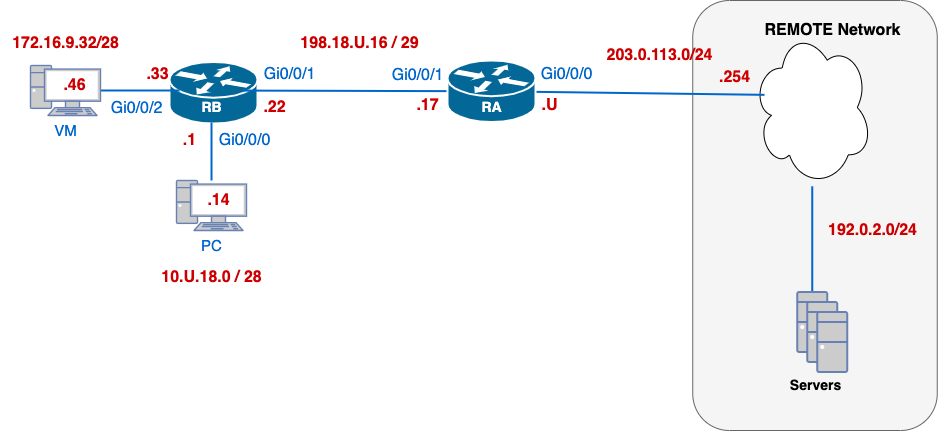

# Lab 11: Public-to-Private Address Translation Techniques


## 🧭 Overview

In this lab, you will deepen your understanding of IPv4 Network Address Translation (NAT) by configuring a single border router to translate traffic between private internal networks and the public Internet. You’ll work through three essential NAT scenarios:

1. **Port Address Translation (PAT)** on the router’s outside interface, allowing multiple inside hosts to share one public IP.
2. **Static port-forwarding**, mapping a specific TCP port on the public address to an internal server.
3. **Dynamic PAT using an address pool**, enabling inside hosts to translate to a small range of public IPs.

This hands-on exercise builds critical skills in conserving IPv4 address space and providing controlled inbound access—practical expertise for any enterprise network engineer.

---

## 🎯 Learning Objectives

By the end of this lab, you will be able to:

- **Prepare interfaces for NAT** by assigning `ip nat inside` and `ip nat outside` on the correct router ports.
- **Create standard access-lists** to identify traffic for translation.
- **Define and apply a PAT overload** on the router’s public interface so multiple hosts share one IP.
- **Configure static port-forwarding** to permit inbound TCP connections on a specified public port.
- **Set up dynamic PAT with a pool** of public addresses for inside hosts.
- **Verify and troubleshoot NAT** using `show ip nat translations`, `show access-lists`, and end-to-end connectivity tests.
- **Document your work** by capturing configurations and command outputs for submission.
    
---

## 💡 Why This Lab Is Important

Network Address Translation (NAT) is a foundational technique in IPv4 networks, allowing organizations to:

- **Conserve scarce IPv4 addresses** by enabling multiple internal hosts to share a single public IP (PAT) or a small pool of addresses (dynamic PAT).
- **Control and secure inbound access** through static port-forwarding, exposing only necessary services to the Internet while keeping internal networks hidden.
- **Maintain address consistency** when renumbering or merging networks, since internal addressing can remain unchanged behind a NAT boundary.
    
By mastering PAT, static port-forwarding, and dynamic NAT pools, you’ll gain practical skills that are essential for designing, operating, and troubleshooting real-world enterprise networks under IPv4 constraints.

---

## 🗺️ Network Topology



## 📘  Addressing Table (IPv4)

Use the table below to configure your devices. Replace `U` with your assigned student ID number.

| Device             | Interface | IP Address (CIDR)  | Description                                 |
| ------------------ | --------- | ------------------ | ------------------------------------------- |
| **RA**             | Gi0/0/0   | `203.0.113.U/24`   | Outside interface to Internet               |
| **RA**             | Gi0/0/1   | `198.18.U.17/29`   | Inside interface, OSPF neighbor to RB       |
| **RB**             | Gi0/0/0   | `10.U.18.1/28`     | Inside gateway for dynamic NAT pool hosts   |
| **RB**             | Gi0/0/1   | `198.18.U.22/29`   | OSPF neighbour to RA                        |
| **RB**             | Gi0/0/2   | `172.16.9.33/28`   | Host receiving static port‐forward (Telnet) |
| **RB**             | LoU       | `192.168.U.1/24`   | Private network                             |
| **VM (PAT host)**  | Gi0/0/2   | `172.16.9.46/28`   | Inside host for PAT translation tests       |
| **PC (Pool host)** | Gi0/0/0   | `10.U.18.14/28`    | Inside host for dynamic NAT pool tests      |
| **Remote**         | —         | `203.0.113.254/24` | External tester for Internet connectivity   |

> 💡 **VM Network**  
> All students use **172.16.9.32/28** for their VM subnet.  
> Assign your VM **172.16.9.46/28**, identical across students, to illustrate how private networks overlap behind NAT.


---
## Partner Collaboration

You will need a partner for connectivity testing. If you don’t find a partner, ask your lab instructor to telnet into your RB.

- [ ]  You will each configure your own devices but work together to test connectivity. The topology diagram shows **only your own** devices; your partner will have the same topology on their end.
- [ ]  You need **one PC** and **one VM** each for testing.
- [ ] If you finish early, help your partner, but do **not** touch their keyboard.
- [ ] If your partner runs into a problem, guide them through troubleshooting. You **both** need full end-to-end connectivity for full marks.

---

## 🛠️ Initial Setup

### 0. Create submission file
- [ ]  On your desktop, create **three** files:
	- [ ] `11-OSPF-username.txt`
	- [ ] `11-NAT-username.txt`
	- [ ] `11-ACL-username.txt`
- [ ] You will later copy these files to the REMOTE TFTP server as proof of completion.
### 1. Basic Configuration
- [ ] Use the provided base configuration file: [basic.cfg](../Resources/basic.cfg)
- [ ] Enable real-time debug output display on all routers.
### 2. Addressing Configuration
- [ ] Configure addresses according to the topology diagram, paying attention to the network masks.
- [ ] Add a description to all Cisco interfaces.
- [ ] Ensure all interfaces are UP/UP before continuing.

---

## OSPF Configuration

- [ ] **Process ID**: Use `U` as the OSPF process number.
- [ ] **Router-IDs**: Manually set each router’s ID under OSPF:
	- [ ] `RA`:  `U.0.0.17`
	- [ ] `RB`: `U.0.0.22`
- [ ] **Default Gateway Advertisement**: On **EDGE**, redistribute or originate a default route so that `0.0.0.0/0` is known across the OSPF domain
- [ ] **CORE–EDGE DR Election**: **EDGE** should _not_ participate in the DR election.
- [ ] Configure explicitly all interfaces **not directly connected to an OSPF neighbour** as passive.
	- [ ] [-1 Point] deduction if using the `network` command.
- [ ] Set the OSPF **reference bandwidth** to `10000 Mbps`.
- [ ] Ensure all loopback interfaces report the **configured mask**, not a default host mask.
- [ ] On the `198.18.U.16/29` network, configure OSPF for **fast convergence** by setting:
	  - [ ] `Hello` interval: 3 seconds
	  - [ ] `Dead` interval: 5 seconds

## 🔍 CO1 - Verification and Collection of Information

📝 In your `11-OSPF-username.txt` file, create a section labelled:

```diff
=== CO1 – OSPF Verification ===
```

From **RA** and **RB**:
```bash
show ip protocols
show ip ospf interface brief
show ip ospf
show ip ospf neighbor
show ip ospf interface GigabitEthernet0/0/1
show ip route ospf | begin Gateway
```

✅ **What to Include:**

| ✅ Requirement                | Description                                                                      |
| ---------------------------- | -------------------------------------------------------------------------------- |
| 🖥️ Device Prompt & Commands | Include the device name and command for both commands                            |
| 📜 Full Output               | Copy **complete output** from both commands                                      |
| 👥 Neighbour Check           | Confirm **RA** has formed adjacencies with **RB**<br>**RB** is the **DR** router |
| 📌 Route Check               | Confirm that the OSPF routes                                                     |
| OSPF Interfaces              | Confirm **passive** interfaces<br>Confirm loopback mask                          |
| ⏱️ Timer Validation          | Confirm that **Hello = 3**, **Dead = 5** on `Gi0/0/1`                            |
| 🗒️ Comment                  | Add a verification note, e.g.:                                                   |
|                              | `!-- OSPF configuration check as per specs`                                      |


---

## <span style="color: red; font-weight: bold;">NEW</span> Services Configuration

### PC Service Configuration

On your PC (using TFTP64):

1. Launch **TFTP64** and open the **Settings** menu.
2. Enable the **TFTP** service and the **Syslog** service.
3. Set the **Base Directory** (or “Home Directory”) to your **Desktop** so that any transferred files and log files are easy to locate.

### Routers Configuration

On **both** RA and RB, enter global configuration mode and apply the following:

```bash
! 1. Set a NTP Master in RA
ntp master 5

! 2. Synchronize time via NTP in RB
ntp server 203.0.113.U

! Point syslog to the PC
3. logging host 10.U.18.14 transport udp port 514

! Specify which source interface’s IP shows up on the syslog messages
logging source-interface GigabitEthernet0/0/0

! OPTIONAL Send syslog messages to your PC’s Syslog server
logging trap informational
! (Optionally adjust trap level: debug, informational, warnings, errors, etc.)

! (Optional) Include timestamps in the log messages
service timestamps log datetime msec localtime
```

- **`ntp master 5`** sets the RA as a master of stratum 5.
- **`ntp server 203.0.113.U`** ensures your router clocks are synchronized with the remote time source.
- **`logging trap informational`** sets the minimum severity level of messages sent to your
- **`logging source-interface`** picks the outbound interface whose IP is used as the syslog source address.
- **`logging host … transport udp port 514`** directs syslog packets to your PC on the standard syslog port.
- **`service timestamps`** adds human‐readable timestamps to each log entry.

On **RA**, enable the built-in HTTP and HTTPS web interface for management:

```bash
! Enable the HTTP server (clear-text)
ip http server
ip http authentication local

! Enable the HTTPS (secure) server
ip http secure-server
```

- `ip http server` turns on the HTTP daemon.
- `ip http secure-server` turns on the HTTPS daemon (uses TLS).
- `ip http authentication local` tells the router to check the local username database for web logins.


### 🔍 CO2 – Verification and Collection of Information

📝 In your `11-OSPF-<username>.txt` file, create four sections labelled:

```diff
=== CO2 – Services Verification ===
```

**Testing Preparation:**
1. **Console into RA** (your workstation) and  `ssh` into RB.
2. From your PC browser, open an HTTPS session to RA and log in with your credentials.

Copy the output of the commands listed:

```bash
!-- From RA
show ssh
show ip http server status
show running-config | section logging
show logging
show clock

!-- From RB
show ip ssh
show users
show tcp brief
show ntp status
show ntp associations detail

```

✅ **What to Include:**

| Requirement             | Details                                                                                           |
| ----------------------- | ------------------------------------------------------------------------------------------------- |
| 🖥️ Device prompt       | Include device name and command, e.g., `ayalac-RA# show ip ssh`                                   |
| 📜 Full command output  | Show the entire output of each command                                                            |
| 🔍 SSH status           | Verify `SSH Enabled - version 2.0`                                                                |
| 🔍 Active session       | In `show users`, confirm an active SSH session listed on RA                                       |
| 🔍 Test syslog entry    | Confirm syslog messages appears in PC’s Syslog window                                             |
| 🔍 HTTP status          | Confirm `HTTP server status: Enable`<br>Confirm `HTTP Secure server status: Enabled` (or similar) |
| 🔍 Active HTTPS session | In `show tcp brief                                                                                |
| 🗒️ Comment             | e.g., `!-- Services configured and verified.`                                                     |

📘 **Sample Output Block** (partial):

```bash

!-- HTTPS session active; web management reachable.

ayalac-RA# show ip http server status
HTTP server status: Enabled

ayalac-RA# show ip http secure-server status
HTTP secure server status: Enabled

ayalac-RA# show tcp brief | include 443  
TCB       Local Address          Foreign Address        (state)
0x123456  198.18.U.17.443        10.U.18.14.51514       ESTAB

ayalac-RA# show users
    Line       User       Host(s)              Idle       Location
  *  0 vty 0  ssh     idle                 00:01:23  10.U.18.14 
  *  0 vty 1  http    idle                 00:00:10  10.U.18.14

!-- Syslog test message received at PC; RA logging config verified.

ayalac-RA# show logging
Syslog logging: enabled (console, host 10.U.18.14)
    Facility: daemon, Level: informational
  Timestamp logging: msec localtime
    No active filter modules.
  Console logging: disabled
    Buffer logging: level debugging, 50 messages logged
    Host 10.U.18.14:514, 10 messages dropped, 0 rate-limited


!-- NTP synchronized to 203.0.113.254; clock verified.

ayalac-RA# show ntp status
Clock is synchronized, stratum 2, reference is 203.0.113.254
nominal frequency is 250.0000 Hz, precision is 2**18
reference time is D4ED:86B3:8D3F.C000 (04:15:51.763 UTC Tue Jul 15 2025)

RA# show ntp associations detail

  address         ref clock       st  when  poll  reach  delay  offset    disp    jitter
=================================================================================
*~203.0.113.254   .REFCLK.        1   15    64    377   0.023   -0.001    0.040     0.005

associd=17 status=0124, leap_none, sync_ntp, auth_disable, port_ok
version=4, remote=203.0.113.254, local=198.18.U.17
delay=0.023, offset=-0.001, dispersion=0.040, jitter=0.005

```


### 📤 Submit Verification File

- [ ] Submit `11-OSPF-username.txt` to the TFTP server.
- [ ] Include all `CO` sections:  CO1-CO2
- [ ] Upload the syslog file to the TFTP server; label this file as `11-OSPF-SYSLOG-username.txt`
- [ ] Upload router configurations to the PC's TFTP server.

---

## NAT Rule #1: Translate to the Public Address of the Exit Interface

**Hosts in the VM Network 172.16.9.32/28 must share RA’s public IP when accessing the Internet.**

1. **Identify the NAT device**
    - Device: **RA** (the border router with the public‐facing interface)
2. **Set inside/outside interfaces**
    ```bash
    ! On RA
	interface GigabitEthernet0/0/1
	  ip nat inside
	interface GigabitEthernet0/0/0
	  ip nat outside
    ```
    
3. **Create a standard ACL (16) to match the inside network**
	```bash
	access-list 16 permit 172.16.9.32 0.0.0.15
	```
    
4. **Enable PAT to the exit interface’s public IP**
    ```bash
    ip nat inside source list 16 interface GigabitEthernet0/0/0 overload
    ```

	Command explanation:
	- **`ip nat inside source`**  
	    Specifies that we’re translating source addresses of packets coming from the **inside** network.
	- **`list 16`**  
	    Uses the **standard ACL 16** to identify which source addresses to translate (in our case, every host in `172.16.9.32/28`).
	- **`interface GigabitEthernet0/0/0`**  
	    Tells the router to use the IP address assigned to **Gi0/0/0** (the outside/public interface) as the translated address.
	- **`overload`**  
	    Enables **Port Address Translation (PAT)**, which lets **all** matched inside hosts share that single public IP by mapping their source port numbers.
	    Put simply, this one line says:

> For any packet sourced from `172.16.9.32/28`, translate its private source IP to the public IP on Gi0/0/0; and because of `overload`, allow many private hosts to reuse that one public IP by differentiating them via port numbers.

### Testing NAT with DNS and ICMP

1. **Set VM's DNS server** to 192.0.2.53 in your network settings.
2. **Enable NAT debugging** on RA
	```bash
	!-- This command is not showing the expected results on the routers
	RA# debug ip nat [ACCESS_LIST]
	```
3. From VM: **Perform a DNS lookup**
	```bash
	VM# nslookup www.cnap.cst
	Server:         192.0.2.53
	Address:        192.0.2.53#53

	Non-authoritative answer:
	Name:   www.cnap.cst
	Address: 192.0.2.80
	```
4. From VM: **Perform a ping to www.cnap.cst**
5. **Inspect the NAT translation table**
	```bash
	RA# show ip nat translations
	```
	
!-- Sample Output
	<table border="1" cellpadding="4" cellspacing="0">
  <thead>
    <tr>
      <th>Pro</th>
      <th>Inside Global</th>
      <th>Inside Local</th>
      <th>Outside Local</th>
      <th>Outside Global</th>
    </tr>
  </thead>
  <tbody>
    <tr>
      <td>UDP</td>
      <td>203.0.113.17:52345</td>
      <td>172.16.9.46:52345</td>
      <td>192.0.2.53:53</td>
      <td>192.0.2.53:53</td>
    </tr>
    <tr>
      <td>ICMP</td>
      <td>203.0.113.17:1</td>
      <td>172.16.9.46:1</td>
      <td>192.0.2.80:0</td>
      <td>192.0.2.80:0</td>
    </tr>
  </tbody>
</table>

6. **Verify ACL and statistics**
```bash
RA# show access-lists 16
RA# show ip nat statistics
```
- **ACL 16** should report ≥ 2 hits.
- **Total active translations** should be ≥ 2.

7. **Disable debugging**
Before you disable debugging, you should see console messages for each translation event. Here’s an example of what two packets look like in the debug output (timestamps illustrative):

```bash
!-- Expected results not showing in the routers
*Mar 19 14:05:01.123: NAT: s=172.16.9.46(52345) d=192.0.2.53(53) proto=UDP translate src to 203.0.113.17(52345) 
*Mar 19 14:05:02.456: NAT: s=172.16.9.46(icmptype:8 icmpid:0) d=192.0.2.80(icmptype:8 icmpid:0) proto=ICMP translate src to 203.0.113.17(1)
```

- The **first line** shows the VM’s DNS query (UDP/53) being translated: source 172.16.9.46:52345 becomes 203.0.113.17:52345.
- The **second line** shows the ICMP echo (ping): ICMP type 8/id 0 from 172.16.9.46 is translated to ICMP type 8/id 1 on 203.0.113.17.

Once you’ve observed these messages, you can turn off debugging:

```bash
RA# undebug all
```

### 🔍 CO3 – Verification and Collection of Information

📝 In your `11-NAT-<username>.txt` file, create a section labelled:


```diff
=== CO3 – PAT to Exit Interface Verification ===
```

Under this header, perform the following steps and include the outputs as described.


| Step                                       | Command(s)                                                                           | What to Include                                                                                                         |
| ------------------------------------------ | ------------------------------------------------------------------------------------ | ----------------------------------------------------------------------------------------------------------------------- |
| **1. Enable NAT debug & generate traffic** | <br>`debug ip nat`<br>`ping 192.0.2.80 source 172.16.9.46 repeat 2`<br>`undebug all` | - **Two** debug lines showing translation of the ICMP echo-request and echo-reply  <br>- Example timestamps and details |
| **2. Show NAT translations**               | `show ip nat translations`                                                           | - Full translation table, showing an entry for ICMP from `172.16.9.46` → `203.0.113.U` to `192.0.2.80`                  |
| **3. Verify ACL hits**                     | `show ip access-lists 16`                                                            | - The ACL 16 permit statement  <br>- Hit count ≥ 1 indicating the subnet was matched                                    |
| **4. Show NAT statistics**                 | `show ip nat statistics`                                                             | - Total active translations ≥ 1  <br>- Hits/Misses summary for inside source translations                               |

#### 📘 Sample Output Block

```bash
=== CO3 – PAT to Exit Interface Verification ===
!-- PAT to exit interface functioning; ICMP translations and ACL verified.

!-- Not working 
*Mar 19 14:05:01.123: NAT: s=172.16.9.46(0) d=192.0.2.80(0) proto=ICMP translate src to 203.0.113.17(1)
*Mar 19 14:05:01.456: NAT: s=192.0.2.80(0) d=203.0.113.17(1) proto=ICMP translate dst to 172.16.9.46(1)

ayalac-RA# show ip nat translations
Pro  Inside global        Inside local         Outside local       Outside global
ICMP 203.0.113.17:1       172.16.9.46:1        192.0.2.80:0         192.0.2.80:0

ayalac-RA# show ip access-lists 16
Standard IP access list 16
    permit 172.16.9.32 0.0.0.15 (hit count: 2)

ayalac-RA# show ip nat statistics
Total active translations: 1 (0 static, 0 extended)
Outside interfaces: 1
  GigabitEthernet0/0/0
Hits: 2  Misses: 0

```


---

## NAT Rule #2: Static Port‐Forwarding

**“Allow Internet users to Telnet to our internal RB at 172.16.9.33:23 via RA’s public IP on TCP 2323.”**

- [ ] Code a **port-forwarding** rule so that external hosts can connect to the telnet server on the RB. 
    ```
    ip nat inside source static <tcp/udp> <in_addr port> <out_add port>
    ```
    - [ ] Telnet is a TCP protocol
    - [ ] Internally, the RB telnet server is at `172.16.9.33` port `23`.
    - [ ] Outside hosts should connect to `203.0.113.U` port `2323`.

**Testing:**
- [ ] From PC, telnet to your partner's router `203.0.113.P` and login.  Keep the connection open, 
- [ ] From PC, telnet to your partner's RB `203.0.113.P 2323` and login.  Keep the connection open. 
- [ ] From your partner PC, telnet to your router `203.0.113.U` and login.  Keep the connection open
- [ ] From your partner PC, telnet to your RB ``203.0.113.U 2323` and login.  Keep the connection open.

> `P`:  Your partner's `U`
> You are testing your partner's configuration.  They are testing your configuration.

### 🔍 CO4 – Port-Forwarding Verification

📝 In your `11-NAT-<username>.txt` file, under the label:

```diff
=== CO4 – Static Port Forwarding Verification ===
```

Copy and paste the outputs (including device prompts) of the following commands from **RA** / **RB**, then add your confirmation comment below the header:

| Requirement                | Details                                                                                                                               |
| -------------------------- | ------------------------------------------------------------------------------------------------------------------------------------- |
| 🖥️ NAT translations       | `RA:  show ip nat translations`  <br>Confirm a static entry mapping `203.0.113.U:2323` → `172.16.9.33:23`                             |
| 🖥️ TCP listener check     | `RB: show tcp brief`  <br>Ensure there is a LISTEN or ESTAB on local port 2323                                                        |
| 🖥️ Active Telnet sessions | `RB: show users`  <br>Confirm at least one `vty` line with protocol `telnet` from your PC or partner’s PC to RA and to the RB is open |

✅ **What to Include:**

| Requirement                 | Details                                                                                                                    |
| --------------------------- | -------------------------------------------------------------------------------------------------------------------------- |
| 🖥️ Device prompt & command | Include device name and exact command,                                                                                     |
| 📜 Full command output      | Capture the entire output of each command without truncation                                                               |
| 🔍 NAT translation entry    | In `show ip nat translations`, confirm a static entry mapping `220.0.0.U:2323` → `172.16.9.33:23`                          |
| 🔍 TCP listener             | In `show tcp brief` ensure there is a `LISTEN` (or `ESTAB`) on local port 2323 on RA                                       |
| 🔍 Active Telnet sessions   | In `show users`, confirm at least one `vty` line with protocol `telnet` from your PC (or partner’s PC) to RA and to the RB |
| 🗒️ Comment                 | e.g., `!-- Static port-forward for Telnet to 172.16.9.33:23 verified; TCP listener, and sessions confirmed.`               |

#### 📘 Sample Output Block

```bash
=== CO4 – Port-Forwarding Verification ===
!-- Static port-forward for Telnet to 172.16.9.33:23 verified; TCP listener and sessions present.

ayalac-RB# show ip nat translations
Pro Inside global          Inside local         Outside local        Outside global
tcp 220.0.0.U:2323        172.16.9.33:23       10.P.18.14:54321      10.P.18.14:54321

ayalac-RB# show tcp brief | include 2323
TCB     Local Address         Foreign Address      (state)
0xABC   220.0.0.U.2323       10.P.18.14.56789     LISTEN

ayalac-RB# show users
    Line       User       Host(s)              Idle       Location
   *  0 vty 2  telnet    idle                 00:00:12  10.P.18.14

```

> Be sure you leave each Telnet session open while you capture these outputs.


---

## NAT Rule #3: Dynamic PAT with Address Pool

**Enable dynamic PAT for your PC network (`10.U.18.0/28`) using a pool of public addresses on RA**.

- [ ] Configure NAT with overload for the network `10.U.18.0/28` to an address from the pool 
    - [ ] Identify the nat inside and outside interfaces.
    - [ ] Code access-list `18` to permit the inside private addresses `10.U.18.0/28`.
    - [ ] Set up the NAT pool called `NAT_POOL` using addresses `209.10.U.2 - 209.10.U.6 / 29`.
    - [ ] Code the translation rule with an overload to translate host addresses permitted by access-list 18 to an address from the NP NAT pool.

### 🔍 CO5 – Dynamic PAT Pool Verification

📝 In your `11-NAT-<username>.txt` file, create a section labelled:

```diff
=== CO5 – Dynamic PAT Pool Verification ===
```

Generate two types of traffic from your **PC (10.U.18.14)**:

1. **ICMP test**: Ping to 192.0.2.69
2. **TFPT test**:  Upload a file to the TFTP server; it could be your current `11-NAT-username.txt"

On **RA**:
```bash
show ip nat translations
show ip nat statistics
show access-lists 18
```

✅ **What to Include:**

| Requirement                 | Details                                                                                                     |
| --------------------------- | ----------------------------------------------------------------------------------------------------------- |
| 🖥️ Device prompt & command | Include device name and exact command for each, e.g., `ayalac-RA# show ip nat translations`                 |
| 📜 Full command output      | Copy the entire output of each command without truncation                                                   |
| 🔍 Translation entries      | In `show ip nat translations`, confirm: • An ICMP entry for `192.0.2.53` • A UDP entry for port `69` (TFTP) |
| 🔍 ACL hit count            | From `show access-lists 18`, verify `permit 10.U.18.0 0.0.0.15` shows a hit count ≥ 2                     |
| 🗒️ Comment                 | e.g., `!-- Dynamic PAT pool NAT_POOL functioning; ICMP and TFTP translations verified.`                     |
> This confirms that inside hosts in `10.U.18.0/28` are translating via addresses in pool `NAT_POOL`, for both standard ICMP and UDP/TFTP traffic.

### 📤 Submit Verification File

- [ ] Submit `11-NAT-username.txt` to the TFTP server.
- [ ] Include all `CO` sections:  CO3-CO5
- [ ] Upload the syslog file to the TFTP server; label this file as `11-NAT-SYSLOG-username.txt`
- [ ] Upload router configurations to the PC's TFTP server.

---

# Extended ACL 1

### Policy Statement
Permit the following traffic **from** the VM subnet `172.16.9.32/28` **to** these destinations, and deny everything else:
- **ICMP echo-requests** to **any** host
- **HTTP (TCP/80)** and **HTTPS (TCP/443)** to **any** web server
- **DNS queries (UDP/53)** to the DNS server at **192.0.2.53**
- **Deny** all other IPv4 traffic from `172.16.9.32/28`

> 💡 **NOTE:** Even traffic **originating** from RB’s Gi0/0/2 toward the Internet will match these rules.
> **Reflection:** Where should you apply this ACL?

1. Code an extended ACL, `VM-NET-FILTER`, to filter traffic as per policy specifications.
2. Use at least **5** ACE, leaving the ISO to assign numbering.  It should be 10, 20, ...
3. Explicitly deny all other IP traffic.
4. Test the ACL 
    - [ ] VM should be able to ping `192.0.2.69`
    - [ ] VM should be able to resolve names: `nslookup www.cnap.cst`
    - [ ] VM should be able to connect to a web server: `https://192.0.2.80`
    - [ ] Telnet from RB to RA should fail:
	    ```bash
	    RB# telnet 203.0.113.U /source-interface GigabitEthernet0/0/2
	    ```

### 🔍 CO6 – Extended ACL #1 Verification

📝 In your `11-ACL-<username>.txt` file, add this section:

```diff
=== CO6 – Extended ACL #1 Verification ===
```

Paste your outputs below, then your confirmation comment:

```bash
!-- Ensure there are matches for each ACE
show access-lists VM-NET-FILTER

!-- Ensure your ACL is bound in the right direction
show ip interface GigabitEthernetX
```

✅ **What to Include:**

| Requirement                 | Details                                                                                                                              |
| --------------------------- | ------------------------------------------------------------------------------------------------------------------------------------ |
| 🖥️ Device prompt & command | Include device name and exact command for each result                                                                                |
| 📜 Full command output      | Include every line of each command’s output                                                                                          |
| 🔍 ACL entries              | Verify all four `permit` lines and the final `deny ip` are present                                                                   |
| 🔍 Hit counts               | In `show access-lists`, confirm each `permit` line has hits ≥ 1 and the `deny` line shows hits for disallowed traffic (e.g., Telnet) |
| 🔍 ACL binding              | In `show ip interface GigabitEthernetX`, confirm `VM-NET-FILTER` is applied in the right direction                                   |
| 🗒️ Comment                 | e.g., `!-- VM-NET-FILTER ACL applied; ICMP, HTTP/HTTPS, DNS permitted; Telnet blocked as expected.`                                  |

---

# Extended ACL 2
### Policy Statement
To safeguard the PC subnet (`10.U.18.0/28`) from unsolicited ping probes and unauthorized access, protect the PC network by permitting only these inbound flows and denying everything else:
- **ICMP echo-reply**, **TTL-exceeded**, and **destination-unreachable** messages to `10.U.18.0/28` (so PCs can receive responses to their own pings)
- **UDP/53** from the lab DNS server (`192.0.2.69`) to `10.U.18.0/28` (so DNS lookups succeed)
- **Deny** all inbound **ICMP echo-requests** to `10.U.18.0/28` from any source (including the VM subnet, RA after NAT, or Internet)
- **Deny** all other IPv4 traffic destined for `10.U.18.0/28`
    
> 💡 **NOTE:** Apply this ACL **inbound on RB’s Gi0/0/0** (the link directly above the PC LAN).  
> **Reflection:** Why must this ACL live on RB rather than RA?

1. **Code the extended ACL** `PROTECT-PC` to enforce the above policy.
2. Use at least **5 ACEs**, numbered 10, 20, 30, … in canonical order.
3. Include a final **`deny ip any any`** to catch all remaining traffic.
4. **Test the ACL:**
    -  **PC → Internet ping**: ping 192.0.2.69` should **succeed**.
    -  **PC DNS lookup**: `nslookup www.cnap.cst` should **succeed** (server `192.0.2.53`).
    -  **VM → PC ping**: `ping 10.U.18.14` should **fail** (echo-requests denied).
    -  **VM → PC HTTP**: `http://10.U.18.1` should **fail**.  You need to enable HTTP in RB!

### 🔍 CO7 – Extended ACL #2 Verification

📝 In your `11-ACL-<username>.txt` file, add this section:

```diff
=== CO7 – Extended ACL #2 Verification ===
```

Copy/paste the outputs (with prompts), then add your confirmation comment immediately under the header.

From **RB**:
```bash
!-- Ensure there are matches for each ACE
show access-lists PROTECT-PC

!-- Ensure your ACL is bound in the right direction
show ip interface GigabitEthernet0/0/0
```


✅ **What to Include:**

| Requirement                 | Details                                                                                                                                                                   |
| --------------------------- | ------------------------------------------------------------------------------------------------------------------------------------------------------------------------- |
| 🖥️ Device prompt & command | `show access-lists PROTECT-PC` and `show ip interface GigabitEthernet0/0/0`                                                                                                |
| 📜 Full command output      | Include every line of the ACL and interface output                                                                                                                        |
| 🔍 ACL entries              | Verify all your ACEs are present                                                                                                                                          |
| 🔍 Hit counts               | In `show access-lists`, confirm all lines have hits                                                                                                                       |
| 🔍 ACL binding              | In `show ip interface GigabitEthernet0/0/0`, confirm `PROTECT-PC` is applied `in`                                                                                         |
| 🗒️ Comment                 | e.g., `!-- ACL: PROTECT-PC.  External pings blocked; PC-initiated ICMP and DNS responses allowed; HTTP to PC blocked. ACL verified.`                                      |

## 📤 Submission Checklist

- [ ] `11-ACL-username.txt` uploaded via TFTP.  
- [ ] Upload the syslog file to the TFTP server; label this file as `11-SYSLOG-username.txt`
- [ ] CO6-C07 outputs included.  
- [ ] Upload updated configs to the TFTP server.
- [ ] Verify with:
```bash
ssh cisco@192.0.2.22
ls -l /var/tftp/*username*
```

If you haven't done it before, ensure
- [ ] `11-OSPF-username.txt` uploaded via TFTP.  
- [ ] `11-NAT-username.txt` uploaded via TFTP.  
