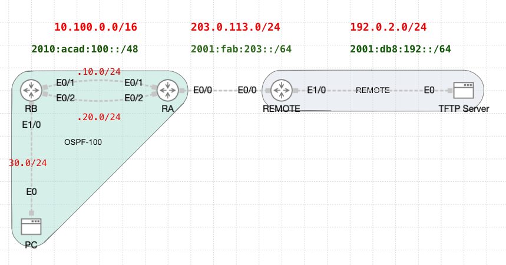

# OSPF Configuration Demo – Class Walkthrough

## Overview
This demo shows the step-by-step configuration of OSPF routing, tuning, and verification using two routers, a TFTP server, and a remote segment. It was built in CML and used during a live session to reinforce key concepts in OSPFv2.

## Topology

📄 [Download Initial YAML File](https://github.com/ayalac1111/Networking-Courses/raw/main/25S-CST8371/Examples/02-OSPF/OSPF_-_Configuration.yaml)

---

## RA – Basic OSPF Configuration
1. Enable OSPF using process ID `U`.
2. Add interfaces `E0/1`, `E0/2`, and `Loopback1` to Area 0.
3. Configure a default route pointing to REMOTE using a fully specified route.
4. Propagate the default route into OSPF using `default-information originate`.

### RA Verification
- Check OSPF-enabled interfaces.
- Test reachability to the TFTP Server.

---

## RB – Basic OSPF Configuration
1. Enable OSPF using process ID `U`.
2. Set the router ID to `U.0.0.2`.
3. Add interfaces `E0/1`, `E0/2`, and `E1/0` to Area 0.

### RB Verification
- Verify OSPF process and router ID.
- Check OSPF neighbour relationships.
- Ping the TFTP Server from the PC.
- Use `show ip route ospf` to confirm OSPF routes.

---

## OSPF Tuning
1. Set the reference bandwidth to `10000 Mbps` on both routers.
2. Adjust `RA-Loopback1` network type to advertise `/24` properly.
3. Set all interfaces that don’t face OSPF neighbours to **passive**.
4. Tune timers on `E0/1`: Hello = 5s, Dead = 10s.
5. Make RA the DR in the `10.100.20.0/24` network via OSPF priority.
6. Verify all settings with `show` and `debug` commands.

---

## Notes
- YAML starter file: `OSPF_-_Configuration.yaml`
- This demo supports Week 5 concepts and Lab 05 implementation
