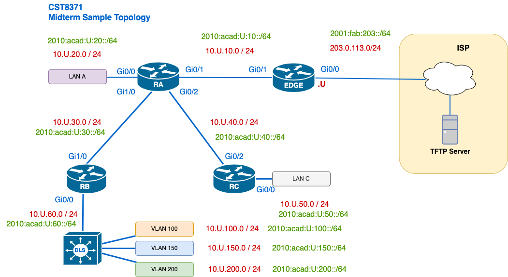

# Basic Routing Concepts – Administrative Distance on RB



The network **10.U.40.0/24** is present in your OSPF network and is learned on **Router RB** through OSPF from **Router RC**. The route is visible in the OSPF database and is marked as **O** (intra-area) with a cost of 10.

The network administrator wants to **prefer a manually configured static route** to that network and adds the following configuration on **RB**:

```bash
ip route 10.U.40.0 255.255.255.0 10.U.20.2 50
```

---

## Questions:

1. What is the default **Administrative Distance** of:
   - OSPF routes  
   - Static routes (without any AD value specified)

2. Given the above configuration, which route will be installed in the **IPv4 routing table** of **RB** for the destination **10.U.40.0/24**?  
   - Justify your answer using the AD values.

3. If the OSPF route is still present in the **OSPF database**, does that mean it's **used** by the router to forward packets?  
   - Explain the relationship between the **OSPF LSDB**, the **RIB (routing table)**, and **FIB (forwarding)**.

4. Suppose you change the AD of the static route to **120**.  
   - Show the updated command.  
   - Which route will be preferred now, and why?
