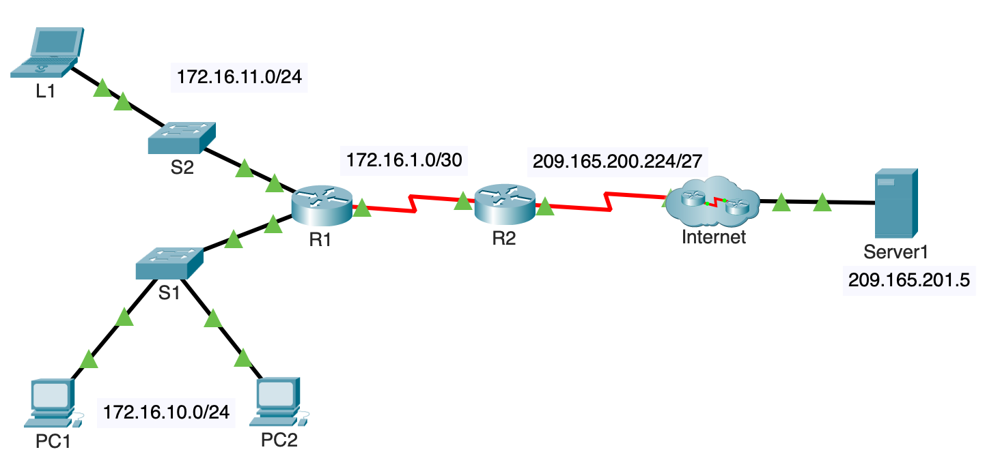

**Course Number**: CST8371  
**Course Name**: Enterprise Internetworks  
**Professor**: Carolina Ayala  

---

# Dynamic NAT Configuration Using the Provided Topology

## Network Topology



In the given network topology, we have the following devices and network segments:
- **PC1**: IP Address 172.16.10.0/24 (inside local)
- **PC2**: IP Address 172.16.10.0/24 (inside local)
- **L1**: IP Address 172.16.11.0/24 (inside local)
- **R1 (Router)**: Connects the internal network 172.16.1.0/30 to the external network via R2
- **R2 (Router)**: Connects the internal network to the external network 209.165.200.224/27
- **Server1**: Public IP Address 209.165.201.5

> **Note**: There is a Packet Tracer activity available to follow along with this example. Please refer to the provided instructions to access the activity and practice the configuration steps outlined below.

## Purpose of Dynamic NAT

Dynamic NAT provides a method for multiple devices within a private network to share a pool of public IP addresses for accessing the internet. Unlike Static NAT, which maps a single private IP address to a single public IP address, Dynamic NAT uses a pool of public IP addresses that are assigned dynamically to devices as needed. This allows for efficient utilization of public IP addresses, especially when there are more devices on the internal network than available public IP addresses.

Dynamic NAT is particularly useful in scenarios where devices do not need a permanent public IP address but require temporary access to external resources. It helps in conserving the limited pool of public IP addresses by reassigning them as devices connect and disconnect from the internet. Additionally, Dynamic NAT enhances security by masking internal network addresses and makes it more difficult for external entities to directly target internal devices.

## Configure Steps for Dynamic NAT

The NAT configuration commands are applied to the router (R2), which handles the translation between the internal and external networks. In this topology, R2 is the device that needs to have the interfaces configured for NAT.

> **Note**: If you are using a Layer 3 (L3) switch, the NAT configuration might be different, and some L3 switches may not support NAT natively. In such cases, the router typically handles NAT operations.

### 1. Configure Traffic that will be Permitted
On R2, configure one statement for ACL 1 to permit any address belonging to the 172.16.0.0/16 network.

This step involves creating an Access Control List (ACL) that defines which internal (local) addresses are allowed to access external resources through NAT. By permitting addresses in the 172.16.0.0/16 network, we specify that any device with an IP address in this range can use the NAT service to access the internet. This is important to ensure that only authorized internal devices can leverage the NAT pool to reach external networks, enhancing both control and security.

```plaintext
R2> enable
R2# configure terminal
R2(config)# access-list 1 permit 172.16.0.0 0.0.255.255
```
### 2. Configure a Pool of Addresses for NAT
Configure R2 with a NAT pool that uses two addresses in the 209.165.200.228/30 address space

A NAT pool is a range of public IP addresses provided by an Internet Service Provider (ISP) that are used for translating internal (private) IP addresses to routable public IP addresses. These addresses are globally unique and can be routed over the internet, allowing internal devices to communicate with external networks. By configuring a NAT pool, we ensure that multiple internal devices can share a limited number of public IP addresses dynamically, efficiently utilizing the available address space.

```plaintext
R2(config)# ip nat pool NAT_POOL 209.165.200.229 209.165.200.230 netmask 255.255.255.252
```

***Question***: What will happen if more than 2 devices attempt to access the internet?

If more than 2 devices attempt to access the internet simultaneously, the third and subsequent devices will not be able to access the internet because there are only two addresses available in the NAT pool.

### 3. Associate ACL 1 with the NAT Pool

This step involves linking the Access Control List (ACL 1), which specifies the internal addresses permitted to use NAT, with the NAT pool, which contains the public IP-Addresses allocated for translation. This association is crucial because it tells the router which internal addresses are allowed to be translated to the public IP addresses in the NAT pool. The ACL acts as a filter, ensuring that only specified internal addresses (in this case, the 172.16.0.0/16 network) can access the external network using the NAT pool. Without this association, the router would not know which internal traffic should be translated using the NAT pool.

```plaintext
R2(config)# ip nat inside source list 1 pool NAT_POOL
```

### 4. Configure R2 interfaces with the appropriate inside and outside NAT commands.

Selecting which interface is inside and which is outside is crucial for proper NAT configuration. The **inside** interface is connected to the internal, private network, where the devices with private IP addresses reside. The **outside** interface is connected to the external network (such as the internet), where the public IP addresses are used.

A helpful mnemonic to remember this is: **"I In" and "O Out"** - **I**nside is for **I**nternal network, **O**utside is for **O**utside world (internet).


``` plaintext
R2(config)# interface GigabitEthernet0/0
R2(config-if)# ip address 209.165.200.226 255.255.255.224
R2(config-if)# ip nat outside
R2(config-if)# exit

R2(config)# interface GigabitEthernet0/1
R2(config-if)# ip address 172.16.1.2 255.255.255.252
R2(config-if)# ip nat inside
```

In this example:

- **GigabitEthernet0/0** is the outside interface, facing the external network.
- **GigabitEthernet0/1** is the inside interface, facing the internal network.

Remember: **Inside (I In)** for internal network and **Outside (O Out)** for external network. This mnemonic will help you identify and configure NAT interfaces correctly.

## Verify NAT Implementation
### 1. Access Services Across the Internet
From the web browser of L1, PC1, or PC2, access the web page for Server1.

### 2: View NAT Translations
View the NAT translations on R2. Identify the internal source address of the PC and the translated address from the NAT pool in the command output.

```plaintext
R2# show ip nat translations
Pro  Inside global        Inside local         Outside local      Outside global
---  209.165.200.229      172.16.10.1          209.165.201.5      209.165.201.5
---  209.165.200.230      172.16.11.1          209.165.201.5      209.165.201.5
```


```plaintext
R2# show ip nat statistics
Total active translations: 2 (0 static, 2 dynamic; 0 extended)
Outside interfaces:
  GigabitEthernet0/0
Inside interfaces:
  GigabitEthernet0/1
Hits: 50  Misses: 5
Expired translations: 0
```

## Sequence of Events and Address Mapping Table

The following sequence of events happen when PC1 pings Server1:

1. **PC1 (172.16.10.1) sends its first packet to Server1 (209.165.201.5).**

2. **As the packet enters the NAT router (R2), the router applies some matching logic to decide whether the packet should have NAT applied.**
   - Because the logic has been configured to match source IP addresses that belong to the 172.16.0.0/16 network, the router adds an entry in the NAT table for 172.16.10.1 as an inside local address.

3. **The NAT router (R2) needs to allocate an IP address from the pool of valid inside global addresses.**
   - It uses the NAT pool and assigns 209.165.200.229 to the NAT table to complete the entry.

4. **The NAT router (R2) translates the source IP address and forwards the packet to Server1.**

When pinging from PC1 to Server1, the address mappings are as follows:

| Step | Inside Local | Inside Global   | Outside Local  | Outside Global |
|------|--------------|-----------------|----------------|----------------|
| 1    | 172.16.10.1  | -               | -              | 209.165.201.5  |
| 2    | 172.16.10.1  | -               | -              | 209.165.201.5  |
| 3    | 172.16.10.1  | 209.165.200.229 | -              | 209.165.201.5  |
| 4    | 172.16.10.1  | 209.165.200.229 | -              | 209.165.201.5  |

In this scenario, the NAT router translates the source IP address from 172.16.10.1 (inside local) to 209.165.200.229 (inside global) for the server, allowing PC1 to communicate with Server1 using the public IP address.
