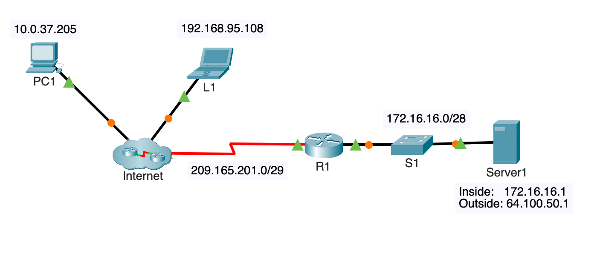

**Course Number**: CST8371  
**Course Name**: Enterprise Internetworks  
**Professor**: Carolina Ayala

---
# Static NAT Configuration Example

## Network Topology



In the given network topology, we have the following devices and network segments:
- **PC1**: IP Address 10.0.37.205 (inside local)
- **L1**: IP Address 192.168.95.108 (inside local)
- **R1 (Router)**: Connects the external network 209.165.201.0/29 to the internal network 172.16.16.0/28
- **S1 (Switch)**: Part of the internal network 172.16.16.0/28
- **Server1**: Inside Local IP Address 172.16.16.1, Inside Global IP Address 64.100.50.1 (inside global)

> **Note**: There is a Packet Tracer activity available to follow along with this example. Please refer to the  instructions to access the activity and practice the configuration steps outlined below.

## Purpose of Static NAT
Static NAT maps a specific private IP address to a specific public IP address. This allows a device within a private network to be accessible from the outside world using a public IP address.

## Configuration Steps for Static NAT
To configure static NAT on the router (R1), follow these steps:

1. **Enter Global Configuration Mode**:
    ```code
    R1> enable
    R1# configure terminal
    ```

2. **Define the Static NAT Mapping**:
    ```code
    R1(config)# ip nat inside source static 172.16.16.1 64.100.50.1
    ```

3. **Configure the Interfaces**:
    ```code
    R1(config)# interface GigabitEthernet0/0
    R1(config-if)# ip address 209.165.201.1 255.255.255.248
    R1(config-if)# ip nat outside
    R1(config-if)# exit

    R1(config)# interface GigabitEthernet0/1
    R1(config-if)# ip address 172.16.16.1 255.255.255.240
    R1(config-if)# ip nat inside
    R1(config-if)# exit
    ```

## Verifying the Static NAT Configuration
To verify that the static NAT configuration is correctly set up, use the following steps and commands:

1. **Ping from PC1 to Server1 (using Inside Global Address)**:
    ```code
    PC1> ping 64.100.50.1

    Pinging 64.100.50.1 with 32 bytes of data:
    Reply from 64.100.50.1: bytes=32 time<1ms TTL=128
    Reply from 64.100.50.1: bytes=32 time<1ms TTL=128
    Reply from 64.100.50.1: bytes=32 time<1ms TTL=128
    Reply from 64.100.50.1: bytes=32 time<1ms TTL=128
    ```

2. **Show NAT Translations**:
    ```code
    R1# show ip nat translations
    Pro  Inside global      Inside local       Outside local      Outside global
    ---  64.100.50.1        172.16.16.1        ---                ---
    ```

3. **Show NAT Statistics**:
    ```code
    R1# show ip nat statistics
    Total active translations: 1 (1 static, 0 dynamic; 0 extended)
    Outside interfaces:
      GigabitEthernet0/0
    Inside interfaces:
      GigabitEthernet0/1
    Hits: 50  Misses: 5
    Expired translations: 0
    ```

## Sequence of Events and Address Mapping Table

The following sequence of events happens when PC1 pings Server1:

1. **PC1 (10.0.37.205) sends its first packet to Server1 (64.100.50.1).**

2. **As the packet enters the NAT router (R1), the router applies some matching logic to decide whether the packet should have NAT applied.**
   - Because the logic has been configured to match source IP addresses that begin with 172.16.16, the router adds an entry in the NAT table for 172.16.16.1 as an inside local address.

3. **The NAT router (R1) needs to allocate an IP address from the pool of valid inside global addresses.**
   - It uses the configured mapping and adds 64.100.50.1 to the NAT table to complete the entry.

4. **The NAT router (R1) translates the source IP address and forwards the packet to Server1.**

When pinging from PC1 to Server1, the address mappings are as follows:

| Step | Inside Local | Inside Global | Outside Local  | Outside Global |
|------|--------------|---------------|----------------|----------------|
| 1    | 10.0.37.205  | -             | -              | 64.100.50.1    |
| 2    | 10.0.37.205  | -             | -              | 64.100.50.1    |
| 3    | 10.0.37.205  | 64.100.50.1   | -              | 172.16.16.1    |
| 4    | 10.0.37.205  | 64.100.50.1   | -              | 172.16.16.1    |

In this scenario, the NAT router translates the source IP address from 172.16.16.1 (inside local) to 64.100.50.1 (inside global) for the server, allowing PC1 to communicate with Server1 using the public IP address.

By following these steps and verifying the configuration, you ensure that static NAT is correctly set up and functioning as intended.
