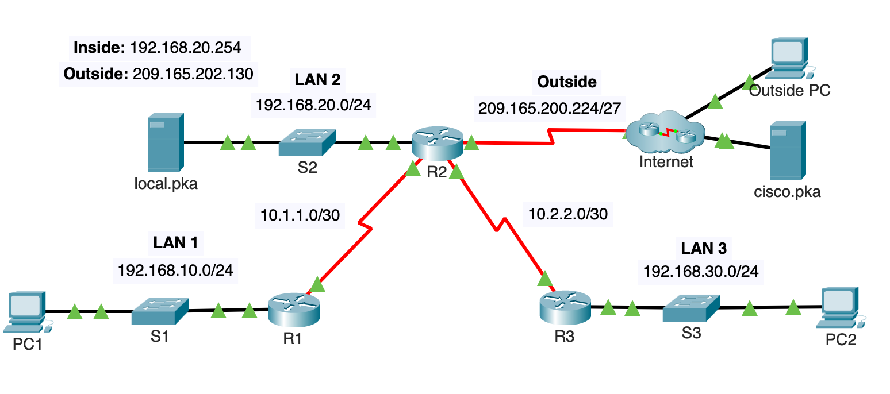

**Course Number**: CST8371  
**Course Name**: Enterprise Networking  
**Professor**: Carolina Ayala

---
# **Understanding NAT Tables**


Follow along with the Packet Tracer activity to do in-class

# NAT Tables Examples

## **Example 0: Communication Between PC1 and local.pka**

### **Scenario:**
Alice, an inventory manager, is working on PC1 (IP: 192.168.10.1) and needs to check the stock level of a particular item in the warehouse database. She runs an SQL query on the local server (local.pka, IP: 192.168.20.254) located in LAN 2 to retrieve information about item SKU12345. SQL listens on port 1433.

### Sequence of Events

1. **PC1 forwards the packet to R1, the default gateway of PC1**:
   - Since local.pka is in a different network, PC1 sends the packet to its default gateway, R1.
   - Source IP: 192.168.10.1 (PC1)
   - Destination IP: 192.168.20.254 (local.pka)
   - The packet contains an SQL query to be processed by local.pka on port 1433.

2. **R1 receives the packet from PC1**:
   - R1 forwards the packet without altering the IP addresses since both the source and destination IPs are private addresses.

3. **R2 receives the packet from R1**:
   - R2 checks the NAT rules to determine if any translation is required.
   - Since the packet is traveling from an inside interface (connected to LAN 1) to another inside interface (connected to LAN 2), and since the interface attached to LAN 2 is not an outside address, NAT rules for translating private to public addresses do not apply.
   - R2 forwards the packet to the server local.pka with the original IP addresses.
   -  Source IP: 192.168.10.1 (PC1)
   - Destination IP: 192.168.20.254 (local.pka)

4. **local.pka receives the packet**:
   - The server processes the SQL query with the source IP address of 192.168.10.1 (PC1) on port 1433.
   - Alice receives the query result back, confirming the stock level of item SKU12345.

### NAT Rules Application

In this scenario, NAT rules do not apply because the communication is between two private IP addresses within the internal network. R2 forwards the packet without any translation as it moves from LAN 1 to LAN 2.

### Summary
When Alice on PC1 communicates with the server local.pka, the packet's source and destination IP addresses remain unchanged throughout the journey. NAT rules on R2 are not applied because the packet does not need to be translated between private and public IP addresses.

---
## **Example 1: Verifying NAT in LAN 1**  

### **Scenario:**  
John, a network engineer, is troubleshooting connectivity issues in the network. He asks a user on PC1 (192.168.10.10) to ping the Outside PC (209.165.201.14) to verify that the network is correctly translating the internal IP addresses to the public IP addresses.

John runs the following command to check if LAN 1 is permitted to go outside: 

```plaintext 
R2# show access-lists
Standard IP access list 1 
10 permit 192.168.10.0 0.0.0.255 
20 permit 192.168.20.0 0.0.0.255 
30 permit 192.168.30.0 0.0.0.255
```

Then, he verifies the NAT rules by using the following command:

```plaintext
R2r# show run | include nat
ip nat pool R2POOL 209.165.202.129 209.165.202.129 netmask 255.255.255.252
ip nat inside source list R2NAT pool R2POOL overload
ip nat inside source static 192.168.20.254 209.165.202.130
```

The output confirms that NAT is configured correctly with an inside source list and a NAT pool named R2POOL.

>**Note**:
>In real equipment, you should use the commands:
>`show ip nat pool, show ip nat outside, show ip nat pool`

John, in **R2**, checking the status of the network, sees the following:

```plaintext
R2# debug ip nat
NAT: s=192.168.10.10->209.165.202.129, d=209.165.201.14 [38]
NAT*: s=209.165.201.14, d=209.165.202.129->192.168.10.10 [38]
```

**Explanation:**

- **Line 1**: `NAT: s=192.168.10.10->209.165.202.129, d=209.165.201.14 [38]
  - This shows the NAT translation of the source IP address from 192.168.10.10 (inside local) to 209.165.202.129 (inside global) for a packet destined for 209.165.201.14.
- **Line 2**: `NAT*: s=209.165.201.14, d=209.165.202.129->192.168.10.10 [38]`
  - This shows the reverse translation for the return packet, translating the destination IP from 209.165.202.129 (inside global) back to 192.168.10.10 (inside local).  

The network administrator then runs the following command:

```plaintext
R2# show ip nat translations
Pro     Inside global     Inside local  Outside local      Outside global
icmp  209.165.202.129  192.168.10.10     209.165.201.14    209.165.201.14
```

**Explanation:**

| Address Type   | IP Address      | Explanation                                                                      |
| -------------- | --------------- | -------------------------------------------------------------------------------- |
| Inside global  | 209.165.202.129 | Public IP address assigned by NAT to the internal device.                        |
| Inside local   | 192.168.10.10   | Original IP address of the internal device.                                      |
| Outside global | 209.165.201.14  | Public IP address of the destination device.                                     |
| Outside local  | 209.165.201.14  | Same as the outside global address in this case, as the address does not change. |

Next, the network administrator verifies the NAT statistics:

```plaintext
R2# show ip nat statistics
Total translations: 1 (0 static, 1 dynamic; 1 extended)
Outside interfaces: Serial0/1/0
Inside interfaces: FastEthernet0/0, Serial0/0/0, Serial0/0/1
Hits: 10  Misses: 0
Expired translations: 0
Dynamic mappings:
-- Inside Source
[Id: 1] access-list 1 pool R2POOL refcount 1
 pool R2POOL: netmask 255.255.255.252
        start 209.165.202.129 end 209.165.202.129
        type generic, total addresses 1, allocated 1 (100%), misses 0
```

**Explanation:**

- **Total addresses**: 1
  - This shows the total number of public IP addresses available in the - NAT pool.
- **Allocated**: 1 (100%)
  - This indicates that all available addresses are currently in use.
- **Misses**:
  - A miss would occur if an internal device attempts to connect to the outside network and there are no available addresses in the NAT pool. Since the pool is fully allocated, any additional NAT requests would result in a miss.

Finally, the network administrator checks the access lists:

```plaintext
R2# show access-lists
Standard IP access list R2NAT
    10 permit 192.168.10.0 0.0.0.255 (4 matches)
    20 permit 192.168.20.0 0.0.0.255
    30 permit 192.168.30.0 0.0.0.255
```

**Explanation:**

- **Matches**: 4  
  - This shows that four packets matched the access list entry for 192.168.10.0/24, which corresponds to the four ICMP echo requests sent by PC1 (as a standard Windows PC sends 4 packets when pinging).

## **Example 2:  LAN 2 (UDP)**

**Scenario:**  
Jane, a network technician, needs to verify that a service on a server outside the local network is reachable from the internal network. She configures a local application on the server `local.pka` (192.168.20.254) to send UDP packets to the `cisco.pka` server (209.165.201.30) on port 5000.  The application is designed to send telemetry data to an external server for monitoring purposes without requiring any response back.

The network administrator, checking the status of the network, sees the following:

```plaintext
NAT: s=192.168.20.254->209.165.202.130, d=209.165.201.30 [5000]
NAT: s=192.168.20.254->209.165.202.130, d=209.165.201.30 [5000]
NAT: s=192.168.20.254->209.165.202.130, d=209.165.201.30 [5000]
```

**Explanation:**

- **Lines:** .  NAT: s=192.168.20.254->209.165.202.130, d=209.165.201.30 [5000]\`
- This shows the NAT translation of the source IP address from 192.168.20.254 (inside local) to 209.165.202.130 (inside global) for a packet destined for 209.165.201.30.
  - The port number `[5000]` indicates the destination port of the packet, which is preserved through the translation process.
  - Since this is a unidirectional communication, there is no return packet, reflecting the behaviour of the application which only sends data.

The network administrator then runs the following command:

  ```plaintext
  Router# show ip nat translations
  Pro Inside global     Inside local      Outside local     Outside global
  udp 209.165.202.130   192.168.20.254    209.165.201.30    209.165.201.30
  ```

**Explanation:**

- **Inside global:** 209.165.202.130
  - This is the public IP address assigned by NAT to the internal device.
- **Inside local:** 192.168.20.254
  - This is the original IP address of the internal device.
- **Outside global & local:** 209.165.201.30
  - This is the public IP address of the destination device.
  - The outside local and outside global are the same because the NAT translation does not alter the address of the external destination; it only changes the internal source address to the public IP for outbound traffic.

Next, the network administrator verifies the NAT statistics:

```plaintext
  R2# show ip nat statistics
  Total translations: 2 (0 static, 2 dynamic; 2 extended)
  Outside interfaces: Serial0/1/0
  Inside interfaces: FastEthernet0/0, Serial0/0/0, Serial0/0/1
  Hits: 20  Misses: 0
  Expired translations: 0
  Dynamic mappings:
  -- Inside Source
  [Id: 1] access-list 1 pool R2POOL refcount 2
   pool R2POOL: netmask 255.255.255.252
          start 209.165.202.129 end 209.165.202.129
          type generic, total addresses 1, allocated 1 (100%), misses 0
```

**Explanation:**
  - **Expired translations:**
    - This indicates the number of NAT entries that have timed out and been removed from the NAT table.
  - **Dynamic mappings:**
    - This shows the current dynamic NAT mappings that have been created based on the defined access lists and NAT pools. Dynamic mappings are created as needed when internal devices initiate connections to the outside network and are removed after a period of inactivity or when the session ends.

Finally, the network administrator checks the access lists:

```plaintext
  R2# show access-lists
  Standard IP access list R2NAT
      10 permit 192.168.10.0 0.0.0.255 (4 matches)
      20 permit 192.168.20.0 0.0.0.255 (32 matches)
      30 permit 192.168.30.0 0.0.0.255
```

**Explanation:**

- **Matches:** 32
  - This shows that 32 UDP datagrams matched the access list entry for 192.168.20.0/24, which corresponds to the UDP traffic sent by `local.pka`.  Assuming each datagram is 1500 bytes, a total of 48,000 bytes (32 x 1500 bytes) of data was sent.


### Example 3: LAN 3 - PC2 to cisco.pka

**Scenario:**  
Mark, an internal user, is browsing a secure website using HTTPS. The PC2 (192.168.30.10) sends an HTTPS request to the `cisco.pka` server (209.165.201.30) on port 443.

The network administrator, checking the status of the network, sees the following:

```plaintext
NAT: s=192.168.30.10->209.165.202.129, d=209.165.201.30 [443]
NAT*: s=209.165.201.30, d=209.165.202.129->192.168.30.10 [443]
```

**Explanation:**
- **Line 1:** `NAT: s=192.168.30.10->209.165.202.129, d=209.165.201.30 [443]`
  - This shows the NAT translation of the source IP address from 192.168.30.10 (inside local) to 209.165.202.129 (inside global) for a packet destined for 209.165.201.30.
  - The port number `[443]` indicates the destination port for HTTPS traffic.
- **Line 2:** `NAT*: s=209.165.201.30, d=209.165.202.129->192.168.30.10 [443]`
  - This shows the reverse translation for the return packet, translating the destination IP from 209.165.202.129 (inside global) back to 192.168.30.10 (inside local).
  - The port number `[443]` is preserved, indicating secure web traffic.

The network administrator then runs the following command:

```plaintext
R2# show ip nat translations
Pro Inside global     Inside local      Outside local     Outside global
tcp 209.165.202.129   192.168.30.10     209.165.201.30    209.165.201.30
```

**Explanation:**

- **Inside global:** 209.165.202.129
  - This is the public IP address assigned by NAT to the internal device.
- **Inside local:** 192.168.30.10
  - This is the original IP address of the internal device.
- **Outside global:** 209.165.201.30
  - This is the public IP address of the destination device.
- **Outside local:** 209.165.201.30
  - This is the same as the outside global address in this case, as the address does not change. The port number `[443]` is preserved throughout the translation, indicating HTTPS traffic.

A typical HTTPS request involves a three-way handshake (3 packets) and the actual data transfer. For a small homepage, let's assume an additional 10 packets for the data transfer. Thus, the total number of packets will be 13.

The network administrator decides to clear the dynamic translations to manage the NAT table:

```plaintext
R2# clear ip nat translation *
```

**Explanation:**
- This command deletes all dynamic NAT translations from the NAT table. However, static translations are not affected by this command, ensuring persistent connectivity for critical services.

Next, the network administrator verifies the NAT statistics:

```plaintext
R2# show ip nat statistics
 Total translations: 1 (0 static, 1 dynamic; 0 extended)
  Outside interfaces: Serial0/1/0
  Inside interfaces: FastEthernet0/0, Serial0/0/0, Serial0/0/1
  Hits: 30  Misses: 0
  Expired translations: 1
  Dynamic mappings:
  -- Inside Source
  [Id: 1] access-list 1 pool R2POOL refcount 1
   pool R2POOL: netmask 255.255.255.252
          start 209.165.202.129 end 209.165.202.129
          type generic, total addresses 1, allocated 1 (100%), misses 0
  ```

**Explanation:**
- **Expired translations:** This indicates the number of dynamic NAT entries that have timed out and been removed from the NAT table.
- **Dynamic mappings:** Shows the current dynamic NAT mappings created based on the defined access lists and NAT pools. This section includes the number of references to the pool and its usage.
- **refcount:** represents the number of active translations currently using the specific NAT pool. Each active translation involves mapping an inside local IP address to an inside global IP address.

Finally, the network administrator checks the access lists:

```plaintext
R2# show access-lists
  Standard IP access list R2NAT
      10 permit 192.168.10.0 0.0.0.255 (4 matches)
      20 permit 192.168.20.0 0.0.0.255 (1 match)
      30 permit 192.168.30.0 0.0.0.255 (13 matches)
```

**Explanation:**
- **Matches:** 13
  - This shows that 13 packets matched the access list entry for 192.168.30.0/24, which corresponds to the HTTPS traffic sent by PC2. This includes the three-way handshake (3 packets) and 10 packets for the small homepage data transfer, totaling 13 packets.
