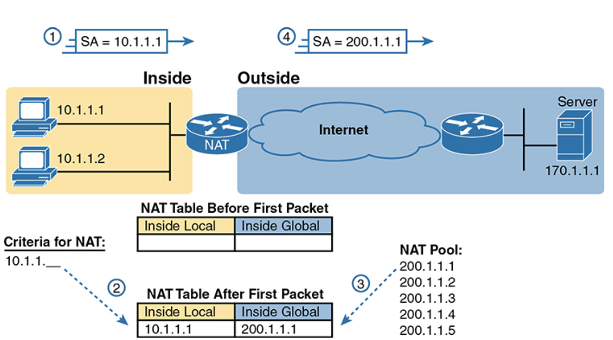

**Course Number**: CST8371  
**Course Name**: Enterprise Internetworks
**Professor**: Carolina Ayala

---
# Network Address Translation (NAT) Theory

## Introduction
Network Address Translation (NAT) is a critical technology in networking that allows multiple devices on a local network to share a single public IP address for accessing the internet. NAT is typically implemented on routers and firewalls, which modify the IP address information in packet headers as they pass through. This document covers the essential concepts and operations of NAT that are crucial for understanding its role and functionality in networking.

## Purpose and Importance of NAT
NAT serves several important purposes:
1. **IP Address Conservation**: By allowing multiple devices to share a single public IP address, NAT helps conserve the limited pool of available IPv4 addresses.
2. **Enhanced Security**: NAT hides the internal IP addresses from the external network, making it harder for attackers to target individual devices within the private network.
3. **Flexible Network Management**: NAT allows for easy network configuration changes without affecting external connections.

## Types of NAT
There are three primary types of NAT, each serving different purposes:

### Static NAT (SNAT)
- **Definition**: Maps a single private IP address to a single public IP address.
- **Use Case**: Commonly used for devices that need to be accessible from the internet, such as web servers.

### Dynamic NAT
- **Definition**: Maps a private IP address to a public IP address from a pool of public IP addresses.
- **Use Case**: Suitable for networks where multiple devices need internet access, but not simultaneously.

### Port Address Translation (PAT)
- **Definition**: Maps multiple private IP addresses to a single public IP address using different port numbers.
- **Use Case**: The most common type of NAT, used in small to medium-sized networks to allow multiple devices to share a single public IP address.

## Key Concepts and Terminology
Understanding NAT involves familiarizing oneself with specific terminology:

- **Inside Local Address**: The private IP address assigned to a device within the local network.
- **Inside Global Address**: The public IP address assigned by the NAT device to represent an inside device to the outside world.
- **Outside Local Address**: The IP address of an external device as it appears to the internal network.
- **Outside Global Address**: The actual public IP address of the external device on the internet.

## Basic Operation of NAT
- When a device in a private network sends a packet to an external network, the NAT device modifies the packet's source IP address to the public IP address of the NAT device (Inside Global Address).
- The NAT device maintains a table tracking active connections and their corresponding translations.
- When the external network sends a response, the NAT device uses the table to translate the destination IP address from the public IP address back to the private IP address (Inside Local Address).

## Network Address Translation (NAT) Sequence of Events

The numbers 1, 2, 3, and 4 in the figure refer to the following sequence of events:

1. **Host 10.1.1.1 sends its first packet to the server at 170.1.1.1.**

2. **As the packet enters the NAT router, the router applies some matching logic to decide whether the packet should have NAT applied.**
   - Because the logic has been configured to match source IP addresses that begin with 10.1.1, the router adds an entry in the NAT table for 10.1.1.1 as an inside local address.

3. **The NAT router needs to allocate an IP address from the pool of valid inside global addresses.**
   - It picks the first one available (200.1.1.1, in this case) and adds it to the NAT table to complete the entry.

4. **The NAT router translates the source IP address and forwards the packet.**

| Step | Inside Local | Inside Global | Outside Local | Outside Global |
|------|--------------|---------------|---------------|----------------|
| 1    | 10.1.1.1     | -             | -             | 170.1.1.1      |
| 2    | 10.1.1.1     | -             | -             | 170.1.1.1      |
| 3    | 10.1.1.1     | 200.1.1.1     | -             | 170.1.1.1      |
| 4    | 10.1.1.1     | 200.1.1.1     | -             | 170.1.1.1      |

In this scenario, the NAT router translates the source IP address from 10.1.1.1 (inside local) to 200.1.1.1 (inside global) and forwards the packet to the server at 170.1.1.1.

*Note: The above example is taken from CCNA 200-301 Official Cert Guide by Wendell Odom.*

## Benefits and Limitations of NAT
### Benefits:
- **IP Address Conservation**: Reduces the need for multiple public IP addresses.
- **Security**: Hides internal network structure from external entities.

### Limitations:
- **End-to-End Connectivity**: Complicates direct peer-to-peer communication.
- **Performance Overhead**: Adds processing overhead on the NAT device due to address translation.

## Impact of IPv6 on NAT
- **IPv6 Address Space**: With its vast address space, IPv6 reduces the need for NAT, allowing for direct end-to-end connectivity.
- **NAT in IPv6**: While less critical, NAT can still play a role in specific IPv6 transition scenarios and mixed IPv4/IPv6 environments.

## Conclusion
NAT is a fundamental networking technology that addresses IPv4 address exhaustion, enhances security, and provides flexible network management. Despite the transition to IPv6, understanding NAT remains relevant for managing current IPv4 networks and hybrid environments. By mastering the core concepts of NAT, network administrators can effectively manage and secure network communications.
