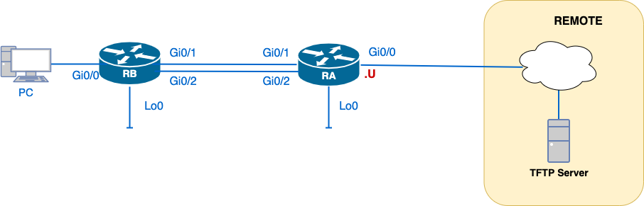

# 25S-CST8371 – SBA Practical Assessment



## 📘 IP Addressing

Use the **198.18.U.0/24** IPv4 subnet and **2010:acad:U::/48** IPv6 prefix assigned in Labs 01 and 02. Your unique `U` value will be used to personalize interface addressing.

Example:
- IPv4: `198.18.U.1/30`, `198.18.U.65/26`, etc.
- IPv6: `2010:acad:U:aa::/64`, `fd00:U::/8` for loopbacks

---

## 🧪 Required Equipment

- 2 routers, or 1 router and 1 L3 switch
- 1 PC or virtual machine
- Console and network cables (as per topology)

---

## 🎯 SBA Objectives and Tasks

### 🔧 Task 0 – Cable and Reload Devices (10 minutes)

- Connect the provided topology
- Erase startup config
- Remove VLANs: `delete vlan.dat`
- Set base configuration:
  - `no ip domain-lookup`
  - `enable secret`
  - `line con 0`, `line vty 0 4` (SSH/Telnet access)
  - Local user for login
  - `service password-encryption`
  - Generate RSA key (`crypto key generate rsa`)
  - Set IP addresses for IPv4 and IPv6

### 🔎 Task 1 – Basic Settings and Direct Connectivity (20 mins – 3 points)

- Set hostnames, banners, and interface descriptions
- Configure console and VTY access
- Assign both IPv4 and IPv6 addresses
- Test connectivity with:
  - `ping`
  - `traceroute`
  - `show ip int brief`
  - `show ipv6 int brief`
  - `show cdp neighbor`

---

### 🌐 Task 2 – Configure OSPFv2 (20 mins – 5 points)

- Use a provided **process ID** per Lab 04
- Set manual `router-id`
- Enable OSPF on internal interfaces only
- Validate neighbour adjacency with:
  - `show ip ospf neighbor`
  - `show ip protocols`
  - `show ip route ospf`

---

### 🔧 Task 3 – Optimize OSPFv2 (15 mins – 4 points)

Implement **two or more** of the following:

- Configure `passive-interface`
- Set reference bandwidth
- Adjust loopback network type (`point-to-point`)
- Tune DR/BDR elections (`ip ospf priority`)
- Advertise default route (`default-information originate`)
- Validate:
  - `show ip ospf`
  - `show ip route`
  - `debug ip ospf adj`

---

### 📈 Task 4 – IPv4 Path Verification (10 mins – 2 points)

- Collect baseline paths with `traceroute`
- Simulate a link failure
- Wait for OSPF to reconvergence
- Capture new failover path

---

### 🌐 Task 5 – Configure IPv6 Static and Floating Routes (20 mins – 4 points)

- Configure static routes using GUA or LLA as next-hop
- Add floating routes with higher AD (e.g., `ipv6 route ... 130`)
- Test with:
  - `show ipv6 route`
  - `ping`, `traceroute`

---

### 🔍 Task 6 – IPv6 Path Verification (10 mins – 2 points)

- Record baseline paths using `traceroute` and `show ipv6 route`
- Simulate link failure
- Confirm failover via floating route

---

### 💾 Task 7 – Backup Configs and Upload Evidence (10 mins)

- Copy running-config to TFTP server:
  ```bash
  copy running-config tftp:
  ```
- Save `show` command outputs in a file named `SBA-<yourid>.txt`
- Upload to TFTP

---

### 🧹 Task 8 – Cleanup Devices and Uncable (10 mins)

> ❗ **Penalty: -5 points if not completed**

- Erase configs and reload
- Unplug all cables
- Leave workstation ready for next group

---

### 📄 Task 9 – Return All Papers (5 mins)

> ❗ **Penalty: Grade of 0 if not returned**

- Submit all notes, printed configs, or scratch work
- If using loose sheets (not lab book), leave them behind

---

## ✅ Scoring Summary

| Task | Description                      | Points           | Time     |
|------|----------------------------------|------------------|----------|
| 1    | IPv6 Addressing (Basic Setup)    | 2                | 20 min   |
| 2    | OSPF Configuration               | 5                | 20 min   |
| 3    | OSPF Optimization & Tuning      | 4                | 20 min   |
| 4    | IPv4 Path Verification           | 2                | 10 min   |
| 5    | IPv6 Static & Floating Routes    | 4                | 20 min   |
| 6    | IPv6 Path Verification           | 2                | 10 min   |
| 7    | Config Upload to TFTP            | –                | 10 min   |
| 8    | Device Cleanup                   | –5 (if not done) | 10 min   |
| 9    | Paper Return                     | Grade = 0        | 5 min    |
| **Total** |                            | **20 pts + req. tasks** | **115 min** |

---

## 📌 Notes

- A default route must exist in the routing table to be advertised (`show ip route`)
- DR/BDR elections require an adjacency reset to take effect
- Use `terminal monitor` when collecting live debug output

---

© 25S-CST8371 – Algonquin College – C. Ayala
