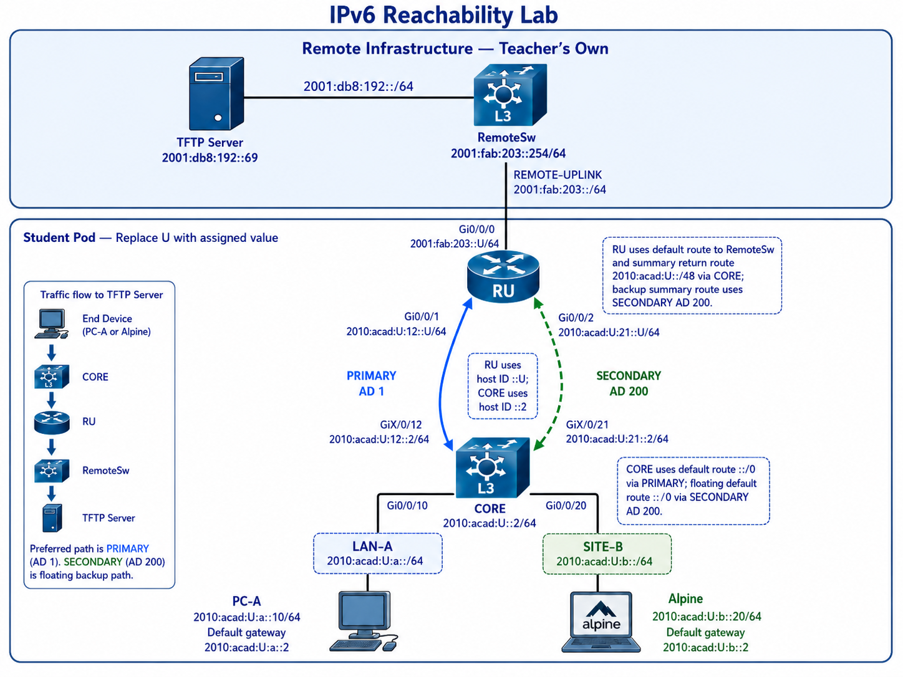
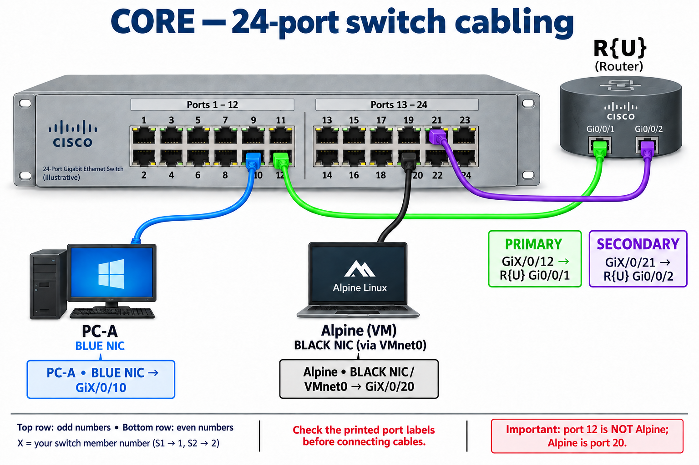

# Challenge Lab 01 — IPv6 Reachability Troubleshooting

```text
Environment:      Cisco IOS-XE physical lab (CORE L3 switch, R{U} router), Day0-provisioned
Lab type:         Challenge Lab — individual, in-lab, graded (5% of the course, 10 raw points)
Time allowed:     180 minutes (scheduled lab session)
Evidence files:   ch01-c00-{username}.txt  through  ch01-c03-{username}.txt
Due:              End of your scheduled Challenge Lab session
```

---

## Section A — Start Here

### A1 — Overview

You are not building this network. You are handed it.

At C00, you use an automated provisioning tool (`day0_provision.py`) to load a **pre-built IPv6 configuration** onto CORE and R{U} over the console port. You then configure the two hosts and verify addressing, access, and interface state. The configuration contains **three deliberate static-routing faults**, one per ticket. The faults use valid command syntax; a successful provisioning check does not mean that routing works. Use operational evidence to identify and repair each fault.

Your job is to **prove what is broken, make the smallest change that repairs it, and prove the repair** — with before-and-after evidence a third party can grade without watching you.

> **Work the tickets in order (C01 → C02 → C03).** Complete each ticket’s evidence before moving on. C01 establishes the forward path used in C02. Complete the PRIMARY-path checks in C02 before testing the SECONDARY path in C03.

> **Prepare before your session:** read this complete handout and review your Week 2–4 notes and lab-book evidence. Bring those notes and your own evidence to the lab. Use the device limits in B3 throughout the challenge.

### A1.1 — Mini Quick-Ref

| Task                                                                | Command                                          | Notes                                                                                                   |
| ------------------------------------------------------------------- | ------------------------------------------------ | ------------------------------------------------------------------------------------------------------- |
| Show IPv6 interface state and addresses                             | `show ipv6 interface brief \| exclude una\|down` | Lists active interfaces and their addresses; the filter hides unassigned and down lines.                |
| Show one interface's IPv6 detail (including its link-local address) | `show ipv6 interface <interface>`                | Use this to read a neighbour's link-local address from that neighbour.                                  |
| Show the route selected for one destination                         | `show ipv6 route <destination>`                  | Prints the matching prefix, route type, administrative distance, next hop, and exit interface (if any). |
| Show the whole IPv6 routing table                                   | `show ipv6 route`                                |                                                                                                         |
| Show the IPv6 neighbour cache                                       | `show ipv6 neighbors`                            | Address, link-layer address, state, and interface.                                                      |
| Ping from a router with a chosen source                             | `ping <destination> source <interface>`          | The source address decides which routes the **reply** depends on.                                       |
| Add / remove a static route                                         | `ipv6 route ...` / `no ipv6 route ...`           | Global configuration mode. To remove a route, repeat it with `no` and the same arguments.               |
| PC-A reachability and path                                          | `ping -6 -n 4 <dest>` / `tracert -6 <dest>`      | Windows.                                                                                                |
| Alpine reachability and path                                        | `ping -6 -c 4 <dest>` / `traceroute6 <dest>`     | Run inside the SSH session to Alpine.                                                                   |

### A1.2 — Evidence Collection

Copy device prompts and full command output into the checkpoint's evidence file **as you complete each step**.

```text
ch01-c00-{username}.txt     C00 baseline (gate)
ch01-c01-{username}.txt     C01 ticket
ch01-c02-{username}.txt     C02 ticket
ch01-c03-{username}.txt     C03 ticket
```

Rules that apply to every checkpoint:

- **Capture before you change anything.** Every ticket requires the state *before* your fix and the state *after* it. Evidence captured only after a repair cannot show what was wrong.
- **Re-test after every repair.** A correct fix with no new post-fix evidence earns no evidence credit.
- **Successful baseline and post-repair pings must show 100 percent success / 0% loss.** A first ping can lose a packet while the neighbour resolves; repeat it before collecting successful proof. Keep the failed **before-repair** pings required by each ticket—they are evidence of the fault, not successful reachability.
- **Widen your terminal before capturing** (`terminal length 0` and `terminal width 0` on the devices; disable line wrap in your SSH client). A wrapped line splits addresses and breaks grading.
- **Save each checkpoint immediately on PC-A’s Desktop.** Upload C00, C01, and C02 over IPv6 once C02 restores PC-A-to-server reachability. Upload C03 after completing its tests (D2).
- `show running-config` is not accepted as evidence.

### A2 — Why This Lab Is Important

- **A route in the table is a claim, not proof.** The next hop, the exit interface, and the neighbour behind them must all be usable before traffic actually flows.
- **Forward and return paths must both work.** A successful ping proves that requests and replies travelled between the tested endpoints. A failed ping alone does not identify which direction failed; inspect the routes needed in both directions.
- **Backup paths are only real once they have carried traffic.** A floating route that has never been exercised is an untested assumption.
- **Evidence beats guessing.** You are expected to justify each repair with the smallest useful set of operational output, before and after.

### A3 — Objectives and Grading

By completing this challenge, you will:

- Diagnose and repair IPv6 forwarding and return-path faults.
- Verify static and default routes using route, next-hop, and reachability evidence.
- Demonstrate that the backup path carries traffic during a PRIMARY outage and restore normal operation.
- Capture before-and-after operational evidence of your work.

| Checkpoint | Focus                                                         | Points |
| ---------- | ------------------------------------------------------------- | -----: |
| C00        | Provision and verify the baseline                             |      1 |
| C01        | Restore reachability from CORE to the remote server           |      3 |
| C02        | Restore return-path and end-to-end reachability for both LANs |      3 |
| C03        | Verify and repair connectivity over the SECONDARY path        |      3 |
| **Total**  | **5% of the course**                                          | **10** |

Marks assess hands-on diagnosis, repair, and operational verification. The short `!--` comments document your work and are not separately scored.

Partial credit is awarded for evidence supporting the relevant criterion. A successful ping without before-repair evidence does not earn diagnosis credit. A configuration dump does not replace operational evidence. Submit before the end of your scheduled 180-minute session.

---

## Section B — Topology and Addressing

### B1 — Topology



The router labelled **RU** uses your **{U}** (for example, R55 when U = 55). 
In CORE interface names, **X** is the switch you are using: S1 uses `Gi1/0/…`, S2 uses `Gi2/0/…`. 
Apply that member number to all four CORE ports, including the diagram's LAN ports labelled `Gi0/0/10` and `Gi0/0/20`.

Use two separate assigned values:

| Value               | Meaning                                                             | Example                                                                |
| ------------------- | ------------------------------------------------------------------- | ---------------------------------------------------------------------- |
| **U**               | Your student addressing number; also identifies your router, `R{U}` | U = 55 gives router `R55` and host address `2010:acad:55:a::10`        |
| **X / CORE_MEMBER** | The member number of the switch at your seat                        | S1 means X = 1, so `GiX/0/21` becomes `Gi1/0/21` and `--core-member 1` |

### B2 — Addressing Table

| Device | Interface | Network | GUA / Prefix | Link-local | Notes |
|---|---|---|---|---|---|
| PC-A | NIC | LAN-A | `2010:acad:U:a::10/64` | Auto-generated | Gateway `2010:acad:U:a::2` |
| CORE | GiX/0/10 | LAN-A | `2010:acad:U:a::2/64` | `fe80::2` | PC-A gateway |
| Alpine | eth0 | SITE-B | `2010:acad:U:b::20/64` | Auto-generated | Gateway `2010:acad:U:b::2` |
| CORE | GiX/0/20 | SITE-B | `2010:acad:U:b::2/64` | `fe80::2` | Alpine gateway |
| CORE | GiX/0/12 | PRIMARY | `2010:acad:U:12::2/64` | `fe80::2` | Link to R{U} |
| R{U} | Gi0/0/1 | PRIMARY | `2010:acad:U:12::U/64` | `fe80::U` | Link to CORE |
| CORE | GiX/0/21 | SECONDARY | `2010:acad:U:21::2/64` | `fe80::2` | Link to R{U} |
| R{U} | Gi0/0/2 | SECONDARY | `2010:acad:U:21::U/64` | `fe80::U` | Link to CORE |
| R{U} | Gi0/0/0 | REMOTE-UPLINK | `2001:fab:203::U/64` | `fe80::U` | Link to RemoteSw |
| RemoteSw | student-facing | REMOTE-UPLINK | `2001:fab:203::254/64` | Existing | Staff-managed |
| TFTP Server | NIC | TFTP-NET | `2001:db8:192::69/64` | Existing | Remote target; staff-managed |

CORE uses host ID `::2` and R{U} uses host ID `::U` on their listed global addresses. The same link-local address therefore exists on more than one link of the same device.

### B3 — Baseline Requirements

| Item | Requirement |
|---|---|
| Pushed by `day0_provision.py` (CORE and R{U}) | Hostnames, SSH (version 2), `admin` / `cisco` with `enable` password `class`, IPv6 routing, every interface address in B2 (GUA and link-local), and the static routes |
| Built by you at C00 | PC-A and Alpine addressing and default gateways from B2 |
| Injected faults | Three, all in **static routing** (route selection, next-hop usability, backup path). Confirm cabling, addressing, SSH, and interface state at C00. If those checks fail, raise your hand before starting C01. |
| Student scope | Cable and provision your assigned pod and configure host addressing at C00. During the tickets, add/remove static IPv6 routes on CORE and R{U}; shut and restore CORE `GiX/0/12` in C03 only. Perform the supplied cleanup in D3 after submission. |
| Protected scope | Do not change RemoteSw or the TFTP server. Do not manually change CORE/R{U} addressing, SSH, users, or other interface settings to repair tickets. Do not run `erase`, `reload`, or `write erase`. |

### B4 — Intended Routing Design

You cannot recognise a deviation if you do not know what correct looks like. This is the design intention — not a copy of the live configuration, and it does not say where your pod differs.

| Device | Purpose | Destination | Next hop | Form | AD |
|---|---|---|---|---|---:|
| CORE | Primary default | `::/0` | R{U} PRIMARY GUA `2010:acad:U:12::U` | Recursive — next-hop GUA only, **no exit interface** | 1 |
| CORE | Floating default | `::/0` | R{U} SECONDARY link-local address | Fully specified — CORE SECONDARY interface + link-local next hop | 200 |
| R{U} | Remote default | `::/0` | RemoteSw `2001:fab:203::254` | Recursive | 1 |
| R{U} | Primary return summary | `2010:acad:U::/48` | CORE PRIMARY GUA `2010:acad:U:12::2` | Recursive — next-hop GUA only, **no exit interface** | 1 |
| R{U} | Floating return summary | `2010:acad:U::/48` | CORE SECONDARY link-local address | Fully specified — R{U} SECONDARY interface + link-local next hop | 200 |
| RemoteSw | Return route (staff-managed) | `2010:acad:U::/48` | R{U} `2001:fab:203::U` | — | — |

A link-local address only has meaning on one link, and the same link-local address can exist on several links — a route that names a link-local next hop must therefore also name the exit interface.

### B5 — Management Access

Use these access paths while troubleshooting:

| To reach | From | Command | Username / password |
|---|---|---|---|
| CORE | PC-A (on-link) | `ssh admin@2010:acad:U:a::2` | `admin` / `cisco` |
| R{U} | CORE, over PRIMARY | `ssh -l admin 2010:acad:U:12::U` | `admin` / `cisco` |
| R{U} | CORE, over SECONDARY (when PRIMARY is shut) | `ssh -l admin 2010:acad:U:21::U` | `admin` / `cisco` |
| Alpine | PC-A | `ssh admin@2010:acad:U:b::20` | `admin` / `cisco` |
| TFTP server (SSH/SCP) | PC-A, IPv4 course network before provisioning | `ssh cisco@192.0.2.69` | `cisco` / `cisco` |
| TFTP server (SSH/SCP) | PC-A, IPv6 after C02 restores connectivity | `ssh -6 cisco@2001:db8:192::69` | `cisco` / `cisco` |

On CORE and R{U}, the `enable` password is `class`. 

Shutting the PRIMARY link (C03) ends any session that runs over it; reconnect over SECONDARY. The router console remains available.

---

## Section C — Lab Tasks and Evidence

### C00 — Cable the Pod, Provision the Baseline, and Confirm Access

#### Goal

Get the pre-built (faulted) configuration onto CORE and R{U}, bring PC-A and Alpine onto their LANs, and record the live starting state before diagnosing anything.

#### Why This Matters

You cannot reason about what is broken until you know what is actually there — and that the layers beneath routing are healthy. A cabling or host-addressing problem looks identical to a routing problem later, but is much harder to trace back once several checkpoints in. This gate also establishes device access and your local evidence files before routing diagnosis starts. Uploads become possible after you restore IPv6 connectivity to the remote server.

#### Action

Complete the numbered actions in order. Use the checkboxes to track the subactions within each action.

1. **Connect PC-A to the course network.**

   - [ ] Cable the PC's **BLUE NIC** to the **white jack** in your pod.

2. **Configure and verify BLUE NIC IPv4.**

   - [ ] In **T113**, select **Obtain an IP address automatically** and **Obtain DNS server address automatically**. Run `ipconfig` and verify that BLUE is on **203.0.113.0/24**, with address **203.0.113.2xx**, where `xx` is your two-digit station number (station 5 → `203.0.113.205`; station 12 → `203.0.113.212`). 
   - [ ] If you are in another lab, configure that address manually with subnet mask **255.255.255.0** and default gateway **203.0.113.254**. 

3. **Download and extract the Day0 package.**

   - [ ] Download to your Desktop over the IPv4 course-network connection:

     ```powershell
     scp cisco@192.0.2.69:configs/c01.zip "$env:USERPROFILE\Desktop\"
     ```

   - [ ] In File Explorer, right-click `c01.zip` and select **Extract All…**. Choose your **Desktop** as the destination, removing the extra `\c01` folder from the suggested path, then select **Extract**.

   - [ ] If extraction still produces a `c01` folder, open it and move its contents onto the Desktop. The files must be arranged as follows:

     ```text
     Desktop/
     ├── c01.zip
     ├── day0_provision.py
     ├── day0-c01.yaml
     ├── x_remote.py
     ├── x-remote-c00.yaml
     └── templates/
         ├── c01-core-set1.txt
         └── c01-ru-set1.txt
     ```

   - [ ] Keep the template files inside `templates`; move that folder as a whole. Confirm that `day0_provision.py`, `day0-c01.yaml`, and `templates` are directly on the Desktop before continuing.

4. **Cable the lab network.**

   

   - [ ] Cable the topology as in **B1**.  Follow the diagram for the four CORE connections, moving PC-A's BLUE NIC cable from the white jack to port 10. Cable Alpine to port 20. Then cable the two links from CORE to R.
   - [ ] Connect R{U} `Gi0/0/0` to the **white jack** toward RemoteSw (shown in topology B1).
   - [ ] Trace each cable and verify both port labels. **Odd ports are on top; even ports are below.** Replace X with your switch member number.

5. **Set your identity and provision from PC-A.**

   - [ ] Click **Start**, type **PowerShell**, right-click **Windows PowerShell**, and select **Run as administrator**. Select **Yes** at the permission prompt. Confirm the title starts with **Administrator: Windows PowerShell**.
   - [ ] Set the working folder once. This lets Python find the scripts and YAML files and places generated evidence on your Desktop:

     ```powershell
     Set-Location "$env:USERPROFILE\Desktop"
     ```

   - [ ] Enter your values once when prompted.

     ```powershell
     $username = (Read-Host "Course username").Trim()
     $u = (Read-Host "Assigned U number").Trim()
     $coreMember = (Read-Host "CORE switch member number").Trim()
     $consolePort = (Read-Host "Console port, for example COM1").Trim()
     ```

   - [ ] Create the three ticket evidence files. Existing files are preserved; C00 will be created by x_remote.

     ```powershell
     1..3 | ForEach-Object {
         $evidenceFile = "ch01-c0$_-$username.txt"
         if (-not (Test-Path $evidenceFile)) {
             New-Item -Path $evidenceFile -ItemType File
         }
     }
     ```

   > **Keep this PowerShell window open** for provisioning, manifest generation, and collection. Variables belong to this window. If you close it, reopen PowerShell as administrator and repeat the working-folder and identity commands. Use separate windows for interactive SSH. Commands on Cisco devices and Alpine still use your actual U and switch member; they cannot read these PowerShell variables.

   > **CONSOLE PORT — ONE APPLICATION AT A TIME:** Close PuTTY before running Day0. Do not reopen it until Day0 finishes. The operating system gives one application exclusive access to the serial port. If PuTTY holds it open, Day0 cannot open it to send commands or read device replies.

   - [ ] Connect the console cable to R{U}.

   - [ ] **[OPTIONAL]** Preview the router configuration:

     ```powershell
     python day0_provision.py --config day0-c01.yaml --device ROUTER --u $u --username $username --core-member $coreMember --dry-run
     ```

   - [ ] Provision **R{U}**:

     ```powershell
     python day0_provision.py --config day0-c01.yaml --device ROUTER --u $u --username $username --core-member $coreMember --port $consolePort
     ```

   - [ ] Move the console cable to the switch that will become CORE. Keep PuTTY closed while provisioning. The command uses `$coreMember` set above. It overrides the YAML value; no YAML edit is needed.

   - [ ] **[OPTIONAL]** Preview CORE and check that the interface names use your switch member:

     ```powershell
     python day0_provision.py --config day0-c01.yaml --device CORE --u $u --username $username --core-member $coreMember --dry-run
     ```

   - [ ] Provision **CORE**:

     ```powershell
     python day0_provision.py --config day0-c01.yaml --device CORE --u $u --username $username --core-member $coreMember --port $consolePort
     ```

   - [ ] Wait for completion and check the verification results on both devices.

   - [ ] Move the console cable back to **R{U}** and keep it there during the challenge. Once Day0 has finished, open PuTTY on that port.

6. **Configure PC-A’s IPv6 address.**

   - [ ] Return to the same **Administrator: Windows PowerShell** window. If `New-NetIPAddress` reports **Access is denied**, reopen PowerShell as administrator and repeat the working-folder and identity commands from action 5.
   - [ ] Find the Windows name of the BLUE NIC connected to CORE `GiX/0/10`:

     ```powershell
     Get-NetAdapter
     ```

   - [ ] Run the following as a **command**, using the adapter name shown above; `${u}` inserts your saved U value. The prompt must start with `PS`; these are PowerShell commands, not Command Prompt commands.

     ```powershell
     New-NetIPAddress -InterfaceAlias "<BLUE NIC name>" -IPAddress "2010:acad:${u}:a::10" -PrefixLength 64 -DefaultGateway "2010:acad:${u}:a::2"
     ```

   - [ ] The command above configures IPv6. Leave the BLUE NIC IPv4 settings configured earlier unchanged.

7. **Connect and configure Alpine.**

   - [ ] Open **VM → Settings → Network Adapter**. Select **Custom: Specific virtual network → VMnet0** and enable **Connected** and **Connect at power on**.

   - [ ] Open **Edit → Virtual Network Editor → Change Settings**. Select **VMnet0**, choose **Bridged**, and set **Bridged to** to the physical **BLACK (Realtek)** adapter, rather than Automatic. Apply the settings.

   - [ ] Start Alpine and log in at its console (`admin` / `cisco`). Configure `eth0` from a shell with administrative privileges:

     ```bash
     ip link set eth0 up
     ip -6 addr flush dev eth0 scope global
     ip -6 addr add 2010:acad:U:b::20/64 dev eth0
     ip -6 route replace default via 2010:acad:U:b::2 dev eth0
     ```

8. **Verify local connectivity.**

   - [ ] Run the first two commands on PC-A and the last command on Alpine, replacing U:

     ```text
     PC-A> ping -6 -n 4 2010:acad:U:a::2
     PC-A> ping -6 -n 4 2010:acad:U:b::20
     Alpine$ ping -6 -c 4 2010:acad:U:b::2
     ```

	All three must complete without packet loss. Both network devices must also show their B2 interfaces up/up. Do **not** test the remote server yet.

9. **Open SSH sessions from PC-A.**

   - [ ] SSH into CORE. Replace `U` with your assigned number and run from PowerShell:

     ```powershell
     ssh admin@2010:acad:U:a::2
     ```

   - [ ] Log in with password `cisco`. If Windows reports **no matching key exchange method**, run this compatibility command instead. Paste the complete block into PowerShell; the backticks continue the command onto the next line.

     ```powershell
     ssh -o KexAlgorithms=+diffie-hellman-group14-sha1 `
         -o HostKeyAlgorithms=+ssh-rsa `
         admin@2010:acad:U:a::2
     ```

   - [ ] SSH into Alpine from a second PowerShell window:

     ```powershell
     ssh admin@2010:acad:U:b::20
     ```

**If provisioning, access, or a baseline check fails, raise your hand before starting C01.** These checks establish the starting environment; the routing faults come after C00. Keep the error output available for the instructor.

#### Verification

```text
CORE# show ipv6 interface brief | exclude una|down
R{U}# show ipv6 interface brief | exclude una|down
```

```text
PC-A> ping -6 -n 4 2010:acad:U:a::2
Alpine$ ping -6 -c 4 2010:acad:U:b::2
```

#### Success Indicator / Failure Signal

| Verification Item | Success Indicator | Failure Signal |
|---|---|---|
| Push completion | `day0_provision.py` reports both devices provisioned and its verify checks pass | Push errors, or verify checks fail |
| Interface state | Every B2 interface on CORE and R{U} shows `[up/up]` with its B2 address | Any `[down/down]` or `[administratively down/down]`, or a missing/wrong address |
| SSH | `show ip ssh` reports `SSH Enabled - version 2` on both devices | SSH disabled, version 1, or login rejected |
| PC-A gateway | `Lost = 0 (0% loss)` | Any loss |
| Alpine gateway | `0% packet loss` | Any loss |

#### C00 — Collection of Information

**Collect CORE and Alpine automatically, then append router-console evidence.** PC-A can reach CORE on its own LAN and Alpine through CORE at C00. Use the router console for R{U}; do not rely on PC-A-to-router routing before the tickets are repaired.

1. **Generate your personalized collection manifest.**

   - [ ] Return to the PowerShell window where you defined your identity. Generate a personal copy from the supplied template; this replaces all U and username placeholders, including Alpine’s ping destination and the output filename:

     ```powershell
     (Get-Content .\x-remote-c00.yaml -Raw).
         Replace('{U}', "$u").
         Replace('{USERNAME}', $username) |
         Set-Content .\x-remote-c00-personal.yaml -Encoding UTF8
     ```

   - [ ] Keep the original `x-remote-c00.yaml` unchanged. If your identity values change, regenerate the personal copy.

2. **Collect CORE and Alpine evidence.**

   - [ ] In that same window, run:

     ```powershell
     python x_remote.py x-remote-c00-personal.yaml
     ```

   - [ ] Confirm the output contains all four CORE commands and all three Alpine commands, with their results under the corresponding device headings. A file or an end-of-collection footer alone does not prove collection succeeded.

3. **Append router-console evidence.**

   - [ ] From **R{U}'s console**, run the commands below, and copy the commands, prompts, and complete output to the **end of the same file**, under a `=== R{U} — console ===` heading:

     ```text
     show ipv6 interface brief | exclude una|down
     show ipv6 route | begin Application
     ```

> **Save locally; upload later:** 
> You cannot upload it yet. 
> Upload C00–C02 together after C02 restores the IPv6 path to the server (D2). Rerunning x_remote overwrites its output file; save a copy first if you have already appended router evidence.

---

### Trouble Tickets

Each ticket describes a reported symptom or change request. Identify the configuration error from the live evidence. Use B4 as the reference for the intended network.

#### Troubleshooting Methodology — Use for Every Ticket

Follow these five steps for C01, C02, and C03. Each ticket supplies the starting conditions, permitted changes, tests, and success criteria. Keep the test source and destination the same when comparing results before and after a repair.

1. **CONFIRM: Record the symptom.** Run the ticket's specified test and save the command and complete result **before changing the configuration**. Note which device runs the test and which source address or interface it uses. For C03, first create the controlled outage exactly as instructed; do not begin repairing until you have captured the failed state.
2. **ESTABLISH EXPECTATIONS: Identify the intended path.** Use the topology, addressing table, and B4 to determine where the packet should go and how its reply should return. Identify the expected next hop, outgoing link, and PRIMARY or SECONDARY path for the test conditions.
3. **INVESTIGATE: Compare the live evidence with the design.** Use route lookups, interface status, and neighbour information to locate the discrepancy. Useful Cisco commands include `show ipv6 route <destination>`, `show ipv6 interface brief | exclude una|down`, and `show ipv6 neighbors`. Check whether the selected route leads to the intended neighbour over the expected link. A failed ping is a symptom; use the supporting evidence to identify its cause.
4. **REPAIR: Make one change supported by the evidence.** Correct the discrepancy within the ticket's permitted scope. Check the result before making another change. If the result does not support your diagnosis, return to INVESTIGATE. Do not change protected addressing, device access, or staff-managed equipment.
5. **VERIFY: Repeat the original test and save the result.** Use the same source, destination, and test conditions as in CONFIRM. Confirm both reachability and the intended route against the ticket's success criteria. Save the required before-and-after evidence. For C03, capture the working SECONDARY path before restoring PRIMARY, then verify normal operation after restoration.

Use the existing checkpoint evidence files. This method adds no separate written report.

### C01 — Trouble Ticket: No Reachability Beyond CORE

#### Ticket

*"CORE cannot reach the remote server through the intended PRIMARY path. Diagnose and repair CORE's forwarding decision. Run this ticket's tests from CORE."*

#### Why This Matters

The forwarding decision at the first router — which route is selected, through which neighbour, out of which interface — is the earliest point where a packet can be lost after it leaves a host. Evidence from that router narrows the fault domain before you look anywhere else. It also matters which source address a test uses: it decides which routes the reply depends on, and therefore whether a failed test points at the forward path or somewhere else.

#### Action

0. **PREPARE: Set up the evidence file.**

   - [ ] Open the existing `ch01-c01-{username}.txt` on your Desktop. Before running any tests, copy the **complete template below** into the file and save it. If it already contains evidence, keep that output and organize it under these headings.
   - [ ] During steps 1–5, replace each angle-bracket placeholder with the requested commands and complete output or your short comment. Keep the headings in place. This template belongs in the text file, **not in the device terminal**.

     ```text
     === C01: No Reachability Beyond CORE ===

     !-- BEFORE REPAIR
     <CORE: failed PRIMARY-sourced ping, route lookup>

     !-- [PROBLEM]: <what was wrong, in one sentence>
     !-- [SOLUTION]: <what you changed, in one sentence>

     !-- AFTER REPAIR
     <CORE: repeated PRIMARY-sourced ping and route lookup>
     ```

1. **CONFIRM: Record the symptom.**

   - [ ] On CORE, **ping first** to establish whether the server is reachable. Run and immediately paste the result under `!-- BEFORE REPAIR`:

     ```text
     ping 2001:db8:192::69 source GigabitEthernetX/0/12
     ```

   - [ ] **“How does CORE try to get to the TFTP server?”** The route lookup shows CORE’s selected forwarding entry; it does not prove the whole path works. Run and append:

     ```text
     show ipv6 route 2001:db8:192::69
     ```

2. **ESTABLISH EXPECTATIONS: Identify the intended path.**

   - [ ] Use B4 to identify CORE’s intended PRIMARY next hop and the link used to reach it. Identify how a reply returns to the test’s source address.

3. **INVESTIGATE: Compare the live evidence with the design.**

   - [ ] Review the ping and route lookup already captured in CONFIRM. Compare CORE’s selected forwarding entry with the intended path in B4.

   - [ ] Use A1.1 — Mini Quick-Ref to choose additional interface or neighbour checks if needed. This step interprets the evidence; no separate collection is required.

4. **REPAIR: Make one change supported by the evidence.**

   - [ ] Fill in the existing PROBLEM line with **what was wrong, in one sentence**:

     ```text
     !-- [PROBLEM]: <what was wrong, in one sentence>
     ```

   - [ ] Correct the implicated static route on CORE within B3’s permitted scope. Recheck the result before making another change.

   - [ ] After the repair, fill in the existing SOLUTION line with **what you changed, in one sentence**:

     ```text
     !-- [SOLUTION]: <what you changed, in one sentence>
     ```

5. **VERIFY: Repeat the original test and save the result.**

   - [ ] Fill the existing section below with each verification command and its complete output; do not add a second heading:

     ```text
     !-- AFTER REPAIR
     ```

   - [ ] Repeat the original commands on CORE:

     ```text
     ping 2001:db8:192::69 source GigabitEthernetX/0/12
     show ipv6 route 2001:db8:192::69
     ```

   - [ ] Confirm the selected route matches B4 and the ping succeeds at 100 percent.

   - [ ] Save the before-and-after evidence in `ch01-c01-{username}.txt` before starting C02.

#### Success Indicator / Failure Signal

| Verification Item           | Success Indicator                                                           | Failure Signal                                                     |
| --------------------------- | --------------------------------------------------------------------------- | ------------------------------------------------------------------ |
| Forwarding from CORE        | Live route evidence agrees with the intended design for the test conditions | No usable route, or evidence inconsistent with the intended design |
| CORE-to-server reachability | The specified sourced ping completes with 100% success                      | Packet loss or an unreachable destination                          |

#### C01 — Submission of Evidence

- [ ] Check `ch01-c01-{username}.txt` against the template prepared in step 0. It must contain the required raw output, the PROBLEM and SOLUTION comments, and completed before-and-after sections.
- [ ] Remove all angle-bracket placeholders; keep the headings and actual command output. Save the completed file.
- [ ] Keep the file on your Desktop; upload it with C00 and C02 after C02 restores server connectivity (D2).

---

### C02 — Trouble Ticket: No Reply From the Remote Server

#### Ticket

*"With the first issue cleared, PC-A and Alpine still get no response from the remote server."*

#### Why This Matters

Return traffic needs a route to the source address used by the test. The CORE-sourced ping in C01 tests a different source from PC-A or Alpine; its success does not prove that replies can reach either host. Compare the routes back to the host networks and test R{U}-to-host reachability as well as host-to-server reachability.

#### Action

0. **PREPARE: Set up the evidence file.**

   - [ ] Open the existing `ch01-c02-{username}.txt` on your Desktop. Before running any tests, copy the **complete template below** into the file and save it. If it already contains evidence, keep that output and organize it under these headings.
   - [ ] During steps 1–5, replace each angle-bracket placeholder with the requested commands and complete output or your short comment. Keep the headings in place. This template belongs in the text file, **not in the device terminal**.

     ```text
     === C02: No Reply From the Remote Server ===

     !-- BEFORE REPAIR
     <R{U}: route lookup toward PC-A and ping to PC-A>

     !-- [PROBLEM]: <what was wrong, in one sentence>
     !-- [SOLUTION]: <what you changed, in one sentence>

     !-- AFTER REPAIR
     <R{U}: route lookup and pings to PC-A and Alpine>
     <PC-A and Alpine: server pings>
     ```

1. **CONFIRM: Record the symptom.**

   - [ ] Fill the existing `!-- BEFORE REPAIR` section as you run the tests. Paste each command and its complete output in place of the corresponding placeholder.

   - [ ] Complete C01 first and keep PRIMARY available. Confirm the reported host-to-server failure. On R{U}, run and save:

     ```text
     show ipv6 route 2010:acad:U:a::10
     ping 2010:acad:U:a::10
     ```

2. **ESTABLISH EXPECTATIONS: Identify the intended path.**

   - [ ] Use B4 and the host source addresses to identify the forward path to the server and the return path to both student LANs.

3. **INVESTIGATE: Compare the live evidence with the design.**

   - [ ] Review the R{U} ping and route lookup already captured in CONFIRM, together with the completed C00 and C01 checks. Compare the forward and return paths with B4; a successful CORE-sourced test does not establish a working return path to the hosts.

   - [ ] Use A1.1 — Mini Quick-Ref to choose additional route, interface, or neighbour checks if needed. This step interprets the evidence; no separate collection is required.

4. **REPAIR: Make one change supported by the evidence.**

   - [ ] Fill in the existing PROBLEM line with **what was wrong, in one sentence**:

     ```text
     !-- [PROBLEM]: <what was wrong, in one sentence>
     ```

   - [ ] Correct the implicated static route within B3’s permitted scope. Recheck the result before making another change.

   - [ ] After the repair, fill in the existing SOLUTION line with **what you changed, in one sentence**:

     ```text
     !-- [SOLUTION]: <what you changed, in one sentence>
     ```

5. **VERIFY: Repeat the original test and save the result.**

   - [ ] Fill the existing section below with each verification command and its complete output; do not add a second heading:

     ```text
     !-- AFTER REPAIR
     ```

   - [ ] On R{U}, repeat the original tests and test Alpine:

     ```text
     show ipv6 route 2010:acad:U:a::10
     ping 2010:acad:U:a::10
     ping 2010:acad:U:b::20
     ```

   - [ ] From the indicated hosts, run:

     ```text
     PC-A> ping -6 -n 4 2001:db8:192::69
     Alpine$ ping -6 -c 4 2001:db8:192::69
     ```

   - [ ] Confirm R{U}'s return route matches the PRIMARY design in B4 and both hosts reach the server with zero packet loss. CORE's forward route was verified in C01.

   - [ ] Save `ch01-c02-{username}.txt`, then upload C00–C02 as described in D2 before starting C03.

#### Success Indicator / Failure Signal

| Verification Item | Success Indicator | Failure Signal |
|---|---|---|
| Forward and return routing | Live route evidence supports communication in both directions under the intended design | A required path is unavailable or inconsistent with the intended design |
| R{U}-to-host reachability | Both specified host pings complete with 100% success | Either host test has packet loss or is unreachable |
| Host-to-server reachability | PC-A and Alpine each reach the server with 0% loss | Either host test has packet loss or is unreachable |

#### C02 — Submission of Evidence

- [ ] Check `ch01-c02-{username}.txt` against the template prepared in step 0. It must contain the required raw output, the PROBLEM and SOLUTION comments, and completed before-and-after sections.
- [ ] Remove all angle-bracket placeholders; keep the headings and actual command output. Save the completed file.
- [ ] Upload C00, C01, and C02 after the server tests succeed. Follow D2 and confirm the files arrived before starting C03.

---

### C03 — Trouble Ticket: PRIMARY Outage Change Request

#### Ticket

*"Change request CHG-0417: the PRIMARY CORE–R{U} link will be taken out of service tonight. Network operations requires proof that PC-A and Alpine keep reaching the remote server over the SECONDARY link before the change is approved."*

#### Why This Matters

A backup route that has never carried traffic is an untested claim. It enters the routing table only when the preferred route disappears, so it can be proven only by removing the preferred path and reading the result. A link-local next hop adds a requirement of its own: the same `fe80::` address can exist on several links, so the route must identify the exit link as well as the neighbour.

#### Action

0. **PREPARE: Set up the evidence file.**

   - [ ] Open the existing `ch01-c03-{username}.txt` on your Desktop. Before running any tests, copy the **complete template below** into the file and save it. If it already contains evidence, keep that output and organize it under these headings.
   - [ ] During steps 1–5, replace each angle-bracket placeholder with the requested commands and complete output or your short comment. Keep the headings in place. This template belongs in the text file, **not in the device terminal**.

     ```text
     === C03: PRIMARY Outage Change Request ===

     !-- BEFORE REPAIR
     <CORE with PRIMARY shut: interface states, route lookup, SECONDARY-sourced ping>

     !-- [PROBLEM]: <what was wrong, in one sentence>
     !-- [SOLUTION]: <what you changed, in one sentence>

     !-- AFTER REPAIR
     <CORE with PRIMARY still shut: repeated interface, route, and sourced-ping tests>
     <R{U}: return-route lookup>
     <PC-A and Alpine: server pings while PRIMARY remains shut>

     !-- PRIMARY RESTORED
     <Interface restoration, route checks, and host-to-server tests after PRIMARY is restored>
     ```

1. **CONFIRM: Record the symptom.**

   - [ ] Fill the existing `!-- BEFORE REPAIR` section as you run the tests. Paste each command and its complete output in place of the corresponding placeholder.

   - [ ] Complete C02 first. On CORE, shut only `GiX/0/12` to create the controlled PRIMARY outage. Keep the console connected to R{U}.

   - [ ] On CORE, run and save the before-repair results:

     ```text
     show ipv6 interface brief | include GigabitEthernetX/0/12|GigabitEthernetX/0/21
     show ipv6 route 2001:db8:192::69
     ping 2001:db8:192::69 source GigabitEthernetX/0/21
     ```

   - [ ] Keep PRIMARY shut while diagnosing and verifying the backup path.

2. **ESTABLISH EXPECTATIONS: Identify the intended path.**

   - [ ] Use B4 to identify the floating routes, their administrative distances, and the SECONDARY next hops and interfaces required in both directions.

3. **INVESTIGATE: Compare the live evidence with the design.**

   - [ ] Review the interface states, route lookup, and sourced ping already captured in CONFIRM. Compare the selected path with B4 under the outage conditions. Use the captured targeted interface listing to confirm PRIMARY is shut and SECONDARY remains available.

   - [ ] Use A1.1 — Mini Quick-Ref to choose additional checks on CORE or R{U} if needed. This step interprets the evidence; no separate collection is required.

4. **REPAIR: Make one change supported by the evidence.**

   - [ ] Fill in the existing PROBLEM line with **what was wrong, in one sentence**:

     ```text
     !-- [PROBLEM]: <what was wrong, in one sentence>
     ```

   - [ ] Correct the implicated static route within B3’s permitted scope. Leave PRIMARY shut until the backup-path tests and evidence are complete.

   - [ ] After the repair, fill in the existing SOLUTION line with **what you changed, in one sentence**:

     ```text
     !-- [SOLUTION]: <what you changed, in one sentence>
     ```

5. **VERIFY: Repeat the original test and save the result.**

   - [ ] Fill the existing section below with each verification command and its complete output; do not add a second heading:

     ```text
     !-- AFTER REPAIR
     ```

   - [ ] With PRIMARY still shut, repeat the original CORE tests:

     ```text
     show ipv6 interface brief | include GigabitEthernetX/0/12|GigabitEthernetX/0/21
     show ipv6 route 2001:db8:192::69
     ping 2001:db8:192::69 source GigabitEthernetX/0/21
     ```

   - [ ] On R{U}, verify the return route:

     ```text
     show ipv6 route 2010:acad:U:a::10
     ```

   - [ ] From the indicated hosts, run:

     ```text
     PC-A> ping -6 -n 4 2001:db8:192::69
     Alpine$ ping -6 -c 4 2001:db8:192::69
     ```

   - [ ] Confirm PRIMARY remains administratively down, SECONDARY remains up, and CORE's forward route and R{U}'s return route match the SECONDARY design in B4. Confirm all required pings succeed without packet loss. Save this evidence in `ch01-c03-{username}.txt` before restoring PRIMARY.

   - [ ] Restore CORE `GiX/0/12` with `no shutdown`. Fill the existing `!-- PRIMARY RESTORED` section after the outage evidence with the following restoration checks:

     ```text
     !-- PRIMARY RESTORED
     ```

     ```text
     CORE# show ipv6 interface brief | include GigabitEthernetX/0/12|GigabitEthernetX/0/21
     CORE# show ipv6 route 2001:db8:192::69
     R{U}# show ipv6 route 2010:acad:U:a::10
     PC-A> ping -6 -n 4 2001:db8:192::69
     Alpine$ ping -6 -c 4 2001:db8:192::69
     ```

   - [ ] Confirm PRIMARY is up, both route lookups match B4's PRIMARY design, and both host pings have zero loss.

> **Operational note:** shut only CORE `GiX/0/12`. Do not shut `GiX/0/10` — it carries your own access to CORE.

#### Success Indicator / Failure Signal

| Verification Item | Success Indicator | Failure Signal |
|---|---|---|
| Controlled outage | The designated PRIMARY link is disabled and the alternate link remains available | The wrong link is disabled, or the alternate link is unavailable |
| Routing during the outage | Live route evidence supports forward and return traffic over the intended available path | A required path is unavailable or still depends on the disabled link |
| Reachability during the outage | The specified CORE, PC-A, and Alpine server tests complete with 100% success / 0% loss | Any required test has packet loss or is unreachable |
| Operation after restoration | PRIMARY is restored; route and traffic tests confirm normal operation | The link remains disabled, traffic fails, or routing does not return to the intended normal path |

#### C03 — Submission of Evidence

- [ ] Check `ch01-c03-{username}.txt` against the template prepared in step 0. It must contain the required raw output, the PROBLEM and SOLUTION comments, and completed before-and-after sections.
- [ ] Remove all angle-bracket placeholders; keep the headings and actual command output. Save the completed file.
- [ ] After restoring PRIMARY and verifying normal operation, upload C03 and confirm it arrived as described in D2.

---

## Section D — Submission

### D1 — Submission Requirements

| File | Content | Saved on |
|---|---|---|
| `ch01-c00-{username}.txt` | Baseline evidence | PC-A's Desktop |
| `ch01-c01-{username}.txt` | Ticket C01, before and after | PC-A's Desktop |
| `ch01-c02-{username}.txt` | Ticket C02, before and after | PC-A's Desktop |
| `ch01-c03-{username}.txt` | Ticket C03, before and after | PC-A's Desktop |

Each checkpoint file must contain the full header shown in its C00 collection section or ticket step 0 template, device identification, commands, and raw command output. Include the short `!-- [PROBLEM]:` and `!-- [SOLUTION]:` comments for C01–C03. In C01–C03, keep before-repair output followed by after-repair output, labelled with `!-- BEFORE REPAIR` and `!-- AFTER REPAIR` comments. C00 contains baseline evidence only. Do not edit command output.

### D2 — Submit / Validate

Submission uses **IPv6 through your lab network** to the remote server at `2001:db8:192::69`. The BLUE NIC remains connected to CORE during uploads.

Save every checkpoint file on PC-A’s Desktop as you work. Once C02's PC-A-to-server tests succeed, upload **C00, C01, and C02**. After completing C03's tests and restoring PRIMARY, upload **C03**.

On PC-A, open PowerShell in the Desktop folder containing your evidence files. Replace `N` with `0`, `1`, `2`, or `3`, and `{username}` with your username. Run once per file:

```powershell
scp -6 ch01-c0N-{username}.txt "cisco@[2001:db8:192::69]:/var/tftp/"
```

Confirm the files landed:

```powershell
ssh -6 cisco@2001:db8:192::69 "ls -l /var/tftp/*{username}*"
```

A complete submission lists four files, `ch01-c00` through `ch01-c03`, each non-zero size. Keep the local copies until submission is confirmed.

If an unresolved fault prevents uploading by the end of the session, retain all collected evidence, raise your hand, and show the instructor the saved files before cleanup. Do not erase your work or claim a successful submission without checking the server.

### D3 — Save Your Work and Clean Up Devices

After submission is confirmed, clean up CORE and R{U} with the provided script:

```text
CORE# tclsh clean.tcl
R{U}# tclsh clean.tcl
```

Expected output on each device:

```text
=== Lab Cleanup Script ===

-- Step 1: Scanning flash: for saved config files --
  No saved config files found on flash:.

-- Step 2: Removing VLANs 2-1001 --
  VLANs 2-1001 removed.

-- Step 3: Checking startup-config --
  No startup-config present.

=== Cleanup Complete - No Reload Needed ===
```

If the script is missing, report to the instructor before deleting files, erasing a configuration, or reloading. Then:

- Power off your devices.
- Reboot your PC.

---

## End of Challenge Lab 01 — IPv6 Reachability Troubleshooting
