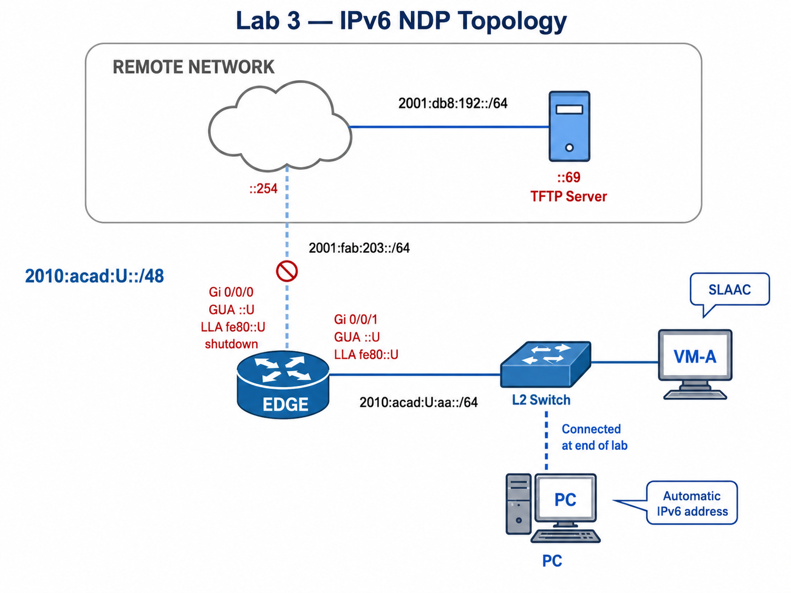

# Foundation Lab 03 — SLAAC and NDP: Discovering the Local Network

---

## Section A — Start Here

### A1 — Overview

You’ll observe how hosts learn prefixes and default gateways from **Router Advertisements (RAs)**, how **Router Solicitations (RS)** trigger those RAs, and how **Neighbour Unreachability Detection (NUD)**—via **NS/NA**—populates and refreshes the neighbour cache. You’ll capture **ops-only** evidence at checkpoints, then re-run final proofs at submission.

### A1.1 — Mini Quick-Ref

| Term | What it proves |
|---|---|
| RA (Router Advertisement) | EDGE is offering a prefix and itself as default router on the LAN |
| SLAAC | VM builds its own GUA from the advertised prefix + its own interface ID |
| NS/NA | EDGE and VM resolve each other's link-layer address and keep the neighbour cache current |
| NUD states | INCOMPLETE → REACHABLE → STALE → DELAY/PROBE — how a neighbour entry is confirmed and re-confirmed |
| DAD (Duplicate Address Detection) | A node refuses to use an address another node already holds |

### A1.2 — Evidence Collection

One file per checkpoint (C01–C05), uploaded by `scp` as soon as the server is reachable — C00 has no submission of its own:

```text
l03-c0N-{username}.txt
```

`l03-c01-{username}.txt` through `l03-c04-{username}.txt` are save on the **PC's Desktop** as you go.
`l03-c05-{username}.txt` it's produced directly on VM by `x_remote` (C05), and uploaded from there.
EDGE's running configuration (`l03-config-{username}.txt`) is sent from EDGE itself, by TFTP, at C05.

### A2 — Why This Lab Is Important

- IPv6 hosts must learn local network information before communication can work.
- SLAAC uses Router Advertisements to learn the prefix and default router.
- NDP replaces ARP + ICMP router discovery in IPv6. Reading **RS/RA** fields (prefixes, lifetimes, flags, router preference) explains why hosts form GUAs and pick a default via the router’s **LLA**.
- **NS/NA** provide address resolution and maintains the **neighbour cache**. You’ll read **NUD** states (INCOMPLETE → REACHABLE → STALE/PROBE) to diagnose first‑ping failures and link reachability.
- **DAD (Duplicate Address Detection)** prevents two nodes on the same segment from using the same IPv6 address. You’ll provoke a duplicate and prove how the tentative address is rejected.
- Logs show what the device observed, not what the configuration was supposed to do.

### A3 — Objectives / Evidence Map

| Objective                                                                    | Checkpoint | Points        |
| ---------------------------------------------------------------------------- | ---------- | ------------- |
| Topology cabled, Alpine's network adapter configured                         | C00        | 0 (gate only) |
| Apply EDGE's configuration script; configure the RA-source interface by hand | C01        | 3             |
| Force VM's MAC address; read EDGE's RA/RS log evidence                       | C02        | 3             |
| Read EDGE's NS/NA log evidence and neighbour table                           | C03        | 2.5           |
| Provoke and verify Duplicate Address Detection                               | C04        | 2.5           |
| Clean up, enable the transit link, run the automated collection from VM      | C05        | 4             |
| **Base Total**                                                               |            | **15**        |

---

## Section B — Topology and Addressing

### B1 — Topology



Topology notes:

```text
Replace U with your assigned value.
The PC is not connected at the beginning of the lab.
Connect the PC only in C04 when instructed.
```

### B2 — Addressing Table

| Device | Interface | Network | IPv6 Address / Prefix | Notes |
|---|---|---|---|---|
| EDGE | `GigabitEthernet0/0/0` | Transit | `2001:fab:203::U/64`, `fe80::U` | Kept `shutdown` until C05 |
| Remote gateway | remote-facing interface | Transit | `2001:fab:203::254/64` | Next hop toward the TFTP network; staff-managed |
| TFTP Server | NIC | Server LAN | `2001:db8:192::69/64` | Submission target; staff-managed |
| EDGE | `GigabitEthernet0/0/1` | VM LAN | `2010:acad:U:aa::U/64`, `fe80::U` | RA source; default router LLA for VM |
| VM | `eth0` | VM LAN | SLAAC-generated | Learned from EDGE's RA |
| VM | `eth0` | VM LAN | `02:00:00:00:U:09` | Forced MAC (see B1's two-digit note) |
| PC | NIC | VM LAN | Automatic (SLAAC) | Not connected until C04 |

### B3 — Files Required

| File | Used in | Where to get it |
|---|---|---|
| [`l03-edge.cfg`](../src/l03-edge.cfg) | C01 | Course GitHub repository |
| [`l03-ndp-xremote.yaml`](../src/l03-ndp-xremote.yaml) | C05 | Course GitHub repository — C05 also retrieves it from the TFTP server with `scp` |

---

## Section C — Lab Tasks and Evidence

### C00 — Build the Topology

#### Goal

Cable the pod and bring Alpine's VM network adapter onto the lab network, before any IPv6 configuration begins.

#### Why This Matters

None of this is an IPv6 skill, but every later checkpoint depends on it being right. A VM stuck on NAT, or bridged to the wrong physical NIC, looks exactly like a broken IPv6 problem later — except the actual cause is a VMware setting from before the lab even started, which is a much harder thing to trace back to once you're several checkpoints in.

#### Action

1. Cable EDGE `Gi0/0/1` to VM's LAN switch/port.
2. Cable EDGE `Gi0/0/0` to Remote using the **white jack** in your pod.
3. Open the **Alpine VM** — not `alpine-24F VM`, a similarly named VM left over from a previous course offering. Credentials: `admin` / `cisco`.
4. Alpine's network adapter defaults to **NAT** — change it to **Custom**. Then, in VMware's **Virtual Network Editor**, confirm `vmnet0` is bridged to the **RealTek NIC (black port)**, not another adapter on your host.

**PC is not part of the topology yet.** Leave it disconnected and without an IPv6 address — it joins the network at C04, not before.

#### Verification

In VMware: confirm Alpine's adapter is set to Custom (`vmnet0`), and that Virtual Network Editor shows `vmnet0` bridged to the RealTek NIC (BLACL jack).

#### Success Indicator / Failure Signal

| Verification Item | Success Indicator | Failure Signal |
|---|---|---|
| Cabling | EDGE–VM and EDGE–Remote links connected as above | A link missing or on the wrong jack |
| Correct VM | The **Alpine VM** is the one running | `alpine-24F VM` (or any other similarly named VM) is running instead |
| Network adapter | Set to Custom, `vmnet0` | Still on NAT |
| Virtual Network Editor | `vmnet0` bridged to the RealTek NIC (black port) | Bridged to a different adapter, or unset |

#### Troubleshooting

If Alpine has no usable link after the adapter change: recheck the Virtual Network Editor's `vmnet0` binding specifically — on a host with more than one physical NIC, it's easy to leave it bound to the wrong one.

No separate evidence file for C00 — its state is confirmed live, not submitted.

---

### C01 — Apply EDGE's Configuration Script and Configure the Router Advertisement Source

#### Goal

Apply EDGE's provided configuration script, then write Gi0/0/1's own configuration — the interface that becomes VM's Router Advertisement source.

#### Why This Matters

Everything in the script below — hostname, hardening, SSH, the transit interface — is boilerplate you'd type identically every time. Turning it into a file you apply once, instead of retyping it by hand, is the simplest form of automation there is — the same idea behind `x_remote` later in this lab, and every heavier automation tool later in this course. Gi0/0/1 is different: EDGE cannot advertise a prefix it doesn't have, and VM cannot form an address from a prefix EDGE never sends. This is the one interface in the whole lab where you're the one deciding what EDGE's IPv6 identity actually is — everything downstream (SLAAC, neighbour discovery, DAD) only makes sense in terms of the address you set here.

#### Action

Replace `U` with your assigned value (full value, not the two-digit MAC form).

1. Download [`l03-edge.cfg`](../src/l03-edge.cfg) (B3). Replace `{device-hostname}` with `{username}-EDGE`, and every `U` with your assigned value.
2. Read the file's own comments — `Gi0/0/0` is fully configured as a worked model; `Gi0/0/1` is deliberately left for you. Add `Gi0/0/1`'s configuration to the file (or type it directly at the EDGE CLI after applying the rest), following `Gi0/0/0`'s shape but using the VM LAN addressing from B2, and ending in `no shutdown`, not `shutdown`.
3. Apply the completed file to EDGE — either paste its contents at the CLI.

#### Verification

```text
EDGE# show ip ssh
EDGE# show ipv6 interface brief
EDGE# show ipv6 interface GigabitEthernet0/0/1
EDGE# show ipv6 route static
```

#### Success Indicator / Failure Signal

| Verification Item           | Success Indicator                                        | Failure Signal                                                                                                   |
| --------------------------- | -------------------------------------------------------- | ---------------------------------------------------------------------------------------------------------------- |
| SSH                         | `show ip ssh` reports SSH enabled, version 2             | SSH disabled, or key generation failed                                                                           |
| `Gi0/0/0` (provided)        | Down/down (still shut) with `2001:FAB:203::U`            | Wrong state, missing address, wrong `U`                                                                          |
| `Gi0/0/1` (your own config) | Up/up with `2010:ACAD:U:AA::U` and `FE80::U`, ND enabled | Down, missing address, or ND suppressed                                                                          |
| Default route               | `show ipv6 route static` shows **no** route yet          | A route already appears — `Gi0/0/0` is still shut down at this point, so this is expected, not a fault (see C05) |

#### Troubleshooting

If SSH key generation fails or `show ip ssh` shows it disabled: confirm the hostname and `ip domain-name` were both applied before `crypto key generate rsa` ran — re-run `crypto key generate rsa modulus 1024` if needed. If `Gi0/0/1` won't come up: confirm you typed `no shutdown` (not `shutdown`) — it's easy to leave it shut after copying Gi0/0/0's shape.

#### C01 — Collection of Information

```diff
=== C01 – EDGE Configuration Script Applied and RA Source Configured ===
```
```text
EDGE# show ip ssh
<paste output>

EDGE# show ipv6 interface brief
<paste output>

EDGE# show ipv6 interface GigabitEthernet0/0/1
<paste output>

EDGE# show ipv6 route static
<paste output>
```
```text
!-- This evidence shows SSH enabled, EDGE's configuration script applied, Gi0/0/1 configured by hand as the LAN RA source, and Gi0/0/0 still down until C05.
```

Save this as `l03-c01-{username}.txt` on **PC's Desktop** — **you cannot upload it yet.** EDGE's transit link to the TFTP server (`Gi0/0/0`) is deliberately down until C05, and PC itself isn't even connected until C04. Upload C01–C04 together once PC is online and that link is up (see C05's Collection of Information).

---

### C02 — Set VM's MAC Address and Trigger RS/RA

#### Goal

Force VM's MAC address to a recognizable pattern, trigger a fresh RS/RA cycle, and capture EDGE's advertisement on the log.

#### Why This Matters

SLAAC = the RA's prefix + the host's own interface ID. **EUI-64**: take the MAC, insert `ff:fe` in the middle, flip the U/L bit (XOR the first byte with `0x02`). Forcing VM's MAC to a pattern that includes your own `U` value is what makes that interface ID recognizable in the resulting address instead of arbitrary. A host's initial Router Solicitation is what prompts EDGE's Router Advertisement — reading that exchange directly in EDGE's own log, in the exact wording Cisco IOS uses, is the recognition skill this checkpoint is for; it's the same log wording you'll be asked to read again later this course.

Worked example, `U = 99`:
```text
VM MAC: 02:00:00:00:99:09
VM LLA: fe80::ff:fe00:9909
VM GUA: 2010:acad:99:aa:0:ff:fe00:9909/64
```

#### Action

Replace `U` with your assigned value.  If your `U` has only one digit, pad with an extra `0`; for example, if U = 7, use `07`.

1. Start an NDP debug capture on EDGE:
   ```text
   EDGE# undebug all
   EDGE# clear logging
   EDGE# terminal monitor
   EDGE# debug ipv6 nd
   ```
2. On VM, set the MAC address and trigger a fresh RS/RA cycle:
   ```bash
   ip link set dev eth0 down
   ip link set dev eth0 address 02:00:00:00:U:09
   ip -6 addr flush dev eth0 scope global
   ip link set dev eth0 up
   sleep 10
   ```
3. If no RA is observed after 10 seconds, request one directly:
   ```bash
   rdisc6 eth0
   sleep 5
   ```
4. Stop debugging on EDGE:
   ```text
   EDGE# undebug all
   ```

#### Verification

```text
EDGE# show logging | include ICMPv6-ND|Received RS|Sending solicited RA|Sending RA|send RA|prefix|MTU
```

> **Note on `include`:** Cisco IOS's `show ... | include` filter is case-sensitive. `ICMPv6-ND` will not match if you type `icmpv6-nd` — copy the exact case shown above, and if this filter returns nothing, check case before assuming the log is empty or the RA never happened.

#### Success Indicator / Failure Signal

| Evidence | Success Indicator | Failure Signal |
|---|---|---|
| EDGE log | `Received RS` from the VM LLA | No RS line |
| EDGE log | `Sending solicited RA` | No solicited RA line |
| EDGE log | `Sending RA ... to FF02::1` | No RA sent to all-nodes multicast |
| EDGE log | `MTU = 1500` | MTU option missing |
| EDGE log | `prefix 2010:ACAD:U:AA::/64 [LA]` | Prefix line missing or wrong |

Expected log pattern (shown for the `U = 99` worked example — your own log will show your own `U` value's derived pattern):

```text
ICMPv6-ND: (GigabitEthernet0/0/1,FE80::FF:FE00:9909) Received RS
ICMPv6-ND: (GigabitEthernet0/0/1) Sending solicited RA
ICMPv6-ND: (GigabitEthernet0/0/1,FE80::99) Sending RA (1800) to FF02::1
ICMPv6-ND:   MTU = 1500
ICMPv6-ND:   prefix 2010:ACAD:99:AA::/64 [LA] 2592000/604800
```

#### Troubleshooting

If nothing is captured at all: confirm EDGE's `Gi0/0/1` is actually up/up (C01) — a down RA source sends nothing to solicit an answer from. If the filter returns nothing but you're sure the RA happened: recheck case (see the note above) before re-running the whole exercise.

#### C02 — Collection of Information

```diff
=== C02 – RS/RA and Advertised Prefix Evidence ===
```
```text
EDGE# show logging | include ICMPv6-ND|Received RS|Sending solicited RA|Sending RA|send RA|prefix|MTU
<paste output>
```
```text
!-- EDGE received an RS from the VM and sent an RA with the LAN prefix and MTU.
```

Do not collect any VM command output for this checkpoint.

Save this as `l03-c02-{username}.txt` on PC's Desktop — upload deferred until C05, same as C01.

---

### C03 — Watch NS/NA Build the Neighbour Cache

#### Goal

Generate neighbour traffic between VM and EDGE, then read the NS/NA exchange and resulting NUD states in EDGE's own log and neighbour table.

#### Why This Matters

NS/NA is address resolution — it's what actually lets EDGE deliver a frame to VM, not just know a route exists. Reading the NUD state progression (INCOMPLETE → REACHABLE → STALE → DELAY/PROBE) directly in Cisco's log wording is, again, a recognition skill you'll need again later this course, not just something to make happen once and forget.

#### Action

Replace `U` with your assigned value.

1. Start a new NDP debug capture on EDGE:
   ```text
   EDGE# undebug all
   EDGE# clear logging
   EDGE# terminal monitor
   EDGE# debug ipv6 nd
   ```
2. On VM, clear the neighbour cache and send traffic to EDGE's GUA:
   ```bash
   ip -6 neigh flush dev eth0
   ping -6 -c 2 2010:acad:U:aa::U
   ```
3. Wait 5 seconds, then send link-local traffic:
   ```bash
   ping -6 -c 2 fe80::U%eth0
   ```
4. Wait long enough to observe state movement:
   ```bash
   sleep 30
   ```
5. Stop debugging on EDGE:
   ```text
   EDGE# undebug all
   ```

#### Verification

```text
EDGE# show logging | include NS|NA|STALE|DELAY|PROBE|REACH
EDGE# show ipv6 neighbors
```

If `show ipv6 neighbors` shows `STALE` instead of `REACH`: ping again from VM and immediately repeat the command — don't treat a `STALE` capture as if it were `REACH`.

#### Success Indicator / Failure Signal

| Evidence | Success Indicator | Failure Signal |
|---|---|---|
| EDGE log | `Received NS` from the VM GUA | No NS line from VM GUA |
| EDGE log | `Sending NA` to the VM GUA | No NA line |
| EDGE log | `STALE -> DELAY`, `DELAY -> PROBE`, `PROBE -> REACH` | No state movement captured |
| `show ipv6 neighbors` | VM's GUA and LLA appear with a MAC and `REACH` | Missing neighbour, or only stale/incomplete state |

Expected log pattern (`U = 99` worked example):

```text
ICMPv6-ND: (GigabitEthernet0/0/1,2010:ACAD:99:AA::99) Received NS from 2010:ACAD:99:AA:0:FF:FE00:9909
ICMPv6-ND: (GigabitEthernet0/0/1,2010:ACAD:99:AA::99) Sending NA to 2010:ACAD:99:AA:0:FF:FE00:9909
ICMPv6-ND: (GigabitEthernet0/0/1,2010:ACAD:99:AA:0:FF:FE00:9909) STALE -> DELAY
ICMPv6-ND: (GigabitEthernet0/0/1,2010:ACAD:99:AA:0:FF:FE00:9909) DELAY -> PROBE
ICMPv6-ND: (GigabitEthernet0/0/1,2010:ACAD:99:AA:0:FF:FE00:9909) PROBE -> REACH
```

#### Troubleshooting

If pings succeed on VM but nothing shows in EDGE's log: confirm the debug capture was actually running before you pinged (step 1 before step 2, in order) — a capture started after the fact catches nothing from before it started.

#### C03 — Collection of Information

```diff
=== C03 – NS/NA and NUD State Evidence ===
```
```text
EDGE# show logging | include NS|NA|STALE|DELAY|PROBE|REACH
<paste output>

EDGE# show ipv6 neighbors
<paste output>
```
```text
!-- EDGE observed NS/NA traffic and has a reachable neighbour entry for VM.
```

Do not collect any VM command output for this checkpoint.

Save this as `l03-c03-{username}.txt` on PC's Desktop — upload deferred until C05, same as C01/C02.

---

### C04 — Provoke and Verify Duplicate Address Detection

#### Goal

Deliberately duplicate EDGE's own LAN address on VM and prove DAD rejects it.

#### Why This Matters

DAD is what stops two nodes from silently colliding on the same address — you need to see it fail on purpose once to recognize the symptom by accident later.

#### Action

Replace `U` with your assigned value.

1. On VM, duplicate EDGE's own LAN address:
   ```bash
   ip -6 addr add 2010:acad:U:aa::U/64 dev eth0
   sleep 5
   ```
2. Confirm the duplicate was rejected (leave it in place for now — you remove it in C05).
3. **Connect PC now.** Connect PC to VM's LAN switch and set it to automatic (SLAAC) IPv6 addressing. From PC, SSH to VM using **VM's link-local address, not its GUA** — VM's GUA is untrustworthy right now, since it's the address you just duplicated onto EDGE in step 1.

#### Verification

```text
EDGE# show logging | include DAD
```
```bash
ip -6 addr show dev eth0
```

> Reminder: `include` is case-sensitive, same as C02.

#### Success Indicator / Failure Signal

| Evidence | Success Indicator | Failure Signal |
|---|---|---|
| EDGE log | DAD attempt detected for `2010:ACAD:U:AA::U` | No DAD evidence |
| VM address | Duplicate GUA shows `dadfailed tentative` | Duplicate address appears usable |
| PC → VM SSH | Session succeeds using VM's LLA | Connection refused, or attempted via VM's GUA instead |

#### Troubleshooting

If no DAD evidence appears: confirm VM and EDGE are genuinely on the same LAN segment — DAD is link-local in scope and cannot detect a duplicate across a routed boundary.

#### C04 — Collection of Information

```diff
=== C04 – Duplicate Address Detection Evidence ===
```
```text
EDGE# show logging | include DAD
<paste output>

VM# ip -6 addr show dev eth0
<paste output>
```
```text
!-- VM attempted to use EDGE's own GUA; DAD marked the duplicate address dadfailed and EDGE's original address was unaffected.
```

Save this as `l03-c04-{username}.txt` on PC's Desktop — upload deferred until C05: PC is connected now, but EDGE's transit link still isn't up yet.

---

### C05 — Clean Up, Collect, and Prove Final Readiness

#### Goal

Remove the duplicate address, enable EDGE's transit link, run an automated evidence collection from VM, and send EDGE's running configuration to the TFTP server.

#### Why This Matters

This checkpoint proves the lab left the topology in a clean, working state — not just that each individual protocol behaved correctly in isolation. Pulling the collection manifest from the server, rather than a link you already have, is also a small rehearsal for Section D's submission model: `scp` is how you both retrieve and hand back files in this course.

#### Action

Replace `U` with your assigned value.

1. On VM, remove the duplicate address:
   ```bash
   ip -6 addr del 2010:acad:U:aa::U/64 dev eth0
   ```
2. On EDGE, bring up the transit link:
   ```text
   EDGE(config)# interface GigabitEthernet0/0/0
   EDGE(config-if)# no shutdown
   ```
3. On VM, retrieve the collection manifest from the TFTP server (now reachable, since step 2 brought the transit link up) — into your home directory, **not** `~/bin`: `~/bin` is where `x_remote.py` itself lives, not a place for data files.
   ```bash
   scp cisco@[2001:db8:192::69]:/var/cst8371/xremote/l03-ndp-xremote.yaml ~/
   ```
4. Edit the manifest: replace every `U` in the two `ip:` addresses (EDGE's and VM's) with your assigned value, and replace `{username}` in the `output_file:` line with your own username.
5. **Run the automated collection.** `~/bin` is already on your `PATH`, so `x_remote.py` runs by name from anywhere:
   ```bash
   x_remote.py ./l03-ndp-xremote.yaml
   ```
   This produces `l03-c05-{username}.txt` directly.
6. On EDGE, send your running configuration to the TFTP server. This is the only TFTP transfer in the lab — EDGE is a router, so it uses TFTP; everything you move from PC or VM uses `scp`.
   ```text
   EDGE# copy running-config tftp://[2001:db8:192::69]/l03-config-{username}.txt
   ```

#### Verification

Open `l03-c05-{username}.txt` and confirm it contains: EDGE's interface/neighbour/route state, and VM's MAC, address, route, and a **100%-successful** ping to the TFTP server.

#### Success Indicator / Failure Signal

| Evidence | Success Indicator | Failure Signal |
|---|---|---|
| VM MAC (in output) | `02:00:00:00:U:09` still appears | MAC changed or reset |
| VM address (in output) | SLAAC GUA remains; duplicate address is gone | `dadfailed tentative` duplicate remains |
| VM route (in output) | Default route via `fe80::U` appears | Default route missing |
| Ping to TFTP server (in output) | `2 packets received`, `0% packet loss` | Ping fails — transit link may still be down |
| Manifest retrieval | `scp` succeeds, `l03-ndp-xremote.yaml` present in your home directory | Connection refused — transit link may still be down |
| `x_remote` run | Completes without connection errors | Authentication failure or timeout |
| Running-config transfer | The `copy` ends with `bytes copied` | `%Error`, timeout, or no `bytes copied` line |

#### Troubleshooting

If the TFTP-server ping, the manifest `scp`, or the running-config `copy` fails: confirm `Gi0/0/0` actually came up (`show ipv6 interface brief` on EDGE), then `ping 2001:db8:192::69` from EDGE — this is the only checkpoint where that link matters.

#### C05 — Collection of Information

`l03-c05-{username}.txt` **is** the `x_remote` output file, unedited.

**Upload now, from wherever each file actually lives:**

From VM:
```bash
scp l03-c05-{username}.txt cisco@[2001:db8:192::69]:/var/tftp/
```

From PC (its Desktop, where C01–C04 were saved):
```bash
scp l03-c01-{username}.txt l03-c02-{username}.txt l03-c03-{username}.txt l03-c04-{username}.txt cisco@[2001:db8:192::69]:/var/tftp/
```

---

## Section D — Submission

### D1 — Submission Requirements

| File | Content | Saved on | Uploaded from |
|---|---|---|---|
| `l03-c01-{username}.txt` | EDGE script + RA-source config | PC's Desktop | PC, at C05 |
| `l03-c02-{username}.txt` | EDGE's RS/RA log evidence | PC's Desktop | PC, at C05 |
| `l03-c03-{username}.txt` | EDGE's NS/NA log and neighbour-table evidence | PC's Desktop | PC, at C05 |
| `l03-c04-{username}.txt` | DAD evidence | PC's Desktop | PC, at C05 |
| `l03-c05-{username}.txt` | `x_remote` output, unedited | VM's home directory | VM, at C05 |
| `l03-config-{username}.txt` | EDGE's running configuration | — | EDGE, by TFTP, at C05 |

C01–C04 can't reach the server before C05 brings the transit link up — and PC itself isn't connected until C04.

### D2 — Validate

Confirm all six files landed:

```bash
ssh cisco@2001:db8:192::69 "ls -la /var/tftp/l03-*{username}*"
```

A complete submission shows all six files, each non-zero size.

### D3 — Cleanup

On EDGE, after submission is confirmed:

```text
EDGE# tclsh clean.tcl
```

Expected output:

```text
=== Lab Cleanup Script ===

-- Step 1: Scanning flash: for saved config files --
  No saved config files found on flash:.

-- Step 2: Removing VLANs 2-1001 --
  VLANs 2-1001 removed.

-- Step 3: Checking startup-config --
  No startup-config present.

=== Cleanup Complete - No Reload Needed ===
```

Do not use `erase startup-config` or `reload` — the script above replaces both.

---

## End of Lab 03 — Discovery Before Routing

This lab proves local IPv6 discovery evidence. It does not prove DNS, application reachability, firewall policy, or full end-to-end enterprise routing.
