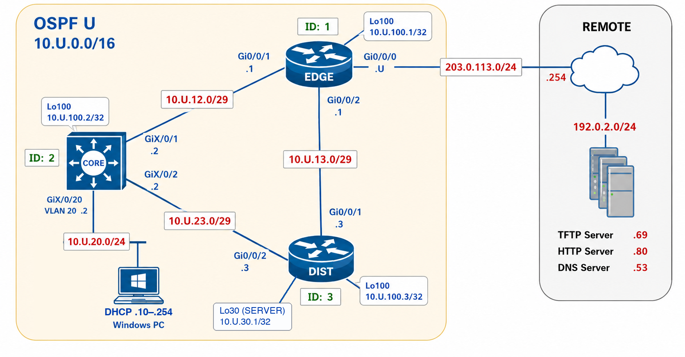

# Lab 05 — OSPF Neighbours and Route Advertisement

```plaintext
Environment: Cisco IOS-XE physical lab; Windows PC (PowerShell).
```

## Section A — Start Here

### A1 — Overview

This lab introduces single-area OSPFv2 on a three-router topology. You will form OSPF neighbours using interface-based activation, set stable Router IDs with Loopback100, advertise CORE VLAN20 as a passive interface, and verify learned routes plus default route propagation from EDGE.

The purpose of this lab is not only to make OSPF work. The purpose is to **prove**, from command output, that the control plane and data plane behave as expected.

- **Control-plane proof**: OSPF Router IDs, OSPF-enabled interfaces, neighbour state, and route installation.
- **Data-plane proof**: PC `ping` to the server loopback before and after it is advertised (C04), and a final PC `ping` and `tracert -d` to the course server through CORE (C05).
- **Evidence rule**: verification commands may be full output while you are checking; collection commands may be filtered so the submitted file stays readable.

### A1.1 — Mini Quick-Ref

| Question                                                   | Command                              |
| ---------------------------------------------------------- | ------------------------------------ |
| Which identity is active?                                  | `show ip ospf`                       |
| Which interfaces participate?                              | `show ip ospf interface brief`       |
| Which neighbours are established?                          | `show ip ospf neighbor`              |
| What network type, timers, role, priority, and cost apply? | `show ip ospf interface <interface>` |
| Which route and next hop are installed?                    | `show ip route <destination> <mask>` |
| Which forwarding next hops are installed?                  | `show ip cef <destination>`          |
| Does the user path work?                                   | PC `ping` and `tracert -d`           |

### A2 — Why This Lab Is Important

- OSPF neighbour formation is the foundation for dynamic route learning.
- Router ID, interface participation, and passive interfaces determine what OSPF advertises.
- Evidence must prove both protocol state and user-facing reachability.
- Troubleshooting starts with evidence: you separate cabling, addressing, and protocol faults, then diagnose and repair one adjacency fault (C03) using operational state.
- This lab creates the baseline for later OSPF tuning, DR/BDR, cost, timers, and convergence labs.

### A3 — Objectives / Evidence Map

| Objective | Checkpoint | Points |
|---|---|---:|
| Confirm provisioned baseline and host access | C00 | 0 — gate (nothing submitted) |
| Establish stable OSPF identities | C01 | 1 |
| Form intended adjacencies and interpret broadcast roles | C02 | 2 |
| Diagnose and repair a timer mismatch | C03 | 3 |
| Distinguish passive, excluded, and advertised interfaces | C04 | 2 |
| Verify default propagation and user reachability | C05 | 2 |
| **Total** | | **10** |

C00 is a mandatory unscored gate. Each scored objective requires all evidence listed in its checkpoint; successful configuration alone earns no credit.

## Section B — Topology and Addressing

### B1 — Topology



> The port table below is the cabling contract: CORE–EDGE is `GiX/0/1`, CORE–DIST is `GiX/0/2`, and the PC is on `GiX/0/20`, as in the image. The PC is the only host. DIST Loopback30 (`10.U.30.1/32`, the server address) is provisioned by Day0 and stays outside OSPF until C04. `Lo100` appears on each router because you create it in C01.

| Device | Type |
|---|---|
| EDGE, DIST | Cisco IOS-XE routers with G0/0/0–2 |
| CORE | Cisco IOS-XE Layer 3 switch, member-numbered GigabitEthernet ports (X is 1 or 2) |
| PC | Windows host; BLUE lab NIC to CORE, console cable for Day0 |
| REMOTE | Instructor upstream and course services (not student-managed) |


| Link      | Endpoint A                   | Endpoint B                                  |
| --------- | ---------------------------- | ------------------------------------------- |
| Upstream  | EDGE G0/0/0                  | Course upstream jack, gateway 203.0.113.254 |
| CORE–EDGE | CORE GiX/0/1                | EDGE G0/0/1                                 |
| EDGE–DIST | EDGE G0/0/2                  | DIST G0/0/1                                 |
| CORE–DIST | CORE GiX/0/2                | DIST G0/0/2                                 |
| User LAN  | CORE GiX/0/20, access VLAN20 | PC lab NIC                                  |

| Network | Subnet | Routing domain |
|---|---|---|
| Upstream | `203.0.113.0/24` | Outside OSPF |
| CORE–EDGE | `10.U.12.0/29` | OSPF Area 0 |
| EDGE–DIST | `10.U.13.0/29` | OSPF Area 0 |
| CORE–DIST | `10.U.23.0/29` | OSPF Area 0 |
| User LAN | `10.U.20.0/24` (VLAN20) | Advertised from CORE, passive |
| Loopbacks | `10.U.100.1–3/32` | OSPF Area 0 |
| Server loopback | `10.U.30.1/32` (DIST Loopback30) | Outside OSPF until C04 |

### B2 — Addressing Table

| Device | Interface | Address / role |
|---|---|---|
| EDGE | G0/0/0 | `203.0.113.U/24`; upstream outside OSPF |
| EDGE | G0/0/1 | `10.U.12.1/29` |
| CORE | GiX/0/1 | `10.U.12.2/29` |
| EDGE | G0/0/2 | `10.U.13.1/29` |
| DIST | G0/0/1 | `10.U.13.3/29` |
| CORE | GiX/0/2 | `10.U.23.2/29` |
| DIST | G0/0/2 | `10.U.23.3/29` |
| EDGE / CORE / DIST | Loopback100 (student-created in C01) | `10.U.100.1/32`, `10.U.100.2/32`, `10.U.100.3/32` |
| DIST | Loopback30 (Day0, SERVER) | `10.U.30.1/32`; outside OSPF until C04 |
| CORE | VLAN20 | `10.U.20.2/24`; host gateway |
| CORE | DHCP pool VLAN20 (Day0) | `10.U.20.0/24`, leases `.10`–`.254`; excluded `.1`–`.9`; gateway `10.U.20.2`; DNS `192.0.2.53` |
| PC | Lab NIC | DHCP lease from CORE: any address from `10.U.20.10` to `10.U.20.254`, mask `255.255.255.0`, gateway `10.U.20.2`, DHCP server `10.U.20.2` |
| Course services | TFTP/SSH / HTTP / DNS | `192.0.2.69` / `.80` / `.53` |

### B3 — Baseline Requirements

**Starting state:** partially configured. Before C01, check that Day0 left these in place:

- [ ] Hostnames, lab credentials, SSHv2, and IPv4 routing on EDGE, CORE, and DIST.
- [ ] Every B2 transit and upstream address, with the required interfaces enabled.
- [ ] CORE VLAN20 with its DHCP pool, and unused CORE access ports in shutdown VLAN666.
- [ ] DIST Loopback30 (`10.U.30.1/32`), addressed and outside OSPF.
- [ ] No OSPF process, network type, priority, reference-bandwidth adjustment, or cost override.
- [ ] No Loopback100. You create it in C01 and use it as the Router ID.

**You build, one checkpoint at a time:**

- [ ] C01: Loopback100 and the OSPF Router ID.
- [ ] C02: Area 0 activation and network types.
- [ ] C03: the timer fault and its repair.
- [ ] C04: passive VLAN20, and Loopback30 in Area 0.
- [ ] C05: the EDGE static default and its origination.

**Student scope:**

- [ ] Cable and provision the pod.
- [ ] Get the PC's address from CORE by DHCP.
- [ ] Make only the OSPF and interface changes that Section C specifies.

**Professor scope:** instructor upstream, servers, other pods, assigned addressing, and management credentials. The instructor supplies return routing for `10.U.0.0/16` through EDGE.

**Working rules:**

- [ ] Use `configure terminal` before configuration commands and `end` before verification.
- [ ] Keep the console connection open for recovery when you deliberately change a link.

### B4 — Management Access

| Target | How to reach it | Username / password |
|---|---|---|
| EDGE, CORE, DIST (Day0 and early checkpoints) | Console cable, 9600 baud, on the PC's COM port | `admin` / `cisco`; enable secret `class` |
| CORE (from C00) | `ssh admin@10.U.20.2` from the PC | `admin` / `cisco`; enable secret `class` |
| EDGE, DIST (after C04) | `ssh admin@10.U.100.1` and `ssh admin@10.U.100.3` from the PC (PowerShell). If Windows reports a key exchange error, use the flags in the C00 troubleshooting | `admin` / `cisco`; enable secret `class` |
| Course server (TFTP host) | `scp` and `ssh` to `192.0.2.69`, course network or working pod | `cisco` / `cisco` |

## Section C — Lab Tasks and Evidence

### C00 — Provision and prove access

#### Goal

Establish addressing and management before diagnosing OSPF.

#### Why This Matters

A failed SSH login or down link must not be mistaken for an adjacency problem. The PC is configured here, before OSPF exists, so any later reachability failure can be traced to routing rather than to host setup. You provision with the same procedure as Challenge 01, so the steps are in the Day0 guide and this checkpoint gives only this lab's values and checks.

#### Action

Complete the numbered actions in order. Use the checkboxes to track the subactions within each action.

1. **Prepare the PC.** You need two things: the **Day0 provisioning guide**, [day0-provision-guide.md](../resources/day0-provision-guide.md), and the lab content, `l05.zip`. Follow the guide through the setup script, using `l05` as the lab value. The script accepts a U from 1 to 253 (your Brightspace **U** grade; 254 is the upstream gateway address) and a CORE member of 1 or 2, and does not report `SETUP OK` unless all device templates and all five evidence files are present. When the guide reaches the download, run exactly this block:

   ```powershell
   Set-Location "$env:USERPROFILE\Desktop"
   $lab = "l05"
   scp cisco@192.0.2.69:configs/$lab.zip "$env:USERPROFILE\Desktop\"
   ```

2. **Cable the lab network.**

   - [ ] Cable the topology as in **B1**. Move the PC's BLUE NIC cable from the white jack to CORE `GiX/0/20`, and connect EDGE `G0/0/0` to the course upstream jack.
   - [ ] Trace each cable and verify both port labels. **Odd ports are on top; even ports are below.** Replace X with your switch member number.
   - [ ] Leave the console cable free for action 3.

3. **Provision EDGE, CORE, and DIST.** Follow the guide's provisioning steps once for each device, in this order: **EDGE**, **CORE**, **DIST**. Do not change the order: each link's far end is then provisioned before you need that link up.

   - [ ] Read each device's verification summary. Every ✔ line must pass except the link rows below, which may fail only while the device at the other end is not yet provisioned. For those rows, the `got` line must show the **correct address** from B2 with a down status:

     | Device | Rows allowed to show down at this point | Rows that must show ✔ |
     |---|---|---|
     | EDGE | G0/0/1 (CORE) and G0/0/2 (DIST) | SSH, no OSPF process, G0/0/0 up/up |
     | CORE | GiX/0/2 (DIST) | SSH, no OSPF process, GiX/0/1, Vlan20, DHCP pool |
     | DIST | none | every line |

   - [ ] Stop for anything else: a configuration line the device rejected, a failed SSH check, any OSPF process or other output where the summary expects none, a wrong address, or a down row not in the table. Do not re-push Day0 or add routing. Keep the error output and raise your hand. A down row not in the table is a cabling problem: see **Troubleshooting**.
   - [ ] **Final link check.** After DIST is provisioned, recheck all three devices without sending any configuration. Move the console cable to each device in turn (EDGE, CORE, DIST), set `$device`, and run:

     ```powershell
     python day0_provision.py --config day0-$lab.yaml --device $device --u $u --username $username --core-member $coreMember --port $consolePort --verify-only
     ```

     Every line must now show ✔ on all three devices, including every transit interface up/up with its B2 address. Do not re-push Day0 to clear a down row.

4. **Get the PC's lab address from CORE by DHCP.**

   - [ ] Set the BLUE NIC to **Obtain an IP address automatically** and **Obtain DNS server address automatically**. (In T113 it already is; other rooms switch back from the static course address.)
   - [ ] In PowerShell run `ipconfig /release` then `ipconfig /renew`.
   - [ ] Run `ipconfig /all`. Confirm an IPv4 address from **10.U.20.10** to **10.U.20.254** (the pool does not reserve `.10`; any address in the range is valid), mask **255.255.255.0**, gateway **10.U.20.2**, DHCP Server **10.U.20.2**, DHCP Enabled **Yes**.
   - [ ] Confirm the gateway answers. The result must show `Lost = 0 (0% loss)`:

     ```powershell
     ping 10.${u}.20.2
     ```

#### Verification

Read the Day0 verification summary for each device and the final link check in the PowerShell window. On the PC, run the commands from action 4:

```powershell
ipconfig /all
ping 10.U.20.2
```

#### Success Indicator / Failure Signal

| Verification Item | Success Indicator | Failure Signal |
|---|---|---|
| Package and setup | `SETUP OK` after the setup script, with all five evidence files created or kept | `SETUP FAILED: missing or invalid ...`, or an evidence file missing |
| EDGE Day0 summary | ✔ for SSH, no OSPF process, G0/0/0 `203.0.113.U` up/up; G0/0/1 `10.U.12.1` and G0/0/2 `10.U.13.1` with the correct address (down is allowed until CORE and DIST are provisioned) | A rejected line, failed SSH or OSPF check, wrong address, or G0/0/0 down |
| CORE Day0 summary | ✔ for SSH, no OSPF process, GiX/0/1 `10.U.12.2`, Vlan20 `10.U.20.2`, DHCP pool VLAN20; GiX/0/2 `10.U.23.2` with the correct address (down is allowed until DIST is provisioned) | A rejected line, failed SSH or OSPF check, wrong address, or any other row down |
| DIST Day0 summary | ✔ for SSH, no OSPF process, G0/0/1 `10.U.13.3`, G0/0/2 `10.U.23.3`, Loopback30 `10.U.30.1` | Any ✘, or an interface reported down |
| Final link check | `--verify-only` on EDGE, CORE, and DIST shows ✔ on every line, with every transit interface up/up | Any ✘ on any device, or Day0 re-pushed to get past it |
| PC DHCP lease | `ipconfig /all` shows DHCP Enabled `Yes`, an address from `10.U.20.10` to `10.U.20.254`, mask `255.255.255.0`, gateway `10.U.20.2`, and DHCP Server `10.U.20.2` | `169.254.x.x`, an address outside that range, a wrong mask, gateway, or server, or DHCP Enabled `No` (a static address does not pass this row) |
| PC gateway ping | `ping 10.U.20.2` shows `Lost = 0 (0% loss)` | Any loss |
| Evidence files | `l05-c01-<username>.txt` to `l05-c05-<username>.txt` exist on the Desktop, with your username and U in the first lines | A file missing, or `{USERNAME}` / `{U}` still visible |

#### Troubleshooting

**If a verification check fails:**

- [ ] **An interface shows down.** While the device at the other end is not yet provisioned, a down link row is expected (see action 3). Once every device is provisioned, check your cabling against **B1** and verify both port labels on that cable. You can fix cabling after provisioning; you do not need to rerun Day0. Recheck with the `--verify-only` command from action 3, or on the device console:

  ```text
  show ip interface brief | exclude unassigned
  ```

- [ ] **A switch interface is still down with correct cabling.** Cycle the interface (shut, then no shut) at **both ends** of the link: on CORE and on the connected router interface.
- [ ] **PC shows 169.254.x.x or no lease.** Check in order: the BLUE cable is in CORE `GiX/0/20`; `show ip interface brief | include Vlan20` on CORE shows up/up; `show ip dhcp pool`; `show ip dhcp conflict`; then run `ipconfig /renew` again. After two attempts with no lease, set the temporary static fallback **10.U.20.9**/24, gateway **10.U.20.2**. `.9` is inside CORE's excluded range, so DHCP never offers it, and no lab device uses it. The fallback only lets you test the gateway ping: the PC DHCP lease row is still not met, so raise your hand and do not start C01 until the instructor accepts the result.
- [ ] **The lease has the wrong mask, gateway, or DHCP server, or lies outside `.10`–`.254`.** Any address from `10.U.20.10` to `10.U.20.254` is valid. On CORE check `show ip dhcp pool`, `show ip dhcp binding`, and `show ip dhcp conflict`. Only if the PC's old binding or a listed conflict explains the result, clear it with `clear ip dhcp binding *` or `clear ip dhcp conflict *`, then run `ipconfig /release` and `ipconfig /renew` again.
- [ ] **Windows reports "no matching key exchange method" when you SSH to a Cisco device.** Use:

  ```powershell
  ssh -o KexAlgorithms=+diffie-hellman-group14-sha1 -o HostKeyAlgorithms=+ssh-rsa "admin@10.${u}.20.2"
  ```

- [ ] **Any other Day0 failure.** Keep the error output and raise your hand before starting C01.

#### Collection of Information

No submission is required for this checkpoint. C00 is worth 0 points; the success indicators above are your check.

### C01 — Establish stable OSPF identity

#### Goal

Set predictable Router IDs before adjacency formation, so neighbour identities can be traced to devices.

#### Why This Matters

OSPF identifies neighbours and database originators by Router ID. Setting an explicit ID before enabling transit links makes the later neighbour tables predictable and avoids changing an active identity mid-experiment.

#### Action

1. **Open your evidence file.** `l05-c01-<username>.txt` is on your Desktop. Its header names the lab and you. Each device starts at a banner line, and each command has a slot under it:

   ```text
   !-- ========================= EDGE =========================
   show ip ospf | include Routing Process|Router ID
   !-- Copy results here:
   ```

   Steps marked **CAPTURE** go into this file. For each one, run the command on the device, then paste the prompt, the command, and the raw output into the slot under that command. Do not edit the output.

2. **On each device, create Loopback100.** It is a stable interface that never goes down, which is why it is the source of the Router ID. Use the EDGE commands. On CORE use `10.U.100.2`, on DIST `10.U.100.3`:

   ```text
   interface loopback100
    ip address 10.U.100.1 255.255.255.255
   ```

3. **On each device, create OSPF process `U` and set the Router ID to the Loopback100 address.** The Router ID is an identity, not a route. Nothing is advertised yet:

   ```text
   router ospf U
    router-id 10.U.100.1
   ```

4. **On each device, activate Area 0 on Loopback100 only.** Transit links stay out of OSPF for now, so no neighbours form. The `network` command is not used in this course, and using it is penalized:

   ```text
   interface loopback100
    ip ospf U area 0
   ```

5. **Explore before you capture.** Run `show ip ospf`, `show ip ospf interface loopback100`, and `show ip interface brief` until you can find each fact yourself. `show ip ospf` shows what you set on the router (process number and Router ID). `show ip ospf interface` shows what is enabled on the interface. You need both.
6. **CAPTURE on EDGE, then CORE, then DIST.** Run these three commands on each device's console. Paste each result under that device's banner:

   ```text
   show ip ospf | include Routing Process|Router ID
   show ip ospf interface loopback100 | include Loopback100|Area
   show tcp brief
   ```

7. **Write your `!-- PROOF:` line** at the bottom of the file.

#### Verification

Use any commands you need to investigate. Then review your evidence file `l05-c01-<username>.txt` before you move on:

- [ ] No slot still shows `!-- Copy results here:` with nothing pasted under it.
- [ ] In the file, every command under EDGE, CORE, and DIST has its prompt, command, and raw output pasted in.
- [ ] Each result matches its row in the table below.
- [ ] Your `!-- PROOF:` line is written.

#### Success Indicator / Failure Signal

| Verification Item | Success Indicator | Failure Signal |
|---|---|---|
| Process and Router ID, each device | `Routing Process "ospf U" with ID 10.U.100.N` (N = 1 EDGE, 2 CORE, 3 DIST) | Wrong process number, wrong Router ID, or no OSPF process |
| Loopback100 in Area 0, each device | `Loopback100 is up, line protocol is up` and `Internet Address 10.U.100.N/32 ... Area 0` | Loopback missing, not up/up, or not in Area 0 |
| Submission-uniqueness check | `show tcp brief` output is present with the device prompt on all three devices | Output missing on any device (collected, not scored) |

#### Troubleshooting

Confirm the loopback was created with the B2 address before the Router ID, and the selected process number. An unexpected existing OSPF process indicates a baseline problem; use instructor reset support rather than an unexplained process clear.

#### Collection of Information

Complete `l05-c01-<username>.txt` following its template, ending with your `!-- PROOF:` line. Keep it on your Desktop; you upload all five files in D2 after C05.

### C02 — Form neighbours and observe broadcast roles

#### Goal

Build adjacencies and distinguish the network type from the physical medium.

#### Why This Matters

OSPF chooses how a link behaves from its **network type**:

- **Broadcast** is the default on Ethernet. Several routers can share the segment, so OSPF elects a Designated Router (DR) and Backup (BDR). Every other router forms a full adjacency only with those two, which avoids a mesh of adjacencies.
- **Point-to-point** suits a link with exactly two routers. There is no election, so the neighbour reaches `FULL/-` faster with fewer states.
- Other types (non-broadcast, point-to-multipoint) serve WAN technologies and are not used in this course.

Both ends of a link must agree on the type. Here the CORE links run point-to-point and only EDGE–DIST runs broadcast, so it is the only place a DR and BDR appear. The election is non-preemptive: which router wins depends on startup order, not on the router's name.

#### Action

1. **Open your evidence file.** `l05-c02-<username>.txt` is on your Desktop. Steps marked **CAPTURE** go into it: run the command on the device, then paste the prompt, the command, and the raw output into the slot under that command.
2. **Point-to-point links: enable one interface at a time.** Apply this pattern on CORE `GiX/0/1` and `GiX/0/2`, EDGE `G0/0/1`, and DIST `G0/0/2`. Replace `g0/0/1` with each interface name:

   ```text
   interface g0/0/1
    ip ospf U area 0
    ip ospf network point-to-point
   ```

   `ip ospf network` is an interface command. The `network` router command is not used in this course.

3. **Broadcast link: enable EDGE `G0/0/2` and DIST `G0/0/1`.** Keep the default priority and do not tune elections:

   ```text
   interface g0/0/2
    ip ospf U area 0
    ip ospf network broadcast
   ```

   Use `g0/0/1` on DIST. Do not enable OSPF on EDGE `G0/0/0`.

4. **Wait about 40 seconds** for the broadcast election and the adjacencies.
5. **Identify the DR and BDR on EDGE–DIST.** On EDGE run `show ip ospf interface g0/0/2` in full and read the roles.
6. **CAPTURE on EDGE.** Paste both results under the EDGE banner:

   ```text
   show ip ospf neighbor
   show ip ospf interface g0/0/2 | include Network Type|Designated
   ```

7. **CAPTURE on CORE.** Paste the result under the CORE banner:

   ```text
   show ip ospf neighbor
   ```

8. **Write your `!-- PROOF:` line.** Name the actual DR and BDR, and explain why point-to-point neighbours show `FULL/-`.

#### Verification

Use any commands you need to investigate. Then review your evidence file `l05-c02-<username>.txt` before you move on:

- [ ] No slot still shows `!-- Copy results here:` with nothing pasted under it.
- [ ] In the file, every command under EDGE and CORE has its prompt, command, and raw output pasted in.
- [ ] Each result matches its row in the table below.
- [ ] Your `!-- PROOF:` line is written.

#### Success Indicator / Failure Signal

| Verification Item | Success Indicator | Failure Signal |
|---|---|---|
| EDGE–CORE adjacency | EDGE's table lists CORE (`10.U.100.2`, address `10.U.12.2`) as `FULL/-` | Missing, not `FULL`, or shown with a DR/BDR role |
| CORE–DIST adjacency | CORE's table lists DIST (`10.U.100.3`, address `10.U.23.3`) as `FULL/-` | Missing, not `FULL`, or shown with a DR/BDR role |
| EDGE–DIST adjacency | EDGE's table lists DIST (`10.U.100.3`, address `10.U.13.3`) as `FULL/DR` or `FULL/BDR` | Missing, not `FULL`, or shown as `FULL/-` |
| Broadcast link roles | The filtered output for `g0/0/2` shows `Network Type BROADCAST`, one `Designated Router`, and one `Backup Designated router` | Point-to-point on this link, or no DR or BDR |

Each adjacency is checked from one side only: an adjacency is `FULL` on both routers or on neither. Either EDGE or DIST may be the DR, because the election is non-preemptive. A persistent `2WAY` state is not the target on this two-router segment; it can be normal between DROTHERs on a larger broadcast segment.

#### Troubleshooting

Check the affected link's up/up state, subnet, area, activation, network type, and timers at both ends. Do not change reference bandwidth or priorities.

#### Collection of Information

Complete `l05-c02-<username>.txt` following its template, ending with your `!-- PROOF:` line naming the actual DR and BDR. Keep it on your Desktop; you upload all five files in D2 after C05.

### C03 — Break, diagnose, and repair one adjacency

#### Goal

Learn that operational state can change even when physical interfaces remain up.

#### Why This Matters

A surviving alternate route does not prove every expected adjacency is healthy. When EDGE and DIST disagree on hello or dead interval, the link stays up/up but the adjacency is refused. CORE still carries traffic between them, which is exactly why this fault is easy to miss without neighbour evidence. The device log records when each adjacency dropped and why, so it is part of your proof.

#### Action

1. **Open your evidence file.** `l05-c03-<username>.txt` has three states: BEFORE, FAULT, RESTORED. Steps marked **CAPTURE** go into the state named in the step: run the command on EDGE, then paste the prompt, the command, and the raw output into the slot under that command.
2. **CAPTURE the BEFORE state on EDGE.** This is the healthy baseline, taken before you change anything. Paste both results under the EDGE banner in the `BEFORE` state:

   ```text
   show ip ospf neighbor
   show ip ospf interface g0/0/2 | include Timer intervals
   ```

   Expect a `FULL` neighbour on G0/0/2 and `Hello 10, Dead 40`.

3. **Set up the log buffer on EDGE, then turn on the hello debug.** Debug messages reach `show logging` only if the local buffer is enabled at debugging severity, so set it first and verify it before you rely on it:

   ```text
   configure terminal
    logging buffered 32768 debugging
   end
   show logging | include Buffer logging|Log Buffer
   ```

   The output must show `Buffer logging` at `level debugging` and a `Log Buffer (32768 bytes)` line. Then clear the log (answer `[confirm]` with Enter) and start the debug. The log then holds only this fault, and the debug shows the timers received from DIST, so DIST needs no commands. Use only this debug, never `debug all`:

   ```text
   clear logging
   debug ip ospf hello
   ```

4. **Change only EDGE `G0/0/2` to hello 5, dead 20:**

   ```text
   interface g0/0/2
    ip ospf hello-interval 5
    ip ospf dead-interval 20
   ```

5. **Wait at least 45 seconds,** so the original dead interval expires at both ends. Run `show ip ospf neighbor` until EDGE no longer shows a `FULL` neighbour for DIST.
6. **Turn the debug off:**

   ```text
   undebug all
   ```

7. **CAPTURE the FAULT state on EDGE, before you repair anything.** Paste all three results under the EDGE banner in the `FAULT` state:

   ```text
   show ip ospf neighbor
   show ip ospf interface g0/0/2 | include Timer intervals
   show logging | include ADJCHG|Mismatched|Dead R
   ```

8. **Compare EDGE's timers with the values the debug reports for DIST.** Then restore EDGE with the same commands, using `10` and `40`:

   ```text
   interface g0/0/2
    ip ospf hello-interval 10
    ip ospf dead-interval 40
   ```

9. **Wait for convergence.** Run `show ip ospf neighbor` until EDGE lists two `FULL` neighbours, CORE and DIST.
10. **CAPTURE the RESTORED state on EDGE.** Paste all three results under the EDGE banner in the `RESTORED` state:

    ```text
    show ip ospf neighbor
    show ip ospf interface g0/0/2 | include Timer intervals
    show logging | include ADJCHG
    ```

11. **Write your `!-- PROOF:` line.** Explain the mismatch and the smallest repair.

#### Verification

Use any commands you need to investigate. Then review your evidence file `l05-c03-<username>.txt` before you move on:

- [ ] No slot still shows `!-- Copy results here:` with nothing pasted under it.
- [ ] In the file, every command in the BEFORE, FAULT, and RESTORED states has its prompt, command, and raw output pasted in.
- [ ] Each result matches its row in the table below.
- [ ] Your `!-- PROOF:` line is written.

#### Success Indicator / Failure Signal

| Verification Item | Success Indicator | Failure Signal |
|---|---|---|
| BEFORE neighbour | EDGE lists DIST (`10.U.100.3`) as `FULL` | Not `FULL` before the fault |
| BEFORE timers | `Hello 10, Dead 40` | Different timers before the fault |
| FAULT timers | `Hello 5, Dead 20` | Timers unchanged (fault not applied) |
| FAULT neighbours | EDGE still lists CORE (`10.U.100.2`) as `FULL`, and DIST is absent or not `FULL` | CORE adjacency dropped, or DIST still `FULL` (captured too early) |
| FAULT adjacency log | `ADJCHG ... Nbr 10.U.100.3 on GigabitEthernet0/0/2 from FULL to DOWN` | No such entry, or the log was not cleared before the fault |
| FAULT mismatch cause | `Mismatched hello parameters from 10.U.13.3` | No debug capture |
| FAULT both sides' timers | `Dead R 40 C 20, Hello R 10 C 5` (R = received from DIST, C = configured on EDGE) | Line missing |
| RESTORED timers | `Hello 10, Dead 40` | Still mismatched, or EDGE left at 5/20 |
| RESTORED neighbours | EDGE lists CORE (`10.U.100.2`) and DIST (`10.U.100.3`) as `FULL` | Either neighbour missing or not `FULL` |
| RESTORED adjacency log | `ADJCHG ... Nbr 10.U.100.3 on GigabitEthernet0/0/2 from LOADING to FULL` | No `FULL` entry after the repair |

A missing DIST entry in the FAULT neighbour table, and `undebug all` before the FAULT capture, are checked by eye.

#### Troubleshooting

Wait through the original dead interval; verify the changed interface. If `show logging` does not list `Buffer logging` at `level debugging`, repeat the buffer commands in action 3 before you change the timers. If debug output floods the console, run `undebug all`. Repair only the timer pair. Do not reset the whole pod or change multiple fault families.

#### Collection of Information

Complete `l05-c03-<username>.txt` following its template (BEFORE, FAULT, RESTORED, in order), ending with your `!-- PROOF:` line. Keep it on your Desktop; you upload all five files in D2 after C05.

### C04 — Advertise a passive user LAN and the server loopback

#### Goal

Advertise VLAN20 to the other routers while preventing neighbour formation on the user LAN, then advertise the DIST server loopback and see what changes.

#### Why This Matters

A passive OSPF interface advertises its prefix while suppressing Hellos. An interface excluded from OSPF does neither. The route and interface evidence must distinguish these states: VLAN20 is passive (in OSPF, no neighbours), while EDGE G0/0/0 is excluded (not in OSPF at all). Loopback30 is a third case: it is addressed but not advertised, so nothing can route to it until you activate it. OSPF advertises a loopback as a /32 host route, and passive does not apply to it because a loopback can never form a neighbour.

#### Security Policy Statement / Placement

End hosts consume the network; they do not participate in routing. VLAN20 is therefore advertised but must never form an adjacency. Mark it passive before activating it so the interface is never neighbour-capable, even briefly.

#### Action

1. **Open your evidence file.** `l05-c04-<username>.txt` has three states: BEFORE, PARTIAL, AFTER. Steps marked **CAPTURE** go into the state named in the step: run the command on the named device or host, then paste the prompt, the command, and the raw output into the slot under that command.
2. **CAPTURE the BEFORE state on the consoles.** Neither VLAN20 nor Loopback30 is in OSPF yet. Run these on CORE and EDGE and paste each result under that device's banner in the `BEFORE` state:

   ```text
   CORE: show ip ospf interface vlan20
   EDGE: show ip route 10.U.20.0 255.255.255.0
   EDGE: show ip route 10.U.30.1 255.255.255.255
   ```

   Expect `OSPF not enabled on Vlan20` and `% Network not in table` twice.

3. **On CORE, make VLAN20 passive first, then activate it.** The interface is never neighbour-capable, even briefly:

   ```text
   router ospf U
    passive-interface vlan20
   interface vlan20
    ip ospf U area 0
   ```

4. **From the PC, open an SSH session to EDGE and one to DIST.** Return routes to VLAN20 now exist, so the loopbacks are reachable (see **B4**). Use one PowerShell window per device:

   ```powershell
   ssh admin@10.U.100.1
   ssh admin@10.U.100.3
   ```

   If Windows reports a key exchange error, use the flags in the C00 troubleshooting.

5. **CAPTURE the PARTIAL state.** VLAN20 is advertised and Loopback30 is still excluded. Paste each result under that device's banner in the `PARTIAL` state:

   ```text
   CORE: show ip ospf interface vlan20 | include Process ID|Area|Passive
   EDGE: show ip route 10.U.20.0 255.255.255.0
   EDGE: show ip route 10.U.30.1 255.255.255.255
   PC:   ping 10.U.30.1
   ```

   Expect the VLAN20 route `Known via "ospf U"` and `% Network not in table` for `10.U.30.1`. The ping must **fail** with `Destination net unreachable` or `Destination host unreachable` from `10.U.20.2`. Windows counts a router's unreachable reply as "Received", so do not judge this state by the loss percentage.

6. **On DIST, activate Loopback30 in Area 0:**

   ```text
   interface loopback30
    ip ospf U area 0
   ```

7. **CAPTURE the AFTER state.** Loopback30 is now advertised. Paste each result under that device's banner in the `AFTER` state:

   ```text
   DIST: show ip ospf interface loopback30 | include Process ID|Area|stub
   EDGE: show ip route 10.U.30.1 255.255.255.255
   EDGE: show ip ospf interface g0/0/0
   PC:   ping 10.U.30.1
   ```

   Expect Area 0 and a stub Host on DIST, `Known via "ospf U"` on EDGE, `OSPF not enabled` on `G0/0/0`, and replies from `10.U.30.1` with `Lost = 0 (0% loss)`.

8. **Write your `!-- PROOF:` line.** Contrast passive VLAN20, excluded `G0/0/0`, and Loopback30 unreachable until advertised, and give the reason.

#### Verification

Use any commands you need to investigate. Then review your evidence file `l05-c04-<username>.txt` before you move on:

- [ ] No slot still shows `!-- Copy results here:` with nothing pasted under it.
- [ ] In the file, every command in the BEFORE, PARTIAL, and AFTER states, on each device and on the PC, has its prompt, command, and raw output pasted in.
- [ ] Each result matches its row in the table below.
- [ ] Your `!-- PROOF:` line is written.

#### Success Indicator / Failure Signal

| Verification Item | Success Indicator | Failure Signal |
|---|---|---|
| BEFORE, CORE VLAN20 | `OSPF not enabled on Vlan20` | VLAN20 already participates |
| BEFORE, EDGE route to VLAN20 | `% Network not in table` | A route to the LAN is already present |
| BEFORE, EDGE route to Loopback30 | `% Network not in table` | A route to `10.U.30.1` is already present |
| PARTIAL, CORE VLAN20 process | `Process ID U` (your process number) | Not in OSPF, or a different process number |
| PARTIAL, CORE VLAN20 area | `Internet Address 10.U.20.2/24 ... Area 0` | Wrong area |
| PARTIAL, CORE VLAN20 passive | `No Hellos (Passive interface)` | Not passive |
| PARTIAL, EDGE route to VLAN20 | `Routing entry for 10.U.20.0/24` with `Known via "ospf U"` | Route absent, or learned another way |
| PARTIAL, EDGE route to Loopback30 | `% Network not in table` | Loopback30 already advertised |
| PARTIAL, PC ping | `Destination net unreachable` or `Destination host unreachable` from `10.U.20.2` | A reply from `10.U.30.1` (Loopback30 already advertised) |
| AFTER, DIST Loopback30 | Interface in `Area 0`, treated as a stub Host | Not in Area 0, or no stub Host line |
| AFTER, EDGE route to Loopback30 | `Routing entry for 10.U.30.1/32` with `Known via "ospf U"` | Route absent, or learned another way |
| AFTER, PC ping | `Reply from 10.U.30.1` and `Lost = 0 (0% loss)` | Unreachable, or any loss |
| Upstream excluded | `OSPF not enabled on GigabitEthernet0/0/0` | G0/0/0 participates in OSPF |

Your `!-- PROOF:` line must contrast passive VLAN20 (advertised, no Hellos), excluded G0/0/0 (neither), and Loopback30 (unreachable until advertised), and give the reason: in PARTIAL, CORE has no route to `10.U.30.1`, so it cannot forward the ping to it. DIST already has the connected loopback and a return route to VLAN20; the missing piece is the forward route to Loopback30 until DIST advertises it. It is checked by eye. An absent neighbour alone does not prove an interface is passive: the `Passive interface` line does.

#### Troubleshooting

Check VLAN20 up/up, Area 0 activation, and passive state separately. Do not remove passive to fix a missing advertisement. Do not add `passive-interface` to Loopback30; it has no neighbours to suppress. If `ssh` from the PC reports a key exchange error, add the compatibility options from the C00 troubleshooting (`-o KexAlgorithms=+diffie-hellman-group14-sha1 -o HostKeyAlgorithms=+ssh-rsa`).

#### Collection of Information

Complete `l05-c04-<username>.txt` following its template (BEFORE, PARTIAL, then AFTER), ending with your `!-- PROOF:` line. Keep it on your Desktop; you upload all five files in D2 after C05.

### C05 — Originate an exit route and prove service

#### Goal

Make EDGE the exit for unknown destinations and prove that a VLAN20 user can reach the remote server, from the Windows PC.

#### Why This Matters

An internal adjacency does not supply a default route automatically. EDGE needs an installed default and explicit origination; the remote network also needs a return route to the user LAN. Testing from a host on VLAN20 shows the path works for the LAN, through CORE, not from the routers themselves.

#### Action

1. **Open your evidence file.** `l05-c05-<username>.txt` has one state, FINAL, with a section for EDGE, CORE, and the PC. Steps marked **CAPTURE** go into it: run the command on the named device or host, then paste the prompt, the command, and the raw output into the slot under that command.
2. **On EDGE, install the static default and originate it into OSPF.** Do not add `always`:

   ```text
   ip route 0.0.0.0 0.0.0.0 g0/0/0 203.0.113.254
   router ospf U
    default-information originate
   ```

3. **Check the default on CORE and DIST** with `show ip route 0.0.0.0`. Both should learn it through OSPF.
4. **From the PC, open SSH sessions to EDGE and CORE** (see **B4**):

   ```powershell
   ssh admin@10.U.100.1
   ssh admin@10.U.20.2
   ```

5. **CAPTURE on EDGE and CORE.** Paste each result under that device's banner:

   ```text
   EDGE: show ip route 0.0.0.0
   CORE: show ip route ospf
   ```

6. **CAPTURE on the PC.** Run these on the PC while it is on VLAN20 through CORE, not on the course network. Paste both results under the PC banner:

   ```powershell
   ping 192.0.2.69
   tracert -d 192.0.2.69
   ```

7. **Write your `!-- PROOF:` line.** State what shows that the path to the server runs through CORE.

#### Verification

Use any commands you need to investigate. Then review your evidence file `l05-c05-<username>.txt` before you move on:

- [ ] No slot still shows `!-- Copy results here:` with nothing pasted under it.
- [ ] In the file, every command under EDGE, CORE, and the PC has its prompt, command, and raw output pasted in.
- [ ] Each result matches its row in the table below.
- [ ] Your `!-- PROOF:` line is written.

#### Success Indicator / Failure Signal

| Verification Item | Success Indicator | Failure Signal |
|---|---|---|
| EDGE static default | `Known via "static"` with `203.0.113.254, via GigabitEthernet0/0/0` | No default, or a different next hop |
| CORE learns the default | `O*E2 0.0.0.0/0` in `show ip route ospf` | No default, or a non-`O*E2` source |
| CORE learns the loopbacks | `O 10.U.30.1/32` (DIST server), `O 10.U.100.1/32`, and `O 10.U.100.3/32` (EDGE and DIST) | A remote loopback missing |
| PC ping | `Lost = 0 (0% loss)` | Any loss |
| PC path | First hop `10.U.20.2` (CORE), and the trace reaches `192.0.2.69` | First hop is not CORE, or the target is not reached |

`default-information originate` must not use `always`, and the tests must run on VLAN20 through CORE, not the course network; both are checked by eye.

#### Troubleshooting

Check installed EDGE default, upstream reachability, origination, learned default, and instructor return routing. Do not use `default-information originate always` to conceal a missing exit.

#### Collection of Information

Complete `l05-c05-<username>.txt` following its template, ending with your `!-- PROOF:` line. Keep it on your Desktop and continue to D2.

## Section D — Submission

### D1 — Submission Requirements

Submit five files, one per checkpoint: `l05-c01-<username>.txt` through `l05-c05-<username>.txt`. C00 has no submission. Each file follows its template, with raw command output and a student-written proof line. Keep your local copies and lab-book notes for Challenge 02.

Do not submit running configurations or screenshots.

### D2 — Submit / Validate

Submit after C05, once the pod reaches the course server. Keep every checkpoint file on your Desktop until then. Use the **Administrator: Windows PowerShell** window where `$username` is defined; if you reopened it, set `$lab = "l05"` and run `. .\lab_setup.ps1` again (C00 action 1); it keeps your existing evidence files. The PC must be on VLAN20 through CORE, with no cable move.

1. Upload the five files with one command. Enter the server password `cisco` when prompted:

   ```powershell
   scp "l05-c0*-$username.txt" "cisco@192.0.2.69:/var/tftp/"
   ```

2. Validate with one non-interactive command:

   ```powershell
   ssh cisco@192.0.2.69 "ls -l /var/tftp/*$username*"
   ```

The listing must show `l05-c01-<username>.txt` through `l05-c05-<username>.txt`, each with a non-zero size. A transfer that returns without error is not confirmation. 

### D3 — Clean Up Devices

After submission is confirmed, clean up EDGE, CORE, and DIST with the provided script:

```text
EDGE# tclsh clean.tcl
CORE# tclsh clean.tcl
DIST# tclsh clean.tcl
```

Expected output on each device:

```text
=== Lab Cleanup Script ===

-- Step 1: Scanning flash: for saved config files --
  No saved config files found on flash:.

-- Step 2: Removing VLANs 2-1001 --
  VLANs 2-1001 removed.

-- Step 3: Checking startup-config --
  No startup-config present.

=== Cleanup Complete - No Reload Needed ===
```

If the script is missing, report to the instructor before deleting files, erasing a configuration, or reloading. If it reports saved files or startup configuration, follow the script's own remediation output. 

Then:
- [ ] Power off your Cisco devices.
- [ ] Restore the PC to the course-network connection and addressing described in step 1 of the Day0 guide (C00 action 1).
- [ ] Reboot your PC.
- [ ] Leave the pod and cables in the instructor's required end-of-session state.

---

## End of Lab 05 — OSPF Fundamentals

