# Installing CML — Student Guide

This course uses **Cisco Modeling Labs — Personal Edition (CML-Free)**, installed and run locally on your own host machine. There is no shared course CML server, no instructor-provisioned login, and no browser URL to connect to. You install CML yourself and run it locally — this guide walks you through that install screen by screen, including the parts that trip people up.

Screenshots below are from a real install on an **Intel Mac using VMware Fusion**. The console wizard looks identical regardless of host OS; only the hypervisor import step (Section 2) differs if you're on Windows/Hyper-V or a different Mac chip.

---

## What you need before starting

**Two separate downloads** — people often miss the second one:

1. **The CML server image** — a `.ova` file (for VMware) or `.iso` (bare-metal only). This is CML itself.
2. **The reference platform image** — a `refplat-*.iso.zip` file. This is the actual router/switch software that runs *inside* CML labs. Without it, CML installs fine but you can't build any topology.

Get both from either:
- **Cisco directly** — register for CML-Free at <https://mkto.cisco.com/cml-free.html>, or
- **Brightspace** — check this course's Content area for direct download links, if posted there.

Either source gives you the same files. Use whichever is more convenient.

**Additional resources from Cisco:**
- Installation guide: <https://developer.cisco.com/docs/modeling-labs/cml-installation-guide/>
- Video walkthrough (playlist): <https://www.youtube.com/watch?v=FrB5tyYrGMQ&list=PLMLm7-g0V0kfSS4TC6-GsmBNUd01L9x3G>

---

## 1. Import the OVA into VMware Fusion

You'll need VMware Fusion installed (free for personal use). Then:

1. **File → Import...**, select the `.ova` you downloaded.
2. Give the VM a **distinct, identifiable name** (e.g. `yourname-cml`) — so it stays clearly separate from any other CML install you may already have on the same host.
3. Pick a save location with enough free disk space — CML wants **100GB+** of virtual disk.
4. Power on the VM.

You may see a VMware popup about **"side channel mitigations"** on first power-on. This is a standard Fusion notice about CPU security features, unrelated to CML — click **OK** and continue.

---

## 2. First-boot configuration wizard

CML boots into a text-based setup wizard the first time. Use arrow keys / Tab to navigate, Enter to confirm.

### Welcome screen

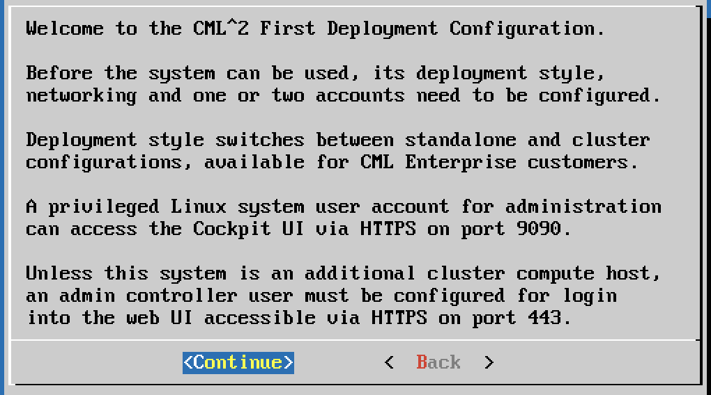

Just informational — hit **Continue**.

### Networking notice

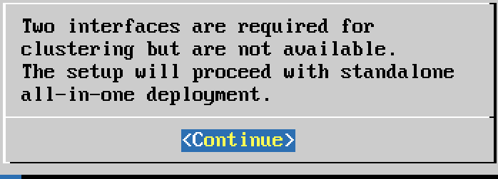

This is expected and correct for a single-machine Personal Edition install — CML clustering needs multiple network interfaces, which you don't have (or need) here. **Continue**.

### Hostname

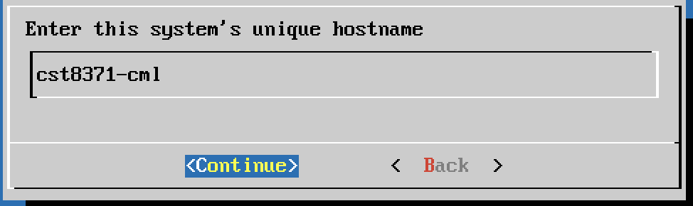

Pick something unique and identifiable — course code + purpose works well (e.g. `cst8371-cml`). Avoid generic names like `cml` if you might ever run two CML VMs on the same network.

### Reference platform ISO prompt

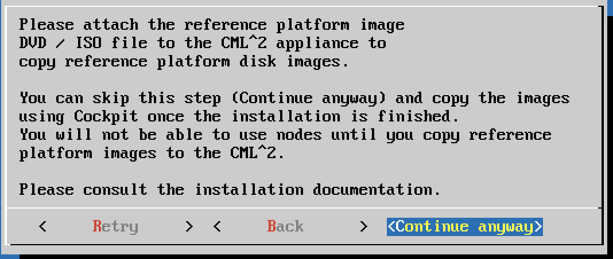

Select **Continue anyway**. You have **not** attached the reference platform ISO yet (that's the second download from the intro) — this screen is just reminding you it's needed *eventually*, not right now. You'll copy those images in through Cockpit after CML finishes installing (Section 4).

### Two accounts — read this carefully

CML sets up **two separate accounts** here, back to back, and this is the single most common point of confusion for the rest of the install.

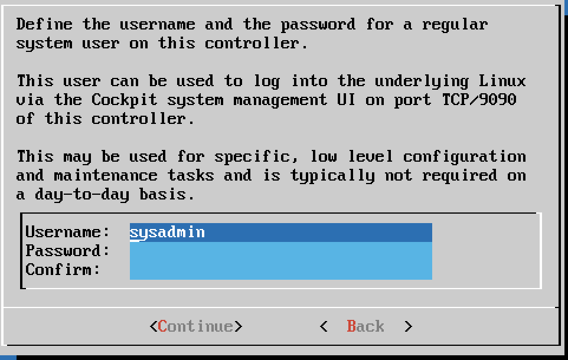

This first one — **`sysadmin`** — is a **Linux system account**. It logs into **Cockpit**, the system-management UI on **port 9090**. You'll use it for maintenance tasks like copying reference platform images. Pick a real password; this account has shell-level access to your VM.

Right after this, a nearly identical-looking screen asks for a **second, different account** — typically `admin` — described as having "administrative privileges" and used to "log into the Web UI." **This is the CML web application account**, on **port 443** (no port number in the URL). This is the one you'll use day-to-day to build and run labs.

**Use two different passwords for these two accounts.** Write both down somewhere until you've confirmed login works — there's no password-reset flow if you forget one.

| Account | Port / URL | Used for |
|---|---|---|
| `sysadmin` (Linux) | `:9090` (Cockpit) | System maintenance, copying reference platform images |
| `admin` (CML controller) | `:443` / no port (Web UI) | Building and running labs day-to-day |

### Network configuration

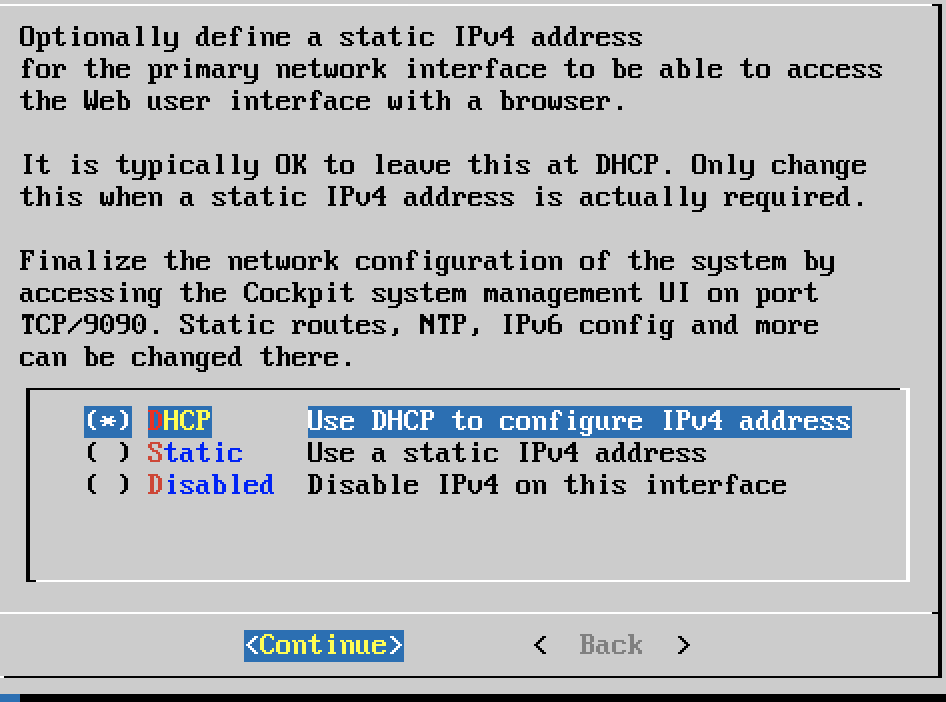

Leave this on **DHCP** (the default) unless you specifically need a static IP. You can add a static IP later through Cockpit if needed.

### Optional services

You'll also be asked which optional services to enable (OpenSSH, PATty, MCPServer). For a standard course install:
- **Enable OpenSSH** — useful for troubleshooting via shell access later.
- Leave **PATty** and **MCPServer** off — they're for lab-node port forwarding and AI/LLM tooling integration respectively, not needed for normal course use. You can turn either on later in Cockpit if a specific lab needs it.

### Confirm and finish

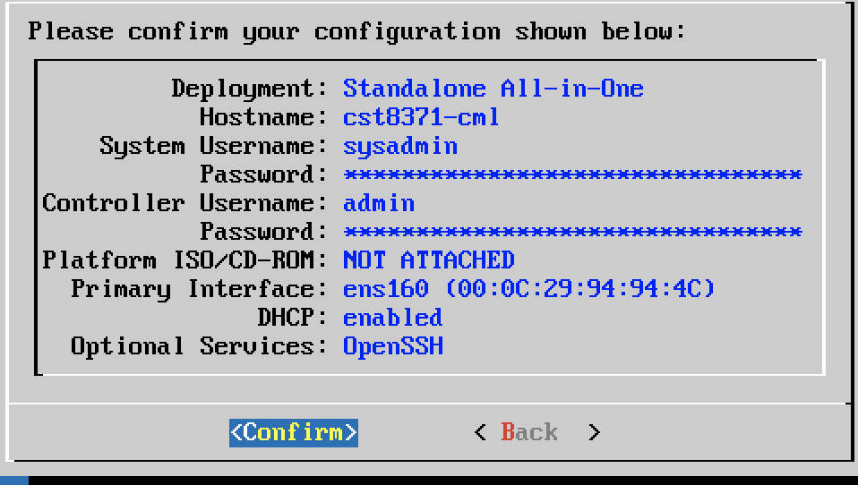

Double-check the hostname and both usernames before confirming — this is your last chance to catch a typo without redoing the whole wizard.

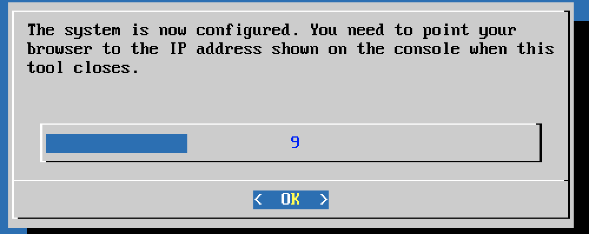

Once you see this, the wizard closes and the console will show you the URLs to use next.

---

## 3. Find your URLs and log in

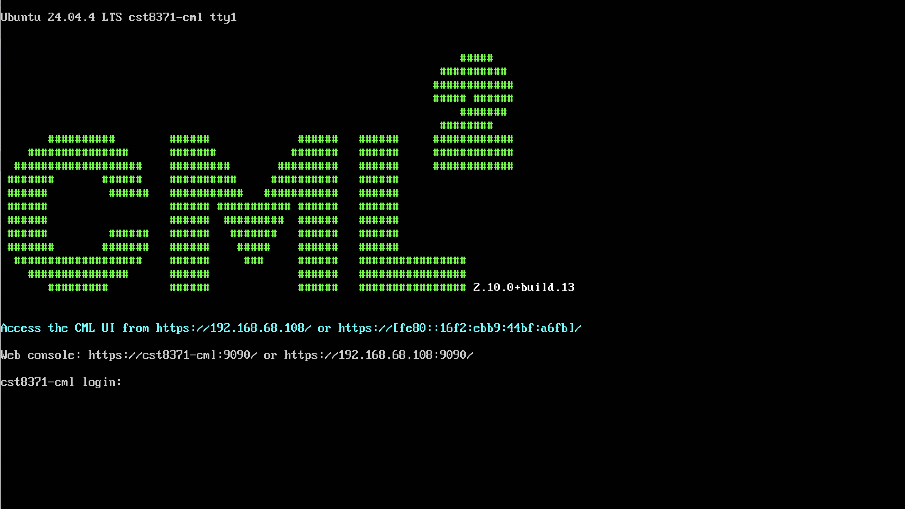

The console prints **two different URLs** — this matches the two-account split from Section 2:

- `https://<ip-or-hostname>/` — the **CML web UI** (port 443, implied) — log in with your **admin/controller** account.
- `https://<ip-or-hostname>:9090/` — **Cockpit** — log in with your **sysadmin** account.

### Expect a certificate warning

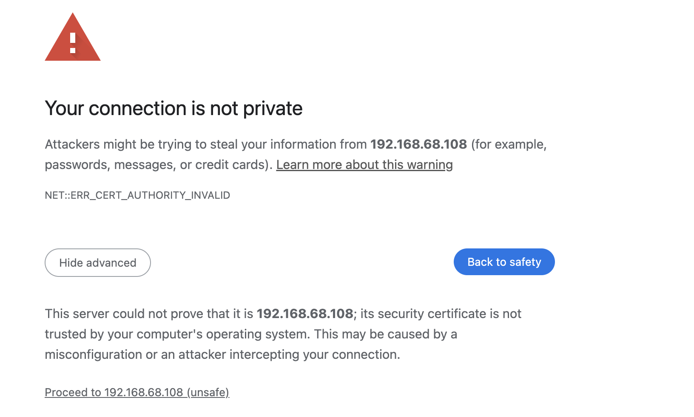

This is normal and expected on **every new URL/port you visit for the first time** — CML has no public CA certificate for a private local IP. Click **Advanced → Proceed** (wording varies by browser). This is not a sign anything is broken.

### The #1 mistake: wrong account on wrong URL

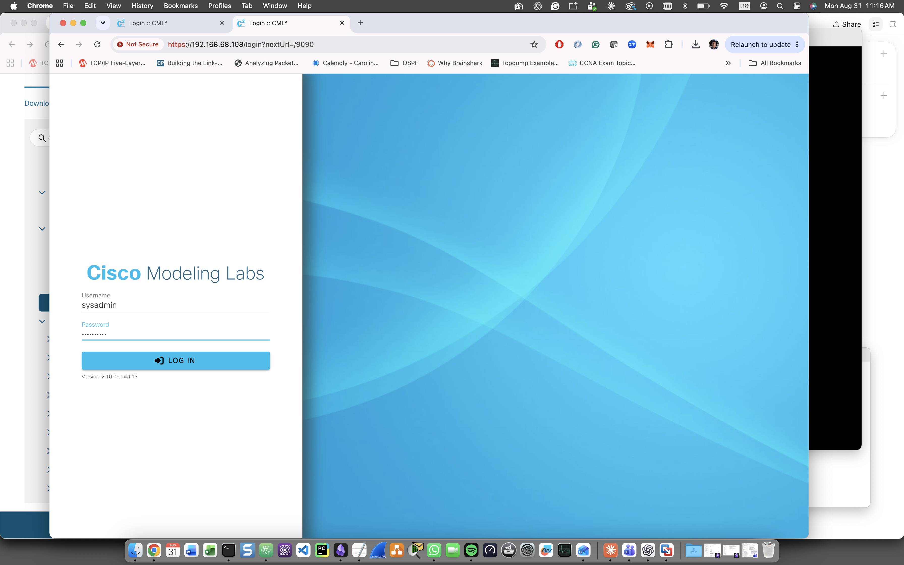

If you get **"Authentication failed,"** check two things before assuming your password is wrong:

1. **Are you using the right account for this URL?** `sysadmin` credentials will fail on the web UI login (port 443), and `admin` credentials will fail on Cockpit (port 9090). See the table in Section 2.
2. **Did the URL actually go where you typed it?** Browsers sometimes auto-complete `:9090` into a URL *path* (`/9090`) instead of a *port*, especially from address-bar history. Check the address bar — if it reads `.../login?nextUrl=/9090` instead of ending in `:9090`, clear it and type the full URL again, e.g. `https://cst8371-cml:9090`, without letting autocomplete finish it for you.

---

## 4. Copy the reference platform images (required before building any lab)

Until you do this, the lab node picker will only show `External Connector` and `Unmanaged Switch` — no actual routers or switches.

1. Unzip the `refplat-*.iso.zip` you downloaded — you'll get a `.iso` file inside.
2. In VMware Fusion, with the CML VM **still running**: **Virtual Machine → CD/DVD (SATA/IDE) → Connect Disk Image...**, select that `.iso`.

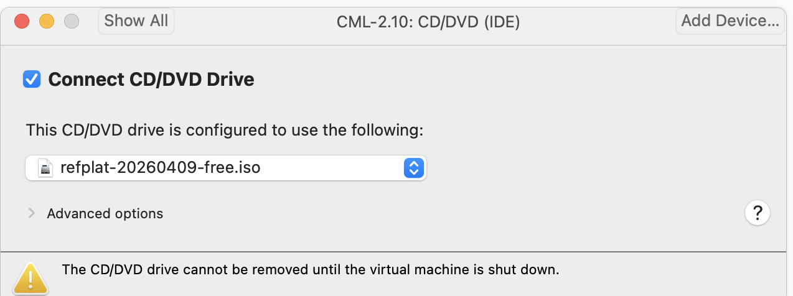

You don't need to power off the VM for this — the drive connects live. Note the warning at the bottom: the CD/DVD can't be *disconnected* again until the VM is shut down, but that's fine, you don't need to.

3. Log into **Cockpit** (`https://<hostname>:9090`, `sysadmin` account). This is the same URL from Section 3 — if you're logged in correctly this time, you'll see the Cockpit login form itself, not the CML web UI's login page:

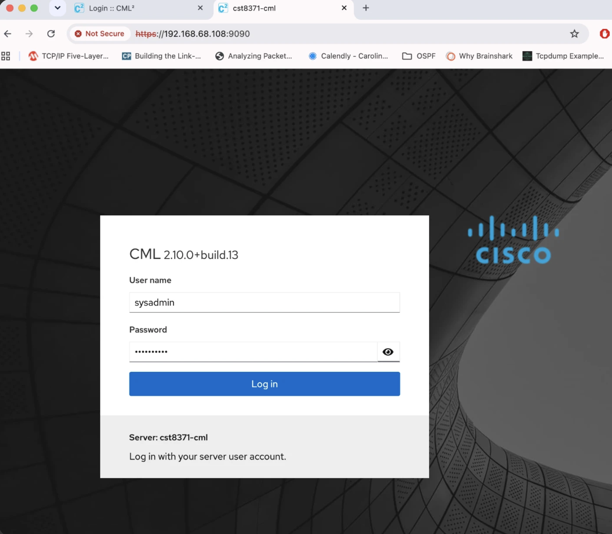

If this doesn't look like what you see, you're still on the wrong URL — go back to the troubleshooting note in Section 3.

4. In the left nav: **CML2 → Overview/Maintenance → Copy Reflat ISO**, click the button, then confirm:

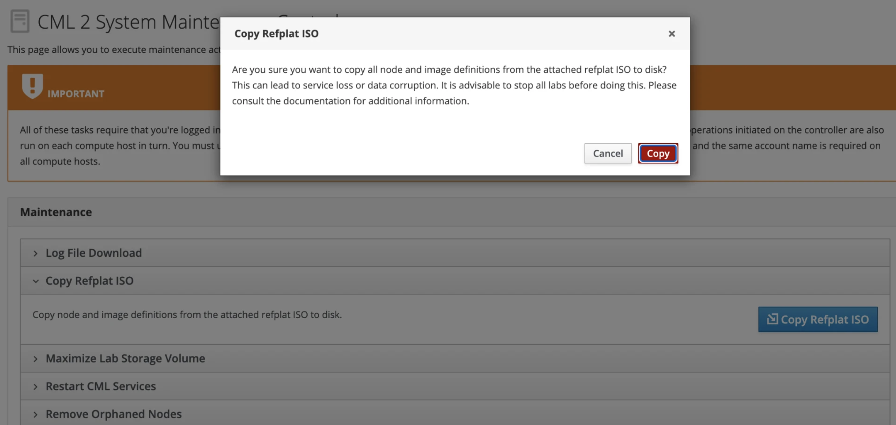

5. This restarts the controller and takes a few minutes. Watch the log output for confirmation:

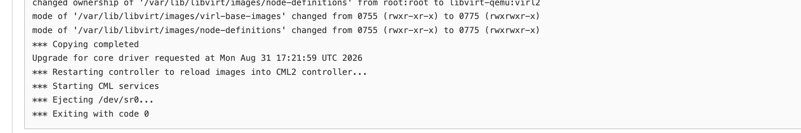

Once you see `*** Copying completed` and `Exiting with code 0`, go back to the CML web UI, start a new lab, and open the node picker (drag-node panel). You should now see real node types — IOSv, IOL, ASAv, etc.

**Success indicator:** you can log into the CML web UI, start a new lab, and drag a real router/switch node (not just External Connector) onto the canvas.

---

## Troubleshooting

| Symptom | What's actually happening |
|---|---|
| "Your connection is not private" warning | Expected — CML's self-signed certificate. Proceed. |
| VMware "side channel mitigations" popup | Standard Fusion notice, unrelated to CML. Click OK. |
| "Authentication failed" on login | Wrong account for this URL — see the two-account table in Section 2. |
| Browser can't reach `:9090` / shows `/9090` in the address bar | The port got parsed as a URL path. Retype the full URL manually. |
| Node picker only shows External Connector / Unmanaged Switch | Reference platform images haven't been copied yet — do Section 4. |
| CML install itself fails to boot or complete | This is a Cisco product issue, not a course issue — check Cisco's official installation guide and system requirements (CPU virtualization, RAM, disk space) first. |

If installation itself fails for reasons not covered above, Cisco's own documentation and support channels are the authoritative source — this is Cisco's product, not a course-built system.
