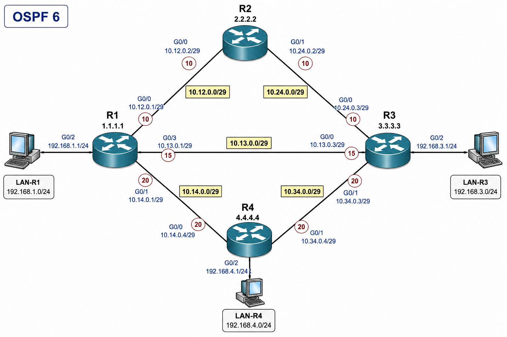

# A06 — OSPF Cost Analysis Audit

**Course:** CST8371  
**Week:** 06  
**Activity type:** Apply / Audit  
**Points:** 4  
**Submission file:** `a06-<username>.txt`

---

## Audit Scope

This audit evaluates OSPF cost interpretation from operational evidence.

- You are not configuring devices.
- You are not fixing faults.
- You are identifying how OSPF cost affects route selection, route metrics, and path direction.

Use only the topology and numbered outputs provided.

---

## Rules

- Submit only the answer keywords listed in each scenario.
- Use the exact keyword names.
- Do not include paragraphs.
- Do not include configuration commands.
- When an answer asks for a path, use router names only.
- When an answer asks for a command, include the device prompt.

Example answer format:

```text
NEXT_HOP_1: 10.12.0.2
METRIC_1: 16
PATH_1: R1-R3
```

---

## Topology




### OSPF Process

```text
OSPF process: 6
Area: 0
```

### Router IDs

| Router | Router ID |
|---|---|
| R1 | `1.1.1.1` |
| R2 | `2.2.2.2` |
| R3 | `3.3.3.3` |
| R4 | `4.4.4.4` |

### Link and Interface Reference

| Link | Network | Router A Interface / IP | Router B Interface / IP |
|---|---|---|---|
| R1-R2 | `10.12.0.0/29` | R1 G0/0 — `10.12.0.1/29` | R2 G0/0 — `10.12.0.2/29` |
| R2-R3 | `10.24.0.0/29` | R2 G0/1 — `10.24.0.2/29` | R3 G0/0 — `10.24.0.3/29` |
| R1-R3 | `10.13.0.0/29` | R1 G0/3 — `10.13.0.1/29` | R3 G0/0 — `10.13.0.3/29` |
| R1-R4 | `10.14.0.0/29` | R1 G0/1 — `10.14.0.1/29` | R4 G0/0 — `10.14.0.4/29` |
| R4-R3 | `10.34.0.0/29` | R4 G0/1 — `10.34.0.4/29` | R3 G0/1 — `10.34.0.3/29` |

### End Networks

| LAN | Router Interface | Network |
|---|---|---|
| LAN-R1 | R1 G0/2 — `192.168.1.1/24` | `192.168.1.0/24` |
| LAN-R3 | R3 G0/2 — `192.168.3.1/24` | `192.168.3.0/24` |
| LAN-R4 | R4 G0/2 — `192.168.4.1/24` | `192.168.4.0/24` |

---

## Scenario 1 — Preferred Path Selection

R1 needs to reach LAN-R3.

Use Outputs 1–3 to identify the selected next hop, metric, and path.

### Output 1

```plaintext
R1# show ip route 192.168.3.0

Routing entry for 192.168.3.0/24
  Known via "ospf 6", distance 110, metric 16, type intra area
  Last update from 10.13.0.3 on GigabitEthernet0/3, 00:02:11 ago
  Routing Descriptor Blocks:
  * 10.13.0.3, from 3.3.3.3, 00:02:11 ago, via GigabitEthernet0/3
      Route metric is 16, traffic share count is 1
```

### Output 2

```plaintext
R1# show ip ospf interface g0/3

GigabitEthernet0/3 is up, line protocol is up
  Internet Address 10.13.0.1/29, Interface ID 7, Area 0
  Attached via Interface Enable
  Process ID 6, Router ID 1.1.1.1, Network Type POINT_TO_POINT, Cost: 15
  Topology-MTID    Cost    Disabled    Shutdown      Topology Name
        0           15        no          no              Base
  Transmit Delay is 1 sec, State POINT_TO_POINT
  Timer intervals configured, Hello 10, Dead 40, Wait 40, Retransmit 5
  Neighbor Count is 1, Adjacent neighbor count is 1
```

### Output 3

```plaintext
R1# show ip ospf interface g0/0

GigabitEthernet0/0 is up, line protocol is up
  Internet Address 10.12.0.1/29, Interface ID 5, Area 0
  Attached via Interface Enable
  Process ID 6, Router ID 1.1.1.1, Network Type POINT_TO_POINT, Cost: 10
  Topology-MTID    Cost    Disabled    Shutdown      Topology Name
        0           10        no          no              Base
  Transmit Delay is 1 sec, State POINT_TO_POINT
  Timer intervals configured, Hello 10, Dead 40, Wait 40, Retransmit 5
  Neighbor Count is 1, Adjacent neighbor count is 1
```

### Scenario 1 Answers

| Keyword | Question |
|---|---|
| `NEXT_HOP_1` | What next-hop does R1 use to reach `192.168.3.0/24`? |
| `METRIC_1` | What route metric does R1 use for `192.168.3.0/24`? |
| `PATH_1` | Which path is selected? Use router names only. |

---

## Scenario 2 — Reference Bandwidth and Interface Cost

R1 is using OSPF process 6.

Use Outputs 4–6 to identify the reference bandwidth and interface costs.

### Output 4

```plaintext
R1# show ip ospf

 Routing Process "ospf 6" with ID 1.1.1.1
 Start time: 00:08:32.156, Time elapsed: 01:14:06.220
 Supports only single TOS(TOS0) routes
 Supports opaque LSA
 Supports Link-local Signaling (LLS)
 Supports area transit capability
 Event-log enabled, Maximum number of events: 1000, Mode: cyclic
 Router is not originating router-LSAs with maximum metric
 Initial SPF schedule delay 5000 msecs
 Minimum hold time between two consecutive SPFs 10000 msecs
 Maximum wait time between two consecutive SPFs 10000 msecs
 Incremental-SPF disabled
 Minimum LSA interval 5 secs
 Minimum LSA arrival 1000 msecs
 Reference bandwidth unit is 10000 mbps
 Number of external LSA 0. Checksum Sum 0x000000
 Number of opaque AS LSA 0. Checksum Sum 0x000000
 Number of DCbitless external and opaque AS LSA 0
 Number of DoNotAge external and opaque AS LSA 0
 Number of areas in this router is 1. 1 normal 0 stub 0 nssa
```

### Output 5

```plaintext
R1# show ip ospf interface g0/0

GigabitEthernet0/0 is up, line protocol is up
  Internet Address 10.12.0.1/29, Interface ID 5, Area 0
  Process ID 6, Router ID 1.1.1.1, Network Type POINT_TO_POINT, Cost: 10
  Topology-MTID    Cost    Disabled    Shutdown      Topology Name
        0           10        no          no              Base
  Transmit Delay is 1 sec, State POINT_TO_POINT
  Timer intervals configured, Hello 10, Dead 40, Wait 40, Retransmit 5
  Neighbor Count is 1, Adjacent neighbor count is 1
    Adjacent with neighbor 2.2.2.2
```

### Output 6

```plaintext
R1# show ip ospf interface g0/1

GigabitEthernet0/1 is up, line protocol is up
  Internet Address 10.14.0.1/29, Interface ID 6, Area 0
  Process ID 6, Router ID 1.1.1.1, Network Type POINT_TO_POINT, Cost: 20
  Topology-MTID    Cost    Disabled    Shutdown      Topology Name
        0           20        no          no              Base
  Transmit Delay is 1 sec, State POINT_TO_POINT
  Timer intervals configured, Hello 10, Dead 40, Wait 40, Retransmit 5
  Neighbor Count is 1, Adjacent neighbor count is 1
    Adjacent with neighbor 4.4.4.4
```

### Scenario 2 Answers

| Keyword | Question |
|---|---|
| `REFBW_2` | What is the configured OSPF reference bandwidth? |
| `COST_R1_G0_0_2` | What is the OSPF cost of R1 G0/0? |
| `COST_R1_G0_1_2` | What is the OSPF cost of R1 G0/1? |

---

## Scenario 3 — Asymmetric Routing

A cost change on R1 changes the forward path from LAN-R1 to LAN-R4.

R4 has not changed its cost toward R1.

Use Outputs 7–9 to determine whether routing is symmetric.

### Output 7

```plaintext
PC-R1> tracert -d 192.168.4.10

Tracing route to 192.168.4.10 over a maximum of 30 hops

  1     1 ms     1 ms     1 ms  192.168.1.1
  2     2 ms     2 ms     2 ms  10.13.0.3
  3     3 ms     3 ms     3 ms  10.34.0.4
  4     4 ms     4 ms     4 ms  192.168.4.10

Trace complete.
```

### Output 8

```plaintext
PC-R4> tracert -d 192.168.1.10

Tracing route to 192.168.1.10 over a maximum of 30 hops

  1     1 ms     1 ms     1 ms  192.168.4.1
  2     2 ms     2 ms     2 ms  10.14.0.1
  3     3 ms     3 ms     3 ms  192.168.1.10

Trace complete.
```

### Output 9

```plaintext
R4# show ip route 192.168.1.0

Routing entry for 192.168.1.0/24
  Known via "ospf 6", distance 110, metric 21, type intra area
  Last update from 10.14.0.1 on GigabitEthernet0/0, 00:00:52 ago
  Routing Descriptor Blocks:
  * 10.14.0.1, from 1.1.1.1, 00:00:52 ago, via GigabitEthernet0/0
      Route metric is 21, traffic share count is 1
```

### Scenario 3 Answers

| Keyword | Question |
|---|---|
| `FORWARD_PATH_3` | Which router path is used from LAN-R1 to LAN-R4? |
| `RETURN_PATH_3` | Which router path is used from LAN-R4 to LAN-R1? |
| `SYMMETRIC_3` | Is the forward path the same as the return path? Answer `YES` or `NO`. |

---

## Scenario 4 — Interface Cost Manipulation

R1 has a manual OSPF cost change on the direct R1-R3 link.

Use Outputs 10–12 to identify the new preferred path and route metric.

### Output 10

```plaintext
R1# show ip ospf interface g0/3

GigabitEthernet0/3 is up, line protocol is up
  Internet Address 10.13.0.1/29, Interface ID 7, Area 0
  Attached via Interface Enable
  Process ID 6, Router ID 1.1.1.1, Network Type POINT_TO_POINT, Cost: 100
  Topology-MTID    Cost    Disabled    Shutdown      Topology Name
        0          100        no          no              Base
  Transmit Delay is 1 sec, State POINT_TO_POINT
  Timer intervals configured, Hello 10, Dead 40, Wait 40, Retransmit 5
  Neighbor Count is 1, Adjacent neighbor count is 1
    Adjacent with neighbor 3.3.3.3
```

### Output 11

```plaintext
R1# show ip route 192.168.3.0

Routing entry for 192.168.3.0/24
  Known via "ospf 6", distance 110, metric 21, type intra area
  Last update from 10.12.0.2 on GigabitEthernet0/0, 00:01:19 ago
  Routing Descriptor Blocks:
  * 10.12.0.2, from 3.3.3.3, 00:01:19 ago, via GigabitEthernet0/0
      Route metric is 21, traffic share count is 1
```

### Output 12

```plaintext
R1# show ip ospf interface brief

Interface    PID   Area            IP Address/Mask    Cost  State Nbrs F/C
Gi0/0        6     0               10.12.0.1/29       10    P2P   1/1
Gi0/1        6     0               10.14.0.1/29       20    P2P   1/1
Gi0/3        6     0               10.13.0.1/29       100   P2P   1/1
Gi0/2        6     0               192.168.1.1/24     1     LOOP  0/0
```

### Scenario 4 Answers

| Keyword | Question |
|---|---|
| `COST_R1_G0_3_4` | What is the OSPF cost of R1 G0/3? |
| `NEW_METRIC_4` | What is R1's new route metric to `192.168.3.0/24`? |
| `NEW_PATH_4` | Which router path is now preferred from R1 to LAN-R3? |

---

## Submission Format

Create a file named:

```text
a06-<username>.txt
```

Use this exact format:

```text
=== SCENARIO 1 ===
NEXT_HOP_1:
METRIC_1:
PATH_1:

=== SCENARIO 2 ===
REFBW_2:
COST_R1_G0_0_2:
COST_R1_G0_1_2:

=== SCENARIO 3 ===
FORWARD_PATH_3:
RETURN_PATH_3:
SYMMETRIC_3:

=== SCENARIO 4 ===
COST_R1_G0_3_4:
NEW_METRIC_4:
NEW_PATH_4:
```

---

## End of A06 — OSPF Cost Analysis Audit
