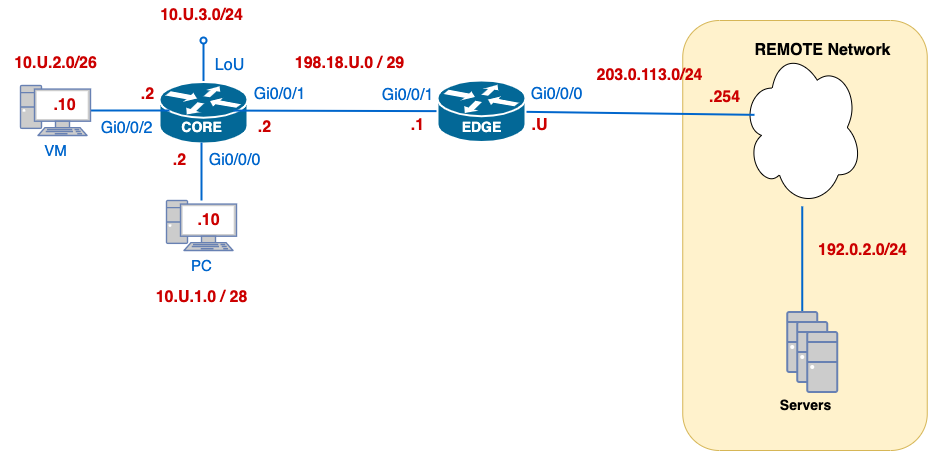

# Lab 01 — IPv4 Management Baseline on Real Equipment

---

## Section A - Lab Information
### A1 - Lab Overview

This lab establishes the baseline router configuration you will reuse during the course. You will bring up the CORE–EDGE topology, apply minimal device settings, configure IPv4 addressing and static routing, enable secure remote access, configure management-plane services, and collect concise command evidence.

**Environment:** Real equipment  
**Submission file:** `l01-<username>.txt`  
**Estimated time:** 60–90 minutes

Keep evidence minimal. Do not submit screenshots or full running-configs unless specifically requested.

### A2 - Why This Lab Is Important

- It creates a **repeatable baseline** so future labs (routing, ACLs, NAT, IPv6) don’t start from scratch.
- Time and logs (**NTP/Syslog**) make your troubleshooting **trustworthy and traceable**.
- Secure VTY access (**SSH-only**) is the foundation for safe remote management.
- Practicing **minimal configuration + one-line verification** builds the evidence discipline you’ll need for **audits** and **challenges**.
- Static routing here removes protocol complexity so you can **focus on essentials** first; dynamic routing arrives later.

### A3 - Learning Objectives

By the end of this lab, you should be able to:

1. **Interpret a topology & addressing plan** and apply IP settings to the correct interfaces.
2. **Establish basic reachability** using static routes and confirm with `ping`/`traceroute`.
3. **Harden management access** by enabling **SSHv2** only with a local admin account.
4. Configure management-plane services: **NTP**, **Syslog**, and **CDP**, using the appropriate **source interface**.
5. **Verify** each configuration with targeted `show` commands and **record minimal evidence** suitable for grading and troubleshooting.
6. Follow a **find → minimal fix → verify** habit you’ll reuse in audits and challenges.

### A4 - What You Will Do

- [ ] Apply a minimal baseline configuration on CORE and EDGE.
- [ ] Address interfaces using your assigned `U` value.
- [ ] Build reachability using static routes.
- [ ] Secure remote access using SSHv2 only and a local admin account.
- [ ] Configure NTP, Syslog, and CDP.
- [ ] Capture evidence for checkpoints C01–C06.
- [ ] Update your lab book with proof commands, failure signals, and reusable rules.

---

## Section B - Topology and Addressing

### B1 - Topology
  

*Addresses in red show network blocks; use your `U` value wherever shown.*

### B2 - Addressing Plan

| Device      | Interface  | Network        | IP/Mask              | Notes                        |
| ----------- | ---------- | -------------- | -------------------- | ---------------------------- |
| **CORE**    | G0/0/0     | 10.U.1.0/28    | **10.U.1.2/28**      | PC LAN — default gateway     |
| **CORE**    | G0/0/2     | 10.U.2.0/26    | **10.U.2.2/26**      | VM LAN — default gateway     |
| **CORE**    | G0/0/1     | 198.18.U.0/29  | **198.18.U.2/29**    | To EDGE (internal link)      |
| **CORE**    | LoopbackU  | 10.U.3.0/24    | **10.U.3.2/24**      | Loopback for tests/router-ID |
| **EDGE**    | G0/0/1     | 198.18.U.0/29  | **198.18.U.1/29**    | To CORE (internal link)      |
| **EDGE**    | G0/0/0     | 203.0.113.0/24 | **203.0.113.U/24**   | To REMOTE network            |
| **REMOTE**  | —          | 203.0.113.0/24 | **203.0.113.254/24** | Remote gateway (given)       |
| **Servers** | —          | 192.0.2.0/24   | —                    | Reachable via REMOTE         |
| **PC**      | NIC        | 10.U.1.0/28    | **10.U.1.10/28**     | DG = 10.U.1.2                |
| **VM**      | NIC        | 10.U.2.0/26    | **10.U.2.10/26**     | DG = 10.U.2.2                |
> Replace `U` with your assigned number.

### B3 - Network Roles

| Device | Role |
|---|---|
| CORE | Internal router for the PC LAN, VM/server LAN, loopback, and link to EDGE |
| EDGE | Border router connecting the internal lab to the REMOTE network |
| REMOTE | Shared remote gateway for services behind the `192.0.2.0/24` network |
| PC | Student workstation inside the lab topology |
| VM/server | Server used for management-plane tests such as syslog |

### B4 - Routing Model

| Device | Route Purpose | Destination | Next Hop |
|---|---|---|---|
| EDGE | Default route to REMOTE | `0.0.0.0/0` | `203.0.113.254` |
| EDGE | Summary route to internal CORE networks | `10.U.0.0/16` | `198.18.U.2` |
| CORE | Default route to EDGE | `0.0.0.0/0` | `198.18.U.1` |
| REMOTE | Return route to student `198.18.U.0` space | `198.18.U.0/24` | `203.0.113.U` |
| REMOTE | Return route to student internal `10.U.0.0` space | `10.U.0.0/16` | `203.0.113.U` |

The `198.18.U.0/24` route on REMOTE is intentional. Each student uses a subnet inside that `/24`; REMOTE uses the `/24` summary to return traffic to each student’s assigned space through EDGE.

### B5 - Management Plane Model

| Service | Lab Design |
|---|---|
| SSH | SSHv2 only on VTY lines; local admin account |
| NTP | EDGE acts as local NTP master at stratum 4; CORE synchronizes to EDGE |
| Syslog | CORE and EDGE send logs to the VM/server at `10.U.2.10` |
| CDP | CDP remains enabled so CORE–EDGE neighbour evidence can be verified |

---

## Section C - Lab Task and Verification

### C0 - Task  0 — Basic Configuration (CORE & EDGE)

- [ ] Cable the topology as the diagram.
- [ ] Replace your `U`for all IP addresses.
- [ ] On your desktop, create **`l01-<username>.txt`**. You will submit this file to the TFTP server.
	- **Avoid double extensions:** Many editors (Notepad, TextEdit) add `.txt` automatically.
	- Incorrect filenames will not be graded
- [ ] Set **hostname** (CORE / EDGE) as `username-<devicename>` (eg: *ayal0014-EDGE*)
- [ ] Disable **DNS lookup**.
- [ ] Protect privileged exec with password `class` stored with strong encryption.
- [ ] Configure the console line to minimize disruptions caused by log messages.

#### Verification

Use a command similar to:

```plaintext
show running-config | include ^hostname|^enable secret|^no ip domain-lookup
```

#### Success Indicator / Failure Signal

| Check | Success Indicator | Failure Signal |
|---|---|---|
| Hostname | Prompt shows assigned username-device format | Default router name remains |
| DNS lookup | `no ip domain-lookup` present | Mistyped commands cause long lookup delay |
| Enable secret | `enable secret` present | No privileged password protection |
| Console behaviour | Log messages do not interrupt typing excessively | Command line is disrupted by log output |

No submission required for this task.

---
## C1 - Task 1 — IP Addressing & Interface State

- [ ] Find your `U` number in Brightspace; you will be using it as part of your network addresses during the semester.
- [ ] Assign IPs per the **Addressing Plan/Topology** (replace `U` with your number).
- [ ] Add clear **descriptions** to each interface you configure.
- [ ] Ensure required interfaces are **up/up** (CORE↔EDGE link and EDGE↔REMOTE).

#### Verification

Run on CORE and EDGE:

```plaintext
show ip interface brief | ex una
```

This command confirms the interface state quickly. It does not show subnet masks.

Then run on CORE and EDGE:

```plaintext
show ip route connected
```

This command confirms connected and local routes with prefix length.

#### Success Indicator / Failure Signal

| Evidence                            | Success Indicator                                                       | Failure Signal                                                                   |
| ----------------------------------- | ----------------------------------------------------------------------- | -------------------------------------------------------------------------------- |
| `show ip interface brief \| ex una` | Required configured interfaces show `up/up`                             | Interface is `administratively down`, `down/down`, or wrong interface configured |
| `show ip route connected`           | Expected `C` and `L` routes appear with correct prefixes and interfaces | Missing connected route, wrong mask, wrong interface, missing loopback           |

#### 🔍 C01 — Collection of Information

📝 In your **`l01-<username>.txt`** file, create a section labelled:

```diff
=== C01 – IP Addressing & Interface State ===
```

Paste this command output from CORE and EDGE:

```plaintext
show ip route connected
```

Add these comment lines after collecting the commands:

```text
!-- Interfaces up/up confirmed via brief; 
!-- IP address and mask verified via connected routes.
```


---

### C2 - Task 2 — Static Routing (baseline reachability)

- [ ] On **EDGE**: install a **fully specified default route** **to REMOTE** (via `203.0.113.254`).
- [ ] On **CORE**: install a **fully specified default route** **to EDGE** (via `198.18.U.1`).
- [ ] On **EDGE**: install a **fully specified summary route** for **all internal networks** behind CORE.

**Why the summary on EDGE?**  
EDGE must reach three internal networks that sit behind CORE:
- PC LAN `10.U.1.0/28`, VM LAN `10.U.2.0/26`, and LoopbackU `10.U.3.0/24`.  
A single summary **`10.U.0.0/16`** covers all of them → fewer routes, same reachability.

**Commands (replace `U` and interfaces to match your diagram):**
```plaintext
! ----- EDGE -----
ip route 0.0.0.0 0.0.0.0 exit-if 203.0.113.254 
ip route 10.U.0.0 255.255.0.0 exit-if 198.18.U.2


! ----- CORE -----
ip route 0.0.0.0 0.0.0.0 exit-if 198.18.U.1
```

#### Verification

On EDGE and CORE:

```plaintext
show ip route static
```

From the PC:

```plaintext
tracert 192.0.2.69
```

From EDGE:

```plaintext
ping 10.U.2.10 source g0/0/1
```

Use the source option so the test validates the route path from EDGE’s internal side toward the VM/server LAN. If your physical interface name differs, replace `g0/0/1` with the actual CORE-facing interface.

#### Success Indicator / Failure Signal

| Evidence                    | Success Indicator                                                    | Failure Signal                                                     |
| --------------------------- | -------------------------------------------------------------------- | ------------------------------------------------------------------ |
| EDGE `show ip route static` | `S* 0.0.0.0/0` via `203.0.113.254`; `S 10.U.0.0/16` via `198.18.U.2` | Missing default route, wrong summary, wrong next hop               |
| CORE `show ip route static` | `S* 0.0.0.0/0` via `198.18.U.1`                                      | Missing default route, wrong EDGE next hop                         |
| PC `tracert 192.0.2.69`     | Path reaches remote service network                                  | Trace stops early, wrong path, repeated timeouts                   |
| EDGE source ping            | Replies from `10.U.2.10`                                             | Timeout, unreachable, wrong source interface, missing return route |

#### 🔍 C02 — Collection of Information

📝 In your **`l01-<username>.txt`** file, create a section labelled:

```diff
=== C02 – Static Routing & REMOTE Reachability ===
```

Run these commands on **EDGE** and **CORE**, then from the **PC**:

```bash
# -- EDGE - CORE
show ip route static

# Connectivity tests
# -- EDGE
ping 10.U.2.10 source  g0/0/1
# -- PC
PC> tracert 192.0.2.69                   # TFTP server behind REMOTE (end-to-end)
```

Add these comment lines after collecting the commands:

```text
!-- Default routes, EDGE summary, PC path test, and EDGE source ping verified.
```

---
### C3 - Task 3 — Secure Remote Access (SSHv2)

- [ ] Create a local **admin** user with **privilege level 15** and **secret password `cisco`** (hashed).
- [ ] Set the device **domain name** to **`cnap.cst`** (needed for key generation).
- [ ] Generate an **RSA host key** with **modulus 1024 bits**.
- [ ] Enforce **SSH version 2 only**.
- [ ] SSH hardening: **authentication retries = 3** and **authentication timeout = 60 seconds**.
- [ ] VTY lines **0–4**: **login local**, **SSH-only** (no Telnet), and **exec-timeout = 10 minutes**.
- [ ] Set an **enable secret** for privileged mode if you haven't done it yet.

Confirm hostname is configured before generating RSA keys.

#### Verification

From the PC, SSH into CORE.

Example:

```plaintext
PC> ssh -l admin 198.18.U.2
```

Use the router IP assigned in your topology. After login, remain in the SSH session.

On CORE, run:

```plaintext
show ssh
show tcp brief
```

On EDGE, run:

```plaintext
show ip ssh
```

#### Success Indicator / Failure Signal

| Evidence Command | Run On                | Success Indicator                                                                                         | Failure Signal                                                                       |
| ---------------- | --------------------- | --------------------------------------------------------------------------------------------------------- | ------------------------------------------------------------------------------------ |
| `show ssh`       | Router you SSH’d into | Active SSH session is listed                                                                              | No session shown, command run from console before SSH login, or wrong router checked |
| `show tcp brief` | Router you SSH’d into | TCP local address includes `.22`; foreign address shows PC IP with ephemeral port; state is `ESTABLISHED` | No TCP/22 entry, wrong source IP, no `ESTABLISHED` state                             |
| `show ip ssh`    | EDGE                  | `SSH Enabled - version 2.0`; timeout `60`; retries `3`; key depends on your hostname                      | SSH disabled, version not 2, timeout/retry values missing; key is self-signed        |

#### 🔍 C03 — Collection of Information

📝 In your **`l01-<username>.txt`** file, create a section labelled:

```diff
=== C03 – Secure Remote Access (SSHv2) ===
```


```bash
# On CORE (verify the session landed)
show tcp brief
show ssh

# On EDGE (prove SSH server settings)
show ip ssh
```

Add these comment lines after collecting the commands:

 `!-- SSHv2 enforced, domain & RSA key present, live session verified.`

---
### C4 - Task 4 — NTP

- [ ] On **EDGE**: act as an **NTP server of stratum 4**.
- [ ] On **CORE**: **sync time from EDGE**.
- [ ] First, **set the clock** on EDGE so clients have a sane initial time.

**Suggested commands:**

```plaintext
! ----- EDGE -----
# On privileged EXEC
 clock set <hh:mm:ss> <day> <month> <year>         ! set the current time
# On global configuration
ntp master 4                           ! serve as stratum-4 master

! ----- CORE -----
# On global configuration
ntp server 198.18.U.1                  ! EDGE's CORE-facing IP
```

**Tip:** NTP may take ~10–60s to show as reachable/selected. 

#### Verification

On EDGE and CORE:

```plaintext
show ntp status
```

Optional:

```plaintext
show ntp associations
```


#### Success Indicator / Failure Signal

| Evidence | Success Indicator | Failure Signal |
|---|---|---|
| EDGE `show ntp status` | Clock synchronized, stratum 4, local master reference | EDGE clock unsynchronized or wrong stratum |
| CORE `show ntp status` | Clock synchronized, stratum 5, reference is EDGE `198.18.U.1` | CORE unsynchronized, wrong reference, wrong stratum |

#### 🔍 C04 — Collection of Information

📝 In your **`l01-<username>.txt`** file, create a section labelled:

`=== C04 – NTP (time synchronization) ===`


```bash
# On EDGE and CORE
show ntp status
```


Add these comment lines after collecting the commands:

```
!-- EDGE serving stratum 4; CORE synced to EDGE.
```

---

### C5 - Task 5 — Syslog 

- [ ] Use the **PC** as the Syslog server.  Enable TFTP64 log server and set file to `l01-<USERNAME>-syslog.txt` 
- [ ] Send Syslog from **CORE** and **EDGE** to the **PC**.

On CORE and EDGE:

```plaintext
logging host 10.U.1.10                       ! PC IP
```

To generate test events, `shutdown /no shutdown` an interface or do a single `login on-success` via console/VTY.  

#### Verification

On CORE and EDGE:

```plaintext
show running-config | include ^logging
```

On the Syslog server:

```text
Confirm entries appear from CORE and EDGE.
```

### Success Indicator / Failure Signal

| Evidence                                  | Success Indicator                                 | Failure Signal                                                   |
| ----------------------------------------- | ------------------------------------------------- | ---------------------------------------------------------------- |
| `show running-config include \| ^logging` | `logging host 10.U.1.10` appears on CORE and EDGE | Missing logging host or wrong server IP                          |
| Syslog server observation                 | Entries visible from CORE and EDGE                | No messages visible, Syslog service off, route to server missing |


#### 🔍 C05 — Collection of Information

📝 In your **`l01-<username>.txt`** file, create a section labelled:

```plaintext
=== C05 – Syslog (remote logging) ===
```

Run these checks:

```plaintext
# On CORE - EDGE
show running-config | include logging

# On PC's Syslog pane
# confirm you see entries from CORE and EDGE
```

Add this comment line:

```text
!-- Syslog to server configured on CORE and EDGE; server checked for router messages.
```

### C6 - Task 6 — CDP Neighbour Discovery

- [ ] Ensure **CDP** is running globally, enabled by default.
- [ ] Confirm CDP on the **CORE ↔ EDGE** interfaces.

CDP is enabled by default. If it was disabled, re-enable it with:

```plaintext
cdp run
```


#### Verification

Run on EDGE only:

```plaintext
show cdp neighbors
```

### Success Indicator / Failure Signal

| Evidence                     | Success Indicator                                                                               | Failure Signal                                                       |
| ---------------------------- | ----------------------------------------------------------------------------------------------- | -------------------------------------------------------------------- |
| `show cdp neighbors` on EDGE | CORE appears as neighbour; local interface is EDGE internal link; remote port matches CORE link | Empty neighbour table, wrong neighbour, wrong local/remote interface |

#### 🔍 C06 — Collection of Information

📝 In your **`l01-<username>.txt`** file, create a section labelled:

```diff
=== C06 – CDP Neighbour Discovery ===
```

Run this command **on EDGE only**:

```plaintext
show cdp neighbors
```


Add these comment lines after collecting the commands:

```text
!-- CDP up on internal link; CORE visible from EDGE as expected.
```

---

## Section D - Submission and Lab Book Documentation

### D1 — Required Submission Files

Create and submit the following files to the course server:

|File|Required Content|Source|
|---|---|---|
|`l01-<username>.txt`|C01–C06 evidence collected during the lab|Student-created evidence file|
|`l01-<username>-CORE-config.txt`|Running configuration from CORE|`show running-config`|
|`l01-<username>-EDGE-config.txt`|Running configuration from EDGE|`show running-config`|
|`l01-<username>-syslog.txt`|Syslog evidence with at least one line from CORE and one line from EDGE|Syslog server log/output|

### D2 — Evidence File Format

Your main evidence file must be named:

```
l01-<username>.txt
```

It must contain:

```
=== C01 – IP Addressing & Interface State ===
=== C02 – Static Routing & REMOTE Reachability ===
=== C03 – Secure Remote Access (SSHv2) ===
=== C04 – NTP (time synchronization) ===
=== C05 – Syslog (remote logging) ===
=== C06 – CDP Neighbour Discovery ===
```

Each section must include:

```
Device prompt + command
Relevant command output
One comment line explaining what the evidence proves
```

### D3 — Submit Files by TFTP

Submit each file to the course server:

From the PC command line:

```
tftp 192.0.2.69 PUT l01-<username>.txt
tftp 192.0.2.69 PUT l01-<username>-syslog.txt
```

Copy your running configs from the routers to the TFTP server.

For example:
```
CORE# copy running-config tftp:
Address or name of remote host []? 192.0.2.69
Destination filename [<username>-CORE-confg]? l01-<username>-CORE-config.txt
```

### D4 — Validate Submission on the Server

Submission is not complete until you confirm the files are on the server.

SSH into the submission server:

```
ssh cisco@192.0.2.69
```

Use password `cisco`

Check that your files exist:

```
ls -l l01-<username>*
```

Optional content check:

```
head l01-<username>.txt
head l01-<username>-CORE-config.txt
head l01-<username>-EDGE-config.txt
head l01-<username>-syslog.txt
```

### D5 — Student Responsibility

Your submission is your responsibility.

Before leaving the lab, prove:

```
1. TFTP transfer completed for all required files.
2. SSH login to 192.0.2.69 works.
3. ls -l shows all required l01-<username>* files.
4. Each file has non-zero size.
5. Syslog file contains at least one line from CORE and one line from EDGE.
```

Ensure devices are in a ready state for the next lab:

```
1. CORE startup-config erased.
2. EDGE startup-config erased.
3. CORE and EDGE reloaded.
4. PC rebooted.
5. Console/SSH/server sessions closed.
```

## D6 — Lab Book Documentation

Your lab book is your working technical record. It is not a replacement for the submitted evidence file.Use one open notebook spread for this lab.

```text
LEFT PAGE  = Pre-lab command map
RIGHT PAGE = Lab proof and troubleshooting notes
```

#### Before configuring devices

Record:

```
Lab:
Topic:
Environment:
Assigned U value:
Device roles:
```

Complete a small topology sketch.

Create a command map:

| Area                | Command to record                           | What the command proves                      |
| ------------------- | ------------------------------------------- | -------------------------------------------- |
| Interface state     | `show ip interface brief`                   | Interfaces are up/up                         |
| IP address and mask | `show ip route connected`                   | Connected/local routes match addressing plan |
| Static routing      | `show ip route static`                      | Static routes are installed                  |
| SSH                 | `show ip ssh`, `show ssh`, `show tcp brief` | SSHv2 and active session evidence            |
| NTP                 | `show ntp status`                           | Clock synchronization state                  |
| Syslog              | `show running-config include ^logging`      | Where you are logging to                     |
| CDP                 | `show cdp neighbors`                        | Direct neighbour evidence                    |

#### During the lab

For each checkpoint C01–C06, write one proof line:

```
Checkpoint:
Device:
Command:
Exact evidence line:
What this proves:
Failure signal:
```

#### After the lab

Complete one reusable troubleshooting rule:

```
Next time I see __________________, I will run __________________ first because __________________.
```

Examples:

```
Next time I see a failed SSH login, I will run show ip ssh first because I need to prove SSHv2 is enabled.
```

```
Next time I see a failed ping to the server, I will check show ip route static first because return and default routes must exist.
```

---

## End of Lab 01 — Verification and Collection of Information 

In this lab, you not only configured CORE and EDGE. You built the first evidence chain, you will reuse all term:

```text
interface evidence
addressing evidence
routing evidence
remote-access evidence
time evidence
log evidence
neighbour evidence
submission evidence
```

A working network is not proven by memory or by _it should work_. 

It is proven by command outputs that another technician can read and repeat.

Carry this forward:

```
Run the command.
Read the output.
Decide what it proves.
Decide what it does not prove.
Then choose the next action.
```

That is the baseline for every lab that follows.

