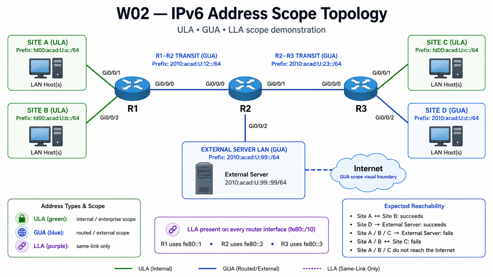

# Lab 02 — IPv6 Address Scope and Network Identity

---

## Section A — Lab Information

### A1 — Lab Overview

IPv6 uses address scope to define where an address is valid and how far communication using that address is expected to go. In this lab, the focus is on three assignable IPv6 address types that appear on real network devices: link-local addresses, unique local addresses, and global unicast addresses.

A **link-local address (LLA)** uses the `fe80::/10` range. It exists only on the local link. Routers do not forward traffic sourced to or destined for a link-local address beyond that link. In this lab, LLA demonstrates a protocol scope boundary.

A **unique local address (ULA)** uses the `fc00::/7` range, commonly seen as `fd00::/8`. ULA addresses are intended for internal or site communication. Routers can forward ULA traffic inside an organization when routes exist, but ULA prefixes are not intended to be carried across the public Internet. In this lab, ULA demonstrates an administrative or routing-policy boundary.

A **global unicast address (GUA)** uses globally routable IPv6 address space. GUA addresses are intended for communication beyond the local organization when routing exists. In this lab, GUA demonstrates external or Internet-routable scope.

### A2 — Why This Lab Is Important

IPv6 is now part of modern enterprise, cloud, ISP, security, and automation work. Network technicians and administrators need to recognize IPv6 address scope because the address type changes what the address can be used for and where traffic is expected to travel.

- IPv6 devices often have more than one address on the same interface. You need to identify which address is local-link, internal-only, or globally routable before troubleshooting.
- **Link-local addresses** are used in neighbour discovery, router relationships, and local next-hop decisions. Misreading an LLA as a normal routed address leads to incorrect troubleshooting.
- **Unique local addresses** are used for internal communication. They can be routed inside an organization, but they are not intended to be carried across the public Internet.
- **Global unicast addresses** are used when a device needs routable identity beyond the local organization.
- In real networks, failed IPv6 communication is often caused by scope, prefix, or routing-policy mismatch. Reading the address correctly helps you choose the right proof command before changing configuration.
- IPv6 evidence appears in router outputs, firewall logs, cloud networks, endpoint configurations, and automation scripts. Being able to classify address scope is a core operational skill.

### A3 — What You Will Do

- Configure and verify IPv6 address scope: LLA, ULA, and GUA.
- Infer missing router interface configurations from the addressing plan.
- Configure minimum IPv6 static routes for the allowed GUA path.
- Prove allowed and blocked reachability using `ping` and `show ipv6 route`.
- Submit checkpoint evidence C01–C09.

### A4 — Learning Objectives

By the end of this lab, you should be able to:

1. Classify observed IPv6 addresses as LLA, ULA, or GUA.
2. Explain the scope boundary for LLA, ULA, and GUA.
3. Configure and verify IPv6 interface identity.
4. Configure and verify IPv6 static routes.
5. Prove expected IPv6 reachability and non-reachability.
6. State what IPv6 evidence proves and what it does not prove.

### A5 — Environment / Constraints

| Item                 | Detail                                                            |
| -------------------- | ----------------------------------------------------------------- |
| **Environment**      | Cisco Packet Tracer                                               |
| **Lab type**         | Practice                                                          |
| **Estimated time**   | 90 minutes                                                        |
| **Submission file**  | `l02-username.txt`                                                |
| **Required devices** | 3 routers, 4 LAN hosts, 1 external server, LAN switches as needed |

Use the starter Packet Tracer topology provided by your instructor.

Replace `U` with your assigned value wherever it appears in an IPv6 address.

Example:

```text
If your assigned value is 7:

fd00:acad:U:a::/64 becomes fd00:acad:7:a::/64
2010:acad:U:12::/64 becomes 2010:acad:7:12::/64
```

---

## Section B — Topology and Addressing

### B1 — Topology





**Topology Note**
>Site A, Site B, and Site C use ULA addressing.
>Site D and the External Server use GUA addressing.
>R1–R2 and R2–R3 transit networks use GUA addressing.
>LLA is present on every IPv6-enabled router interface.

**Scope Boundary Model**
>
>**LLA boundary** = protocol scope boundary. LLAs stay on the local link.
>**ULA boundary** = routing-policy / administrative boundary. ULAs may be routed internally when routes exist, but this lab does not carry ULA prefixes across the external/core routing boundary.
>**GUA boundary** = globally routable address scope. GUA networks in this lab are the transit, Site D, and External Server networks.

### B2 — Addressing Plan

| Device          | Interface | Network                 | IPv6 Address / Prefix   | Notes                       |
| --------------- | --------- | ----------------------- | ----------------------- | --------------------------- |
| R1              | Gi0/0/1   | Site A ULA LAN          | `fd00:acad:U:a::1/64`   | Site A default gateway      |
| R1              | Gi0/0/2   | Site B ULA LAN          | `fd00:acad:U:b::1/64`   | Site B default gateway      |
| R1              | Gi0/0/0   | R1–R2 GUA Transit       | `2010:acad:U:12::1/64`  | Transit to R2               |
| R2              | Gi0/0/0   | R1–R2 GUA Transit       | `2010:acad:U:12::2/64`  | Transit to R1               |
| R2              | Gi0/0/1   | R2–R3 GUA Transit       | `2010:acad:U:23::2/64`  | Transit to R3               |
| R2              | Gi0/0/2   | External Server GUA LAN | `2010:acad:U:99::2/64`  | External server gateway     |
| R3              | Gi0/0/0   | R2–R3 GUA Transit       | `2010:acad:U:23::3/64`  | Transit to R2               |
| R3              | Gi0/0/1   | Site C ULA LAN          | `fd00:acad:U:c::3/64`   | Site C default gateway      |
| R3              | Gi0/0/2   | Site D GUA LAN          | `2010:acad:U:d::3/64`   | Site D default gateway      |
| Site A PC       | NIC       | Site A ULA LAN          | `fd00:acad:U:a::10/64`  | Gateway `fd00:acad:U:a::1`  |
| Site B PC       | NIC       | Site B ULA LAN          | `fd00:acad:U:b::10/64`  | Gateway `fd00:acad:U:b::1`  |
| Site C PC       | NIC       | Site C ULA LAN          | `fd00:acad:U:c::10/64`  | Gateway `fd00:acad:U:c::3`  |
| Site D PC       | NIC       | Site D GUA LAN          | `2010:acad:U:d::10/64`  | Gateway `2010:acad:U:d::3`  |
| External Server | NIC       | External Server GUA LAN | `2010:acad:U:99::99/64` | Gateway `2010:acad:U:99::2` |

### B3 — Link-Local Addressing Convention

| Router | Interfaces | Link-Local Address |
|---|---|---|
| R1 | Gi0/0/0, Gi0/0/1, Gi0/0/2 | `fe80::1` |
| R2 | Gi0/0/0, Gi0/0/1, Gi0/0/2 | `fe80::2` |
| R3 | Gi0/0/0, Gi0/0/1, Gi0/0/2 | `fe80::3` |

**Operational note**
>A link-local address is scoped to the local link. 
>The same LLA value may appear on different router interfaces.

### B4 — Network Roles

| Device | Role |
|---|---|
| R1 | ULA edge for Site A and Site B; GUA transit to R2 |
| R2 | Transit/core router; external server gateway |
| R3 | ULA edge for Site C; GUA edge for Site D |
| Site A PC | ULA internal host |
| Site B PC | ULA internal host |
| Site C PC | ULA internal host with no external reachability |
| Site D PC | GUA host that can reach the External Server |
| External Server | GUA destination representing an external/Internet-side service |

### B5 — Routing / Protocol / Service Model

Only configure the routes listed in this table.

| Device | Purpose | Destination | Exit Interface | Next Hop | Static Route Type |
|---|---|---|---|---|---|
| R2 | Return path to Site D GUA LAN | `2010:acad:U:d::/64` | `Gi0/0/1` | `2010:acad:U:23::3` | Fully specified |
| R3 | Forward path to External Server GUA LAN | `2010:acad:U:99::/64` | `Gi0/0/0` | `2010:acad:U:23::2` | Fully specified |

Do not configure these routes:

| Device | Do Not Configure | Boundary Reason |
|---|---|---|
| R1 | No default route and no route to the External Server LAN | Keeps Site A and Site B ULA networks inside the R1 administrative boundary |
| R1 | No route to Site C | Prevents ULA reachability between separate administrative areas |
| R2 | No routes to Site A, Site B, or Site C ULA networks | Prevents the core/external routing table from carrying ULA prefixes |
| R3 | No routes to Site A or Site B ULA networks | Prevents Site C from reaching R1-side ULA networks |

**ULA routing-policy note**

The IPv6 forwarding protocol does not block ULA prefixes. A router can forward ULA traffic if routes exist. In this lab, the ULA boundary is implemented by routing policy: ULA prefixes are intentionally not installed in the core/external routing table.

### B6 — Management Plane / Service Model

| Service            | Lab Design                                              |
| ------------------ | ------------------------------------------------------- |
| SSH                | Used                                                    |
| NTP                | Not used                                                |
| Syslog             | Not used                                                |
| CDP / LLDP         | Not required                                            |
| DNS / TFTP / Other | Not used                                                |
| IPv6 Routing       | Required on R1, R2, and R3 using `ipv6 unicast-routing` |

---

## Section C — Lab Tasks and Verification

### C0 — Baseline / Access Setup

- [ ] Cable the topology as the diagram.
- [ ] On your desktop, create **`l02-<username>.txt`**. You will submit this file to Brightspace.
	- **Avoid double extensions:** Many editors (Notepad, TextEdit) add `.txt` automatically.
	- Incorrect filenames will not be graded
- [ ] Set hostnames as `l02-username-device` for example: `l02-ayalac-R1`
- [ ] Disable **DNS lookup**.
- [ ] Protect privileged exec with password `class` stored with strong encryption.
- [ ] Configure the console line to minimize disruptions caused by log messages.

#### Verification

Use a command similar to:

```plaintext
show running-config | include ^hostname|^enable secret|^no ip domain-lookup
```

#### Success Indicator / Failure Signal

| Check | Success Indicator | Failure Signal |
|---|---|---|
| Hostname | Prompt shows assigned username-device format | Default router name remains |
| DNS lookup | `no ip domain-lookup` present | Mistyped commands cause long lookup delay |
| Enable secret | `enable secret` present | No privileged password protection |
| Console behaviour | Log messages do not interrupt typing excessively | Command line is disrupted by log output |

No submission required for this task.


---

### C1 — Enable IPv6 Routing on Routers


Cisco routers do not forward IPv6 traffic by default. An interface can have an IPv6 address and still not forward IPv6 packets between interfaces until IPv6 unicast routing is enabled.

- [ ] On R1, R2, and R3, enable IPv6 routing.

```plaintext
configure terminal
ipv6 unicast-routing
end
```

This command is required before the router can **forward IPv6 traffic** between interfaces.

#### Verification

```plaintext
show running-config | include ipv6 unicast-routing
```

#### Success Indicator / Failure Signal

| Evidence | Success Indicator | Failure Signal |
|---|---|---|
| `show running-config \| include ipv6 unicast-routing` | Output contains `ipv6 unicast-routing` | No output |

#### C01 — Collection of Information

In your evidence file, create this section:

```text
=== C01 – IPv6 Routing Enabled ===
```

Paste:

```plaintext
R1# show running-config | include ipv6 unicast-routing
R2# show running-config | include ipv6 unicast-routing
R3# show running-config | include ipv6 unicast-routing
```

Add a comment line:

```text
!-- This proves IPv6 unicast routing is enabled. Without this command, the router can have IPv6 interface addresses but will not forward IPv6 packets between interfaces.
```

---

### C2 — Configure Router IPv6 Interface Identity


- [ ] Configure IPv6 interface identity on R1, R2, and R3.
- [ ] Replace `U` with your assigned value.
- [ ] Use the addressing plan in Section B.
- [ ] Use `description` for all interfaces.

#### R1 configuration example

```
configure terminal
interface gi0/0/1 
description SITE-A-ULA-LAN 
ipv6 address fe80::1 link-local 
ipv6 address fd00:acad:U:a::1/64 
no shutdown 
exit

interface gi0/0/2 
description SITE-B-ULA-LAN 
ipv6 address fe80::1 link-local 
ipv6 address fd00:acad:U:b::1/64 
no shutdown 
exit

interface gi0/0/0 
description R1-R2-GUA-TRANSIT 
ipv6 address fe80::1 link-local 
ipv6 address 2010:acad:U:12::1/64 
no shutdown 
end
```

> Configure R2 and R3 by applying the same pattern.
#### Verification

Run this command on each router:

```
show ipv6 interface brief
```

Run this command only if an interface does not show the expected address.  You cannot submit this command output; it is intended for troubleshooting your configuration.

```
show running-config interface <interface-id>
```

#### Success Indicator / Failure Signal

| Evidence                        | Success Indicator                                                                               | Failure Signal                                                                   |
| ------------------------------- | ----------------------------------------------------------------------------------------------- | -------------------------------------------------------------------------------- |
| `R1# show ipv6 interface brief` | R1 interfaces show `fe80::1`, `fd00:acad:U:a::1`, `fd00:acad:U:b::1`, and `2010:acad:U:12::1`   | R1 uses wrong interface ID, wrong prefix, or missing LLA                         |
| `R2# show ipv6 interface brief` | R2 interfaces show `fe80::2`, `2010:acad:U:12::2`, `2010:acad:U:23::2`, and `2010:acad:U:99::2` | R2 uses `::1`, wrong transit prefix, or wrong external gateway address           |
| `R3# show ipv6 interface brief` | R3 interfaces show `fe80::3`, `2010:acad:U:23::3`, `fd00:acad:U:c::3`, and `2010:acad:U:d::3`   | R3 uses wrong address type, wrong interface ID, or missing Site C/Site D address |
| Interface state                 | Required router interfaces are `up/up` or administratively enabled in Packet Tracer             | Interface is administratively down or missing from output                        |
| Address type                    | Site A/B/C router LANs use ULA; Site D, transit, and External Server LAN use GUA                | ULA and GUA prefixes are mixed or assigned to the wrong segment                  |

#### C02 — Collection of Information

In your evidence file, create this section:

```
=== C02 – Router IPv6 Interface Identity ===
```

Paste:

```bash
R1# show ipv6 interface brief
R2# show ipv6 interface brief
R3# show ipv6 interface brief
```

Add one comment line for each router:

```
!-- R1 evidence proves Site A and Site B use ULA addressing, the R1-R2 transit uses GUA addressing, and R1 uses fe80::1 as its LLA.
!-- R2 evidence proves the core/transit and External Server LAN interfaces use GUA addressing, and R2 uses fe80::2 as its LLA.
!-- R3 evidence proves Site C uses ULA addressing, Site D uses GUA addressing, and R3 uses fe80::3 as its LLA.
```

---

### C3 — Configure Host IPv6 Addresses

- [ ] Configure a static IPv6 address and default gateway on each host.
- [ ] Replace `U` with your assigned value.

#### Verification

From each host command prompt, test the local default gateway.

```plaintext
ping <local-default-gateway>
```

#### Success Indicator / Failure Signal

| Evidence                     | Success Indicator                   | Failure Signal                           |
| ---------------------------- | ----------------------------------- | ---------------------------------------- |
| Site A PC ping gateway       | Replies from `fd00:acad:U:a::1`     | Host address, prefix, or gateway wrong   |
| Site B PC ping gateway       | Replies from `fd00:acad:U:b::1`     | Host address, prefix, or gateway wrong   |
| Site C PC ping gateway       | Replies from `fd00:acad:U:c::3`     | Host address, prefix, or gateway wrong   |
| Site D PC ping gateway       | Replies from `2010:acad:U:d::3`     | Host address, prefix, or gateway wrong   |
| External Server gateway test | Server can ping `2010:acad:U:99::2` | Server address, prefix, or gateway wrong |

#### C03 — Collection of Information

```text
=== C03 – Host Local Gateway Tests ===
```

Paste:

```plaintext
Site A PC> ping fd00:acad:U:a::1
Site B PC> ping fd00:acad:U:b::1
Site C PC> ping fd00:acad:U:c::3
Site D PC> ping 2010:acad:U:d::3
External Server> ping 2010:acad:U:99::2
```

Add a comment line:

```text
!-- This proves each host has a usable IPv6 identity on its local network.
```

---

### C4 — Configure SSH and Capture TCP Session Evidence

- [ ] Configure SSH on **R1** and open an SSH session from the **Site A PC** to R1.
- [ ] Create a local **admin** user with **privilege level 15** and **secret password `cisco`** (hashed).
- [ ] Set the device **domain name** to **`cst8371.net`** (needed for key generation).
- [ ] Generate an **RSA host key** with **modulus 1024 bits**.
- [ ] Enforce **SSH version 2 only**.
- [ ] VTY lines **0–4**: **login local**, **SSH-only** (no Telnet), and **exec-timeout = 10 minutes**.
- [ ] Set an **enable secret** for privileged mode if you haven't done it yet.
- [ ] From the Site A PC command prompt, open an SSH session to R1.
- [ ] Keep the SSH session open.

#### Verification

Run these commands on R1:

```plaintext
show ip ssh
show tcp brief
```

#### Success Indicator / Failure Signal

|Evidence|Success Indicator|Failure Signal|
|---|---|---|
|`R1# show ip ssh`|Output shows SSH enabled and version 2|SSH disabled, version 1, missing RSA keys, or missing domain name|
|Site A PC SSH command|SSH login to R1 succeeds using `admin`|Connection refused, timeout, authentication failure, or wrong IPv6 target|
|`R1# show tcp brief`|Active TCP session shows R1 IPv6 address, Site A PC IPv6 address, port `22`, and an established state|No TCP session, wrong source address, wrong destination address, or no established SSH session|
#### C04 — Collection of Information

In your evidence file, create this section:

```text
=== C04 – SSH and TCP Session Evidence ===
```

From R1 Paste:

```bash
show ip ssh
show tcp brief
```

Add this comment line:

```text
!-- This proves SSHv2 is enabled on R1 and that Site A PC opened an active SSH TCP session to R1 using IPv6.
```

---

### C5 — Configure Minimum IPv6 Static Routes

Configure only the minimum IPv6 static routes needed for the allowed GUA path.  
  
This lab uses routing policy to define the ULA boundary. ULA prefixes are not blocked by IPv6 forwarding itself. A router can forward ULA traffic if routes and policy allow it.  
  
In this topology, the ULA boundary is implemented by routing policy:  
  
- R1 has no default route.  
- R1 has no route toward the External Server.  
- R2 does not carry Site A, Site B, or Site C ULA prefixes.  
- R3 has a route to the External Server for Site D GUA traffic.  
- Site C is blocked from the GUA/external zone by the preconfigured boundary policy on R3.

```text  
ULA boundary = routing-policy / administrative boundary.
```


- [ ] On R2, configure the route to Site D:

```
configure terminal
ipv6 route 2010:acad:U:d::/64 2010:acad:U:23::3
end
```

- [ ] On R3, configure the matching route to the External Server LAN.
- [ ] Do not configure static routes on R1.
- [ ] Do not configure a default route on R1, R2, or R3.
- [ ] Do not configure routes for these ULA prefixes on R2:
	- `fd00:acad:U:a::/64`
	- `fd00:acad:U:b::/64`
	- `fd00:acad:U:c::/64`

#### Verification

```plaintext
show ipv6 route
```

#### Success Indicator / Failure Signal

| Evidence                                  | Success Indicator                                                   | Failure Signal                    |
| ----------------------------------------- | ------------------------------------------------------------------- | --------------------------------- |
| `R2# show ipv6 route`                     | Static route to `2010:acad:U:d::/64` via `2010:acad:U:23::3`        | Missing route to Site D           |
| `R3# show ipv6 route 2010:acad:U:99::/64` | Static route to `2010:acad:U:99::/64` via `2010:acad:U:23::2`       | Missing route to External Server  |
| `R1# show ipv6 route summary`             | No static routes - only a total of 7 routes 3 connected and 4 local | R1 has an unintended static route |
| `R1# show ipv6 route ::/0`                | No default route                                                    | Default route exists              |
| `R2# show ipv6 route fd00:acad:U:a::/64`  | No route found                                                      | ULA route exists on R2            |
| `R2# show ipv6 route fd00:acad:U:b::/64`  | No route found                                                      | ULA route exists on R2            |
| `R2# show ipv6 route fd00:acad:U:c::/64`  | No route found                                                      | ULA route exists on R2            |


#### C05 — Collection of Information

```text
=== C05 – IPv6 Static Route Evidence ===
```

Paste:

```
R1# show ipv6 route summary
R2# show ipv6 route
R3# show ipv6 route 2010:acad:U:99::/64
R2# show ipv6 route fd00:acad:U:a::/64  
R2# show ipv6 route fd00:acad:U:b::/64  
R2# show ipv6 route fd00:acad:U:c::/64
```

Add one comment line:

```
!-- This proves only the required GUA static routes exist and R1 has no static route toward the external network.
```


---

### C6 — Prove IPv6 Address Scope Behaviour

- [ ] Run the required ping tests.
- [ ] Use these outcomes to connect reachability to address scope:

```text
LLA boundary = protocol scope boundary.
ULA boundary = routing-policy / administrative boundary.
GUA boundary = globally routable address scope.
```

#### Verification

```plaintext
ping <destination-ipv6-address>
```

#### Success Indicator / Failure Signal

| Test ID | Source    | Destination          | Expected Result | Failure Signal                                                                    |
| ------- | --------- | -------------------- | --------------- | --------------------------------------------------------------------------------- |
| T1      | Site A PC | `fd00:acad:U:b::10`  | Success         | Site A/B addressing or R1 interface issue                                         |
| T2      | Site A PC | `2010:acad:U:99::99` | Fail            | If success occurs, R1 has unintended route/default route                          |
| T3      | Site A PC | `fd00:acad:U:c::10`  | Fail            | If success occurs, extra ULA route exists                                         |
| T4      | Site C PC | `2010:acad:U:d::10`  | Fail            | If success occurs, Site C boundary policy is missing or not applied               |
| T5      | Site C PC | `2010:acad:U:99::99` | Fail            | If success occurs, Site C boundary policy or external return-path design is wrong |
| T6      | Site D PC | `2010:acad:U:99::99` | Success         | Site D route, R2 return route, or host gateway issue                              |

#### C06 — Collection of Information

```text
=== C06 – IPv6 Scope Reachability Tests ===
```

Paste:

```plaintext
Site A PC> ping fd00:acad:U:b::10  
Site A PC> ping 2010:acad:U:99::99  
Site A PC> ping fd00:acad:U:c::10  
Site C PC> ping 2010:acad:U:d::10  
Site C PC> ping 2010:acad:U:99::99  
Site D PC> ping 2010:acad:U:99::99
```

Add a comment line:

```text
!-- This proves Site A and Site B ULA networks can communicate internally, Site C ULA is blocked from the GUA zone by boundary policy, Site A/B/C do not have external reachability, and Site D GUA can reach the External Server.
```

---

## Section D — Submission Requirements

### D1 — Required Submission Files

Your main evidence file must be named:

```text
l02-<username>.txt
```

It must contain:

```text
=== C01 – IPv6 Routing Enabled ===
=== C02 – Router IPv6 Interface Identity ===
=== C03 – Host Local Gateway Tests ===
=== C04 – SSH and TCP Session Evidence ===
=== C05 – IPv6 Static Route Evidence ===
=== C06 – IPv6 Scope Reachability Tests ===
```

Each section must include:

```text
Device prompt + command
Relevant command output
One comment line explaining what the evidence proves
```

> **Packet Tracer file note**
>
> The Packet Tracer file is used to build and test the lab, but it is **not submitted**. Submit only the evidence file named `l02-<username>.txt`.
>
> The evidence file must contain command output that proves your configuration and test results. A completed `.pkt` file by itself is not accepted as evidence.

---

## End of Lab 02 — Prove Address Scope Before Reachability

Before you troubleshoot IPv6 reachability, prove IPv6 identity first.

```text
Run the command.
Read the address.
Classify the scope.
Identify the boundary.
Check the prefix.
Check the route.
Then test reachability.
```

This is the baseline for IPv6 troubleshooting in later labs.
