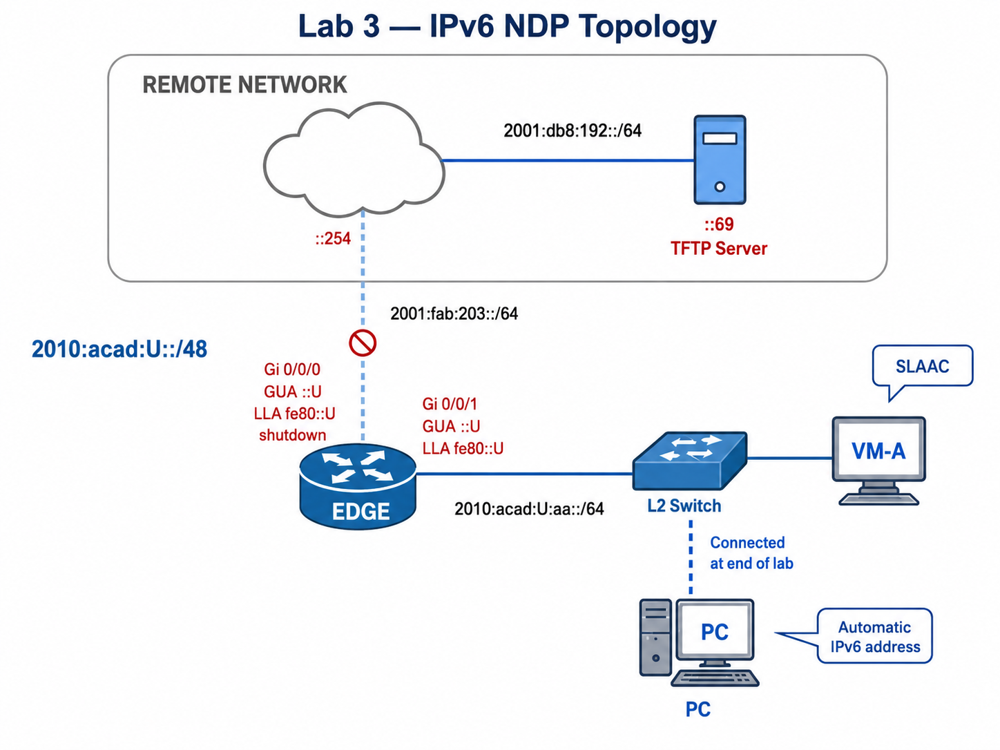

# Lab 03 — IPv6 Neighbor Discovery Protocol (NDP): RA/RS, NS/NA, NUD, and DAD

---

## Section A — Lab Information

### A1 — Lab Overview

You’ll observe how hosts learn prefixes and default gateways from **Router Advertisements (RAs)**, how **Router Solicitations (RS)** trigger those RAs, and how **Neighbour Unreachability Detection (NUD)**—via **NS/NA**—populates and refreshes the neighbour cache. You’ll capture **ops-only** evidence at checkpoints, then re-run final proofs at submission.

### A2 — Why This Lab Is Important

- IPv6 hosts must learn local network information before communication can work.
- SLAAC uses Router Advertisements to learn the prefix and default router.
- NDP replaces ARP + ICMP router discovery in IPv6. Reading **RS/RA** fields (prefixes, lifetimes, flags, router preference) explains why hosts form GUAs and pick a default via the router’s **LLA**.
- **NS/NA** provide address resolution and maintains the **neighbour cache**. You’ll read **NUD** states (INCOMPLETE → REACHABLE → STALE/PROBE) to diagnose first‑ping failures and link reachability.
- **DAD (Duplicate Address Detection)** prevents two nodes on the same segment from using the same IPv6 address. You’ll provoke a duplicate and prove how the tentative address is rejected.
- Logs show what the device observed, not what the configuration was supposed to do.

### A3 — What You Will Do

- [ ] Configure EDGE IPv6 addressing.
- [ ] Keep the remote-facing link shut down until the final submission step.
- [ ] Set the VM MAC address to `02:00:00:00:U:09`.
- [ ] Trigger and observe RS/RA behaviour.
- [ ] Capture EDGE log evidence for RA/RS.
- [ ] Generate NS/NA traffic and observe neighbour cache states.
- [ ] Provoke DAD by assigning the EDGE LAN GUA to the VM.
- [ ] Connect the PC only when instructed near the end of the lab.
- [ ] Use the PC to SSH into the VM using the VM link-local address.
- [ ] Submit checkpoint evidence C01–C05.

### A4 — Learning Objectives and Command Collection Map

By the end of this lab, you should be able to:

| Objective                                              | Evidence checkpoint |
| ------------------------------------------------------ | ------------------- |
| Verify EDGE can advertise an IPv6 LAN prefix           | C01                 |
| Identify RS/RA behaviour and the advertised prefix     | C02                 |
| Verify NS/NA and NUD state movement                    | C03                 |
| Verify DAD when a duplicate GUA is attempted           | C04                 |
| Prove final IPv6 reachability and submission readiness | C05                 |

### A5 — Environment / Constraints

```text
Environment: Cisco IOS / IOS-XE EDGE router + Alpine Linux VM + PC
Lab type: Practice
Estimated time: 2 hours
Submission file: l03-{username}.txt
Required devices: EDGE, VM, PC, Remote gateway, TFTP server
Required services: IPv6, ICMPv6, SLAAC, NDP, SSH, TFTP
VM credentials: cisco / root
```


---

## Section B — Topology and Addressing

### B1 — Topology



Topology notes:

```text
Replace U with your assigned value.
The PC is not connected at the beginning of the lab.
Connect the PC only in C04 when instructed.
```

### B2 — Addressing Plan

| Device         | Interface               | Network    | IP/Mask                | Notes                                 |
| -------------- | ----------------------- | ---------- | ---------------------- | ------------------------------------- |
| TFTP Server    | server NIC              | Server LAN | `2001:db8:192::69/64`  | Submission target                     |
| Remote gateway | remote-facing interface | Transit    | `2001:fab:203::254/64` | Next hop toward TFTP server           |
| EDGE           | `GigabitEthernet0/0/0`  | Transit    | `2001:fab:203::U/64`   | Keep shut down until final submission |
| EDGE           | `GigabitEthernet0/0/0`  | Transit    | `fe80::U`              | Link-local                            |
| EDGE           | `GigabitEthernet0/0/1`  | VM LAN     | `2010:acad:U:aa::U/64` | RA source                             |
| EDGE           | `GigabitEthernet0/0/1`  | VM LAN     | `fe80::U`              | Default router learned by VM          |
| VM             | `eth0`                  | VM LAN     | SLAAC-generated        | Learned from EDGE RA                  |
| VM             | `eth0`                  | VM LAN     | `02:00:00:00:U:09`     | Forced MAC pattern                    |
| PC             | NIC                     | VM LAN     | Automatic IPv6         | Connect only in C04                   |

### B3 — Service Model

| Service | Lab Design |
|---|---|
| SSH | Used from PC to VM after PC is connected |
| Syslog / logging | EDGE local logging is required |
| TFTP | Submission target using IPv6 |
| ICMPv6 | RS/RA, NS/NA, NUD, DAD, and ping tests |

---

## Section C — Lab Tasks and Verification

### C0 — Baseline / Access Setup

#### Action

- [ ] Cable the topology as shown, but do **not** connect the PC to the switch yet.
- [ ] Create your evidence file on your workstation:

```text
l03-{username}.txt
```

- [ ]  Set hostnames as `l03-{username}-EDGE`.
- [ ]  Disable DNS lookup.
- [ ]  Protect privileged exec with the password `class` stored with strong encryption.
- [ ]  Configure the console line to reduce command disruption from log messages.
- [ ]  Set the current time on EDGE.

#### Verification

On EDGE:

```plaintext
show running-config | include ^hostname|^enable secret|^no ip domain-lookup
show ipv6 interface brief
```

#### Success Indicator / Failure Signal

| Check           | Success Indicator                  | Failure Signal                         |
| --------------- | ---------------------------------- | -------------------------------------- |
| Hostname        | Prompt shows assigned hostname     | Default hostname remains               |
| DNS lookup      | `no ip domain-lookup` present      | Mistyped commands pause for DNS lookup |
| Enable secret   | `enable secret` present            | No privileged password protection      |
| VM access       | Alpine shell is available          | Cannot access VM                       |
| PC disconnected | PC link is not connected to switch | PC creates extra RS/NS noise early     |

No checkpoint submission is required for C0.

---

### C1 — Configure EDGE IPv6 and Router Advertisement Source

- [ ] On EDGE, configure IPv6 routing and the two IPv6 interfaces.
- [ ] Replace `U` with your assigned value.
- [ ] Keep `GigabitEthernet0/0/0` shut down until the final submission step.
- [ ] Code a fully specified default route towards the remote network, using the next hop LLA address `fe80::254`

> Note:
> As `GigabitEthernet0/0/0` is in a shutdown state, the default route will not be installed until the interface is `up`and `up`.

#### Verification

On EDGE:

```plaintext
show run | include ipv6 unicast
show ipv6 interface brief
show ipv6 int gi0/0/1
```

#### Success Indicator / Failure Signal

| Evidence                           | Success Indicator                                         | Failure Signal                  |
| ---------------------------------- | --------------------------------------------------------- | ------------------------------- |
| `show run \| include ipv6 unicast` | `ipv6 unicast-routing` appears                            | No output                       |
| `show ipv6 interface brief`        | `Gi0/0/1` is up/up with `FE80::U` and `2010:ACAD:U:AA::U` | LAN address missing or wrong    |
| `show ipv6 int gi0/0/1`            | ND is enabled and hosts use stateless autoconfig          | ND suppressed or interface down |
| `show ipv6 interface brief`        | `Gi0/0/0` is down/down until final step                   | Transit link enabled too early  |
#### C01 — Collection of Information

In `l03-{username}.txt`, create this section:

```text
=== C01 – EDGE IPv6 Addressing and RA Source ===
```

From EDGE paste:

```plaintext
show run | include ipv6 unicast
show ipv6 interface brief
show ipv6 int gi0/0/1
```

Add one comment line:

```text
!-- EDGE has IPv6 routing enabled and Gi0/0/1 can advertise the VM LAN prefix. 
```

---

### C2 — Trigger RS/RA and Observe SLAAC

#### Background

**Stateless Address Autoconfiguration (SLAAC) and IPv6 Address**
- SLAAC = **RA prefix** + **interface ID** (often **EUI-64** on hosts/routers).
- **EUI-64**: take the MAC, insert **ff:fe** in the middle, and **flip the U/L bit** (XOR first byte with `0x02`).
- LLAs commonly use EUI-64; GUAs may be **stable/temporary**, so check the LLA first.

**RA and default routes**
- Hosts learn prefixes and default gateways from **RAs**; an initial **RS** from the host can prompt an immediate RA.
- Hosts install the default route via the router’s **link-local address (LLA)**.
- Reading the router’s **RA debug** confirms the **RS→RA** exchange on the LAN.

<details>
<summary><strong>Why this works</strong></summary>

- **From MAC→IID:** `aa:bb:cc:dd:ee:ff` → `a8:bb:cc:ff:fe:dd:ee:ff` (U/L bit flipped). 
- **IPv6 form:** group into hextets (e.g., `a8bb:ccff:fedd:eeff`) and attach to the prefix.
- **LLA vs GUA:** LLA almost always EUI-64; GUA may be RFC7217/4941 (not EUI-64).
- **RS→RA handshake:** a host’s Router Solicitation triggers a Router Advertisement on-link.  
- **Default via LLA:** IPv6 next-hop is the router’s LLA; it’s always valid on that link.  
- **PIO & timers:** RA carries Prefix Information (valid/preferred lifetimes) that enables SLAAC.

</details>

In this lab, the VM MAC address is forced so the EUI-64-style host identifier is easy to recognize.

Example with `U=100`:

```text
VM MAC: 02:00:00:00:100:09
VM LLA: fe80::ff:fe00:9909
VM GUA: 2010:acad:100:aa:0:ff:fe00:9909/64
```

#### Steps

- [ ] On VM, set the MAC address to the recognizable pattern.
- [ ] Replace `U` with your assigned value.
- [ ] Run as root:

```bash
ip link set dev eth0 down
ip link set dev eth0 address 02:00:00:00:U:09
ip -6 addr flush dev eth0 scope global
ip link set dev eth0 up
sleep 5
```

Start NDP debugging on EDGE before triggering the RS/RA cycle.

On EDGE:

```plaintext
undebug all
clear logging
terminal monitor
debug ipv6 nd
```

On VM, trigger a fresh RS/RA cycle:

```bash
ip -6 addr flush dev eth0 scope global
ip link set dev eth0 down
sleep 1
ip link set dev eth0 up
sleep 10
```

If Router Advertisement is not observed after 10 seconds, run:

```bash
rdisc6 eth0
sleep 5
```

Stop debugging on EDGE:

```plaintext
undebug all
```

#### Verification

On EDGE:

```plaintext
show logging | include ICMPv6-ND|Received RS|Sending solicited RA|Sending RA|send RA|prefix|MTU
```

#### Success Indicator / Failure Signal

| Evidence | Success Indicator | Failure Signal |
|---|---|---|
| EDGE log | `Received RS` from the VM LLA | No RS line |
| EDGE log | `Sending solicited RA` | No solicited RA line |
| EDGE log | `Sending RA ... to FF02::1` | No RA sent to all-nodes multicast |
| EDGE log | `MTU = 1500` | MTU option missing |
| EDGE log | `prefix 2010:ACAD:U:AA::/64 [LA]` | Prefix line missing or wrong |

Expected log pattern:

```text
ICMPv6-ND: (GigabitEthernet0/0/1,FE80::FF:FE00:9909) Received RS
ICMPv6-ND: (GigabitEthernet0/0/1) Sending solicited RA
ICMPv6-ND: (GigabitEthernet0/0/1,FE80::100) Sending RA (1800) to FF02::1
ICMPv6-ND:   MTU = 1500
ICMPv6-ND:   prefix 2010:ACAD:100:AA::/64 [LA] 2592000/604800
```

#### C02 — Collection of Information

In `l03-{username}.txt`, create this section:

```text
=== C02 – RS/RA and Advertised Prefix Evidence ===
```

From EDGE paste:

```plaintext
show logging | include ICMPv6-ND|Received RS|Sending solicited RA|Sending RA|send RA|prefix|MTU
```

Add one comment line:

```text
!-- EDGE received an RS from the VM and sent an RA with the LAN prefix and MTU.
```

Do not collect any VM command outputs.

---

### C3 — Watch Neighbour Solicitation (NS) and Neighbour Advertisement (NA) build the neighbour cache

#### Background
- **NS → NA** performs address resolution and refreshes the **neighbour cache**.
- Entries move through **NUD** states: INCOMPLETE → REACHABLE → STALE → (DELAY/PROBE).
- **Solicited-node multicast** (`ff02::1:ffXX:XXXX`) is the NS target group derived from the IID.
- **LLA vs GUA:** LLAs are link-scope; pings must include an interface context (zone).

<details>
<summary><strong>Why this works </strong></summary>

- **Address resolution:** Host sends NS to the target’s *solicited-node multicast*; the owner replies NA (unicast).
- **NUD timers:** ReachableTime expiry moves entries to **STALE**; reuse triggers **DELAY/PROBE**.
- **Scope:** GUA pings don’t need a zone; LLA pings must specify **which interface/link**.

**NUD = Neighbour Unreachability Detection.**  
It’s the IPv6 mechanism (part of NDP) that keeps the **neighbour cache** accurate—verifying whether a neighbour is still reachable and refreshing the L3→L2 mapping using real traffic and, when needed, active probes (**NS/NA**).

**States (at a glance):**
- **INCOMPLETE** – don’t know L2 yet; sent NS.
- **REACHABLE** – recently confirmed good.
- **STALE** – mapping is old; first reuse will test it.
- **DELAY → PROBE** – grace period, then unicast NS probes.
- _(Linux may also show **FAILED**.)_

**Why you care:** explains “first ping fails, second works,” flaky links, and odd reachability.

</details>

Precision matters in technical work. The difference between `RS`, `RA`, `NS`, and `NA` is not cosmetic. Each message proves a different part of the IPv6 process.

#### Steps

- [ ] Start a new NDP debug capture on EDGE.

```plaintext
undebug all
clear logging
terminal monitor
debug ipv6 nd
```

- [ ] On VM, clear the neighbour cache and send traffic to EDGE GUA.
- [ ] Replace `U` with your assigned value.

```bash
ip -6 neigh flush dev eth0
ping -6 -c 2 2010:acad:U:aa::U
```

- [ ] Wait 5 seconds, then send link-local traffic:

```bash
ping -6 -c 2 fe80::U%eth0
```

- [ ] Wait long enough to observe state movement:

```bash
sleep 30
```

- [ ] Stop debugging on EDGE:

```plaintext
undebug all
```

#### Verification

On EDGE:

```plaintext
show logging | include NS|NA|STALE|DELAY|PROBE|REACH
show ipv6 neighbors
```

If `show ipv6 neighbors` shows `STALE` instead of `REACH`, ping again from VM and immediately repeat `show ipv6 neighbors`.

#### Success Indicator / Failure Signal

| Evidence | Success Indicator | Failure Signal |
|---|---|---|
| EDGE log | `Received NS` from the VM GUA | No NS line from VM GUA |
| EDGE log | `Sending NA` to the VM GUA | No NA line |
| EDGE log | `STALE -> DELAY`, `DELAY -> PROBE`, `PROBE -> REACH` | No state movement captured |
| `show ipv6 neighbors` | VM GUA and VM LLA appear with MAC and `REACH` | Missing neighbour or only stale/incomplete state |

Expected log pattern:

```text
ICMPv6-ND: (GigabitEthernet0/0/1,2010:ACAD:U:AA::U) Received NS from 2010:ACAD:U:AA:0:FF:FE00:9909
ICMPv6-ND: (GigabitEthernet0/0/1,2010:ACAD:U:AA::U) Sending NA to 2010:ACAD:U:AA:0:FF:FE00:9909
ICMPv6-ND: (GigabitEthernet0/0/1,2010:ACAD:U:AA:0:FF:FE00:9909) STALE -> DELAY
ICMPv6-ND: (GigabitEthernet0/0/1,2010:ACAD:U:AA:0:FF:FE00:9909) DELAY -> PROBE
ICMPv6-ND: (GigabitEthernet0/0/1,2010:ACAD:U:AA:0:FF:FE00:9909) PROBE -> REACH
```

Expected neighbour pattern:

```text
IPv6 Address                              Age Link-layer Addr State Interface
2010:ACAD:U:AA:0:FF:FE00:9909              0 0200.0000.9909  REACH Gi0/0/1
FE80::FF:FE00:9909                         0 0200.0000.9909  REACH Gi0/0/1
```

#### C03 — Collection of Information

In `l03-{username}.txt`, create this section:

```text
=== C03 – NS/NA and NUD State Evidence ===
```

From EDGE paste:

```plaintext
show logging | include NS|NA|STALE|DELAY|PROBE|REACH
show ipv6 neighbors
```

Add one comment line:

```text
!-- EDGE observed NS/NA traffic and has reachable neighbour entries for the VM.
```

---

### C4 — Provoke Duplicate Address Detection from the VM

#### Background
- **DAD** runs whenever a node configures a **new IPv6 address**: it sends a Neighbour Solicitation (NS) from `::` to the address’s **solicited-node multicast**.  
- If any node replies / claims that address, the tentative address is **rejected** (not usable).  
- Router debug lets you see the **NS used for DAD** on the link.

<details>
<summary><strong>Why this works (mini theory)</strong></summary>

- **DAD probe:** source `::` → destination `ff02::1:ffXX:XXXX` (based on the IID).  
- **Rejection path:** a response indicates a duplicate → stack marks **tentative/duplicate** (Linux: `dadfailed`).  
- **Scope:** DAD is **on-link** only; both nodes must share the same /64 and L2 segment.
</details>

#### Steps

- [ ] Start a short NDP debug ipv6 nd capture on EDGE.
- [ ] On VM, add the duplicate address. Replace `U` with your assigned value.

```bash
ip -6 addr add 2010:acad:U:aa::U/64 dev eth0
sleep 5
```

- [ ] Connect the PC to the switch.
- [ ] Set the PC to use automatic IPv6 addressing.
- [ ] From the PC, use PuTTY to SSH to the VM using the VM link-local address.  The VM GUA is intentionally duplicated and cannot be trusted for this task. Use the VM LLA.
- [ ] Stop debugging on EDGE:

#### Verification

On EDGE:

```plaintext
show logging | include DAD|DUPLICATE|Duplicate|Received NS|Sending NA
show ipv6 int gi0/0/1 | include DAD
```

On VM:

```bash
ip -6 addr show dev eth0
```

#### Success Indicator / Failure Signal

| Evidence | Success Indicator | Failure Signal |
|---|---|---|
| EDGE log | DAD attempt detected for `2010:ACAD:U:AA::U` | No DAD evidence |
| EDGE log | EDGE sends NA in response to DAD NS | No NA response |
| VM address output | Duplicate GUA appears as `dadfailed tentative` | Duplicate address appears usable |
| EDGE address | EDGE still owns `2010:acad:U:aa::U/64` | EDGE address was modified |

Expected EDGE log pattern:

```text
ICMPv6-ND: (GigabitEthernet0/0/1,2010:ACAD:U:AA::U) Received NS from ::
ICMPv6-ND: (GigabitEthernet0/0/1,2010:ACAD:U:AA::U) Sending NA to FF02::1
%IPV6_ND-6-DUPLICATE_INFO: DAD attempt detected for 2010:ACAD:U:AA::U on GigabitEthernet0/0/1
```

Expected VM output pattern:

```text
inet6 2010:acad:U:aa::U/64 scope global dadfailed tentative
inet6 2010:acad:U:aa:0:ff:fe00:9909/64 scope global dynamic
inet6 fe80::ff:fe00:9909/64 scope link
```

#### C04 — Collection of Information

In `l03-{username}.txt`, create this section:

```text
=== C04 – Duplicate Address Detection Evidence ===
```

From EDGE paste:

```plaintext
show logging | include DAD|DUPLICATE|Duplicate|Received NS|Sending NA
show ipv6 int gi0/0/1 | include DAD
```

From VM paste:

```plaintext
ip -6 addr show dev eth0
```

Add one comment line:

```text
!-- VM attempted to use EDGE's GUA and DAD marked the duplicate address as failed.
```

---

### C5 — Clean Up, Enable Transit, and Submit


- [ ] On VM, remove the duplicate address. Replace `U` with your assigned value.

```bash
ip -6 addr del 2010:acad:U:aa::U/64 dev eth0
```

- [ ] On EDGE, enable the remote-facing interface.
- [ ] On VM, verify final addressing, routing, and TFTP reachability.

```bash
ip link show eth0 | grep link/ether
ip -6 addr show dev eth0
ip -6 route | grep default
ping -c 2 2001:db8:192::69
```

#### Verification

On VM:

```bash
ip link show eth0 | grep link/ether
ip -6 addr show dev eth0
ip -6 route | grep default
ping -c 2 2001:db8:192::69
```

#### Success Indicator / Failure Signal

| Evidence         | Success Indicator                               | Failure Signal                          |
| ---------------- | ----------------------------------------------- | --------------------------------------- |
| VM MAC           | `02:00:00:00:U:09` appears                      | MAC changed or reset                    |
| VM address       | SLAAC GUA remains and duplicate address is gone | `dadfailed tentative` duplicate remains |
| VM route         | Default route via `fe80::U` appears             | Default route missing                   |
| Ping TFTP server | `2 packets received`, `0% packet loss`          | Ping fails                              |

#### C05 — Collection of Information

In `l03-{username}.txt`, create this section:

```text
=== C05 – Cleanup, Final Reachability, and Submission ===
```

From VM paste:

```plaintext
ip link show eth0 | grep link/ether
ip -6 addr show dev eth0
ip -6 route | grep default
ping -c 2 2001:db8:192::69
```

Add one comment line:

```text
!-- Duplicate address removed; VM has IPv6 readiness and can reach the TFTP server.
```

---

## Section D — Submission and Cleanup

### D1 — Required Submission File

| File                 | Required Content                          | Source                        |
| -------------------- | ----------------------------------------- | ----------------------------- |
| `l03-{username}.txt` | C01–C05 evidence collected during the lab | Student-created evidence file |
| default              | Running configuration from EDGE           | running-config                |

### D2 — Evidence File Format

Your main evidence file must be named:

```text
l03-{username}.txt
```

It must contain:

```text
=== C01 – EDGE IPv6 Addressing and RA Source ===
=== C02 – RS/RA and Advertised Prefix Evidence ===
=== C03 – NS/NA and NUD State Evidence ===
=== C04 – Duplicate Address Detection Evidence ===
=== C05 – Cleanup, Final Reachability, and Submission ===
```

Each checkpoint must include:

```text
Device prompt + command
Raw command output
One comment line beginning with !--
```

### D3 — Submit Files by TFTP

Submit each file to the course TFTP server.

### D4 — Validate Submission

Submission is not complete until the file is present and non-zero on the TFTP server.

| Check             | Success Indicator                           | Failure Signal                |
| ----------------- | ------------------------------------------- | ----------------------------- |
| File exists       | `l03-{username}.txt` appears on TFTP server | File missing                  |
| File size         | File is not 0 bytes                         | Zero-byte file                |
| Evidence sections | C01–C05 sections appear                     | Missing checkpoint            |
| Raw output        | Prompt + command + output are present       | Only summaries or screenshots |

Your submission is your responsibility.

Before leaving the lab, prove:

```
1. TFTP transfer completed for all required files.
2. SSH login to 2001:db8:192::69 works. Credentials cisco/cisco
3. ls -l shows all required l03-<username>* files.
4. Each file has non-zero size.
```

### D5 — Cleanup

After submission is confirmed, clean up EDGE using the provided TCL script.

On EDGE:

```plaintext
tclsh clean.tcl
```

Expected cleanup output:

```text
=== Lab Cleanup Script ===

-- Step 1: Scanning flash: for saved config files --
  No saved config files found on flash:.

-- Step 2: Removing VLANs 2-1001 --
  VLANs 2-1001 removed.

-- Step 3: Checking startup-config --
  No startup-config present.

=== Cleanup Complete - No Reload Needed ===
```

Now you can turn off your router.
### D5 — End of Lab Message

```text
Run the command.
Read the output.
Identify the protocol process.
Identify what the output proves.
Identify what the output does not prove.
Then act.
```

_This lab proves local IPv6 discovery evidence. It does not prove DNS, application reachability, firewall policy, or full end-to-end enterprise routing._
