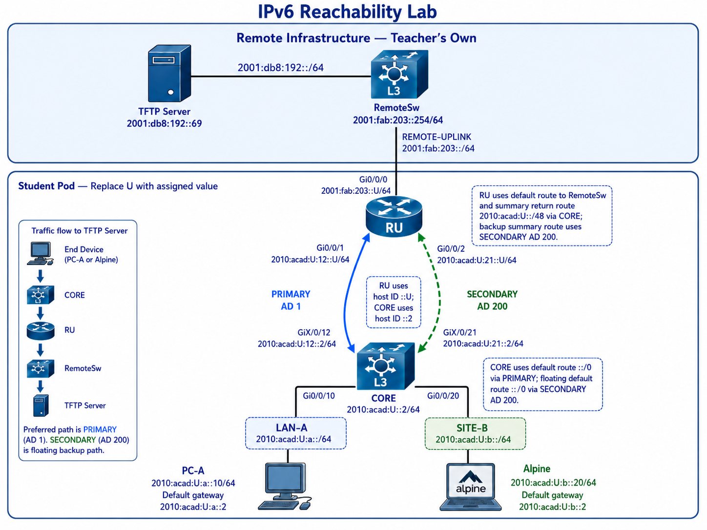

# Lab 04 — IPv6 Route Selection and Backup Path Evidence

---
## Section A — Lab Information

### A1 — Lab Overview

This lab establishes and verifies IPv6 reachability between a student network and a fixed remote TFTP network using the least practical number of static routes.

Students will build a routed IPv6 topology using a CORE Layer 3 switch, an RU router, two end devices, and the existing remote infrastructure. The lab includes a floating static route test where the PRIMARY path is removed and the SECONDARY path must take over.

### A2 — Why This Lab Is Important

This lab connects IPv6 interface state to routing-table evidence.  **Static routes** are a basic network administrator tool for controlling how traffic leaves a device when no dynamic routing protocol is being used. A network administrator must be able to read a routing table, identify the selected next hop, and prove whether the route supports both the forward path and the return path. A successful route is not just a line in the configuration; it must point to a reachable next hop and produce observable reachability.

**Default routes** simplify configuration when multiple destinations exist beyond a single upstream router. **Summary routes** reduce the number of return routes by representing multiple internal networks with one larger prefix. 

**Floating static routes** provide a backup path by using a higher administrative distance; therefore, the backup route remains inactive until the preferred route is removed from the routing table. In IPv6, link-local next hops introduce an additional operational requirement: the route must be fully specified with the outgoing interface, as the same link-local address can exist on multiple links.

### A3 — What You Will Do

-  Configure IPv6 addressing and SSH access on Cisco routers.  
-  Configure the least-route static routing design using default and summary routes.  
-  Configure SECONDARY backup routes as floating static routes with link-local next hops.  
-  Prove end-to-end reachability. 
-  Shut down the PRIMARY path, prove SECONDARY takes over, then restore PRIMARY.  

### A4 — Learning Objectives

By the end of this lab, you should be able to:

1. Configure IPv6 static routes and prove route selection with `show ipv6 route <destination>`.
2. Use an IPv6 summary route to reduce the number of required static routes.
3. Configure a floating static route and prove it becomes active after the PRIMARY path fails.
4. Use a fully specified IPv6 static route when the next hop is link-local.
5. Prove reachability from two end-device networks to a remote TFTP server.

### A5 — Environment / Constraints

```text
Environment:        Real equipment
Lab type:           Practice
Estimated time:     2 hours 30 minutes
Submission file:    l04-username.txt
Required devices:   CORE Layer 3 switch, RU router, PC-A, Alpine VM, RemoteSw, TFTP server
Required services:  SSH, IPv6 routing, TFTP reachability
```


---

## Section B — Topology and Addressing

### B1 — Topology



### B2 — Addressing Plan

| Device      | Interface                | Network       | GUA / Prefix           | LLA            | Notes                    |
| ----------- | ------------------------ | ------------- | ---------------------- | -------------- | ------------------------ |
| PC-A        | NIC                      | LAN-A         | `2010:acad:U:a::10/64` | Auto-generated | End device               |
| CORE        | Gi0/0/10                 | LAN-A         | `2010:acad:U:a::2/64`  | `fe80::2`      | PC-A gateway             |
| Alpine      | NIC                      | SITE-B        | `2010:acad:U:b::20/64` | Auto-generated | End device               |
| CORE        | Gi0/0/20                 | SITE-B        | `2010:acad:U:b::2/64`  | `fe80::2`      | Alpine gateway           |
| CORE        | Gi0/0/12                 | PRIMARY       | `2010:acad:U:12::2/64` | `fe80::2`      | PRIMARY link to RU       |
| RU          | Gi0/0/1                  | PRIMARY       | `2010:acad:U:12::U/64` | `fe80::U`      | PRIMARY link to CORE     |
| CORE        | Gi0/0/21                 | SECONDARY     | `2010:acad:U:21::2/64` | `fe80::2`      | SECONDARY link to RU     |
| RU          | Gi0/0/2                  | SECONDARY     | `2010:acad:U:21::U/64` | `fe80::U`      | SECONDARY link to CORE   |
| RU          | Gi0/0/0                  | REMOTE-UPLINK | `2001:fab:203::U/64`   | `fe80::U`      | Link to RemoteSw         |
| RemoteSw    | Student-facing interface | REMOTE-UPLINK | `2001:fab:203::254/64` | Existing       | Remote gateway           |
| TFTP Server | NIC                      | TFTP-NET      | `2001:db8:192::69/64`  | Existing       | Final remote destination |

>Operational note:
>RU uses host ID `::U` for all RU addresses.
>CORE uses host ID `::2` for all CORE addresses.

### B3 — Network Roles

| Device      | Role                                                                  |
| ----------- | --------------------------------------------------------------------- |
| CORE        | Layer 3 switch for LAN-A, SITE-B, PRIMARY, and SECONDARY routed links |
| RU          | Router between student network and RemoteSw                           |
| RemoteSw    | Instructor-owned Layer 3 switch for remote infrastructure             |
| PC-A        | End device in LAN-A                                                   |
| Alpine      | End device in SITE-B                                                  |
| TFTP Server | Remote IPv6 destination at `2001:db8:192::69`                         |

### B4 — Routing / Service Model

| Device | Purpose | Destination / Service | Next Hop / Target |
|---|---|---|---|
| CORE | Primary default route | `::/0` | RU PRIMARY global address `2010:acad:U:12::U` |
| CORE | Floating default route | `::/0` | RU SECONDARY link-local address, fully specified with CORE SECONDARY interface |
| RU | Remote default route | `::/0` | RemoteSw `2001:fab:203::254` |
| RU | Primary student summary return route | `2010:acad:U::/48` | CORE PRIMARY global address `2010:acad:U:12::2` |
| RU | Floating student summary return route | `2010:acad:U::/48` | CORE SECONDARY link-local address, fully specified with RU SECONDARY interface |
| RemoteSw | Existing return route | `2010:acad:U::/48` | RU remote-facing address `2001:fab:203::U` |
| PC-A | Default gateway | `::/0` | CORE LAN-A address `2010:acad:U:a::2` |
| Alpine | Default gateway | `::/0` | CORE SITE-B address `2010:acad:U:b::2` |

### B5 — Management Plane / Service Model

| Service | Lab Design                                                                      |
| ------- | ------------------------------------------------------------------------------- |
| SSH     | Configure SSH on CORE and RU. Use SSH to access Alpine for evidence collection. |
| TFTP    | TFTP server is the final IPv6 reachability target at `2001:db8:192::69`         |

---

## Section C — Lab Tasks and Verification

### C1 — Baseline / Access Setup
#### Action

- [ ] Cable the topology according to Section B1.
- [ ] Configure IPv6 addresses on PC-A and Alpine from Section B2.
- [ ] Configure IPv6 addressing on CORE and RU from Section B2.
- [ ] Configure SSH on CORE and RU.
- [ ] Confirm that you can access Alpine by SSH before collecting Alpine evidence.
- [ ] From PC-A, SSH into CORE using:

```
ssh <username>@2010:acad:U:a::2
```

>**L3 switch note**:
>Interfaces used as Layer 3 routed ports require `no switchport` before IPv6 addressing is applied.

#### Verification

Use these commands while checking your baseline:

```
From CORE and RU:
show ipv6 interface brief
show ipv6 route
show ipv6 protocols
show ip ssh

From RU:
show tcp brief
```

#### Success Indicator / Failure Signal

| Check                       | Success Indicator                                                                      | Failure Signal                                                                   |
| --------------------------- | -------------------------------------------------------------------------------------- | -------------------------------------------------------------------------------- |
| IPv6 routing                | `show ipv6 protocols` displays IPv6 routing information                                | IPv6 routing is not enabled or no IPv6 protocol output appears                   |
| Route evidence              | `show ipv6 route` shows expected `C` prefixes and `L` routes for GUA and LLA addresses | Missing `C` route, missing GUA `L` route, missing LLA `L` route, or wrong prefix |
| SSH service                 | `show ip ssh` shows SSH enabled and version 2                                          | SSH disabled or version 1                                                        |
| Active SSH session evidence | `show tcp brief` shows an active TCP session to port `22`                              | No SSH TCP session appears                                                       |
| Alpine access               | SSH login to Alpine succeeds                                                           | SSH fails or Alpine cannot be reached                                            |

#### C01 — Collection of Information

In your evidence file, create this section:

```
=== C01 – Baseline IPv6 Routing, Route Table, and SSH Evidence ===
```

Paste from CORE & RU:

```
show ipv6 protocols
show ipv6 route
show ip ssh

Only in CORE:
show tcp brief
```

Add one comment line:

```
!-- This proves CORE and RU have IPv6 routing enabled, required connected and local IPv6 routes installed, SSHv2 enabled, and active SSH access evidence.
```

---

### C2 — Configure Least-Route Static Routing

#### Action

- [ ] Configure the least-route design.
- [ ] Before configuring each floating route, identify the neighbour link-local address on the SECONDARY link.
- [ ] Use route or neighbour evidence. Do not assume the link-local next hop from the GUA alone.
- [ ] Record the discovered LLA in your lab book before configuring the floating route.

**CORE routes**

```plaintext
Primary route:
- Destination: ::/0
- Next hop: RU PRIMARY global address 2010:acad:U:12::U
- Administrative distance: default
- Requirement: configure this as a recursive static route using only the next-hop GUA. Do not include the outgoing interface.

Floating route:
- Destination: ::/0
- Next hop: RU SECONDARY link-local address
- Outgoing interface: CORE SECONDARY interface
- Administrative distance: 200
- Requirement: route must be fully specified
```

**RU routes**

```plaintext
Remote default route:
- Destination: ::/0
- Next hop: RemoteSw 2001:fab:203::254

Primary student summary return route:
- Destination: 2010:acad:U::/48
- Next hop: CORE PRIMARY global address 2010:acad:U:12::2
- Administrative distance: default
- Requirement: configure this as a recursive static route using only the next-hop GUA. Do not include the outgoing interface.

Floating student summary return route:
- Destination: 2010:acad:U::/48
- Next hop: CORE SECONDARY link-local address
- Outgoing interface: RU SECONDARY interface
- Administrative distance: 200
- Requirement: route must be fully specified
```

>When a static route uses an IPv6 link-local next hop, the route must include the outgoing interface.
>**Reason**: a link-local address only has meaning on a local link. The router or switch must know which interface/link contains that neighbour.

#### Verification

```plaintext
CORE:
show run | include ipv6 route
show ipv6 route 2001:db8:192::69

RU:
show run | include ipv6 route
show ipv6 route 2010:acad:U:a::10
show ipv6 route 2010:acad:U:b::20
show ipv6 route 2001:db8:192::69
```

#### Success Indicator / Failure Signal

| Evidence                                        | Success Indicator                                            | Failure Signal                                  |
| ----------------------------------------------- | ------------------------------------------------------------ | ----------------------------------------------- |
| `CORE# show ipv6 route 2001:db8:192::69`        | Route uses PRIMARY next hop `2010:acad:U:12::U`              | No route or SECONDARY selected before failure   |
| `RU# show ipv6 route 2010:acad:U:a::10`         | Route matches `2010:acad:U::/48` through PRIMARY             | No matching route or wrong next hop             |
| `RU# show ipv6 route 2010:acad:U:b::20`         | Route matches `2010:acad:U::/48` through PRIMARY             | No matching route or wrong next hop             |
| `RU# show ipv6 route 2001:db8:192::69`          | Route uses RemoteSw `2001:fab:203::254`                      | No route to TFTP-NET                            |

#### C02 — Collection of Information

```text
=== C02 – Least-Route Static Routing Evidence ===
```

Paste:

```plaintext
From CORE:
show run | include ipv6 route
show ipv6 route 2001:db8:192::69

FROM RU:
show run | include ipv6 route
show ipv6 route 2010:acad:U:a::10
show ipv6 route 2010:acad:U:b::20
show ipv6 route 2001:db8:192::69
```

Add one comment line:

```text
!-- This proves CORE uses a primary default route, RU uses a /48 summary return route, and backup routes are configured as floating routes.
```

---

### C3 — Prove Local and Remote Reachability Before Failure

#### Action

- [ ] From PC-A, test the CORE gateway and the remote TFTP server.
- [ ] From Alpine, SSH into the VM first, then run the tests from the SSH session.

>**Alpine copy/paste constraint**
>The Alpine VM console does not permit reliable copy/paste.
>Use SSH into Alpine from your workstation before collecting Alpine evidence.
>Alpine credentials: `root/cisco`

#### Verification

From PC-A:

```plaintext
ping 2010:acad:U:a::2
ping 2001:db8:192::69
tracert 2001:db8:192::69
```

From your workstation, SSH into Alpine:

```plaintext
ssh <alpine-username>@2010:acad:U:b::20
```

From the Alpine SSH session:

```plaintext
ip -6 addr show
ip -6 route
ping -6 -c 2 2010:acad:U:b::2
ping -6 -c 2 2001:db8:192::69
traceroute6 2001:db8:192::69
```

#### Success Indicator / Failure Signal

| Evidence                                  | Success Indicator                             | Failure Signal                    |
| ----------------------------------------- | --------------------------------------------- | --------------------------------- |
| `PC-A ping 2010:acad:U:a::2`              | PC-A receives replies from CORE LAN-A gateway | Request timed out or unreachable  |
| `PC-A ping 2001:db8:192::69`              | PC-A receives replies from TFTP server        | Timeout                           |
| `PC-A tracert 2001:db8:192::69`           | Path leaves PC-A through CORE and RU          | Trace stops at local gateway      |
| `ssh <alpine-username>@2010:acad:U:b::20` | SSH login succeeds                            | SSH connection refused or timeout |
| `Alpine ip -6 route`                      | Default route points to `2010:acad:U:b::2`    | Missing default route             |
| `Alpine ping -6 -c 2 2001:db8:192::69`    | Alpine receives replies from TFTP server      | 100% packet loss                  |
| `Alpine traceroute6 2001:db8:192::69`     | Path leaves Alpine through CORE and RU        | Trace stops at Alpine or CORE     |

#### C03 — Collection of Information

```text
=== C03 – End-Device Reachability Evidence Before Failure ===
```

Paste:

```plaintext
PC-A> ping 2010:acad:U:a::2
PC-A> ping 2001:db8:192::69
PC-A> tracert 2001:db8:192::69

Alpine$ ip -6 addr show
Alpine$ ip -6 route
Alpine$ ping -6 -c 4 2010:acad:U:b::2
Alpine$ ping -6 -c 4 2001:db8:192::69
Alpine$ traceroute6 2001:db8:192::69
```

Add one comment line:

```text
!-- This proves both end-device networks can reach the remote TFTP server before the PRIMARY path is removed.
```

---

### C4 — Prove Floating Routes Activate

#### Action

- [ ] Shut down the PRIMARY CORE-to-RU link on CORE only.
- [ ] Wait 10 seconds after shutting down the PRIMARY link.

#### Verification

```plaintext
CORE# show ipv6 interface brief
CORE# show ipv6 route 2001:db8:192::69

RU# show ipv6 route 2010:acad:U:a::10
RU# show ipv6 route 2010:acad:U:b::20

PC-A> tracert 2001:db8:192::69

Alpine$ traceroute6 2001:db8:192::69
```

#### Success Indicator / Failure Signal

| Evidence                                 | Success Indicator                                                                                                     | Failure Signal                                         |
| ---------------------------------------- | --------------------------------------------------------------------------------------------------------------------- | ------------------------------------------------------ |
| `CORE# show ipv6 interface brief`        | PRIMARY interface is `administratively down/down`; SECONDARY remains `up/up`                                          | SECONDARY also down or wrong interface shut            |
| `CORE# show ipv6 route 2001:db8:192::69` | Route now uses SECONDARY path                                                                                         | No route to TFTP server                                |
| `RU# show ipv6 route 2010:acad:U:a::10`  | Route to LAN-A uses SECONDARY path                                                                                    | Return path still uses failed PRIMARY or route missing |
| `RU# show ipv6 route 2010:acad:U:b::20`  | Route to SITE-B uses SECONDARY path                                                                                   | Return path still uses failed PRIMARY or route missing |
| `PC-A> tracert 2001:db8:192::69`         | Trace reaches the TFTP server and first routed hop is CORE, then traffic proceeds through RU using the SECONDARY path | Trace stops at CORE or does not reach TFTP             |
| `Alpine$ traceroute6 2001:db8:192::69`   | Trace reaches the TFTP server and first routed hop is CORE, then traffic proceeds through RU using the SECONDARY path | Trace stops at CORE or does not reach TFTP             |

#### C04 — Collection of Information

```text
=== C04 – Floating Route Activation Evidence ===
```

Paste:

```plaintext
CORE# show ipv6 interface brief
CORE# show ipv6 route 2001:db8:192::69

RU# show ipv6 route 2010:acad:U:a::10
RU# show ipv6 route 2010:acad:U:b::20

PC-A> tracert 2001:db8:192::69

Alpine$ traceroute6 2001:db8:192::69
```

Add one comment line:

```text
!-- This proves the SECONDARY floating routes are installed and usable after the PRIMARY path fails.
```

---

### C5 — Restore PRIMARY and Prove Route Preference Returns

#### Action

Restore the **PRIMARY CORE-to-RU link on CORE**.

Wait 10 seconds after restoring the interface.
#### Verification

Use only `show ipv6 route` to observe that the lower administrative distance route becomes preferred again:

```
From CORE / RU:
show ipv6 route
```

#### Success Indicator / Failure Signal

|Evidence|Success Indicator|Failure Signal|
|---|---|---|
|`CORE# show ipv6 route`|Default route `::/0` returns to the PRIMARY recursive next hop `2010:acad:U:12::U`|Default route still uses SECONDARY `fe80::U`, route is missing, or route has wrong next hop|
|`RU# show ipv6 route`|Summary route `2010:acad:U::/48` returns to the PRIMARY next hop `2010:acad:U:12::2`|Summary route still uses SECONDARY `fe80::2`, route is missing, or route has wrong next hop|

#### Collection of Information

No C05 submission evidence is required.

Operational note:

```
C04 is the graded proof that floating routes activate. 
C05 restores the preferred path and confirms the routing table returns to the lower-AD routes.
```

---

## Section D — Submission and Cleanup

### D1 — Submission

Submit one evidence file to the course TFTP server.

|File|Required Content|Source|
|---|---|---|
|`l04-<username>.txt`|C01–C04 evidence collected during the lab|Student-created evidence file|

Your evidence file must contain:

```
=== C01 – Baseline IPv6 Routing, Route Table, and SSH Evidence ===
=== C02 – Least-Route Static Routing Evidence ===
=== C03 – End-Device Reachability Evidence Before Failure ===
=== C04 – Floating Route Activation and Path Evidence ===
```

Each checkpoint must include:

```
Device prompt + command
Raw command output
One comment line beginning with !--
```

Submit the file by TFTP:

```
tftp 2001:db8:192::69 PUT l04-<username>.txt
```

> If the TFTP transfer fails from your workstation, check that the local firewall is not blocking TFTP traffic.

---

### D2 — Validate Submission

Your submission is your responsibility.

Before leaving the lab, prove:

```
1. TFTP transfer completed.
2. SSH login to 2001:db8:192::69 works.
3. ls -l /var/tftp/l04-username* 
4. The file has non-zero size.
```

---

### D3 — Cleanup

After submission is confirmed, clean up routers using the provided TCL script.

On CORE and RU:

```
tclsh clean.tcl
```

Expected cleanup output:

```
=== Lab Cleanup Script ===

-- Step 1: Scanning flash: for saved config files --
  No saved config files found on flash:.

-- Step 2: Removing VLANs 2-1001 --
  VLANs 2-1001 removed.

-- Step 3: Checking startup-config --
  No startup-config present.

=== Cleanup Complete - No Reload Needed ===
```

Now you can turn off your router.

---
## End of Lab 04 — IPv6 Route Selection

Build a least-route IPv6 static routing design, prove route selection with evidence, and verify that a floating backup path takes over when the primary path fails.

```text
Run the command.  
Read the output.  
Identify the selected route.  
Identify the next hop.  
Identify whether the route proves the forward path, the return path, or both.  
Identify what the output does not prove.  
Then act.
```

_This lab proves IPv6 route selection, summary-route return paths, and floating static route activation.  It does not prove OSPF, DNS, firewall policy, application-layer service health, or Internet reachability._
