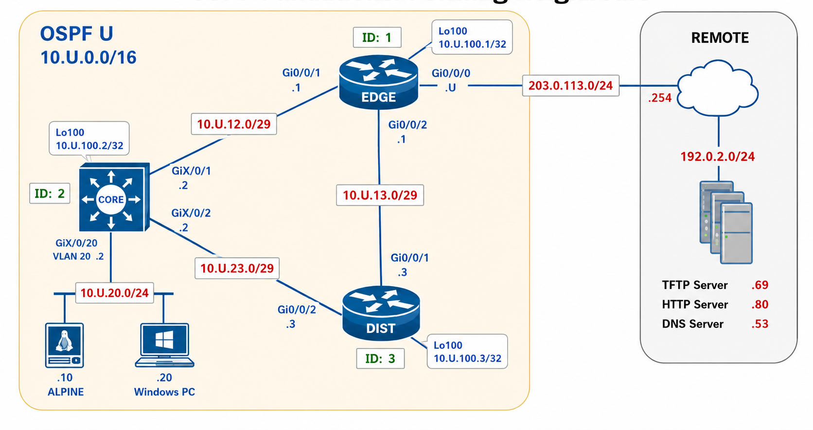
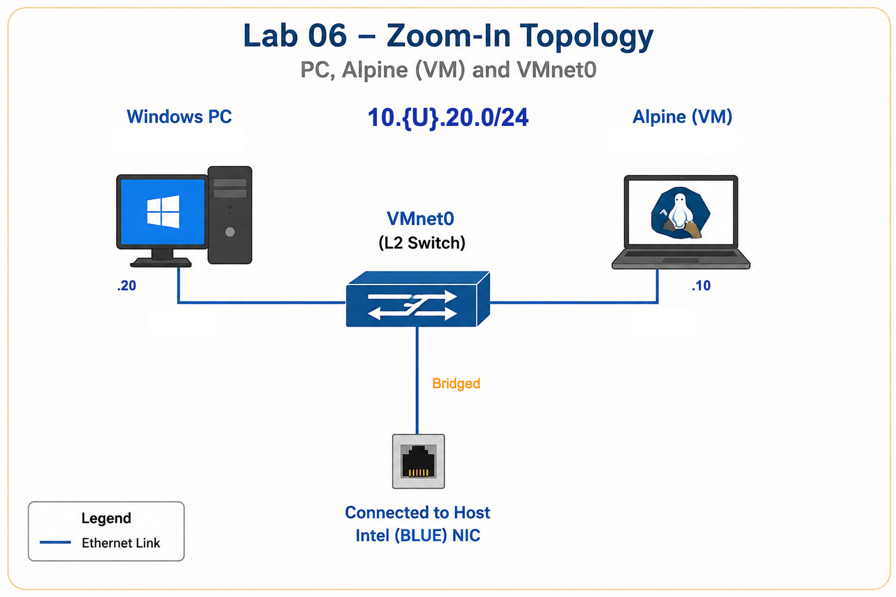

# Lab 06 — OSPF Path Selection and Network Operations

---

## Section A — Start Here

### A1 — Overview

In Lab 05, you built a functioning OSPF network and verified neighbour formation, route learning, and path recovery.

In this lab, the network is already operational.

Your focus shifts from protocol deployment to protocol operations.

You will use an Alpine Linux virtual machine as a network administration workstation to:

- verify management connectivity
- access devices using SSH
- collect operational evidence automatically
- transfer files using TFTP
- analyze OSPF route selection
- observe how OSPF costs influence path selection

The purpose of this lab is not to configure OSPF from scratch.

The purpose is to understand how OSPF makes forwarding decisions and how network administrators collect evidence that proves those decisions.

### A1.1 — Mini Quick-Ref

| Task                       | Command / Indicator            |
| -------------------------- | ------------------------------ |
| Verify SSH access          | `ssh admin@10.U.20.2`          |
| Verify OSPF neighbours     | `show ip ospf neighbor`        |
| Verify OSPF interfaces     | `show ip ospf interface brief` |
| Verify OSPF routes         | `show ip route ospf`           |
| Verify route cost          | `show ip route <network>`      |
| Verify interface cost      | `show ip ospf interface <int>` |
| Verify reference bandwidth | `show ip ospf`                 |
| Transfer files using TFTP  | `tftp`                         |
| Collect automated evidence | `x_remote.py`                  |

### A2 — Why This Lab Is Important

Building a routing protocol is only part of operating a network.

Network administrators spend much of their time:

- collecting operational evidence
- verifying routing behaviour
- identifying forwarding paths
- validating protocol decisions
- automating repetitive tasks

### A3 — Objectives / Evidence Map

| Objective                                        | Checkpoint |
| ------------------------------------------------ | ---------- |
| Verify the operational baseline from Lab 05      | C00        |
| Configure Alpine as the administration host      | C01        |
| Collect and upload evidence using `x_remote.py`  | C02        |
| Tune OSPF reference bandwidth and interface cost | C03        |

---

## Section B — Topology and Addressing

### B1 — Topology



### B2 — Addressing Plan

Reuse the Lab 05 addressing plan.

| Device | Interface | Address |
|----------|----------|----------|
| Alpine | eth0 | 10.U.20.10/24 |
| PC | NIC | 10.U.20.20/24 |

### B3 — Network Roles

| Device | Role |
|----------|----------|
| EDGE | OSPF exit router |
| CORE | User LAN gateway |
| DIST | Alternate OSPF path |
| Alpine | Administration workstation |
| PC | User endpoint |
| Remote | External destination |

### B4 — Management Services

| Service     | Purpose                       |
| ----------- | ----------------------------- |
| SSH         | Device administration         |
| TFTP        | File transfer                 |
| x_remote.py | Automated evidence collection |

---

## Section C — Lab Tasks and Evidence

### C00 — Verify the Operational Baseline

#### Goal

Restore the Lab 05 topology and verify that all required network services are operational before beginning Lab 06.

#### Why This Matters

Every task in this lab depends on a stable network baseline.

Before performing automation tasks or analyzing OSPF path selection, you must verify that:

- the topology is cabled correctly
- device configurations are restored
- OSPF has converged
- SSH access is operational
- the TFTP server is reachable

If the baseline is not functioning correctly, later observations and collected evidence cannot be trusted.
#### Action

1. Cable the topology exactly as documented in Lab 05.
2. Restore the Lab 05 configurations to all devices from Lab 05.
3. Verify that all required interfaces are operational.
4. Verify that OSPF has converged.
5. Verify that SSH is configured using:

```
Username: admin
Password: cisco
Privilege level: 15
Domain name: cst8371.net
SSH version: 2
```

6. Verify that the SSH key was generated **after** the correct hostname was configured.
7. Establish the following management model:

```text
From PC:
EDGE -> Console  
CORE -> SSH  
DIST -> SSH  
  
Once C00 is complete, console cables remain connected to EDGE.  
Do not move console cables between devices.
````

8. Verify reachability to the course TFTP server.

> From this point forward, do not move console cables between devices.
> All management access to CORE and DIST must use SSH.

#### Verification

Verify:

```text
OSPF process id and router id
OSPF interfaces
OSPF neighbour state
OSPF routes
SSH status
SSH connectivity
TFTP reachability
```

#### Success Indicator / Failure Signal

|Verification Item|Success Indicator|Failure Signal|
|---|---|---|
|Interface status|Required interfaces are `up/up`|Interface is down or administratively down|
|OSPF neighbours|All expected neighbours are in the `FULL` state|Missing neighbour or neighbour not FULL|
|OSPF routes|Expected OSPF routes are present|Routes missing from routing table|
|SSH configuration|Username, domain name, and RSA key requirements are met|Missing user, incorrect domain name, or incorrect key size|
|SSH connectivity|PC successfully opens SSH sessions to CORE and DIST|SSH login fails or connection times out|
|TFTP reachability|PC can reach the course TFTP server|TFTP server unreachable|

#### C00 — Collection of Information

No collection of information required.

> Do not continue if you cannot reach the course TFTP server.

---

### C01 — Configure the Alpine Administration Host  

#### Goal  
  
Prepare Alpine Linux to function as the network administration workstation for the remainder of the lab.  
  
#### Why This Matters  
  
Network administrators frequently use Linux systems to remotely manage devices, collect operational information, transfer files, and execute automation tools.  
  
In this lab, Alpine will be used to run automation and transfer evidence files to the course TFTP server.  
  
#### Action  
  
Alpine credentials:  `admin/cisco`
  
**Step 1 — Select the correct Alpine VM**  
  
1. Open VMware Workstation and select the virtual machine named **Alpine**, do not use **alpine-24F**.  
2. Do not start the Alpine VM yet.  
  
**Step 2 — Configure VMnet0**  
  
1. In VMWare  `Edit → Virtual Network Editor`.
2. Select **VMnet0** `→ Change Settings`.
3. Approve the elevation request.  
4. Configure:  `VMnet Information → Bridged → Bridged To → Intel(R) Ethernet`. 
  
**VMnet0** creates a Layer 2 bridge between the Alpine virtual machine, the PC and the physical lab network.

When **VMnet0** is bridged to the Intel adapter, Alpine appears on the lab network as an independent host with its own MAC address and IP address.  



  
**Step 3 — Configure the Alpine network adapter**  
  
1. Select the **Alpine VM**.
2. Configure `Network Adapter → VMnet0`
3. Configure your MAC address `Advanced → MAC Address → 02:00:00:00:{U}:{U}`

> If your `U` only has one digit, use `0U`
  
**Step 4 — Start Alpine and log in**  
  
**Step 5 — Change the Alpine hostname**  
  
Change the hostname:  

```bash
sudo hostname {username}-alpine  
```  

>Your prompt should change to the new hostname
  
**Step 6 — Configure Alpine IPv4 addressing**  
  
```bash
sudo ip addr add 10.{U}.20.10/24 dev eth0  
sudo ip route add default via 10.{U}.20.2  
```
  
Verify:  

```
ip link show dev eth0
ip addr show  
ip route  
```


**Step 7 — Verify connectivity**  
  
Verify the default gateway, the PC and the TFTP server:  

```  
ping -c 2 10.{U}.20.2  
ping -c 2 10.{U}.20.20  
ping -c 2 192.0.2.69  
```
  
**Verify SSH access to Alpine**  

1. From PC ssh into Alpine.
2. Keep the ssh connection from now on.
  
#### Verification  
  
- Alpine hostname is {username}-alpine 
- Alpine has the correct MAC address
-  Alpine eth0 has 10.{U}.20.10/24  
- Alpine default route points to 10.{U}.20.2  
- Alpine can ping 10.{U}.20.2,  10.{U}.20.20  and 192.0.2.69  
- PC can SSH to Alpine  
  
#### Success Indicator / Failure Signal  
  
| Verification Item    | Success Indicator                           | Failure Signal                               |
| -------------------- | ------------------------------------------- | -------------------------------------------- |
| Correct VM           | Student is using Alpine                     | Student is using alpine-24F                  |
| VMnet0 bridge        | VMnet0 is bridged to Intel Adapter (BLUE)   | VMnet0 bridged to wrong adapter              |
| Alpine adapter       | Alpine network adapter uses Custom → VMnet0 | Alpine uses NAT, Host-only, or another VMnet |
| Alpine MAC           | 02:00:00:00:{U}:{U}                         | MAC not based on your U number               |
| Hostname             | hostname shows {username}-alpine            | Hostname remains default or incorrect        |
| IPv4 address         | eth0 has 10.{U}.20.10/24                    | IP address missing or incorrect              |
| Default route        | Default route points to 10.{U}.20.2         | Default route missing or wrong gateway       |
| Gateway reachability | Alpine can ping 10.{U}.20.2                 | Ping to gateway fails                        |
| PC reachability      | Alpine can ping 10.{U}.20.20                | Ping to PC fails                             |
| TFTP reachability    | Alpine can ping 192.0.2.69                  | Ping to TFTP server fails                    |
| SSH to Alpine        | PC opens SSH session to Alpine              | SSH connection fails                         |
  
#### Troubleshooting  
  
If the Alpine interface is **DOWN**, verify:  
  
- Alpine VM → Settings → Network Adapter → Custom VMnet0  
- VMware → Virtual Network Editor → VMnet0 → Bridged to Intel Adapter (BLUE)  
  
If the PC can ping the TFTP server but Alpine cannot, the problem is likely Alpine configuration or VMware network bridging.  
  
If the PC cannot ping the TFTP server, the problem is not Alpine. Return to C00 and troubleshoot the network baseline before continuing.  
  
#### C01 — Collection of Information  
  
No evidence collection is required for this checkpoint.  
  
This task prepares Alpine for automated evidence collection in C02.

---

### C02 — Collect Baseline Evidence with `x_remote.py`

#### Goal

Use the `x_remote.py` automation script to collect baseline operational evidence from the network devices and upload the generated evidence file to the course TFTP server.

#### Why This Matters

Manual command collection is slow and inconsistent.

In this lab, evidence collection is automated. The YAML file defines:

- which devices to connect to
- credentials needed to SSH into the device
- which commands to run
- where the output file is saved

The `x_remote.py` script connects to devices by SSH, runs the commands listed in the YAML file, and saves the command output into an evidence file.

**x_remote.py Repository** → https://github.com/ayalac1111/x-remote

#### Action

**Step 1 — Copy the baseline YAML file from the TFTP server**

From Alpine:

    scp cisco@192.0.2.69:YAML/l06-baseline.yaml .

**Step 2 — Edit the YAML file**

Open the YAML file:

    vi l06-baseline.yaml

Modify the required variables:

| Variable | Required Value |
|---|---|
| `{USERNAME}` | Your username |
| `{U}` | Your pod number |

Save and exit.

**Step 3 — Verify the YAML file before running automation**

Display the file:

    cat l06-baseline.yaml

Confirm that:

- your {username} appears in the output filename
- your {U} number appears in the device IP addresses
- the device list includes the required routers

**Step 4 — Run the automation script**

Run:

    x_remote.py l06-baseline.yaml

**Step 5 — Verify that the evidence file was created**

List the output files:

    ls -l l06-*.txt

Open the generated evidence file:

    less l06-baseline-{username}.txt

Confirm that the file contains output from the required devices and commands.

**Step 6 — Upload the evidence file to the TFTP server**

Upload:

    tftp 192.0.2.69 -c put l06-baseline-{username}.txt

**Step 7 — Confirm the upload command completed**

If the TFTP command returns without an error, continue.

If the TFTP command fails, verify:

    ping -c 2 192.0.2.69
    ls -l l06-baseline-{username}.txt

#### Verification

- `l06-baseline.yaml` exists on Alpine
- `{USERNAME}` was replaced with your username
- `{U}` was replaced with your pod number
- `x_remote.py` runs without connection errors
- `l06-baseline-{username}.txt` is created
- the evidence file contains output from the required devices
- the evidence file contains the expected baseline commands
- the file uploads to the TFTP server

#### Success Indicator / Failure Signal

| Verification Item | Success Indicator | Failure Signal |
|---|---|---|
| YAML file copied | `l06-baseline.yaml` exists on Alpine | YAML file missing |
| YAML variables | Username and pod number are updated | `{USERNAME}` or `{U}` still appears in file |
| Device connectivity | `x_remote.py` connects to required devices | SSH timeout, authentication failure, or unreachable device |
| Automation run | Script completes and returns to shell prompt | Script stops with Python, YAML, SSH, or timeout error |
| Evidence file | `l06-baseline-<username>.txt` exists and has non-zero size | File missing or zero bytes |
| Evidence content | File contains device prompts, commands, and output | File missing device output or command output |
| TFTP upload | Upload command completes without error | TFTP timeout, unreachable server, or file not found |

#### Troubleshooting

If `scp` fails, verify Alpine can reach the TFTP server:

    ping -c 2 192.0.2.69

If `x_remote.py` cannot connect to CORE or DIST, return to C00 and verify SSH access.

If `x_remote.py` cannot connect to EDGE, verify that EDGE is reachable from Alpine and that SSH is enabled on EDGE.

If the output file is created but does not contain all commands, check the YAML command list.

If the TFTP upload fails but ping works, verify the filename and TFTP syntax.

#### C02 — Collection of Information

The collection of information for this checkpoint is generated **automatically** by `x_remote.py`.

Required file:

    l06-baseline-<username>.txt

This file must be uploaded to the course TFTP server before continuing.

---

### C03 — OSPF Cost, Reference Bandwidth, and ECMP

#### Goal

Observe how OSPF cost and reference bandwidth affect path selection, then make CORE use both available paths to reach an EDGE loopback.

#### Why This Matters

OSPF does not choose paths randomly. It selects routes based on accumulated cost.

By changing the OSPF reference bandwidth and interface cost, you can observe how route metrics change and how equal-cost multipath routing is formed.

#### Action

**Step 1 — Create a test destination on EDGE**

On EDGE, create Loopback1:

    interface loopback1
    ip address 10.{U}.1.1 255.255.255.255
    ip ospf {U} area 0

**Step 2 — Check the baseline route from CORE**

From CORE, check the current route to EDGE Loopback1:

    show ip route 10.{U}.1.1

Record the current metric.

**Step 3 — Change the OSPF reference bandwidth**

On EDGE, CORE, and DIST:

    router ospf {U}
    auto-cost reference-bandwidth 10000

**Step 4 — Verify the reference bandwidth**

From EDGE, CORE, and DIST:

    show ip ospf | include Reference

**Step 5 — Check the route metric again**

From CORE:

    show ip route 10.{U}.1.1

Compare the new metric with the baseline metric.

**Step 6 — Observe the alternate path cost**

From DIST:

    show ip route 10.{U}.1.1

This shows the cost of the path through DIST toward EDGE.

**Step 7 — Tune CORE interface cost to create ECMP**

On CORE, adjust the cost on the CORE-to-EDGE interface.

    interface gx/0/1
    ip ospf cost N

Choose `N` so the two total path costs are equal:

    CORE → EDGE → Lo1
    CORE → DIST → EDGE → Lo1

**Step 8 — Verify ECMP from CORE**

From CORE:

    show ip cef 10.{U}.1.1
    show ip route 10.{U}.1.1

CORE should show two next hops when the path costs are equal.

**Step 9 — Download the YAML file**

From Alpine:

    scp cisco@192.0.2.69:YAML/l06-cost.yaml .

Verify:

    ls -l l06-cost.yaml

**Step 10 — Edit the YAML file**

Edit:

    vi l06-cost.yaml

Update:

| Variable | Required Value |
|---|---|
| `{USERNAME}` | Your username |
| `{U}` | Your pod number |

Verify the file before running automation:

    cat l06-cost.yaml

**Step 11 — Run automated evidence collection**

From Alpine:

    x_remote.py l06-cost.yaml

**Step 12 — Verify the output file**

List the generated file:

    ls -l l06-cost-<username>.txt

Open the file and confirm that it contains the correct command output:

    less l06-cost-<username>.txt

**Step 13 — Upload the evidence file**

From Alpine:

    tftp 192.0.2.69 -c put l06-cost-<username>.txt

#### Verification

Verify:

- EDGE Loopback1 exists and is advertised into OSPF.
- Reference bandwidth is set to `10000` on EDGE, CORE, and DIST.
- CORE route metric to `10.{U}.1.1/32` changes after the reference-bandwidth update.
- CORE shows two next hops to `10.{U}.1.1/32` after interface cost tuning.
- `x_remote.py` creates the evidence file.
- The evidence file uploads successfully to the TFTP server.

#### Success Indicator / Failure Signal

| Verification Item | Success Indicator | Failure Signal |
|---|---|---|
| EDGE Loopback1 | `10.{U}.1.1/32` exists and is in OSPF | Loopback missing or not advertised |
| Baseline route | CORE has a route to `10.{U}.1.1/32` | CORE has no route to Loopback1 |
| Reference bandwidth | EDGE, CORE, and DIST show reference bandwidth `10000` | One or more routers still use default reference bandwidth |
| Route metric change | CORE route metric changes after reference bandwidth update | Metric does not change |
| Alternate path | DIST has a route to `10.{U}.1.1/32` | DIST route missing |
| Interface cost tuning | CORE path costs become equal | Costs remain unequal |
| ECMP | CORE shows two next hops to `10.{U}.1.1/32` | CORE shows only one next hop |
| YAML file | `l06-cost.yaml` exists on Alpine | YAML file missing |
| Automation output | `l06-cost-<username>.txt` exists and has non-zero size | Output file missing or empty |
| TFTP upload | Upload completes without error | TFTP timeout, unreachable server, or file not found |

#### Troubleshooting

If CORE does not have a route to `10.{U}.1.1/32`, verify that EDGE Loopback1 is enabled in OSPF.

If reference bandwidth does not match on all routers, check the OSPF process number.

If ECMP does not appear, recalculate the total path cost for both paths and adjust the CORE interface cost.

If `x_remote.py` fails, verify SSH connectivity from Alpine to the routers.

If TFTP upload fails, verify Alpine connectivity to the TFTP server.

#### C03 — Collection of Information

The collection of information for this checkpoint is generated automatically by `x_remote.py`.

Required file:

    l06-cost-<username>.txt

This file must be uploaded to the course TFTP server before continuing.

---

## Section D — Submission and Cleanup

### D1 — Submission Requirements

Submit:

- l06-baseline-{username}.txt
- l06-cost-{username}.txt

### D2 — Submit from PC

Your submission is your responsibility.

Before leaving the lab, prove:

```text
1. TFTP transfer completed.
2. File names are l06-baseline-{username}.txt and l06-cost-{username}.txt.
3. Files have non-zero size.
```

### D3 — Cleanup

After submission is confirmed, clean up routers using the provided TCL script.

On all devices:

```
tclsh clean.tcl
```

- Turn off your router
- Reload your switch
- Reboot your PC

---

## End of Lab 06 — OSPF Path Selection and Network Operations
