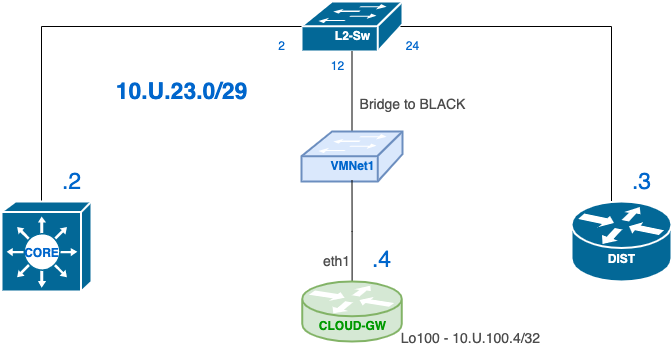

# Lab 07 — OSPF Behaviour, Cross-Vendor Operations, and Convergence

---

## Section A — Start Here

### A1 — Overview

In Lab 06, you built and verified an operational single-area OSPF network.

In this lab, the network is already operational.

Your focus shifts from OSPF deployment to OSPF behaviour and cross-vendor operations.

You will use the same Lab 06 topology as the baseline, then modify one OSPF behaviour at a time to observe:

- hello/dead timer mismatch
- neighbour-loss detection
- point-to-point versus broadcast network type
- passive-interface behaviour
- Cisco and MikroTik OSPF interoperability
- DR/BDR election behaviour
- OSPF reconvergence after link or neighbour loss

The purpose of this lab is not to configure OSPF from scratch.

The purpose is to understand how OSPF behaves when protocol parameters change and how network administrators collect evidence that proves those behaviours.

> SBA practice note: You may manually rebuild the OSPF configuration before C00 as practice for the SBA. If you do, the final state must still match the requirements in C00 before continuing.

---

### A1.1 — Mini Quick-Ref

| Task | Cisco OSPF Command / Indicator | MikroTik OSPF Command / Indicator |
|---|---|---|
| Verify OSPF neighbours | `show ip ospf neighbor` | `/routing ospf neighbor print` |
| Verify OSPF interfaces | `show ip ospf interface brief` | `/routing ospf interface-template print` |
| Verify OSPF interface details | `show ip ospf interface <interface>` | `/routing ospf interface-template print detail` |
| Verify OSPF routes | `show ip route ospf` | `/routing route print where ospf` |
| Verify OSPF process and router ID | `show ip ospf` | `/routing ospf instance print detail` |
| Verify passive interfaces | `show ip protocols` | `/routing ospf interface-template print detail` |
| Verify DR/BDR state | `show ip ospf neighbor` / `show ip ospf interface <interface>` | `/routing ospf neighbor print detail` |
| Observe OSPF hello packets | `debug ip ospf hello` | `/log print where message~"ospf"` |
| Observe OSPF adjacency changes | `debug ip ospf adj` | `/routing ospf neighbor print detail` |
| Stop Cisco debugging | `undebug all` | Not applicable |

Timer values used in this lab:

| Link      | Final Hello | Final Dead |
| --------- | ----------: | ---------: |
| CORE–EDGE |    1 second |  4 seconds |

### A1.2 — Evidence Collection

This lab uses the same evidence collection workflow introduced in Lab 06.

For each collection checkpoint:

- Download the required YAML file from the TFTP server.
- Update `{USERNAME}` and `{U}`.
- Execute `x_remote.py`.
- Verify the output file was created.
- Upload the output file to the TFTP server.

If you need a refresher on the process, refer to the **Lab 06**.

Each checkpoint identifies:

- the YAML file to use
- the expected output filename
- the evidence that must be collected

---

### A2 — Why This Lab Is Important

Building an OSPF domain is only part of operating a routed network.

Network administrators spend much of their time:

- collecting operational evidence
- identifying neighbour formation problems
- reading protocol logs
- validating route advertisements
- interpreting DR/BDR election results
- proving convergence after failure
- working across more than one vendor CLI

This lab emphasizes OSPF as a vendor-neutral protocol.

Cisco IOS and MikroTik RouterOS use different command syntax, but the control-plane concepts are the same:

- router ID
- area membership
- hello/dead timers
- interface network type
- neighbour state
- DR/BDR roles
- route installation

Throughout the lab, every conclusion must be supported by command output.

> Ask this question at every checkpoint: What command proves this is correct?

---

### A3 — Objectives / Evidence Map

| Objective                                                                                           | Checkpoint |
| --------------------------------------------------------------------------------------------------- | ---------- |
| Restore and prove the Lab 06 OSPF domain is stable                                                  | C00        |
| Modify Hello/Dead timers and classify timer mismatch versus neighbour-loss detection                | C01        |
| Compare OSPF network types: point-to-point versus broadcast                                         | C02        |
| Apply or adjust passive-interface and explain advertisement versus neighbour formation              | C03        |
| Add MikroTik CHR as a third router on a broadcast segment                                           | C04        |
| Analyze DR/BDR behaviour using Cisco and MikroTik                                                   | C05        |

---

## Section B — Topology and Addressing

### B1 — Starting Topology

Start from your completed Lab 06 topology.


---

### B2 — Addressing Plan

Reuse the Lab 06 addressing plan.

---

### B3 — OSPF Baseline Requirements

The Lab 07 baseline must match these requirements before C01 begins.

| Item | Requirement |
|---|---|
| OSPF process ID | `{U}` |
| OSPF area | Area 0 |
| Router ID method | Manual `router-id` command |
| Router ID value | Same as each router Loopback100 address |
| Reference bandwidth | `10000` Mbps |
| EDGE default route | Configured on EDGE |
| Default advertisement | Redistributed or originated from EDGE into OSPF |
| EDGE Gi0/0 | Must not be OSPF enabled |
| SSH username | `admin` |
| SSH password | `cisco` |
| SSH version | 2 |

---

### B4 — Automation and Evidence Collection

For each evidence checkpoint:

1. Run the required YAML file from Alpine.
2. Verify the generated evidence file exists.
3. Open the evidence file and confirm device prompts, commands, and outputs are present.
4. Upload the evidence file to the course TFTP server.

---

## Section C — Lab Tasks and Evidence

### C00 — Restore Lab 06 and Prove the OSPF Domain Is Stable

#### Goal

Restore the Lab 06 topology and prove that the OSPF domain is stable before making any protocol changes.

#### Why This Matters

Every task in this lab depends on a trusted baseline.

If OSPF is not stable before timer, network-type, passive-interface, or DR/BDR changes are introduced, later observations cannot be trusted.

#### Action

1. Restore your completed Lab 06 topology.
2. Confirm Alpine is connected and operating as the administration workstation.
3. Confirm all IP addresses match Lab 06.
4. Confirm SSH is configured on all Cisco routers.
5. Confirm OSPF is configured using the baseline requirements.
6. Confirm EDGE has the default route, and it advertises it into the OSPF domain.
7. Confirm EDGE Gi0/0 is not participating in OSPF.
8. Confirm Alpine/PC can reach the course TFTP server.

> Do not continue if Alpine or the PC cannot reach the course TFTP server.

#### Verification

Verify from Cisco routers:

```text
show ip ospf
show ip ospf neighbor
show ip ospf interface brief
show ip route ospf
show ip protocols
```

Verify from Alpine/PC:

```bash
ping -c 2 192.0.2.69
```

#### Success Indicator / Failure Signal

| Verification Item | Success Indicator | Failure Signal |
|---|---|---|
| OSPF process | Process ID is `{U}` | Wrong process ID or missing process |
| Router ID | Router ID matches Loopback100 | Router ID selected automatically or wrong value |
| Reference bandwidth | `10000 Mbps` appears in OSPF output | Default reference bandwidth remains active |
| OSPF neighbours | Expected neighbours are `FULL` | Missing neighbour or neighbour not FULL |
| OSPF routes | Expected OSPF routes are present | OSPF routes missing |
| Default route | Default route is present downstream | No default route downstream |
| EDGE Gi0/0 | Interface is not OSPF-enabled | EDGE Gi0/0 participates in OSPF |
| Alpine to TFTP | Ping to `192.0.2.69` succeeds | Ping fails |
| PC to TFTP | Ping to `192.0.2.69` succeeds | Ping fails |

#### Troubleshooting

If OSPF neighbours are missing:

- verify interface status
- verify OSPF area
- verify OSPF process ID
- verify router IDs are unique
- verify EDGE Gi0/0 is excluded from OSPF

If Alpine cannot reach the TFTP server:

- verify Alpine IP address
- verify Alpine default route
- verify CORE VLAN20 gateway
- verify OSPF default route propagation


#### C00 — Collection of Information

This checkpoint uses the standard evidence collection workflow introduced in Lab 06.  
  
YAML File:  `l07-baseline.yaml`  
Required Output:  `l07-baseline-{username}.txt`  
  
Required Evidence:  
- OSPF neighbour state  
- OSPF routes  
- OSPF process information  
- OSPF interface participation  
- SSH status  
- Reachability to the course TFTP server  
  
Upload the generated evidence file to the course TFTP server before continuing.

---

### C01 — Hello/Dead Timer Behaviour

#### Goal

Modify OSPF Hello/Dead timers on one link and classify the difference between:

- timer mismatch
- neighbour-loss detection

This task uses the **CORE–EDGE** link only.

#### Why This Matters

OSPF neighbours form only when the required `hello` parameters match.  A timer mismatch prevents adjacency formation.

Neighbour-loss detection occurs when OSPF stops receiving valid hello packets and the dead timer expires.

These are different failure behaviours and must be identified using evidence.

#### Action

**Step 1 — Identify the CORE–EDGE interface**

On CORE and EDGE:

```text
show ip ospf neighbor
show ip ospf interface brief
```

Record the interface used for the CORE–EDGE adjacency.

**Step 2 — Start OSPF hello debugging before changing timers**

On CORE:

```text
terminal monitor
clear logging
debug ip ospf hello
```

Allow several hello packets to appear.

**Step 3 — Create a timer mismatch on CORE only**

On the CORE interface facing EDGE:

```text
interface Gix/0/1
 ip ospf hello-interval 1
 ip ospf dead-interval 4
```

Do not change EDGE yet.

**Step 4 — Capture the mismatch evidence**

On CORE:

```text
show logging | include OSPF|ospf|MISMATCH|mismatch|Hello|Dead
show ip ospf neighbor
show ip ospf interface Gix/0/1 | include Hello|Dead|State
```

Look for hello/dead mismatch information in the log output.

Example output:

```
OSPF: Send hello to 224.0.0.5 area 0 on GigabitEthernet1/0/1 from 10.{U}.12.1
OSPF: Rcv hello from 10.{U}.12.2 area 0 from GigabitEthernet1/0/1 10.{U}.12.2
OSPF: Mismatched hello parameters from 10.{U}.12.2
OSPF: Dead R 40 C 4, Hello R 10 C 1  Mask R 255.255.255.252 C 255.255.255.252
```

Evidence to identify:

| Event          | Indicator                  |
| -------------- | -------------------------- |
| Hello sent     | `Send hello to 224.0.0.5`  |
| Hello received | `Rcv hello from 10.U.12.2` |
| Hello timer    | `Rcv 10` - `Configured 4`  |
| Dead timer     | `Rcv 40` - `Configure 1`   |

Do not continue until you observe both:

```
Send hello
Rcv hello
```

messages in the debug output.

**Step 5 — Stop debugging**

On CORE:

```text
undebug all
show debugging
```

Expected indicator:

```text
No debugging active
```

**Step 6 — Restore adjacency by matching EDGE timers**

On the EDGE interface facing CORE:

```text
interface Gi0/0/1
 ip ospf hello-interval 1
 ip ospf dead-interval 4
```

Wait for adjacency to return to FULL.

Final state for the CORE–EDGE link:

```text
Hello = 1
Dead = 4
Adjacency = FULL
```

#### Verification

Verify from CORE and EDGE:

```text
show ip ospf interface Gix/0/1
show ip ospf neighbor
show logging | include OSPF|ospf|MISMATCH|mismatch|Hello|Dead|FULL
```

#### Success Indicator / Failure Signal

| Verification Item | Success Indicator | Failure Signal |
|---|---|---|
| Debug before change | Hello packets are visible before timer changes | No hello packets appear |
| Timer mismatch | Adjacency drops or fails to form after CORE-only timer change | Adjacency remains FULL with mismatched timers |
| Syslog mismatch evidence | Log shows hello/dead mismatch information | No mismatch evidence captured |
| Debug stopped | `No debugging active` | Debug remains active |
| Restored timers | CORE and EDGE both show Hello 1 / Dead 4 | Timers do not match |
| Restored adjacency | CORE–EDGE returns to `FULL` | Neighbour remains down |
| Neighbour-loss detection | Neighbour disappears after failure | Neighbour remains listed after dead interval |

#### Troubleshooting

If the mismatch does not appear:

- confirm timers were changed on CORE only
- confirm the correct interface was modified
- confirm debug was started before the timer change
- confirm logging is enabled with `show logging`

If adjacency does not return:

- compare hello/dead timers on both ends
- compare area number
- compare network type
- confirm both interfaces are up/up

If debug output continues:

```text
undebug all
show debugging
```

#### C01 — Collection of Information

This checkpoint uses the standard evidence collection workflow introduced in Lab 06.  
  
YAML File:  `l07-timers.yaml`  
Required Output:  `l07-timers-{username}.txt`  

The evidence file must include:

- timer values before and after change
- debug or logging evidence showing mismatch
- neighbour state during mismatch
- restored FULL adjacency
- final CORE–EDGE Hello 1 / Dead 4 state

Upload the file to the course TFTP server.

---

### C02 — Compare OSPF Network Types and DR Election Behaviour

#### Goal

Compare OSPF point-to-point and broadcast network types and observe how DR elections occur on broadcast segments.

#### Why This Matters

OSPF network type affects neighbour behaviour and election behaviour.

- Point-to-point networks do not elect a DR or BDR.
- Broadcast networks elect a DR and BDR.
- DR elections are non-preemptive.
- Interface priority influences DR election results.

#### Starting State

At the end of C01:

| Link                        | Network Type   |
| --------------------------- | -------------- |
| CORE Gi0/0/1 ↔ EDGE Gi0/0/1 | Point-to-Point |
| CORE Gi0/0/2 ↔ DIST Gi0/0/2 | Point-to-Point |
| EDGE Gi0/0/2 ↔ DIST Gi0/0/1 | Point-to-Point |

All OSPF neighbours should be in the FULL state.

#### Step 1 — Verify the Current Network Types

On all routers:

```text
show ip ospf interface brief
show ip ospf interface
show ip ospf neighbor
```

Identify:

- network type
- neighbour state
- DR information

Verify that all transit links are operating as point-to-point networks.

#### Step 2 — Convert EDGE–DIST to Broadcast and Force a New Election

On EDGE Gi0/0/2:

```text
interface g0/0/2
 no ip ospf network point-to-point
 ip ospf priority 0
 shutdown
 no shutdown
```

On DIST Gi0/0/1:

```text
interface g0/0/1
 no ip ospf network point-to-point
```

EDGE priority is set to `0` so that EDGE cannot become either the DR or BDR on this segment.

This allows you to observe how OSPF excludes routers with a priority of zero from the election process.

Verify:

```text
show ip ospf interface g0/0/2
show ip ospf neighbor
```

Record:

- network type
- interface priority
- DR
- BDR
- neighbour state

#### Step 3 — Convert CORE–DIST to Broadcast and Force a New Election

On CORE Gi0/0/2:

```text
interface g0/0/2
 no ip ospf network point-to-point
```

On DIST Gi0/0/2:

```text
interface g0/0/2
 no ip ospf network point-to-point
 ip ospf priority {U}
```


Force a new election from CORE:

```text
clear ip ospf process
```

Answer:

```text
yes
```

Allow OSPF to reconverge.

Verify:

```text
show ip ospf neighbor
show ip ospf interface g0/0/2
```

Record:

- DR    
- BDR
- priority values
- neighbour state


#### Final State

At the end of C02:

|Link|Required Network Type|Expected Election Result|
|---|---|---|
|CORE Gi0/0/1 ↔ EDGE Gi0/0/1|Point-to-Point|No DR or BDR|
|EDGE Gi0/0/2 ↔ DIST Gi0/0/1|Broadcast|DIST Gi0/0/1 = DR|
|CORE Gi0/0/2 ↔ DIST Gi0/0/2|Broadcast|DIST Gi0/0/2 = DR|

Required priority settings:

|Device|Interface|Priority|
|---|---|---|
|EDGE|Gi0/0/2|0|
|DIST|Gi0/0/2|{U}|

#### Verification

On all routers:

```text
show ip ospf neighbor
show ip ospf interface
show ip ospf interface brief
```

Verify:

- CORE–EDGE remains point-to-point
- EDGE–DIST operates as broadcast
- CORE–DIST operates as broadcast
- EDGE Gi0/0/2 priority is 0
- DIST Gi0/0/2 priority is {U}
- all neighbours return to FULL state
- DR and BDR information is visible on broadcast segments

> **Important**
> 
> OSPF DR elections are **non-preemptive**.
> 
> The order in which routers join a broadcast network can affect the election results.
> 
> A router that joins the segment first may become the DR even if another router with a higher priority joins later.
> 
> To ensure a predictable election result in this lab, you will force a new election using either:
> 
> - an interface shutdown / no shutdown sequence, or
> - `clear ip ospf process`
>     
> 
> When verifying election results, always confirm:
> 
> - interface priority
> - router ID
> - neighbour state
> - DR and BDR roles
> 
> Do not assume the router with the highest priority will automatically become DR unless a new election occurs.

#### Success Indicator / Failure Signal

|Verification Item|Success Indicator|Failure Signal|
|---|---|---|
|CORE–EDGE network type|Point-to-Point|Broadcast|
|EDGE–DIST network type|Broadcast|Point-to-Point|
|CORE–DIST network type|Broadcast|Point-to-Point|
|EDGE priority|0|Non-zero|
|DIST priority|{U}|Incorrect value|
|DR election|DIST elected DR|Unexpected DR|
|BDR election|BDR present on broadcast segment|No BDR present|
|Neighbour state|FULL|INIT, EXSTART, or DOWN|

---

#### Troubleshooting

If a neighbour does not return:

- Verify both ends use the same OSPF network type
- Verify Hello and Dead timers still match.
- Verify the interface is not passive.
- Verify both interfaces are operational.

If the expected DR is not elected:

- Verify the configured interface priority.
- Verify the election was forced.
- Verify the interface is operating as a broadcast network.
- Remember that DR elections are non-preemptive.

#### C02 — Collection of Information

This checkpoint uses the standard evidence collection workflow introduced in Lab 06.  
  
YAML File:  `l07-dr.yaml`  
Required Output:  `l07-dr-{username}.txt`  
  
Upload the generated evidence file to the course TFTP server before continuing.

---

### C03 — Passive Interfaces and Route Advertisement

#### Goal

Observe how passive interfaces affect neighbour formation and compare passive-interface behaviour with disabling OSPF on an interface.

#### Why This Matters

A passive interface prevents OSPF neighbour formation but continues advertising the connected network.

Disabling OSPF on an interface removes the network advertisement completely.

Understanding the difference is important when troubleshooting missing neighbours and missing routes.

---

#### Starting State

At the end of C02:

- All OSPF neighbours are in the FULL state.
- VLAN20 is configured as a passive interface.
- VLAN20 is advertised into OSPF.
- Alpine can reach the course TFTP server.
- The TFTP server can reach Alpine.

---

#### Step 1 — Verify the Current Passive Interface Configuration

On CORE:

```text
show ip protocols
show ip ospf interface brief
```

Identify:

- passive interfaces
- VLAN20

Verify that VLAN20 is configured as a passive interface.

#### Step 2 — Configure CORE Gi0/0/1 as a Passive Interface

On CORE:

```text
router ospf {U}
 passive-interface g0/0/1
```

Verify:

```text
show ip ospf neighbor
show ip protocols
```

Observe:

- the CORE–EDGE neighbour relationship disappears
- the adjacency does not return
- Gi0/0/1 appears in the passive-interface list

Question:

> Why does a passive transit interface prevent neighbour formation?

#### Step 3 — Restore the CORE–EDGE Adjacency

On CORE:

```text
router ospf {U}
 no passive-interface g0/0/1
```

Verify:

```text
show ip ospf neighbor
```

Wait until the CORE–EDGE neighbour returns to FULL.

#### Step 4 — Verify VLAN20 Passive Interface Behaviour

On CORE:

```text
show ip protocols | section Passive
show ip ospf interface vlan 20 | include Hello|State|Timer
```

Verify that:

- VLAN20 is configured as a passive interface.
- OSPF is enabled on VLAN20.
- No OSPF Hello packets are sent on VLAN20.

On EDGE:

```text
show ip route ospf
```

Verify that the VLAN20 network is still present in the OSPF routing table.

Question:

> If no Hellos are sent on VLAN20, why is the network still advertised?

#### Step 5 — Disable OSPF on VLAN20

On CORE:

```text
interface vlan 20
 no ip ospf {U} area 0
```

Verify:

On CORE:

```text
show ip ospf interface brief
```

Confirm VLAN20 no longer appears in the OSPF interface list.

On EDGE:

```text
show ip route ospf | include 10.{U}.20.0
```

Observe that the VLAN20 route disappears from the OSPF routing table.

#### Step 6 — Observe the Impact on Connectivity

From Alpine:

```bash
ping -c 2 192.0.2.69
```

Observe the result.

From EDGE:

```text
show ip route 10.{U}.20.0
```

Observe that EDGE no longer has a route to VLAN20.

Because the VLAN20 network is no longer advertised into OSPF, the TFTP server does not have a return path to Alpine.

Question:

> What is the difference between a passive OSPF interface and an interface that is not participating in OSPF?

#### Step 7 — Restore OSPF on VLAN20

On CORE:

```text
interface vlan 20
 ip ospf {U} area 0
```

Allow OSPF to reconverge.

Verify:

On EDGE:

```text
show ip route ospf | include 10.{U}.20.0
```

Confirm the VLAN20 route returns.

From Alpine:

```bash
ping -c 2 192.0.2.69
```

Confirm connectivity is restored.

#### Final State

At the end of C03:

|Item|Required State|
|---|---|
|CORE–EDGE adjacency|FULL|
|VLAN20|Passive|
|VLAN20 OSPF participation|Enabled|
|VLAN20 route advertisement|Present|
|Alpine ↔ TFTP connectivity|Operational|
#### Verification

On CORE:

```text
show ip ospf neighbor
show ip protocols
show ip ospf interface brief
```

On EDGE:

```text
show ip route ospf | include 10.{U}.20.0
```

Verify:

- CORE–EDGE adjacency is FULL
- VLAN20 is passive
- VLAN20 participates in OSPF
- VLAN20 route exists in the OSPF domain
- connectivity has been restored

#### Success Indicator / Failure Signal

|Verification Item|Success Indicator|Failure Signal|
|---|---|---|
|Passive transit interface|Neighbour goes down|Neighbour remains FULL|
|Restored transit interface|Neighbour returns to FULL|Neighbour remains down|
|Passive VLAN20|Route remains advertised|Route disappears|
|OSPF removed from VLAN20|Route disappears from EDGE|Route remains present|
|OSPF restored on VLAN20|Route returns|Route remains missing|
|Final connectivity|Alpine reaches TFTP server|Connectivity fails|
#### Troubleshooting

If the CORE–EDGE neighbour does not return:
- Verify `no passive-interface g0/0/1` was applied.
- Verify Hello and Dead timers match.
- Verify the interface is operational.
    

If the VLAN20 route does not return:
- Verify `ip ospf {U} area 0` was restored on VLAN20.
- Verify VLAN20 is operational.
- Verify OSPF has reconverged.

**No evidence collection is required for this checkpoint.**

---

### C04 — Add a MikroTik CHR to the OSPF Domain

#### Goal

Introduce a MikroTik CHR router into the OSPF domain and verify cross-vendor OSPF interoperability between Cisco IOS and MikroTik RouterOS.

#### Why This Matters

OSPF is an open standard defined by the IETF.

Although Cisco IOS and MikroTik RouterOS use different configuration syntax, both implement the same OSPF concepts.

In this section, you will connect a MikroTik router to the existing broadcast segment and verify OSPF neighbour formation.

#### Step 1 — Configure VMware Networking

Open:

```text
VMware Workstation
→ Edit → Virtual Network Editor
```

Create a new network:

```text
VMNet1
```

Configure:

```text
Type: Bridged
Adapter: Realtek (BLACK)
```

#### Step 2 — Configure the MikroTik VM

The MikroTik VM should have two virtual network adapters.

Configure:

|Adapter|Setting|
|---|---|
|Network Adapter|Custom: VMNet1|
|Network Adapter 2|Connected at Power On = Disabled|

The MikroTik router should use only a single active network adapter connected to VMNet1.

#### Step 3 — Modify the Physical Topology

Disconnect the direct connection between CORE and DIST.

Insert an L2 switch between the devices.

Connect:

| Device                  | Switch Port |
| ----------------------- | ----------- |
| CORE Gi0/0/2            | Port 2      |
| MikroTik ether1 (BLACK) | Port 12     |
| DIST Gi0/0/2            | Port 24     |

Resulting topology:



This creates a shared Ethernet broadcast segment where Cisco and MikroTik devices participate in the same OSPF network.
#### Step 4 — Configure the MikroTik Router

Login:

```text
Username: admin
Password: admin
```

**MikroTik Configuration**

- [ ]  When moving/cloning VMs, the interface names change; to ensure consistency, rename the interfaces as in the network diagram. The first NIC shown in the VM settings should be labelled `ether1`. If unsure, go to [Advanced] and check the MAC address of the interface.
- [ ]  Set names as `{username}-CLOUD-GW`.
- [ ]  Create Lo100 interface.
- [ ]  Assign IP addresses to all interfaces
- [ ]  SSH into both cloud routers for simplicity of use. SSH is enabled by default in MikroTik.
- [ ]  Enable `OSPF-{U}` in both routers using the router ID of the Lo100
- [ ]  Add `AREA-0` with id `0.0.0.0` to ospf `OSPF-{U}`
- [ ]  Enable the interfaces in AREA-0
- [ ]  **Verify** connectivity using `ping` from `CLOUD-GW`to EDGE / CORE.
- [ ]  Save configuration after all changes:
    - `/system backup save name={yourname}-cloud.backup`
    - The file will be saved on the CLOUD router, you can scp it to your host.


Complete MikroTik configuration:

```text
# CLOUD routers: Rename Interfaces
/interface print
Flags: R - RUNNING
Columns: NAME, TYPE, ACTUAL-MTU, L2MTU, MAC-ADDRESS
#   NAME    TYPE      ACTUAL-MTU  L2MTU  MAC-ADDRESS      
0 R ether5  ether           1500         00:0C:29:41:EB:ED

# ID 0 is the first interface, lower name, in this case, with MAC ending in ED;
/interface set 0 name=ether1

# CLOUD-GW:
# Set name
/system identity set name=CLOUD-GW

# Create Lo100
/interface bridge add name=Lo100

# Assign IP address to all interfaces - Using U=250
/ip address add address=10.250.23.4/29 interface=ether1 network=10.250.23.0
/ip address add address=10.250.100.4 interface=Lo100 network=10.250.100.4

# Enable OSPF-250
/routing ospf instance add name=OSPF-250 router-id=10.250.100.4
/routing ospf area add instance=OSPF-250 name=AREA-0

# Enable all the interfaces in OSPF 
/routing ospf interface-template add area=AREA-0  interfaces=Lo100
/routing ospf interface-template add area=AREA-0 interfaces=ether1
```

#### Verification

Cisco:

```text
show ip ospf neighbor
show ip ospf interface brief
show ip route ospf
```

MikroTik:

```text
# MikroTik interfaces and IPs
/ip add print

# OSPF Neighbours
/routing ospf neighbor print

# OSPF interfaces
/routing ospf interface-template print

# OSPF Routes
/routing route print where ospf
```

Verify:

- neighbour formation
- route exchange
- Router IDs
- Area 0 participation

#### Success Indicator / Failure Signal

|Verification Item|Success Indicator|Failure Signal|
|---|---|---|
|MikroTik connectivity|MikroTik reachable on 10.{U}.23.4|Cannot ping MikroTik|
|OSPF neighbour formation|Cisco and MikroTik reach FULL state|Neighbour remains INIT or DOWN|
|Router ID|10.{U}.100.4 visible in OSPF|Router ID missing|
|Route exchange|OSPF routes exchanged|Missing OSPF routes|
|Area membership|All devices in Area 0|Area mismatch|

#### Troubleshooting

If neighbours do not form:

- Verify the MikroTik interface is connected to VMNet1.
- Verify VMNet1 is bridged to the Realtek (BLACK) adapter.
- Verify the correct IP address is configured.
- Verify all devices are using Area 0.
- Verify OSPF is enabled on the MikroTik interface.
- Verify the MikroTik router ID is configured correctly.


#### C04 — Collection of Information

This checkpoint uses the standard evidence collection workflow introduced in Lab 06.YAML 

File: `l07-mikrotik.yaml`
Required Output: `l07-mikrotik-{username}.txt`

Verify that:

- CLOUD-GW appears as an OSPF neighbour on Cisco devices
- Cisco neighbours appear on CLOUD-GW
- All neighbours reach the FULL state
- OSPF routes are exchanged between Cisco and MikroTik

Upload the file to the TFTP server.

---

### C05 — Analyze DR/BDR Behaviour Using Cisco and MikroTik

#### Goal

Analyze DR/BDR election behaviour on a broadcast segment that includes Cisco and MikroTik routers.

#### Why This Matters

DR/BDR elections are part of OSPF broadcast network operation.

Vendor syntax differs, but election rules are interoperable.

The router with the highest OSPF interface priority wins the DR election. If priorities tie, the highest router ID is used.

#### Action

Use the broadcast segment that now includes Cisco and MikroTik.

**Step 1 — Record the current election state**

On Cisco:

```text
show ip ospf neighbor
show ip ospf interface <broadcast-interface>
```

On MikroTik:

```text
/routing ospf neighbor print detail
/routing ospf interface-template print detail
```

Record:

- DR
- BDR
- DROTHER
- priorities
- router IDs

**Step 2 — Set MikroTik priority high enough to win DR**

On MikroTik:

- Identify the template number for the broadcast-segment interface.
- Set the priority to 255.

Example:

```
# Find the ID for CLOUD-GW ether1; 
# Mikrotik uses a default priority of 128

/routing ospf interface-template print detail
Flags: X - disabled, I - inactive
 0   area=AREA-0 interfaces=Lo100 instance-id=0 type=broadcast retransmit-interval=5s transmit-delay=1s hello-interval=10s dead-interval=40s priority=128 cost=1

 2   area=AREA-0 interfaces=ether1 instance-id=0 type=broadcast retransmit-interval=5s transmit-delay=1s hello-interval=10s dead-interval=40s priority=128 cost=1

# Set ether1 (ID 1 -- The first number on the line ) priority to 255
/routing ospf interface-template set 1 priority=255
```


**Step 3 — Force a new election**

Use one of the following methods only when instructed:

```text
clear ip ospf process
```

#### Verification

Cisco:

```text
show ip ospf neighbor
show ip ospf interface <broadcast-interface>
```

MikroTik:

```text
/routing ospf neighbor print detail
/routing ospf interface-template print detail
```

#### Success Indicator / Failure Signal

| Verification Item   | Success Indicator                                | Failure Signal                               |
| ------------------- | ------------------------------------------------ | -------------------------------------------- |
| Priority visibility | Cisco and MikroTik priority values are visible   | Priority cannot be confirmed                 |
| MikroTik priority   | MikroTik broadcast interface priority is 255     | MikroTik priority remains default            |
| DR election         | MikroTik becomes DR after re-election            | DR remains unchanged after valid re-election |
| BDR role            | Remaining eligible router becomes BDR            | No BDR on multi-access segment               |
| Neighbour state     | All neighbours return to Full                    | One or more neighbours remain down           |

#### Troubleshooting

If MikroTik does not become DR:

- confirm the correct interface-template was modified
- confirm priority is applied to the broadcast interface
- confirm OSPF re-election was forced
- confirm the Cisco priority is lower than MikroTik
- confirm all devices are on the same broadcast segment

If adjacency drops:

- confirm timers match
- confirm network type is broadcast
- confirm OSPF area is Area 0
- verify the interface is not passive

#### C05 — Collection of Information

From Alpine:

```bash
x_remote.py l07-mikrotik-dr.yaml
```

Required output file:

```text
l07-mikrotik-dr-{username}.txt
```

Upload the file to the course TFTP server.

---

## Section D — Submission and Cleanup

### D1 — Submission Requirements

Submit:
```
l07-baseline-{username}.txt  
l07-timers-{username}.txt  
l07-dr-{username}.txt  
l07-mikrotik-{username}.txt  
l07-mikrotik-dr-{username}.txt
```

### D2 — Submit from Alpine

Your submission is your responsibility.

Before leaving the lab, prove:

```text
1. TFTP transfer completed.
2. File names are l07-*-{username}.txt.
3. Files have non-zero size.
```

### D3 — Cleanup

After submission is confirmed, clean up routers using the provided TCL script.

On all devices:

```
tclsh clean.tcl
```

- Turn off your router
- Reload your switch
- Reboot your PC

---

## End of Lab 07 — OSPF Convergence and Tuning
