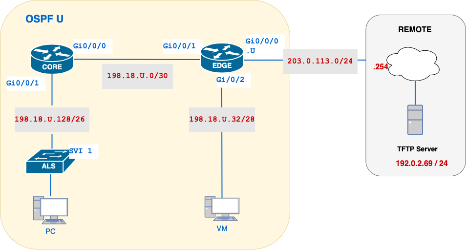
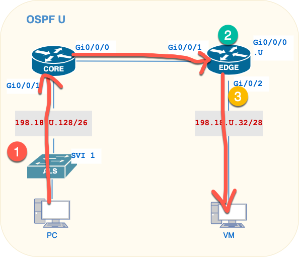
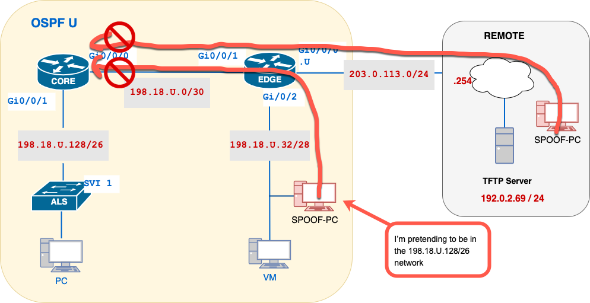

# Lab 10 — Standard ACLs: Policy Design, Placement, and Verification

---

## Section A — Start Here

### A1 — Overview

In this lab, the network from previous weeks is already operational.

Your focus shifts from routing operations to source-based traffic control using **named standard ACLs**.

You will secure a two-router, one-switch network by implementing three named standard ACL policies:

1. **PROTECT-VM** — Ensure only hosts in the PC subnet may reach the VM network.
2. **PROTECT-PC** — Prevent any hosts from spoofing internal PC-subnet addresses.
3. **PROTECT-ALS** — Restrict SSH access to the switch management plane to PCs and a designated TFTP server.

All ACLs will be created as **named standard** lists, applied on the router or switch interface closest to the resource they protect.

The purpose of this lab is not to memorize ACL syntax.

The purpose is to understand how to decompose a security policy into match criteria, choose correct ACL placement, and prove enforcement using operational evidence.

> **This lab carries forward.** The topology and device configurations built in this lab are reused in Week 11 (NAT). Save a local copy of your configurations before you leave — do not erase or reload your devices at the end of this lab.

### A1.1 — Mini Quick-Ref

| Task | Command | Notes |
|---|---|---|
| Define a numbered standard ACL | `access-list <1-99> permit\|deny [source] [wildcard]` | e.g. `access-list 10 deny 10.0.0.0 0.255.255.255 log` |
| Define a named standard ACL | `ip access-list standard [NAME]` | |
| Apply ACL to an interface | `ip access-group [NAME] in\|out` | under `interface` config |
| Apply ACL to VTY lines | `access-class [NAME] in` | under `line vty 0 4` config |
| Enable ACL logging on interface | `logging access-list` | under the same `interface` stanza as the ACL bind |
| View all ACLs and hit counts | `show ip access-lists` | EXEC mode |
| Show ACL binding on an interface | `show ip interface <interface>` | EXEC mode |
| Clear ACL counters | `clear access-list counters` | EXEC mode |
| Check ACL log entries | `show logging \| include ACCESS-LIST` | EXEC mode |

### A1.2 — Evidence Collection

This lab uses **manual** evidence collection: you will copy device prompts and command output directly into your submission file as you complete each checkpoint.

You are encouraged to use `x_remote.py` to automate collection if you prefer — no YAML file is provided for this lab, so you would need to write your own YAML defining the devices, credentials, and commands for each checkpoint. This is **optional**; it does not change what evidence is required or how it is graded.

### A2 — Why This Lab Is Important

- **Fundamental Security Control**: Standard ACLs provide a simple yet powerful method to enforce source-based access policies, a cornerstone of network segmentation and access control in enterprise environments.
- **Defence in Depth**: By protecting each network segment (VM hosts, PC workstations, and switch management) separately, you limit the blast radius of misconfigurations or compromised devices.
- **Operational Visibility**: Learning to enable and interpret ACL hit-counters and logs equips you with the tools to monitor attempted breaches, misrouted traffic, or policy violations.
- **Management-Plane Hardening**: Applying `access-class` on VTY lines is a best practice for securing device access.
- **Real-World Applicability**: Named standard ACLs are routinely used in campus and data-center networks; mastering their placement and verification prepares you for production network deployments.

### A3 — Objectives / Evidence Map

| Objective | Checkpoint |
|---|---|
| Restore the baseline and confirm the network is stable before applying ACLs | C00 |
| Design, place, and verify the PROTECT-VM standard ACL | C01 |
| Design, place, and verify the PROTECT-PC anti-spoofing standard ACL | C02 |
| Design, place, and verify the PROTECT-ALS management-plane standard ACL | C03 |

---

## Section B — Topology and Addressing

### B1 — Topology



### B2 — Addressing Table

| Network | Subnet |
|---|---|
| **CORE–EDGE transit** | `198.18.U.0/30` |
| **VM subnet** | `198.18.U.32/28` |
| **PC subnet & Mgmt VLAN** | `198.18.U.128/26` |

- **EDGE** always takes the **first usable** address in each lab subnet.
- **CORE** (when connected) takes the **last usable** address.
- **VM** hosts live on the **last usable** address of their subnet.
- **PC** hosts live on the **first usable** address of their subnet.
- **ALS SVI** (the switch management interface on VLAN 1) uses the **second-last usable** address in the PC/Management VLAN.

### B3 — Baseline Requirements

| Item | Requirement |
|---|---|
| Base configuration | [basic.cfg](../resources/basic.cfg) |
| OSPF process ID | `U` |
| Router-IDs | EDGE = `U.0.0.0`, CORE = `0.0.0.U` |
| Default route | Originated/redistributed on EDGE, advertised via OSPF |
| CORE–EDGE DR election | CORE wins (interface priority `U` on the transit link) |
| Passive interfaces | All interfaces that do not form OSPF adjacencies |
| ALS management | VLAN 1 SVI addressed, default gateway configured |

---

## Section C — Lab Tasks and Evidence

### C00 — Apply Baseline and Prove the Network Is Stable

#### Goal

Confirm the network is fully operational before any ACL is applied.

#### Why This Matters

ACL placement and verification depend on a trusted baseline. If routing, addressing, or reachability are not already correct, ACL hit-counter evidence collected later cannot be trusted.

#### Action

1. Apply [basic.cfg](../resources/basic.cfg) to all devices.
2. Configure addressing per the topology diagram. Add a description to every Cisco interface. Confirm all interfaces are `up/up`.
3. Configure OSPF per the baseline requirements in B3.
4. Confirm CORE wins the DR election on the CORE–EDGE transit link.

#### Verification

```text
show ip ospf neighbor
show ip ospf
show ip ospf interface GigabitEthernet0/0/0
show ip route
```

```bash
ping 198.18.U.129
ping 198.18.U.46
ping 203.0.113.254
```

#### Success Indicator / Failure Signal

| Verification Item | Success Indicator | Failure Signal |
|---|---|---|
| OSPF neighbours | EDGE and CORE see each other in `FULL` | Neighbour missing or not `FULL` |
| Router-ID | Matches manually configured value | Router ID auto-selected |
| DR/BDR | CORE = DR, EDGE = BDR on the transit link | Wrong device elected DR |
| Default route | `0.0.0.0/0` installed on CORE, pointing to EDGE | Default route missing |
| End-to-end reachability | All pings from ALS, CORE, EDGE succeed | Any ping fails |

#### Troubleshooting

If OSPF neighbours are missing: verify interface status, OSPF area, process ID, and that router IDs are unique.

If reachability fails: verify addressing against the topology diagram and confirm the default route is propagating.

**C00 — Collection of Information: not required.** Do not continue until every item above passes.

---

### C01 — Policy 1: Protect the VM Network (PROTECT-VM)

#### Goal

Design, place, and verify a standard ACL that allows only PC-subnet sources to reach the VM network.

#### Why This Matters

Standard ACLs match only on source address. Placement determines whether the policy protects the intended segment without collaterally blocking unrelated traffic — this is the first policy where you must reason through placement rather than follow a prescribed interface.

#### Security Policy Statement

Only hosts in the PC subnet (`198.18.U.128/26`) may initiate traffic to the VM network (`198.18.U.32/28`). All other sources are denied.

#### Policy Decomposition

Break the policy into its key elements:

| Component          | Details                                                  |
| ------------------ | -------------------------------------------------------- |
| **Policy Name**    | `PROTECT-VM`                                             |
| **ACL Type**       | Standard (source IP only)                                |
| **Match Criteria** | Source IP in PC subnet: `198.18.U.128/26`                |
| **Actions**        | 1. **Permit** matching traffic<br>2. **Deny** all others |

#### ACL Placement



To decide exactly where and how to apply our **PROTECT-VM** standard ACL, follow these three steps:

1. **Trace the Traffic Path**  
   - **Source:** any PC in 198.18.U.128/26 → moves up to the CORE router (Gi0/0/1) → across the transit link (CORE Gi0/0/0 → EDGE Gi0/0/1) → exits EDGE toward the VM network (Gi0/0/2).  
   - **Destination:** any VM in 198.18.U.32/28.

2. **Choose the Closest Device to the Destination**  
   - Since this is a **standard ACL** (which matches only on source IP), best practice is to place it as **close to the destination** as possible.  
   - The device nearest the VM network is the **EDGE** router.

3. **Determine the Correct Interface & Direction**  
   - At the **EDGE** router, traffic to the VM segment _egresses_ via **GigabitEthernet0/0/2**.  
   - We must inspect packets **before** they enter the VM subnet—i.e. apply the ACL **outbound** on Gi0/0/2.

| Device | Interface | Direction | Reason |
|---|---|---|---|
| EDGE | `GigabitEthernet0/0/2` | `out` | Filters on PC-source IP just before packets reach the VM LAN; avoids collateral blocking of other traffic. |

> **Why “close to the destination” for Standard ACLs?**  
> Standard ACLs filter only on the source address.  By placing them near the destination, you ensure that only traffic actually headed for the protected subnet is tested, and you avoid inadvertently blocking other traffic from the same source network that has different destinations elsewhere.  
#### Action

```shell
!-- Create and populate the ACL
 ip access-list standard PROTECT-VM
   permit 198.18.U.128 0.0.0.63 log
   deny any
 exit

!-- Apply the ACL inbound on the VM-facing interface
interface GigabitEthernet0/0/2
 ip access-group PROTECT-VM out
 exit
```

> **Note on `log` keyword:**
> - Appending `log` to an ACE causes a syslog entry each time that line matches.
> - Log permits if you need visibility into allowed flows; log denies to audit or troubleshoot blocked traffic.
> - Be mindful of log volume—high-traffic networks may require rate-limiting (`logging rate-limit access 10 conform-action log exceed-action drop`).
#### Verification

```bash
EDGE# clear access-list counters PROTECT-VM
PC# ping 198.18.U.46
CORE# ping 198.18.U.46
CORE# ping 198.18.U.46 source 198.18.U.190
EDGE# show ip access-lists PROTECT-VM
EDGE# show ip interface GigabitEthernet0/0/2 | include PROTECT-VM
EDGE# show logging | include PROTECT-VM
```

#### Success Indicator / Failure Signal

| Verification Item | Success Indicator | Failure Signal |
|---|---|---|
| PC → VM | 100% success | Any failure |
| CORE → VM (unspoofed) | 0% success, dropped by PROTECT-VM | Traffic passes |
| CORE → VM (spoofed as PC source) | 100% success | Traffic dropped |
| ACL binding | `PROTECT-VM` bound `out` on Gi0/0/2 | Wrong direction or interface |
| Hit counters | Permit and deny lines both show non-zero matches | Either counter remains 0 |

#### ACL Counter Validation

```bash
EDGE# show access-lists PROTECT-VM
```
    
- **Permit** line hits should equal the number of successful PC→VM (and spoofed) pings.
- **Deny** line hits should equal the number of failed CORE→VM pings.
####  Logging Check

```bash
show logging | include PROTECT-VM
```

>_Optional:_ Verify that denied matches were logged (if you left `log` on the `deny any` ACE).
#### Troubleshooting

If all traffic is denied: confirm the wildcard mask matches the full PC subnet, and confirm the ACL is bound `out`, not `in`.

If the ACL has no effect: confirm it is applied on Gi0/0/2, not the transit interface.

#### C01 — Collection of Information

In your `l10-{username}.txt` file, create a section labelled:

```diff
=== CO1 – Policy #1 - PROTECT-VM Verification ===
```

**CORE**:
```bash 
# ping 198.18.U.46                          !-- FAIL
# ping 198.18.U.46 source 198.18.U.190      !-- PASS
```

**EDGE**:
```bash
show ip access-lists PROTECT-VM 
show ip interface GigabitEthernet0/0/2 | include PROTECT-VM
show logging | include PROTECT-VM
```

**What to Include:**

| Requirement             | Details                                                                                           |
| ----------------------- | ------------------------------------------------------------------------------------------------- |
| Device prompt           | Include device name and command, e.g., `ayalac-EDGE# show ip access-lists PROTECT-VM`             |
| Full command output     | Show the entire ACL with hit counts, _and_ the interface binding with direction                   |
| ACL name & direction    | Verify the ACL name (`PROTECT-VM`) and that it’s bound `out` on `GigabitEthernet0/0/2`            |
| Hit counts for each ACE | Ensure the **permit** and **deny** lines both have non-zero **match counters** (after your tests) |
| Comment                 | Add a confirmation line, e.g.:                                                                    |
|                         | `!-- PROTECT-VM is applied outbound on Gi0/0/2 and both ACEs have hits as expected.`              |

 **Sample Output Block**:
!-- Your matches may be different depending on how many pings you perform.
!-- This sample does not include the output of the pings

```bash
=== CO1 – Policy #1 - PROTECT-VM Verification ===
!-- PROTECT-VM applied outbound on Gi0/0/2; permit and deny counters show traffic matches  

ayalac-EDGE# show ip access-lists PROTECT-VM 
Standard IP access list PROTECT-VM     
10 permit 198.18.U.128, wildcard bits 0.0.0.63  (4 matches)     
20 deny   any                                   (4 matches)  

ayalac-EDGE# show ip interface GigabitEthernet0/0/2  | include PROTECT-VM
Outgoing access list is PROTECT-VM

ayalac-EDGE#show logging | include PROTECT-VM
*Jul  4 14:05:22.123: %SEC-6-IPACCESSLOGP: list PROTECT-VM permitted ip 198.18.100.129 (Ethernet0/2) -> 198.18.100.46
*Jul  4 14:06:10.456: %SEC-6-IPACCESSLOGD: list PROTECT-VM denied    ip 203.0.113.100 (Ethernet0/2) -> 198.18.100.46
```

> Your logs may look different, as this output was taken from CML nor an actual router.

Use this section to demonstrate that your ACL is correctly placed and actively enforcing the policy.

---

### C02 — Policy 2: Protect the PC Network from Spoofing (PROTECT-PC)

#### Goal

Design, place, and verify a standard ACL that blocks packets which claim (spoof) a source address inside the PC subnet but do not originate from it.

#### Why This Matters

IP spoofing lets an attacker bypass ACLs that trust "inside" addresses. Blocking spoofed sources close to where they enter the network is a foundational anti-spoofing control.

#### Security Policy Statement

Any packet whose **source** IP claims to be within the PC subnet (`198.18.U.128/26`), but does **not** arrive from the trusted PC segment, must be dropped and logged. All other traffic — including legitimate external or remote sources — is permitted to reach the PC network.

> This ACL is **not** concerned with destination address. It examines only source address, to stop packets arriving from EDGE that pretend to originate inside the PC subnet.

#### Policy Decomposition

Fill in the blanks based on the security policy statement above.

| Component | Details |
|---|---|
| **Policy Name** | `PROTECT-PC` |
| **ACL Type** | Standard |
| **Match Criteria** | _(source IP range to match)_ |
| **Actions** | _(permit or deny)_ |
| **Device** | _(device)_ |
| **Interface** | _(interface facing the PC subnet)_ |
| **Direction** | _(inbound or outbound)_ |
| **Logging** | _(yes/no)_ |

#### ACL Placement



| Device | Interface | Direction | Reason |
|---|---|---|---|
| CORE | | | |

**Reasoning checkpoints (answer before configuring):**
1. Trace the path of a packet from the Internet/EDGE to a PC in `198.18.U.128/26` — which router/interface does it arrive on before reaching the PC network?
2. Why must the ACL be applied **before** packets reach the PCs, but **after** normal routing?
3. Which interface and direction ensures only packets destined for the PC network are checked?

#### Action

> Translate your decomposition and placement into IOS commands.

#### Verification

Before testing, create a spoof source on EDGE:

```shell
EDGE(config)# interface Loopback130
EDGE(config-if)# ip address 198.18.U.130 255.255.255.255
EDGE(config-if)# exit
```

```bash
# Clear ACL counter
clear access-list counters PROTECT-PC

PC# ping 198.18.U.190                                 !-- Successful

EDGE# ping 198.18.U.129 source 198.18.U.130           !-- Fail; should be dropped
EDGE# ping 198.18.U.129 source 203.0.113.U            !-- Successful
EDGE# show access-lists PROTECT-PC

EDGE# show logging | include PROTECT-PC

# Permit line hits should equal the number of successful pings.
# Deny line hits should equal the number of spoof attempts.
```

#### Success Indicator / Failure Signal

| Verification Item | Success Indicator | Failure Signal |
|---|---|---|
| PC → CORE (legitimate) | 100% success | Failure |
| Spoof → PC | 0% success, dropped by PROTECT-PC | Traffic passes |
| REMOTE → PC | 100% success | Traffic dropped |
| Hit counters | Permit and deny lines both show non-zero matches | Either counter remains 0 |

#### Troubleshooting

If legitimate PC traffic is blocked: confirm the ACL matches only the spoofed range, not all PC-subnet-destined traffic — remember this ACL filters on source, not destination.

If the spoof test still passes: confirm the ACL is applied on the interface facing EDGE, inbound, before the packet reaches the PC subnet.

#### C02 — Collection of Information

In your `l10-{username}.txt` file, create a section labelled:

```diff
=== CO2 – Policy #2 - PROTECT-PC Verification ===
```

Copy the command and output of your pings:
```bash
PC# ping 198.18.U.190                           !-- PASS
EDGE# ping 198.18.U.129 source 198.18.U.130     !-- FAIL
EDGE# ping 198.18.U.129 source 203.0.113.U      !-- PASS    
```

Copy the output of these commands from the device you applied the AC::
```bash
show ip access-lists PROTECT-PC 
show ip interface GigabitEthernetX | include PROTECT-PC
show logging | include PROTECT-PC
```

**What to Include:**

| Requirement             | Details                                                                                       |
| ----------------------- | --------------------------------------------------------------------------------------------- |
| Device prompt           | Include device name and command                                                               |
| Full command output     | Show the entire ACL with hit counts, _and_ the interface binding with direction               |
| ACL name & direction    | Verify the ACL name (`PROTECT-PC`) and that it’s bound `out` or `in` on  the interface        |
| Hit counts for each ACE | Ensure the **permit** and **deny** lines both have non-zero match counters (after your tests) |
| Comment                 | Add a confirmation line, e.g.:                                                                |
|                         | `!-- PROTECT-PC is applied to prevent spoofing addresses.`                                    |


---

### C03 — Policy 3: Protect the Switch Management Plane (PROTECT-ALS)

#### Goal

Design, place, and verify a standard ACL restricting SSH access to the switch management plane.

#### Why This Matters

Management-plane access is one of the highest-value targets on any network device. Restricting SSH to a small, known set of sources is a baseline hardening control.

#### Security Policy Statement

Only hosts in the PC subnet (`198.18.U.128/26`) and the TFTP server may establish SSH sessions to the switch management interface. All other attempts are denied and logged.

> Enforce this with a standard ACL applied as `access-class` on the switch's VTY lines (0–4), bound inbound.

#### Policy Decomposition

| Component | Details |
|---|---|
| **Policy Name** | `PROTECT-ALS` |
| **ACL Type** | Standard |
| **Match Criteria** | _(source IP ranges: PC subnet and TFTP server)_ |
| **Actions** | _(permit or deny)_ |
| **Device** | Switch |
| **Interface** | _(management SVI — VLAN 1)_ |
| **Direction** | _(inbound on VTY lines and/or the SVI)_ |
| **Logging** | _(yes/no)_ |

#### ACL Placement

| Device | Interface | Direction | Reason |
|---|---|---|---|
| Switch | | | |

**Reasoning checkpoints (answer before configuring):**
1. Which interface(s) carry SSH traffic destined for the switch's management plane?
2. Should the ACL be applied on the VLAN SVI or directly on the VTY lines?
3. What direction inspects SSH session attempts before they reach the control plane?

#### Action

> Translate your decomposition and placement into IOS commands: create `PROTECT-ALS`, apply it via `access-class` on the VTY lines, and enable logging as required.

#### Verification

```shell
ALS# clear access-list counters PROTECT-ALS
```

| Test | Command | Expected Result |
|---|---|---|
| SSH from PC (allowed) | `PC# ssh admin@198.18.U.189` | Successful login prompt |
| SSH from TFTP server (allowed) | `TFTP# ssh admin@198.18.U.189` | Successful login prompt |
| SSH from VM host (denied) | `VM# ssh admin@198.18.U.189` | Connection refused or timeout |
| ACL counter validation | `ALS# show access-lists PROTECT-ALS` | Permit ACEs have hits for PC & TFTP; deny ACE has hits for VM |

#### Success Indicator / Failure Signal

| Verification Item | Success Indicator | Failure Signal |
|---|---|---|
| SSH from PC/TFTP | Login succeeds | Login refused |
| SSH from VM | Connection refused | Login succeeds |
| ACL binding | `PROTECT-ALS` bound to VLAN 1 SVI and `line vty 0 4` | Missing binding on either |
| Hit counters | Permit and deny both show non-zero matches | Either counter remains 0 |

#### Troubleshooting

If SSH from PC fails: verify the switch management SVI (`show ip interface brief`) is up/up with the correct address before testing SSH.

If VM can still SSH in: confirm the ACL is bound to `line vty 0 4`, not just the SVI.

#### C03 — Collection of Information

In your `l10-{username}.txt` file, create a section labelled:

```diff
=== CO3 – Policy #3 - PROTECT-ALS Verification ===
```

From the ALS:

```bash
show ip access-lists PROTECT-ALS
show ip interface Vlan1 | include PROTECT-ALS
show running-config | section line vty
```

**What to Include:**

| Requirement             | Details                                                                                         |
| ----------------------- | ----------------------------------------------------------------------------------------------- |
| Device prompt           | Include device name and command                                                                 |
| Full command output     | Capture the entire ACL with hit counts, the SVI binding, and the VTY line ACL application       |
| ACL name & binding      | Verify the ACL name (`PROTECT-ALS`), that it’s applied to `Vlan1` **in**, and on `line vty 0 4` |
| Hit counts for each ACE | Ensure the **permit** entries for PC & TFTP and the **deny** entry all show non-zero matches    |
| Comment                 | Add a confirmation line, e.g.:                                                                  |
|                         | `!-- PROTECT-ALS bound to Vlan99 and VTY lines; all ACEs have expected hit counts.`             |

---

## Section D — Submission

### D1 — Submission Requirements

Submit a single file:

```text
l10-{username}.txt
```

containing all three sections: `CO1`, `CO2`, `CO3`.

### D2 — Submit from PC

Your submission is your responsibility. Before leaving the lab, prove:

```bash
ssh cisco@192.0.2.69
ls -l /var/tftp/*{username}*
```

1. TFTP transfer completed.
2. File name is `l10-{username}.txt`.
3. File has non-zero size.

Upload updated configs to the TFTP server alongside your evidence file.

### D3 — Save Your Work and Clean Up Devices

After submission is confirmed, clean up routers using the provided TCL script.

On all devices:

```
tclsh clean.tcl
```

- Turn off your router
- Reload your switch
- Reboot your PC

Lab 11 reuses the same topology and configurations. Save a local copy of your device configs before you leave — you will need them to continue directly into lab 11.

---

## End of Lab 10 — Standard ACLs: Policy Design, Placement, and Verification
