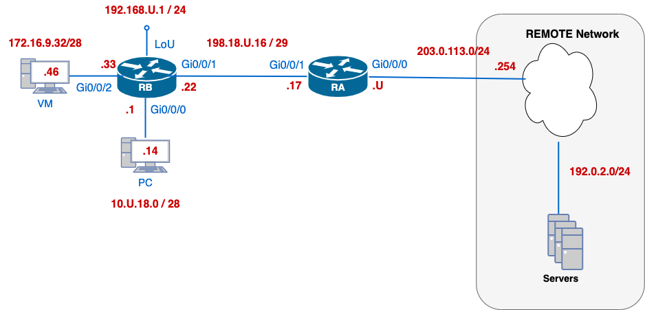

# Lab 11 — NAT Foundations: PAT, Static Port-Forwarding, and Dynamic Pools

---

## Section A — Start Here

### A1 — Overview

In this lab, you will deepen your understanding of IPv4 Network Address Translation (NAT) by configuring a border router to translate traffic between private internal networks and the public Internet.

This lab uses its own two-router topology (**RA**/**RB**) with private addressing — it does not reuse the EDGE/CORE/ALS topology from previous weeks.

You will work through three essential NAT scenarios:

1. **Port Address Translation (PAT)** on the router's outside interface, allowing multiple inside hosts to share one public IP.
2. **Static port-forwarding**, mapping a specific TCP port on the public address to an internal server.
3. **Dynamic PAT using an address pool**, enabling inside hosts to translate to a small range of public IPs.

This hands-on exercise builds critical skills in conserving IPv4 address space and providing controlled inbound access — practical expertise for any enterprise network engineer.

### A1.1 — Mini Quick-Ref

| Task | Command | Notes |
|---|---|---|
| Mark inside interface | `ip nat inside` | under the interface facing the private network |
| Mark outside interface | `ip nat outside` | under the interface facing the public network |
| Define a standard ACL to match inside traffic | `access-list <1-99> permit [source] [wildcard]` | e.g. `access-list 16 permit 172.16.9.32 0.0.0.15` |
| PAT to the outside interface's address | `ip nat inside source list <ACL> interface <if> overload` | all matched hosts share the interface's public IP |
| Static port-forward | `ip nat inside source static <tcp\|udp> <in_addr> <in_port> <out_addr> <out_port>` | maps one public port to one internal host:port |
| Dynamic PAT pool | `ip nat pool <name> <start_ip> <end_ip> <mask>` then `ip nat inside source list <ACL> pool <name> overload` | matched hosts share the pool addresses |
| View NAT translations | `show ip nat translations` | EXEC mode |
| View NAT statistics | `show ip nat statistics` | EXEC mode |
| View ACL hit counts | `show ip access-lists <ACL>` | EXEC mode |

### A1.2 — Evidence Collection

This lab uses a mix of **automated** and **manual** evidence collection:

- **C00 (OSPF/services baseline)** is collected automatically using `x_remote.py` and the provided `l11-ospf.yaml` file.
- **C01–C03 (NAT verification)** are collected manually: you will copy device prompts and command output directly into your submission file as you complete each checkpoint.

### A2 — Why This Lab Is Important

Network Address Translation (NAT) is a foundational technique in IPv4 networks, allowing organizations to:

- **Conserve scarce IPv4 addresses** by enabling multiple internal hosts to share a single public IP (PAT) or a small pool of addresses (dynamic PAT).
- **Control and secure inbound access** through static port-forwarding, exposing only necessary services to the Internet while keeping internal networks hidden.
- **Maintain address consistency** when renumbering or merging networks, since internal addressing can remain unchanged behind a NAT boundary.

By mastering PAT, static port-forwarding, and dynamic NAT pools, you'll gain practical skills that are essential for designing, operating, and troubleshooting real-world enterprise networks under IPv4 constraints.

### A3 — Objectives / Evidence Map

| Objective | Checkpoint |
|---|---|
| Apply baseline configuration, bring up OSPF and services, and collect automated verification | C00 |
| Configure and verify PAT to the exit interface's public IP (NAT Rule #1) | C01 |
| Configure and verify static port-forwarding to an internal server (NAT Rule #2) | C02 |
| Configure and verify dynamic PAT using an address pool (NAT Rule #3) | C03 |

---

## Section B — Topology and Addressing

### B1 — Topology



### B2 — Addressing Table (IPv4)

Use the table below to configure your devices. Replace `U` with your assigned student ID number.

| Device             | Interface | IP Address (CIDR)  | Description                                 |
| ------------------ | --------- | ------------------ | -------------------------------------------- |
| **RA**             | Gi0/0/0   | `203.0.113.U/24`   | Outside interface to Internet                |
| **RA**             | Gi0/0/1   | `198.18.U.17/29`   | Inside interface, OSPF neighbor to RB        |
| **RB**             | Gi0/0/0   | `10.U.18.1/28`     | Inside gateway for dynamic NAT pool hosts    |
| **RB**             | Gi0/0/1   | `198.18.U.22/29`   | OSPF neighbour to RA                         |
| **RB**             | Gi0/0/2   | `172.16.9.33/28`   | Host receiving static port-forward (Telnet)  |
| **RB**             | LoU       | `192.168.U.1/24`   | Private network                              |
| **VM (PAT host)**  | Gi0/0/2   | `172.16.9.46/28`   | Inside host for PAT translation tests        |
| **PC (Pool host)** | Gi0/0/0   | `10.U.18.14/28`    | Inside host for dynamic NAT pool tests       |
| **Remote**         | —         | `203.0.113.254/24` | External tester for Internet connectivity    |

> **VM Network**
> All students use **172.16.9.32/28** for their VM subnet.
> Assign your VM **172.16.9.46/28**, identical across students, to illustrate how private networks overlap behind NAT.

### B3 — Baseline Requirements

| Item                | Requirement                                                                                                                                           |
| ------------------- | ----------------------------------------------------------------------------------------------------------------------------------------------------- |
| Base configuration  | [basic.cfg](../resources/basic.cfg)                                                                                                                   |
| OSPF process ID     | `U`                                                                                                                                                   |
| Router-IDs          | RA = `U.0.0.17`, RB = `U.0.0.22`                                                                                                                      |
| Default route       | Originated/redistributed so `0.0.0.0/0` is known across the OSPF domain                                                                               |
| RA–RB DR election   | RB wins (interface priority `U`)                                                                                                                      |
| Passive interfaces  | All interfaces not directly connected to an OSPF neighbour                                                                                            |
| Reference bandwidth | `10000 Mbps` on all OSPF-speaking routers                                                                                                             |
| Convergence tuning  | RB–LoU network type `point-to-point`<br>`198.18.U.16/29` link uses `hello 3`/`dead 6`<br> RB's PC- and VM-facing interfaces have priority `0`         |
| Services            | RA is NTP master (stratum 4); <br>RB syncs to RA; <br>TFTP source-address fix applied to routers; <br>syslog directed to the PC per B3 details in C00 |

---

## Partner Collaboration

You will need a partner for connectivity testing. If you don't find a partner, ask your lab instructor to telnet into your RB.

- [ ] You will each configure your own devices but work together to test connectivity. The topology diagram shows **only your own** devices; your partner will have the same topology on their end.
- [ ] You need **one PC** and **one VM** each for testing.
- [ ] If you finish early, help your partner, but do **not** touch their keyboard.
- [ ] If your partner runs into a problem, guide them through troubleshooting. You **both** need full end-to-end connectivity for full marks.

---

## Section C — Lab Tasks and Evidence

### C00 — Baseline Configuration, OSPF, Services, and Verification

#### Goal

Bring the RA/RB topology to a fully operational baseline — addressing, OSPF, and supporting services — and collect automated verification evidence before any NAT rule is configured.

#### Why This Matters

NAT rules depend on a stable, routable network underneath them. If OSPF adjacencies, addressing, or services are not correct first, NAT translation and hit-counter evidence collected later cannot be trusted.

#### Action

**1. Basic Configuration**
- [ ] Use the provided base configuration file: [basic.cfg](../resources/basic.cfg)
- [ ] Enable real-time debug output display on all routers.

**2. Addressing Configuration**
- [ ] Configure addresses according to the topology diagram in B1, paying attention to the network masks.
- [ ] Add a description to all Cisco interfaces.
- [ ] Ensure all interfaces are `up/up` before continuing.
- [ ] Console to **RA** and SSH into **RB** using the user `cisco/cisco`.

**3. OSPF Configuration**
- [ ] **Process ID**: Use `U` as the OSPF process number.
- [ ] **Router-IDs**: Manually set each router's ID under OSPF:
	- [ ] `RA`: `U.0.0.17`
	- [ ] `RB`: `U.0.0.22`
- [ ] **Default Gateway Advertisement**: On **RA**, redistribute or originate a default route so that `0.0.0.0/0` is known across the OSPF domain.
- [ ] **RA–RB DR Election**: Ensure **RB** becomes the DR by setting its priority to `U`.
- [ ] Configure explicitly all interfaces **not directly connected to an OSPF neighbour** as passive.
- [ ] Set the OSPF **reference bandwidth** to `10000 Mbps` for accurate cost calculation on gigabit links.
- [ ] **Convergence Tuning**:
	- [ ] **RB–LoU**: Configure as a `point-to-point` OSPF network type.
	- [ ] On the `198.18.U.16/29` link, set `hello 3` and `dead 6`.
	- [ ] **RB** interfaces towards the PC and the VM network should _never_ become a DR by setting their priority to `0`.

**4. Services**
- [ ] Configure **RA** as the authoritative NTP master of stratum 4.
- [ ] Synchronize **RB**'s time with **RA**, using the IP address of their directly connected link.
- [ ] Prevent the router from using its own IP as a source when sending to TFTP.
- [ ] Direct `syslog` messages to the PC. Note that **RA** messages will be sent once you configure OSPF.
	- [ ] Use the Gi0/0/0 interface as the syslog source.
	- [ ] Send informational (and higher) severity messages.
	- [ ] Include date/time on log entries.

```bash
! --- SYSLOG Configuration ---
! Direct syslog messages to the PC
R(config)# logging host 10.U.18.14 transport udp port 514

! Use the Gi0/0/0 interface as the syslog source
R(config)# logging source-interface GigabitEthernet0/0/0

! Send informational (and higher) severity messages
R(config)# logging trap informational

! Include date/time on log entries
R(config)# service timestamps log datetime msec localtime
```

**5. PC — Extra Configuration**

On your **PC** (using **TFTP64**):
- [ ] Launch **TFTP64** and open the **Settings** menu.
- [ ] Set the **Base Directory** (or "Home Directory") to your **Desktop**.
- [ ] Enable the **TFTP** and the **Syslog** services.

> *Tip:* You can monitor real-time syslog messages in the **Syslog** tab while testing ping and routing events.

**6. VM — Extra Configuration**

Your PC and VM only have private addresses at this point, so neither can reach the remote server (`192.0.2.69`) yet — that path doesn't exist until C01's PAT rule is configured. To retrieve the automated-evidence YAML file before then, temporarily borrow public addressing on the VM:

- [ ] Use the **Alpine VM**.
- [ ] Temporarily connect the VM to the **REMOTE** network: address `203.0.113.U/24`, gateway `203.0.113.254`.
- [ ] From the VM, retrieve the YAML file:
    ```bash
    scp cisco@192.0.2.69:YAML/l11-ospf.yaml .
    ```
- [ ] Once the file is retrieved, move the VM back onto its normal network (the VM network, `172.16.9.32/28`) and reassign its usual address, `172.16.9.46/28` (see B2).

#### Verification

Before collecting evidence, review your lab notes and the network specifications carefully. Ensure all configurations match the addressing plan, OSPF process settings, and service requirements described above.

Verify that all devices are reachable and that OSPF adjacencies, DR/BDR elections, timers, and passive interfaces are functioning as expected. Confirm that Syslog, NTP, and TFTP services are operating as configured.

```text
show ip protocols
show ip ospf neighbor
show ip ospf interface brief
show ip route ospf
show ntp associations
show logging | include Logging to|udp
```

#### Success Indicator / Failure Signal

| Verification Item | Success Indicator | Failure Signal |
|---|---|---|
| OSPF neighbours | RA and RB see each other in `FULL` | Neighbour missing or not `FULL` |
| Router-ID | Matches manually configured value | Router ID auto-selected |
| DR/BDR | RB = DR on the RA–RB link | Wrong device elected DR |
| Default route | `0.0.0.0/0` known across the OSPF domain | Default route missing |
| NTP | RB synchronized to RA (stratum 5) | RB not synchronized |
| Syslog | Messages arriving at the PC | No messages received |

#### Troubleshooting

If OSPF neighbours are missing: verify interface status, OSPF area, process ID, and that router IDs are unique.

If services fail: confirm the syslog source-interface and NTP peer address match the addressing table exactly.

#### C00 — Collection of Information (Automated)

Once you have verified that the network is stable and fully functional, collect your C00 baseline evidence using `x_remote.py`:

- [ ] Use the `l11-ospf.yaml` file you retrieved via `scp` in step 6 above.
- [ ] Open the YAML file and replace the `{U}` and `{USERNAME}` placeholders with your own information.
- [ ] Run the collector (from the VM, now back on its normal network):

```bash
python3 x_remote.py l11-ospf.yaml
```

This connects to RA and RB, executes the OSPF and services verification commands defined in `l11-ospf.yaml`, and saves the results to **`l11-ospf-{USERNAME}.txt`**.

- [ ] Also create **one** evidence file: `l11-nat-{USERNAME}.txt` — you will add the C01–C03 sections to it manually as you progress through the lab.  This file can be created on the PC or the VM.

> **Hold your submission.** Your PC and VM still only have private addresses, so neither can reach the TFTP server (`192.0.2.69`) yet — that connectivity doesn't exist until C01's PAT rule is configured. **Do not submit `l11-ospf-{USERNAME}.txt` yet.** You'll submit it at the end of C01, once NAT gives you a path to the TFTP server.

> **NOTE**: Do not include the curly brackets as part of your username; they represent that `{USERNAME}` is a variable.

---

### C01 — NAT Rule #1: PAT to the Exit Interface's Public Address

#### Goal

Configure and verify Port Address Translation (PAT) so that hosts in the VM network share RA's public IP when accessing the Internet.

#### Why This Matters

PAT overload is the most common form of NAT in production networks — it is how an entire private network can reach the Internet through a single public address, conserving scarce IPv4 space.

#### Security / Translation Policy Statement

Hosts in the VM Network `172.16.9.32/28` must share RA's public IP when accessing the Internet.

#### Action

1. **Identify the NAT device**: RA (the border router with the public-facing interface).
2. **Set inside/outside interfaces**:
    ```bash
    ! On RA
    interface GigabitEthernet0/0/1
      ip nat inside
    interface GigabitEthernet0/0/0
      ip nat outside
    ```
3. **Create a standard ACL (16) to match the inside network**:
    ```bash
    access-list 16 permit 172.16.9.32 0.0.0.15
    ```
4. **Enable PAT to the exit interface's public IP**:
    ```bash
    ip nat inside source list 16 interface GigabitEthernet0/0/0 overload
    ```

Command explanation:
- **`ip nat inside source`** — Specifies that we're translating source addresses of packets coming from the **inside** network.
- **`list 16`** — Uses the **standard ACL 16** to identify which source addresses to translate (in our case, every host in `172.16.9.32/28`).
- **`interface GigabitEthernet0/0/0`** — Tells the router to use the IP address assigned to **Gi0/0/0** (the outside/public interface) as the translated address.
- **`overload`** — Enables **Port Address Translation (PAT)**, which lets **all** matched inside hosts share that single public IP by mapping their source port numbers.

> For any packet sourced from `172.16.9.32/28`, translate its private source IP to the public IP on Gi0/0/0; and because of `overload`, allow many private hosts to reuse that one public IP by differentiating them via port numbers.

#### Verification

**Testing NAT with TFTP and ICMP**

1. From VM: **Ping the TFTP server**, `192.0.2.69`.
2. From VM: **Transfer a file to the TFTP server**, to generate UDP/69 traffic through the PAT translation:
	```bash
	VM# tftp -p -l l11-ospf-{USERNAME}.txt 192.0.2.69
	```
3. **Inspect the NAT translation table**:
	```bash
	RA# show ip nat translations
	```

!-- Sample Output
<table border="1" cellpadding="4" cellspacing="0">
  <thead>
    <tr>
      <th>Pro</th>
      <th>Inside Global</th>
      <th>Inside Local</th>
      <th>Outside Local</th>
      <th>Outside Global</th>
    </tr>
  </thead>
  <tbody>
    <tr>
      <td>UDP</td>
      <td>203.0.113.17:52345</td>
      <td>172.16.9.46:52345</td>
      <td>192.0.2.69:69</td>
      <td>192.0.2.69:69</td>
    </tr>
    <tr>
      <td>ICMP</td>
      <td>203.0.113.17:1</td>
      <td>172.16.9.46:1</td>
      <td>192.0.2.69:0</td>
      <td>192.0.2.69:0</td>
    </tr>
  </tbody>
</table>

4. **Verify ACL and statistics**:
```bash
RA# show access-lists 16
RA# show ip nat statistics
```
- **ACL 16** should report ≥ 2 hits.
- **Total active translations** should be ≥ 2.

#### Success Indicator / Failure Signal

| Verification Item | Success Indicator | Failure Signal |
|---|---|---|
| TFTP transfer | File transfer to `192.0.2.69` completes | Transfer fails or times out |
| NAT translations | ICMP and UDP/69 entries for `172.16.9.46` present | No translation entries |
| ACL 16 hits | ≥ 2 hits | 0 hits |
| Total active translations | ≥ 2 | 0 |

#### Troubleshooting

If no translations appear: confirm `ip nat inside`/`ip nat outside` are on the correct interfaces and that ACL 16's wildcard mask matches `172.16.9.32/28` exactly.

#### C01 — Collection of Information

In your `l11-nat-{USERNAME}.txt` file, create a section labelled:

```diff
=== C01 – PAT to Exit Interface Verification ===
```

Under this header, perform the following steps and include the outputs as described.

| Step                         | Command(s)                 | What to Include                                                                                        |
| ---------------------------- | -------------------------- | ------------------------------------------------------------------------------------------------------ |
| **1. Show NAT translations** | `show ip nat translations` | Full translation table, showing ICMP and UDP/69 (TFTP) entries for `172.16.9.46` → `203.0.113.U` to `192.0.2.69` |
| **2. Verify ACL hits**       | `show ip access-lists 16`  | The ACL 16 permit statement; hit count ≥ 2 indicating both flows were matched                          |
| **3. Show NAT statistics**   | `show ip nat statistics`   | Total active translations ≥ 2; hits/misses summary for inside source translations                    |

**What to Include:**

| Requirement | Details |
|---|---|
| Device prompt & command | Include device name and exact command |
| Full command output | Capture the entire output of each command without truncation |
| NAT translation entries | In `show ip nat translations`, confirm ICMP and UDP/69 entries mapping `172.16.9.46` → `203.0.113.U` → `192.0.2.69` |
| Comment | e.g., `!-- PAT to exit interface functioning; ICMP and TFTP translations and ACL verified.` |

#### Sample Output Block

```bash
=== C01 – PAT to Exit Interface Verification ===
!-- PAT to exit interface functioning; ICMP and TFTP translations and ACL verified.

ayalac-RA# show ip nat translations
Pro  Inside global        Inside local         Outside local       Outside global
ICMP 203.0.113.U:1       172.16.9.46:1        192.0.2.69:0         192.0.2.69:0
UDP  203.0.113.U:52345   172.16.9.46:52345    192.0.2.69:69        192.0.2.69:69

ayalac-RA# show ip access-lists 16
Standard IP access list 16
    permit 172.16.9.32 0.0.0.15 (hit count: 2)

ayalac-RA# show ip nat statistics
Total active translations: 2 (0 static, 0 extended)
Outside interfaces: 1
  GigabitEthernet0/0/0
Hits: 2  Misses: 0
```

**Submit Verification File**
- [ ] PAT now gives you a path to the outside network — submit `l11-ospf-{USERNAME}.txt` (held from C00) to the TFTP server (`192.0.2.69`).
- [ ] Upload router configurations to the TFTP server.

---

### C02 — NAT Rule #2: Static Port-Forwarding

#### Goal

Configure and verify a static port-forward so external hosts can reach RB's internal Telnet server through RA's public IP.

#### Why This Matters

Static port-forwarding is how organizations expose a single internal service to the Internet without exposing the entire internal network — a common pattern for web servers, mail servers, and remote-management ports.

#### Security / Translation Policy Statement

Allow Internet users to Telnet to internal RB at `172.16.9.33:23` via RA's public IP on TCP `2323`.

#### Action

- [ ] Code a **port-forwarding** rule so that external hosts can connect to the telnet server on RB:
    ```
    ip nat inside source static <tcp/udp> <in_addr port> <out_add port>
    ```
    - [ ] Telnet is a TCP protocol.
    - [ ] Internally, the RB telnet server is at `172.16.9.33` port `23`.
    - [ ] Outside hosts should connect to `203.0.113.U` port `2323`.

#### Verification

- [ ] From PC, telnet to your partner's router `203.0.113.P` and login. Keep the connection open.
- [ ] From PC, telnet to your partner's RB `203.0.113.P 2323` and login. Keep the connection open.
- [ ] From your partner PC, telnet to your router `203.0.113.U` and login. Keep the connection open.
- [ ] From your partner PC, telnet to your RB `203.0.113.U 2323` and login. Keep the connection open.

> `P`: Your partner's `U`. You are testing your partner's configuration. They are testing your configuration.

```bash
RA:  show ip nat translations
RB:  show tcp brief
RB:  show users
```

#### Success Indicator / Failure Signal

| Verification Item | Success Indicator | Failure Signal |
|---|---|---|
| NAT translations | Static entry `203.0.113.U:2323` → `172.16.9.33:23` | Entry missing |
| TCP listener check | `LISTEN` or `ESTAB` on local port 2323 on RB | No listener present |
| Active Telnet sessions | `vty` line with protocol `telnet` from PC/partner to RA and RB | No active sessions |

#### Troubleshooting

If the port-forward doesn't work: confirm the static NAT statement uses `tcp`, the correct inside address/port, and the correct outside address/port (2323).

#### C02 — Collection of Information

In your `l11-nat-{USERNAME}.txt` file, under the label:

```diff
=== C02 – Static Port Forwarding Verification ===
```

Copy and paste the outputs (including device prompts) of the following commands from **RA**/**RB**, then add your confirmation comment below the header:

| Requirement | Details |
|---|---|
| NAT translations | `RA: show ip nat translations` — confirm a static entry mapping `203.0.113.U:2323` → `172.16.9.33:23` |
| TCP listener check | `RB: show tcp brief` — ensure there is a `LISTEN` or `ESTAB` on local port 2323 |
| Active Telnet sessions | `RB: show users` — confirm at least one `vty` line with protocol `telnet` from your PC or partner's PC to RA and to RB is open |

**What to Include:**

| Requirement | Details |
|---|---|
| Device prompt & command | Include device name and exact command |
| Full command output | Capture the entire output of each command without truncation |
| NAT translation entry | In `show ip nat translations`, confirm a static entry mapping `203.0.113.U:2323` → `172.16.9.33:23` |
| TCP listener | In `show tcp brief` ensure there is a `LISTEN` (or `ESTAB`) on local port 2323 |
| Active Telnet sessions | In `show users`, confirm at least one `vty` line with protocol `telnet` from your PC (or partner's PC) to RA and to RB |
| Comment | e.g., `!-- Static port-forward for Telnet to 172.16.9.33:23 verified; TCP listener, and sessions confirmed.` |

#### Sample Output Block

```bash
=== C02 – Static Port Forwarding Verification ===
!-- Static port-forward for Telnet to 172.16.9.33:23 verified; TCP listener and sessions present.

ayalac-RA# show ip nat translations
Pro Inside global          Inside local         Outside local        Outside global
tcp 203.0.113.U:2323      172.16.9.33:23       10.P.18.14:54321  10.P.18.14:54321

ayalac-RB# show tcp brief
TCB     Local Address         Foreign Address      (state)
0xABC   203.0.113.U.2323     10.P.18.14.56789     LISTEN

ayalac-RB# show users
    Line       User       Host(s)              Idle       Location
   *  0 vty 2  telnet    idle                 00:00:12  10.P.18.14
```

> Be sure you leave each Telnet session open while you capture these outputs.

---

### C03 — NAT Rule #3: Dynamic PAT with Address Pool

#### Goal

Configure and verify dynamic PAT for the PC network using a small pool of public addresses.

#### Why This Matters

A dynamic PAT pool sits between a single-address overload and full one-to-one static NAT — it's used when a network needs more simultaneous outbound sessions than a single address can comfortably support, without dedicating a public address per host.

#### Security / Translation Policy Statement

Enable dynamic PAT for the PC network (`10.U.18.0/28`) using a pool of public addresses on RA.

#### Action

- [ ] Configure NAT with overload for the network `10.U.18.0/28` to an address from the pool:
    - [ ] Identify the NAT inside and outside interfaces.
    - [ ] Code access-list `18` to permit the inside private addresses `10.U.18.0/28`.
    - [ ] Set up the NAT pool called `NAT_POOL` using addresses `209.10.U.2 – 209.10.U.6 /29`.
    - [ ] Code the translation rule with overload to translate host addresses permitted by access-list 18 to an address from the `NAT_POOL` NAT pool.

#### Verification

Generate two types of traffic from your **PC (10.U.18.14)**:

1. **ICMP test**: Ping to `192.0.2.69`.
2. **TFTP test**: Upload a file to the TFTP server; it could be your current `l11-nat-{USERNAME}.txt`.

On **RA**:
```bash
show ip nat translations
show ip nat statistics
show access-lists 18
```

#### Success Indicator / Failure Signal

| Verification Item | Success Indicator | Failure Signal |
|---|---|---|
| ICMP translation | Entry for `192.0.2.53`/`192.0.2.69` present | Entry missing |
| TFTP (UDP 69) translation | Entry for port 69 present | Entry missing |
| ACL 18 hit count | `permit 10.U.18.0 0.0.0.15` shows matches ≥ 2 | 0 matches |

#### Troubleshooting

If translations don't appear: confirm the pool range and mask match `209.10.U.2 – 209.10.U.6 /29`, and that ACL 18's wildcard mask matches `10.U.18.0/28`.

#### C03 — Collection of Information

In your `l11-nat-{USERNAME}.txt` file, create a section labelled:

```diff
=== C03 – Dynamic PAT Pool Verification ===
```

**What to Include:**

| Requirement | Details |
|---|---|
| Device prompt & command | Include device name and exact command for each, e.g., `ayalac-RA# show ip nat translations` |
| Full command output | Copy the entire output of each command without truncation |
| Translation entries | In `show ip nat translations`, confirm an ICMP entry for `192.0.2.53`/`192.0.2.69` and a UDP entry for port `69` (TFTP) |
| ACL hit count | From `show access-lists 18`: verify `permit 10.U.18.0 0.0.0.15` shows a matches count ≥ 2 |
| Comment | e.g., `!-- Dynamic PAT pool NAT_POOL functioning; ICMP and TFTP translations verified.` |

> This confirms that inside hosts in `10.U.18.0/28` are translating via addresses in pool `NAT_POOL`, for both standard ICMP and UDP/TFTP traffic.

**Submit Verification File**
- [ ] Submit `l11-nat-{USERNAME}.txt` to the TFTP server.
- [ ] Include all sections: C01–C03.
- [ ] Upload the syslog file to the TFTP server; label this file as `l11-nat-syslog-{USERNAME}.txt`.
- [ ] Upload router configurations to the PC's TFTP server — for you to keep a copy.

---

## Section D — Cleanup

### D1 — Reset the Devices

From the router console or an active SSH session, enter Tcl shell mode and run the cleanup script provided by your instructor:

```text
tclsh clean.tcl
```

This resets the device for the next lab session. Do not skip this step — the following lab depends on this device being clean.

---

## End of Lab 11 — NAT Foundations: PAT, Static Port-Forwarding, and Dynamic Pools
