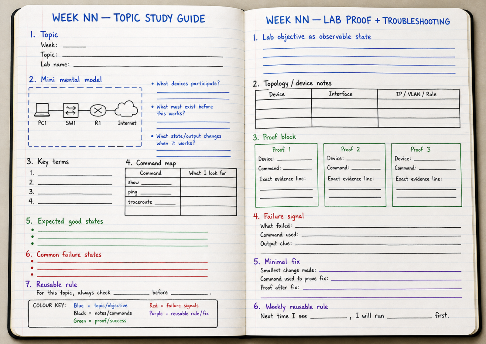

# R01 — Tool Readiness Lab Book Reflection

**Course:** CST8371 — Introduction to Enterprise Networking  
**Activity type:** Reflection / lab-book setup  
**Environment:** Windows host + Alpine Linux reference environment  
**Status:** Ungraded, unless your instructor requests a lab-book check  
**Submission:** None, unless requested by your instructor  

---

## Purpose

The goal is to create a reusable command reference in your lab book for tools you will use throughout the course.

You will document command use for:

```text
Windows host  <-->  Alpine Linux
```

You may use:

```text
Alpine Linux VM
course Alpine server
previous Linux experience
course-provided examples
Brightspace infographics
```

---

## Reflection Outcome

This reflection is complete when your lab book contains entries for:

```text
1. Alpine IP address, static IP address, and default route
2. ping
3. traceroute / tracert
4. SSH
5. SCP
6. TFTP
```

Each entry must include:

```text
Tool:
Platform:
Direction:
Command:
Target:
Success output indicator:
Common failure output:
What this proves:
What this does not prove:
Next command/check if this fails:
```

---

## Lab Book Page Setup

Use one open notebook spread.

```text
LEFT PAGE  = R01 Tool Study Guide
RIGHT PAGE = R01 Tool Evidence + Troubleshooting Reflection
```

### Left Page Header

Record:

```text
Reflection: R01
Topic: Tool readiness for enterprise networking labs
Environment: Windows + Alpine Linux
Reference materials: Brightspace infographics + Alpine documentation
```

### Left Page Must Include

```text
1. Command map
2. Expected good states
3. Common failure states
4. Reusable rule
```

### Right Page Must Include

```text
1. Evidence or sample output pattern for each tool
2. What the output proves
3. What the output does not prove
4. Next command/check if the test fails
```

### Lab Model



---

## Environment

Use one of the following:

1. An Alpine Linux VM you install yourself.
2. An Alpine Linux in the lab 

Recommended install source:

```text
Alpine Linux Virtual x86_64
```

Recommended VMware network mode:

```text
NAT
```

NAT is recommended because the Alpine VM should have internet access for package installation without requiring bridged-network troubleshooting.
## Reference Materials

Use the infographics posted in Brightspace resources

Use Alpine documentation as the technical reference for Alpine network configuration:

```text
https://wiki.alpinelinux.org/wiki/Configure_Networking
https://docs.alpinelinux.org/user-handbook/0.1a/index.html
```

Do not copy long documentation into your lab book. Record the command pattern, evidence line, and troubleshooting value.

---

# Reflection Task 1 — Alpine Network Identity and Static IP

## Action

Create a lab-book entry that shows how you would identify Alpine network settings and configure a static IP address.

You should document how to:

```text
1. Identify Alpine version
2. Identify the active interface
3. View current IP address
4. View default route
5. Identify the VMware or lab network being used
6. Select an unused IP address
7. Apply a static IP address
8. Confirm the network still works
```

Commands may be similar to the following, depending on the Alpine version and network service in use:

```sh
cat /etc/alpine-release
ip addr
ip route
ping -c 4 <gateway-or-known-target>
```

For persistent static IP configuration, use Alpine documentation. Your commands may vary depending on whether the system uses setup scripts, `/etc/network/interfaces`, NetworkManager, or another method.

## Lab-Book Entry

```text
Tool: Alpine network identity and static IP
Platform: Alpine Linux
Command(s):
Target:
Success output indicator:
Common failure output:
What this proves:
What this does not prove:
Next command/check if this fails:
```

## Success Indicator / Failure Signal

| Check | Success Indicator | Failure Signal |
|---|---|---|
| Alpine version | Alpine release number appears | No output or command error |
| Active interface | Interface has active state/carrier | Wrong interface selected |
| Current IP | IPv4 address appears on expected interface | No IPv4 address |
| Default route | `default via <gateway>` exists | No default route |
| Static IP selection | Address is on correct network and unused | Duplicate address or wrong network |
| Static IP applied | Selected static IP appears on Alpine | Old IP remains or interface loses IP |
| Network still works | `ping -c 4` receives replies | 100% packet loss or unreachable |

## Reflection Prompt

```text
Which command proves Alpine has an IP address?
Which command proves Alpine has a default route?
What output would suggest the static IP was applied to the wrong interface?
```

---

# Reflection Task 2 — Ping

## Action

Create a lab-book entry for ping from both platforms.

Document:

```text
Windows -> Alpine
Alpine -> Windows
Alpine -> gateway or known target
```

Use the `-c` option on Alpine/Linux so the command stops after a fixed number of probes.

Commands may be similar to:

```powershell
ping <target-ip>
```

```sh
ping -c 4 <target-ip>
```

Refer to the Ping infographic posted in Brightspace.

## Lab-Book Entry

```text
Tool: ping
Platform:
Direction:
Command:
Target:
Success output indicator:
Common failure output:
Common output characters or patterns:
What this proves:
What this does not prove:
Next command/check if this fails:
```

## Success Indicator / Failure Signal

| Direction | Success Indicator | Failure Signal |
|---|---|---|
| Windows to Alpine | `Reply from <ip>` lines and packet summary | `Request timed out`, unreachable, 100% loss |
| Alpine to Windows | `64 bytes from <ip>` lines and packet-loss summary | `100% packet loss`, unreachable, name-resolution failure |
| Output interpretation | Replies, loss, latency, and timeout are interpreted | Entry says only “works” or “does not work” |
| Next troubleshooting step | Next command/check is named | No next step recorded |

## Required Reflection Notes

Record at least three common ping patterns.

Examples:

```text
Reply from <ip> = ICMP reply received
64 bytes from <ip> = Linux ICMP reply received
Request timed out = no reply received before timeout
Destination Host Unreachable = a device reports it cannot reach the destination
100% packet loss = no replies returned for the probes sent
```

## Reflection Prompt

```text
What does a successful ping prove?
What does a successful ping not prove?
If ping fails, what command would you run next?
```

---

# Reflection Task 3 — Traceroute / Tracert

## Action

Create a lab-book entry for path testing.

Document both platform commands:

```text
Windows: tracert
Alpine/Linux: traceroute
```

Commands may be similar to:

```powershell
tracert <target-ip>
```

```sh
traceroute <target-ip>
```

Refer to the Traceroute infographic posted in Brightspace.

## Lab-Book Entry

```text
Tool: traceroute / tracert
Platform:
Direction:
Command:
Target:
Success output indicator:
Common failure output:
Common output characters or patterns:
What this proves:
What this does not prove:
Next command/check if this fails:
```

## Success Indicator / Failure Signal

| Direction | Success Indicator | Failure Signal |
|---|---|---|
| Windows `tracert` | Hop list or direct local result appears | Request timed out, stops early, no route |
| Alpine `traceroute` | Hop list or direct local result appears | `* * *`, stops early, command missing |
| Output interpretation | Last responding hop or direct path is identified | Entry claims traceroute proves root cause |
| Next troubleshooting step | Next command/check is named | No next step recorded |

## Required Reflection Notes

Record at least three common traceroute/tracert patterns.

Examples:

```text
* * * = no reply for that probe
Path stops early = path appears to stop or stop responding
Different hop times = latency varied between probes
Same destination in one hop = local or directly reachable target
```

## Reflection Prompt

```text
If traceroute stops at hop 3, what is proven?
What is not proven?
What command would you compare with traceroute before changing configuration?
```

---

# Reflection Task 4 — SSH

## Action

Create a lab-book entry for SSH.

Document both directions:

```text
Windows -> Alpine
Alpine -> Windows
```

Commands may be similar to:

```powershell
ssh <user>@<target-ip>
```

```sh
ssh -l <user> <target-ip>
```

Also document what must be true on the target:

```text
SSH server installed
SSH service running
TCP/22 listening
Firewall allows inbound TCP/22
Correct username/password or key
```

## Lab-Book Entry

```text
Tool: SSH
Platform:
Direction:
Command:
Target:
Success output indicator:
Common failure output:
What this proves:
What this does not prove:
Next command/check if this fails:
```

## Success Indicator / Failure Signal

| Check | Success Indicator | Failure Signal |
|---|---|---|
| SSH command | Authenticated shell prompt appears | Connection refused, timeout, permission denied |
| Target service | SSH service running and TCP/22 listening | Service stopped or TCP/22 absent |
| Firewall/service note | Inbound TCP/22 allowed on target | Firewall blocks TCP/22 |
| Interpretation | Entry states what SSH access proves | Entry claims SSH proves all services work |

## Required Reflection Notes

Record these failure patterns:

```text
Connection refused = target reached but service is not accepting the connection
Connection timed out = no response from target/service path
Permission denied = authentication failed
Host key verification failed = saved host identity does not match expected key
```

## Reflection Prompt

```text
Which command proves the SSH service is reachable?
Which output proves authentication succeeded?
What is the next check if SSH says Connection refused?
```

---

# Reflection Task 5 — SCP

## Action

Create a lab-book entry for SCP.

Document both directions:

```text
Windows -> Alpine
Alpine -> Windows
```

Commands may be similar to:

```powershell
scp <source-file> <user>@<target-ip>:<destination-path>
```

```sh
scp <source-file> <user>@<target-ip>:<destination-path>
```

SCP depends on SSH. If SSH fails in that direction, SCP is expected to fail in that direction.

## Lab-Book Entry

```text
Tool: SCP
Platform:
Direction:
Command:
Target:
Success output indicator:
Destination proof:
Common failure output:
What this proves:
What this does not prove:
Next command/check if this fails:
```

## Success Indicator / Failure Signal

| Check | Success Indicator | Failure Signal |
|---|---|---|
| Transfer command | Transfer reaches 100% | Permission denied, wrong path, SSH failure |
| Destination proof | File exists at destination with expected name, size, or content | Transfer message exists but destination not checked |
| Dependency | Entry states SCP depends on SSH | Entry treats SCP as independent from SSH |
| Interpretation | Entry confirms file arrived at intended destination | Entry records only the command |

## Required Reflection Notes

Record at least three SCP failure causes:

```text
SSH authentication failure
Wrong destination path
Permission denied
File missing at destination
Windows path syntax issue
```

## Reflection Prompt

```text
What command proves the file reached the destination?
Why is the SCP progress line not enough evidence by itself?
What should you check first if SCP fails in one direction?
```

---

# Reflection Task 6 — TFTP

## Action

Create a lab-book entry for TFTP.

Document possible roles:

```text
Windows as TFTP server
Alpine as TFTP server
container-based TFTP server
lab-provided TFTP server
Windows or Alpine as TFTP client
```

Commands may be similar to:

```sh
tftp <server-ip>
tftp <server-ip> -c put <file>
tftp <server-ip> -c get <file>
```

TFTP success is not required for this reflection. Evidence quality is required.

## Lab-Book Entry

```text
Tool: TFTP
Platform:
Role: client / server
Command:
Target:
Success output indicator:
Common failure output:
What this proves:
What this does not prove:
Next command/check if this fails:
```

## Success Indicator / Failure Signal

| Check | Success Indicator | Failure Signal |
|---|---|---|
| Client command | `put` or `get` completes | Timeout, access violation, file not found |
| Server folder proof | File appears in TFTP root with expected name/size/content | File absent from server root |
| Server readiness | TFTP service running; root folder identified | Service not running, wrong root, permission error |
| Firewall | UDP/69 allowed | Firewall blocks UDP/69 |
| Interpretation | Entry states TFTP is unencrypted and uses UDP/69 | Entry treats TFTP as secure or omits failure evidence |

## Required Failure Documentation

If TFTP fails, record:

```text
Command used:
Exact error:
Client:
Server:
Likely failure point:
Next command or check:
```

## Reflection Prompt

```text
What makes TFTP different from SCP?
What command or check proves the file reached the TFTP root?
If TFTP times out, what are the first two checks?
```

---

# Final Reflection Check

Before leaving this activity, confirm your lab book has one entry for each tool.

| Tool | Evidence Required | Success Indicator | Failure Signal |
|---|---|---|---|
| Alpine IP / static IP / route | Alpine network commands and Alpine docs reference | Static IP, interface, and default route documented | No IP, duplicate IP, wrong network, no default route |
| ping | Windows ping and Alpine `ping -c 4` command pattern | Replies and packet-loss summary identified | Timeout, unreachable, 100% loss |
| traceroute / tracert | Windows `tracert`, Alpine `traceroute` command pattern | Hop list, direct path, or stop point identified | `* * *`, timeout, command missing |
| SSH | Windows to Alpine and Alpine to Windows command pattern | Authenticated shell prompt identified | Refused, timeout, permission denied, firewall block |
| SCP | Copy command plus destination proof | File exists at destination with expected name/size/content | File missing, wrong path, SSH failure |
| TFTP | TFTP put/get pattern plus server-root proof | File appears in TFTP root | Timeout, access violation, file not found, UDP/69 blocked |

---

# Required Reusable Rule

Complete one sentence in your lab book:

```text
Next time I see __________________, I will run __________________ first because __________________.
```

Examples:

```text
Next time I see SSH fail, I will run ping -c 4 <target-ip> first because I need to prove reachability before checking credentials.
```

```text
Next time I see SCP fail, I will confirm SSH works in the same direction first because SCP depends on SSH.
```

```text
Next time I see 100% packet loss, I will check ip addr and ip route first because I need to prove local IP and gateway state.
```

```text
Next time I see traceroute stop early, I will compare it with ping before changing configuration because traceroute gives path clues, not final root cause.
```

```text
Next time I see TFTP timeout, I will check the server process, TFTP root, and UDP/69 firewall rule first because TFTP requires a reachable server and allowed UDP traffic.
```

---

# Completion Standard

This reflection is complete when your lab book contains the following for each Week 1 readiness tool:

```text
1. command used or command pattern
2. platform used
3. direction or role tested
4. target used
5. success output indicator
6. common failure output
7. what the command proves
8. what the command does not prove
9. next command/check if the test fails
```

No formal file submission is required unless your instructor requests a lab-book check.
